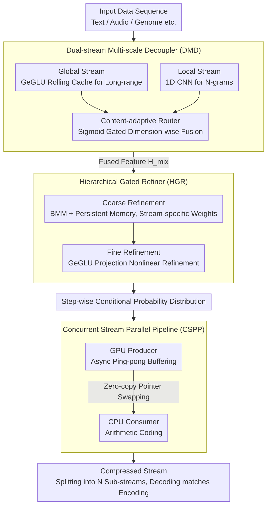

# Efficient Learned Data Compression via Dual-Stream Feature Decoupling

**Conference**: ACL 2026  
**arXiv**: [2604.07239](https://arxiv.org/abs/2604.07239)  
**Code**: [https://github.com/huidong-ma/FADE](https://github.com/huidong-ma/FADE)  
**Area**: Model Compression / Data Compression  
**Keywords**: Learned Data Compression, Dual-Stream Feature Decoupling, Probabilistic Modeling, Concurrent Pipeline, Lossless Compression

## TL;DR
This paper proposes the FADE framework, which separates micro-syntax and macro-semantic features into parallel shallow streams using a Dual-stream Multi-scale Decoupler (replacing deep serial stacking). Combined with a Hierarchical Gated Refiner and a Concurrent Stream Parallel Pipeline, it achieves SOTA performance in both compression ratio and throughput.

## Background & Motivation

**Background**: Learned Data Compression (LDC) leverages deep learning for probability estimation and has significantly surpassed traditional methods (e.g., Gzip, zstd) in compression ratios. Mainstream methods utilize autoregressive frameworks—predicting the conditional probability distribution $P(x_t|x_{<t})$ at each step, followed by entropy coding.

**Limitations of Prior Work**: Two structural limitations exist: (1) Single-stream architectures struggle to simultaneously capture micro-syntax (local N-gram patterns) and macro-semantics (long-range dependencies), forcing the use of deep MLP stacks to approximate complex distributions, which exacerbates autoregressive decoding latency; (2) The speed mismatch between GPU probability generation and CPU arithmetic coding in heterogeneous systems leads to pipeline stalls, while autoregressive serial decoding is strictly constrained by Amdahl's Law, preventing parallel acceleration.

**Key Challenge**: Accurate probabilistic modeling (high compression ratio) requires deep networks, yet deep serial execution leads to high latency. Analysis of mutual information decay curves reveals that data sequences indeed exhibit two distinct dependency patterns: "micro-syntax" (sharp initial decay) and "macro-semantics" (persistent non-zero tail). Single-stream MLPs use shared parameters to fit these heterogeneous features, leading to significant distribution dispersion.

**Goal**: Significantly reduce latency and improve throughput while maintaining or enhancing compression ratios.

**Key Insight**: Data's dual dependency patterns are analyzed from an information-theoretic perspective to design explicit feature decoupling—replacing deep serial structures with shallow parallel ones to resolve bottlenecks at both the model and system levels.

**Core Idea**: Use a CNN branch to capture micro-local patterns and an MLP branch to capture macro-global dependencies, dynamically fusing them via a content-adaptive router, followed by instance-adaptive refinement using a Hierarchical Gated Refiner.

## Method

### Overall Architecture
FADE comprises three core innovations: (1) Dual-stream Multi-scale Decoupler (DMD) separates features into local CNN and global MLP streams for parallel processing; (2) Hierarchical Gated Refiner (HGR) implements instance-adaptive probabilistic modeling through coarse-to-fine refinement; (3) Concurrent Stream Parallel Pipeline (CSPP) integrates data and temporal parallelism to achieve zero-wait processing. The first two innovations replace "deep serial" structures with "shallow parallel + instance-adaptive refinement" at the model level to improve compression and expressiveness, while the third resolves the pipeline bottleneck between GPU probability generation and CPU arithmetic coding and bypasses autoregressive causal dependencies to boost throughput.

### Key Designs

**1. Dual-stream Multi-scale Decoupler (DMD): Separating micro-syntax and macro-semantics into two non-interfering parallel shallow streams.**

The fundamental issue with single-stream MLPs is that mutual information decay analysis and feature saliency heatmaps confirm data sequences possess two heterogeneous patterns: "micro-syntax" (local N-grams, corresponding to the sharp initial segment of the decay curve) and "macro-semantics" (long-range dependencies, corresponding to the persistent non-zero tail). When shared-parameter MLPs fit both, saliency distribution disperses, failing to capture sharp syntactic fluctuations and requiring deep stacking for approximation, which slows down autoregressive decoding. DMD assigns two shallow streams with different inductive biases: the global stream uses a GeGLU-based Rolling Cache to capture long-range dependencies, maintaining a rolling cache $\bm{M}$ updated at each step as $\bm{M}_t = \text{Roll}(\bm{M}_{t-1}, \text{GeGLU}(\bm{X}_t))$; the local stream uses 1D convolutions to impose strong local inductive biases for precise N-gram locking. The outputs are fused dimension-wise via a content-adaptive router with Sigmoid gating:

$$\bm{H}_{\text{mix}} = \bm{\alpha} \odot \bm{H}_{\text{global}} + (1-\bm{\alpha}) \odot \bm{H}_{\text{local}}$$

The key lies in "replacing one deep serial stream with two parallel shallow streams"—eliminating feature interference and trading depth for width, which significantly reduces latency without loss of expressiveness.

**2. Hierarchical Gated Refiner (HGR): Coarse-to-fine instance-adaptive refinement to memorize the characteristics of each data stream.**

DMD uses globally shared parameters, but in online compression, feature distributions are non-stationary; statistical properties vary greatly across data streams (text, audio, genomes). HGR bridges this gap using a two-stage cascade. The coarse-grained stage handles channel interaction: using Batch Matrix Multiplication (BMM) with persistent memory $\bm{W}_U \in \mathbb{R}^{B \times d_h \times d_h}$, each batch index is bound to a fixed data stream, allowing stream-specific patterns to evolve through backpropagation. Noise is suppressed via content-aware self-gating:

$$\bm{H}_{\text{coarse}} = \big(\bm{H}_a \odot \sigma(\bm{H}_{\text{mix}} \bm{W}_c)\big) + \lambda_c \cdot \bm{H}_{\text{mix}}$$

The fine-grained stage performs nonlinear refinement via GeGLU and projection. This combination of "one learnable weight per stream + gated selective enhancement" functions as an adaptive layer atop the shared backbone, providing more accurate estimation than global parameters.

**3. Concurrent Stream Parallel Pipeline (CSPP): Bypassing autoregressive causal dependencies to align decompression with compression speeds.**

The system-level challenge is that compression benefits from temporal parallelism, but decompression reverts to serial execution due to autoregressive causality (Amdahl's Law), compounded by the speed mismatch between GPU probability generation and CPU arithmetic coding. CSPP introduces parallelism in two dimensions. In the temporal dimension, async ping-pong buffers decouple GPU producer threads from CPU consumer threads, using zero-copy pointer swapping to eliminate memory contention. In the data dimension, the input stream is split into $N$ independent sub-streams maintaining internal causality; $N$ workers execute concurrently via a double-barrier protocol, reducing complexity from $O(B)$ to $O(B/N)$. During compression, both parallelisms are active; during decompression, since sub-stream splitting bypasses global causal dependencies, data parallelism alone suffices to match compression speed—resolving the long-standing asymmetry.

### Loss & Training
The model optimizes probability prediction accuracy using cross-entropy loss. Persistent memory in the HGR is adapted to specific patterns of various data streams through online backpropagation.

## Key Experimental Results

### Main Results

| Method | Avg. Compression Ratio↑ | Throughput | Latency | GPU Memory |
|------|-----------|--------|------|--------|
| Traditional (Gzip/zstd) | Low | High | Low | — |
| PAC | Mid-High | Mid | Mid | Mid |
| SEP | High | Mid-High | Mid | Mid-High |
| EDPC | High | High | Mid-Low | Mid-Low |
| FADE | **Highest** | **Highest** | **Lowest** | **Lowest** |

### Ablation Study

| Configuration | Compression Ratio | Throughput | Description |
|------|--------|--------|------|
| Full FADE | Optimal | Optimal | Complete model |
| w/o Local Stream | Decrease | Slight Increase | Loss of micro-syntax capture |
| w/o HGR | Decrease | Slight Increase | Loss of instance adaptivity |
| w/o CSPP | Equal | Significant Decrease | Implies importance of system parallelism |

### Key Findings
- FADE achieves SOTA in both compression ratio and throughput, breaking the previous trade-off.
- Dual-stream decoupling replaces deep serial processing with shallow parallel processing, significantly reducing latency while enhancing expressiveness.
- Persistent memory allows HGR to achieve stream-specific adaptation in online compression, proving more accurate than global shared parameters.
- The data parallelism strategy of CSPP makes decompression speed approach compression speed, solving the long-standing asymmetry problem.
- Excellent performance is observed across heterogeneous data including text, audio, images, video, floating-point numbers, and genomes.

## Highlights & Insights
- **Complete Chain from Information Theory to Architecture**: The existence of dual dependency patterns is verified via mutual information decay and self-similarity matrices before designing the decoupled architecture. This "analysis-driven design" is more persuasive than intuition-driven approaches.
- **Shallow Parallelism over Deep Serialism**: Reducing latency without sacrificing expressiveness relies on the insight that "separation + specialization" is superior to "unification + stacking."
- **Innovative Use of Persistent Memory**: Each batch index in BMM corresponds to a learnable weight matrix that evolves via backpropagation during online compression, successfully "memorizing the unique patterns of each data stream."

## Limitations & Future Work
- Data parallelism requires segmenting the input into independent sub-streams, which ignores cross-stream dependencies.
- The size of persistent memory scales linearly with batch size, potentially leading to significant memory overhead in large-scale parallelism.
- There remains a compression ratio gap compared to LLM-based methods (e.g., LLMZip), though FADE maintains a huge efficiency advantage.
- The weight allocation strategy of the adaptive router is relatively simple; more complex MoE-style routing could be explored.

## Related Work & Insights
- **vs PAC/OREO**: Lightweight MLP-based methods using masking and caching for acceleration. FADE further improves efficiency and expression through dual-stream decoupling.
- **vs SEP**: SEP introduces semantic enhancement modules and multi-stream pipelines. FADE's CSPP implements more complete parallelization.
- **vs EDPC**: EDPC proposes a dual-path framework and latent transformation engine. FADE's DMD more explicitly targets the decoupling of micro/macro patterns.

## Rating
- Novelty: ⭐⭐⭐⭐ The dual-stream decoupling design has clear theoretical support and experimental validation.
- Experimental Thoroughness: ⭐⭐⭐⭐⭐ Comprehensive coverage across 7 datasets (text, audio, image, video, floating-point, genome, heterogeneous).
- Writing Quality: ⭐⭐⭐⭐ Clear structure, progressing logically from analysis to design to system implementation.
- Value: ⭐⭐⭐⭐ High engineering practicality by resolving bottlenecks at both model and system levels.

<!-- RELATED:START -->

## Related Papers

- [\[CVPR 2026\] DAGE: Dual-Stream Architecture for Efficient and Fine-Grained Geometry Estimation](../../CVPR2026/model_compression/dage_dual-stream_architecture_for_efficient_and_fine-grained_geometry_estimation.md)
- [\[ICML 2026\] Efficient Learned Image Compression without Entropy Coding](../../ICML2026/model_compression/efficient_learned_image_compression_without_entropy_coding.md)
- [\[ACL 2026\] FastKV: Decoupling of Context Reduction and KV Cache Compression for Prefill-Decoding Acceleration](fastkv_decoupling_of_context_reduction_and_kv_cache_compression_for_prefill-deco.md)
- [\[AAAI 2026\] InfoCom: Kilobyte-Scale Communication-Efficient Collaborative Perception with Information-Aware Feature Compression](../../AAAI2026/model_compression/infocom_kilobyte-scale_communication-efficient_collaborative_perception_with_inf.md)
- [\[CVPR 2026\] Block-based Learned Image Compression without Blocking Artifacts](../../CVPR2026/model_compression/block-based_learned_image_compression_without_blocking_artifacts.md)

<!-- RELATED:END -->
