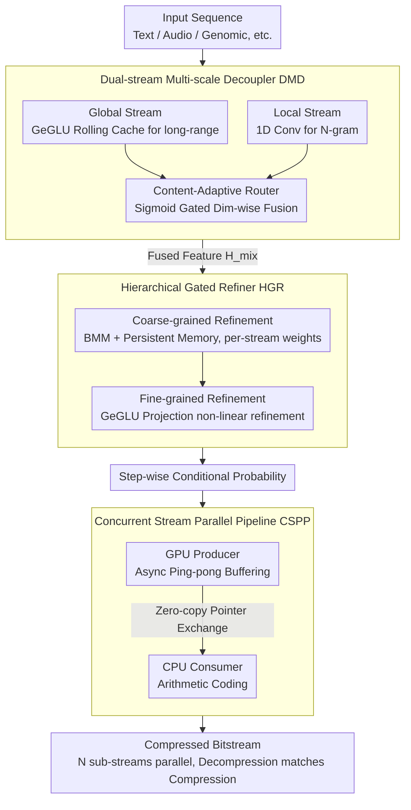

# Efficient Learned Data Compression via Dual-Stream Feature Decoupling

**Conference**: ACL 2026  
**arXiv**: [2604.07239](https://arxiv.org/abs/2604.07239)  
**Code**: [https://github.com/huidong-ma/FADE](https://github.com/huidong-ma/FADE)  
**Area**: Model Compression / Data Compression  
**Keywords**: Learned Data Compression, Dual-Stream Feature Decoupling, Probabilistic Modeling, Concurrent Pipeline, Lossless Compression

## TL;DR
This paper proposes the FADE framework, which separates micro-syntax and macro-semantic features into parallel shallow streams using a Dual-stream Multi-scale Decoupler (replacing deep serial stacking). Combined with a Hierarchical Gated Refiner and a Concurrent Stream Parallel Pipeline, it achieves SOTA performance in both compression ratio and throughput.

## Background & Motivation

**Background**: Learned Data Compression (LDC) utilizes deep learning for probability prediction and has significantly outperformed traditional methods (Gzip, zstd, etc.) in compression ratios. Mainstream methods use autoregressive frameworks—predicting conditional probability distributions $P(x_t|x_{<t})$ at each step, followed by entropy coding.

**Limitations of Prior Work**: Two structural constraints exist: (1) Single-stream architectures struggle to simultaneously capture micro-syntax (local N-gram patterns) and macro-semantics (long-range dependencies), forcing the use of deep MLP stacks to approximate complex distributions, which exacerbates autoregressive decoding latency; (2) Mismatched speeds between GPU probability generation and CPU arithmetic coding in heterogeneous systems lead to pipeline stalls, and autoregressive serial decoding is strictly constrained by Amdahl's Law, preventing parallel acceleration.

**Key Challenge**: Accurate probabilistic modeling (high compression ratio) requires deep networks, but deep serial execution results in high latency. Analysis of mutual information decay curves reveals that data sequences exhibit two distinct dependency patterns: "micro-syntax" (sharp initial decay) and "macro-semantics" (persistent non-zero tail). Single-stream MLPs fitting these heterogeneous features with shared parameters lead to significant distribution dispersion.

**Goal**: Significantly reduce latency and increase throughput while maintaining or improving compression ratios.

**Key Insight**: Data's dual dependency patterns are analyzed from an information-theoretic perspective to design explicit feature decoupling—replacing deep serial structures with shallow parallel ones—addressing bottlenecks at both the model and system levels.

**Core Idea**: Utilize a CNN branch to capture micro-local patterns and an MLP branch for macro-global dependencies, dynamically fused via a content-adaptive router, followed by instance-adaptive refinement using a Hierarchical Gated Refiner.

## Method

### Overall Architecture
FADE consists of three core innovations: (1) Dual-stream Multi-scale Decoupler (DMD) separates features into a local CNN stream and a global MLP stream for parallel processing; (2) Hierarchical Gated Refiner (HGR) achieves instance-adaptive probabilistic modeling through coarse and fine refining stages; (3) Concurrent Stream Parallel Pipeline (CSPP) integrates data and temporal parallelism to achieve zero-wait processing. The first two innovations replace "deep serial" with "shallow parallel + instance-adaptive refinement" at the model level to improve compression ratio and expressiveness. The third innovation optimizes the pipeline between GPU probability generation and CPU arithmetic coding at the system level, bypassing autoregressive causal dependencies to enhance throughput.

### Key Designs

**1. Dual-stream Multi-scale Decoupler (DMD): Separating micro-syntax and macro-semantics into two non-interfering parallel shallow streams.**

The fundamental issue with single-stream MLPs is that both mutual information decay analysis and feature saliency heatmaps confirm the coexistence of "micro-syntax" (local N-grams) and "macro-semantics" (long-range dependencies). Shared-parameter MLPs suffer from saliency dispersion when fitting both, failing to capture sharp syntactic fluctuations and requiring deep stacking, which slows decoding. DMD assigns each pattern to a shallow stream with specific inductive biases: the global stream uses a GeGLU-based Rolling Cache $\bm{M}$ updated via $\bm{M}_t = \text{Roll}(\bm{M}_{t-1}, \text{GeGLU}(\bm{X}_t))$, and the local stream uses 1D convolution for local induction. Outputs are fused dim-wise via a Sigmoid gate:

$$\bm{H}_{\text{mix}} = \bm{\alpha} \odot \bm{H}_{\text{global}} + (1-\bm{\alpha}) \odot \bm{H}_{\text{local}}$$

The key is "parallel shallow streams replacing serial deep ones"—eliminating feature interference while reducing latency without losing expressiveness.

**2. Hierarchical Gated Refiner (HGR): Coarse-to-fine instance-adaptive refinement to memorize specific data stream characteristics.**

While DMD uses globally shared parameters, feature distributions in online compression are non-stationary across different data types (text, audio, etc.). HGR addresses this via a two-level cascade. Coarse-grained refinement performs channel interaction using Batch Matrix Multiplication (BMM) with persistent memory $\bm{W}_U \in \mathbb{R}^{B \times d_h \times d_h}$, allowing each batch index to evolve stream-specific patterns through backpropagation, while content-aware self-gating suppresses noise:

$$\bm{H}_{\text{coarse}} = \big(\bm{H}_a \odot \sigma(\bm{H}_{\text{mix}} \bm{W}_c)\big) + \lambda_c \cdot \bm{H}_{\text{mix}}$$

Fine-grained refinement follows with GeGLU and projection. This combination acts as a stream-adaptive "knob" on the shared backbone, providing more accurate estimations than global parameters alone.

**3. Concurrent Stream Parallel Pipeline (CSPP): Bypassing autoregressive causal dependencies via sub-stream splitting to align decompression with compression speed.**

System-level bottlenecks involve the loss of temporal parallelism in decompression due to autoregressive causality and speed mismatches between GPU/CPU. CSPP introduces parallelism in two dimensions. Temporally, it uses async ping-pong buffers to decouple GPU producer and CPU consumer threads with zero-copy pointer exchanges. Spatially, it splits input into $N$ independent sub-streams that maintain internal causality. $N$ workers execute concurrently via a double-barrier protocol, reducing complexity from $O(B)$ to $O(B/N)$. This allows decompression speed to match compression speed, solving the long-standing asymmetry in LDC.

### Loss & Training
Cross-entropy loss is used to optimize probability prediction accuracy. Persistent memory in HGR is adapted to specific data stream patterns via online backpropagation.

## Key Experimental Results

### Main Results

| Method | Avg. Compression Ratio↑ | Throughput | Latency | GPU Memory |
|------|-----------|--------|------|--------|
| Traditional (Gzip/zstd) | Low | High | Low | — |
| PAC | Med-High | Med | Med | Med |
| SEP | High | Med-High | Med | Med-High |
| EDPC | High | High | Med-Low | Med-Low |
| FADE | **Highest** | **Highest** | **Lowest** | **Lowest** |

### Ablation Study

| Configuration | Compression Ratio | Throughput | Description |
|------|--------|--------|------|
| Full FADE | Optimal | Optimal | Complete model |
| w/o Local Stream | Decrease | Slight Increase | Loss of micro-syntax capture |
| w/o HGR | Decrease | Slight Increase | Loss of instance adaptivity |
| w/o CSPP | Same | Significant Drop | Importance of system parallelism |

### Key Findings
- FADE achieves SOTA in both compression ratio and throughput, breaking the previous trade-off.
- Dual-stream decoupling replaces deep serial layers with shallow parallel ones, reducing latency while enhancing expressiveness.
- Persistent memory allows HGR to achieve stream-specific adaptation during online compression, outperforming global parameters.
- CSPP's data parallelism aligns decompression speed with compression speed, solving the asymmetry problem.
- Excellent performance across heterogeneous data (text, audio, image, video, float, genomic).

## Highlights & Insights
- **Full Chain from Information Theory to Architecture**: Verified dual dependency patterns via mutual information decay and self-similarity matrices before designing the decoupled architecture.
- **Shallow Parallelism over Deep Serialism**: Reduced latency without sacrificing expressiveness, based on the insight that "separation + specialization" is superior to "unification + stacking."
- **Innovative use of Persistent Memory**: Each batch index in BMM maps to a learnable weight matrix that evolves during online compression to "remember" unique stream patterns.

## Limitations & Future Work
- Data parallelism requires segmenting input into independent sub-streams, ignoring inter-stream dependencies.
- Persistent memory size scales with batch size, potentially increasing memory overhead in large-scale parallelization.
- Compression ratio still trails LLM-based methods (e.g., LLMZip), though FADE offers massive efficiency advantages.
- The weight assignment in the adaptive router is relatively simple; MoE-style routing could be explored.

## Related Work & Insights
- **vs PAC/OREO**: MLP-based lightweight methods using masks and caches. FADE enhances efficiency and expression via dual-stream decoupling.
- **vs SEP**: SEP introduces semantic enhancement and multi-stream pipelines. CSPP in FADE achieves more comprehensive parallelization.
- **vs EDPC**: EDPC uses a dual-path framework. DMD in FADE more explicitly targets the decoupling of micro/macro patterns.

## Rating
- Novelty: ⭐⭐⭐⭐ Clear theoretical support and experimental validation for dual-stream decoupling.
- Experimental Thoroughness: ⭐⭐⭐⭐⭐ Comprehensive coverage across 7 datasets (text/audio/image/video/float/genomic/heterogeneous).
- Writing Quality: ⭐⭐⭐⭐ Structured logic from analysis to design to system implementation.
- Value: ⭐⭐⭐⭐ High engineering utility by addressing both model and system-level bottlenecks.

<!-- RELATED:START -->

## Related Papers

- [\[CVPR 2026\] DAGE: Dual-Stream Architecture for Efficient and Fine-Grained Geometry Estimation](../../CVPR2026/model_compression/dage_dual-stream_architecture_for_efficient_and_fine-grained_geometry_estimation.md)
- [\[ICML 2026\] Efficient Learned Image Compression without Entropy Coding](../../ICML2026/model_compression/efficient_learned_image_compression_without_entropy_coding.md)
- [\[ACL 2026\] FastKV: Decoupling of Context Reduction and KV Cache Compression for Prefill-Decoding Acceleration](fastkv_decoupling_of_context_reduction_and_kv_cache_compression_for_prefill-deco.md)
- [\[ICML 2026\] Learned Subspace Compression for Communication-Efficient Pipeline Parallelism](../../ICML2026/model_compression/learned_subspace_compression_for_communication-efficient_pipeline_parallelism.md)
- [\[CVPR 2026\] What Matters in Practical Learned Image Compression](../../CVPR2026/model_compression/what_matters_in_practical_learned_image_compression.md)

<!-- RELATED:END -->
