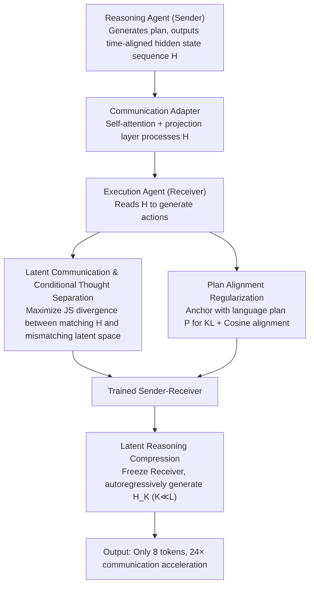

# Enabling Agents to Communicate Entirely in Latent Space

**Conference**: ACL 2026  
**arXiv**: [2511.09149](https://arxiv.org/abs/2511.09149)  
**Code**: [GitHub](https://github.com/XiaoDu-flying/Interlat)  
**Area**: Model Compression  
**Keywords**: Latent space communication, multi-agent, hidden state transmission, information compression, inference acceleration

## TL;DR

This paper proposes Interlat, a framework that enables LLM agents to communicate entirely in latent space. The sender transmits the final layer's hidden states as a continuous representation of "thought." The receiver interprets these latent messages via a communication adapter and further compresses them to just 8 tokens through latent space reasoning while maintaining competitive performance, achieving a communication speedup of up to 24×.

## Background & Motivation

**Background**: Multi-agent systems based on LLMs coordinate tasks through natural language communication. Although natural language is human-readable, it serves as a lossy communication medium—downsampling high-dimensional internal states into discrete tokens loses a significant amount of information.

**Limitations of Prior Work**: (1) The information bandwidth of natural language communication is limited (approximately 15 bits/token vs. approximately 40k bits/hidden-state), causing many inference paths and subtle information to be discarded during tokenization; (2) A large amount of generated text is used for linguistic coherence rather than task-relevant information, resulting in redundancy; (3) The inherent ambiguity of language is a primary source of failure in multi-agent coordination; (4) Existing hidden state communication methods rely on single-activation grafting or are coupled with language trajectories, requiring specific layer selection.

**Key Challenge**: Most computations in LLMs occur in a continuous latent space where internal hidden states contain extremely rich information—however, communication requires compressing this into discrete tokens, leading to substantial information loss.

**Goal**: To enable communication between agents to occur entirely in the latent space—directly transmitting continuous hidden states instead of discrete tokens, and achieving efficient communication through compression.

**Key Insight**: Analogous to "telepathy"—bypassing symbolic language to transmit internal representations directly. The sequence of final-layer hidden states produced during the LLM generation process is utilized as a continuous representation of "thought" for transmission.

**Core Idea**: Use time-aligned final-layer hidden state sequences as latent communication messages. A conditional thought separation loss ensures the receiver utilizes rather than ignores the latent information, while a latent space reasoning model compresses long sequences into extremely short latent messages.

## Method

### Overall Architecture

Sender-Receiver two-agent setup: The reasoning agent (Sender) generates a plan and its hidden states $H \in \mathbb{R}^{L \times d}$ $\rightarrow$ a communication adapter (lightweight self-attention + projection layer) processes the hidden states $\rightarrow$ the execution agent (Receiver) receives the hidden states and generates actions. During the training phase, a conditional thought separation loss forces the receiver to actually read $H$, while plan alignment regularization prevents divergence. After training, a separate compression model is trained to distill $H_L$ into extremely short $H_K$ ($K \ll L$) for efficient communication.

### Key Designs

**1. Latent Communication & Conditional Thought Separation: Forcing the receiver to utilize the hidden states**

The most straightforward approach is to transmit the time-aligned final-layer hidden state sequence $H = [h_1, ..., h_L]$ generated by the sender, using special tokens `<bop>` and `<eop>` to mark communication boundaries. However, a potential risk is that with simple SFT, the receiver might learn to ignore these latent messages and rely solely on prompts. To address this, a conditional thought separation loss is introduced to explicitly optimize for the usage of latent information. The receiver is fed both a matching latent space $H$ and a mismatching latent space $\tilde{H}$ from another task, maximizing the Jensen-Shannon divergence between the receiver's output distributions under both conditions. This prevents the model from taking the shortcut of ignoring the latent space.

**2. Plan Alignment Regularization: Preventing degraded outputs**

Maximizing separation alone might lead to a degenerate mode where the model shifts probability mass toward strange tokens that increase divergence but fail to complete the task. Plan alignment regularization uses the corresponding plan $P$ in the language space as an anchor. Using the output distribution conditioned on the language plan as a reference, a KL divergence constraint is applied to the output conditioned on the latent space to maintain consistency, supplemented by logit cosine similarity alignment. This ensures that latent communication conveys at least as much information as language communication in the same direction.

**3. Latent Reasoning Compression: Distilling long sequences into a few tokens**

Complete hidden state sequences often span hundreds of steps, leading to considerable communication latency. To address this, an inference model $M_\phi$ is trained to autoregressively generate compact messages $H_K$ ($K \ll L$) in the latent space. This is achieved by feeding the hidden state from the previous step directly back as the input embedding for the next step—performing reasoning in continuous space without decoding into tokens. During training, the receiver is frozen, and three losses are optimized: a task loss to maintain downstream performance, an uncertainty-weighted consistency loss to align distributions at information-critical positions, and a latent geometric alignment loss to maintain the global semantic direction. The final sequence can be compressed to just 8 tokens with only a 4% performance loss, resulting in 24× acceleration.

### Loss & Training

Main Training: $\mathcal{L}_{total} = \mathcal{L}_{task} + \lambda_S \mathcal{L}_{sep} + \lambda_A \mathcal{L}_{align}$, using a randomized token-latent mixed curriculum to stabilize training.
Compression Training: $\mathcal{L}_{compress} = \lambda_{task}\mathcal{L}_{task} + \lambda_{pref}\mathcal{L}_{pref} + \lambda_{geom}\mathcal{L}_{geom}$, where the receiver is frozen and only the compression model is updated.

## Key Experimental Results

### Main Results

**Success rates of Qwen2.5-7B on Seen/Unseen tasks**

| Method | Seen Success Rate | Unseen Success Rate |
|------|-----------|-------------|
| No-Comm (No communication) | 62.14 | 62.19 |
| Text (Language communication + SFT) | 64.29 | 62.44 |
| CoT (full) | 67.14 | - |
| **Interlat (Latent communication)** | **70.48** | **65.42** |

### Ablation Study

**Communication Compression (Qwen2.5-7B, Seen tasks)**

| Compression Tokens $K$ | Success Rate | Speedup Ratio |
|----------------|--------|-------|
| Full $L$ | 70.48 | 1× |
| 64 | ~70 | ~4× |
| 32 | ~69 | ~8× |
| 16 | ~68 | ~16× |
| **8** | **~66** | **24×** |

**Cross-model Heterogeneous Communication**

| Sender → Receiver | Latent Communication | Language Communication |
|-------------------|----------|---------|
| Qwen-7B → Qwen-0.5B | 61.19 | 54.52 |
| LLaMA-8B → LLaMA-8B | 70.71 | 62.86 |

### Key Findings

- Latent space communication (70.48%) significantly outperforms language communication (64.29%) and no communication (62.14%)—hidden states indeed carry useful information that language cannot express.
- The method remains effective across heterogeneous models (different architectures/sizes), suggesting that the information structure of final-layer hidden states possesses cross-model universality.
- Compressing to 8 tokens results in only about a 4% performance loss (~66% vs 70.48%) while increasing communication speed by 24×.
- Analysis shows that agents using latent space communication exhibit more exploratory behavior—they utilize task-relevant information in the latent space rather than superficial pattern matching.
- Conditional separation loss is critical—without it, the model tends to ignore latent space inputs.

## Highlights & Insights

- The "telepathy" analogy accurately captures the core concept—communication between LLMs does not require human-readable intermediate representations.
- Latent space reasoning compression is a novel form of "information distillation"—performing autoregressive reasoning in continuous space without decoding to tokens.
- The 24× communication speedup is significant for the practical deployment of multi-agent systems.

## Limitations & Future Work

- Validated only in Sender-Receiver two-agent scenarios; not yet extended to more complex multi-agent topologies.
- The communication adapter requires training, which increases deployment complexity.
- Latent space communication loses human interpretability—making it difficult to debug or audit "conversations" between agents.
- The impact of latent space communication on safety has not been explored.

## Related Work & Insights

- **vs. COCONUT/Thought-of-Thought**: These works perform latent space reasoning within a single model; Interlat extends this to communication between multiple agents.
- **vs. Ramesh & Li (2025)**: They utilize single-activation grafting, whereas Interlat transmits a full time-aligned hidden state sequence.
- **vs. Tang et al. (2025)**: Their latent space communication is coupled with language trajectories, while Interlat operates entirely in the latent space.

## Rating

- Novelty: ⭐⭐⭐⭐⭐ Full latent space communication + latent reasoning compression is a completely new paradigm.
- Experimental Thoroughness: ⭐⭐⭐⭐ Evaluated across multiple models and tasks, though limited to two-agent scenarios.
- Writing Quality: ⭐⭐⭐⭐ Clear description of motivation and methods, with complete mathematical formulations.
- Value: ⭐⭐⭐⭐⭐ Opens a new direction for efficient communication in multi-agent systems.

<!-- RELATED:START -->

## Related Papers

- [\[CVPR 2026\] TimeRipples: Accelerating vDiTs by Understanding the Spatio-Temporal Correlations in Latent Space](../../CVPR2026/model_compression/timeripples_accelerating_vdits_by_understanding_the_spatio-temporal_correlations.md)
- [\[ACL 2026\] ProActor: Timing-Aware Reinforcement Learning for Proactive Task Scheduling Agents](proactor_timing-aware_reinforcement_learning_for_proactive_task_scheduling_agent.md)
- [\[ACL 2026\] IMPACT: Importance-Aware Activation Space Reconstruction](impact_importance-aware_activation_space_reconstruction.md)
- [\[ACL 2026\] Latent-Condensed Transformer for Efficient Long Context Modeling](latent-condensed_transformer_for_efficient_long_context_modeling.md)
- [\[CVPR 2026\] Generative Video Compression with One-Dimensional Latent Representation](../../CVPR2026/model_compression/generative_video_compression_with_one-dimensional_latent_representation.md)

<!-- RELATED:END -->
