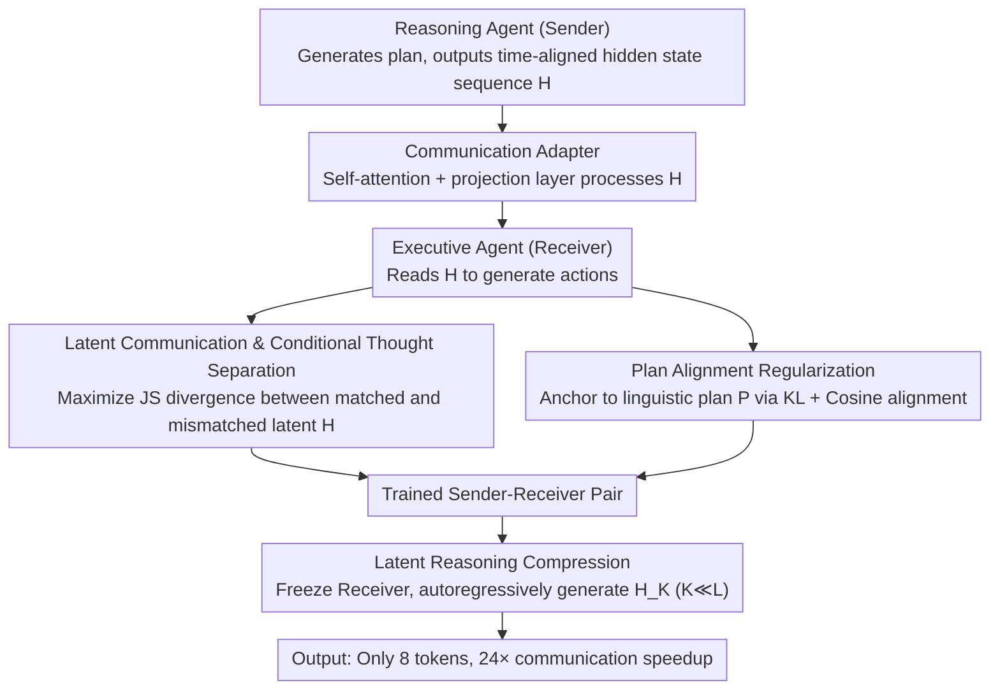

# Enabling Agents to Communicate Entirely in Latent Space

**Conference**: ACL 2026  
**arXiv**: [2511.09149](https://arxiv.org/abs/2511.09149)  
**Code**: [GitHub](https://github.com/XiaoDu-flying/Interlat)  
**Area**: Model Compression  
**Keywords**: Latent Space Communication, Multi-Agent, Hidden State Transfer, Information Compression, Inference Acceleration

## TL;DR

This paper proposes Interlat, a framework enabling LLM agents to communicate entirely in latent space. The sender directly transmits the last-layer hidden states as a representation of "thought," while the receiver interprets these latent messages via a communication adapter. Through latent reasoning, messages are compressed to as few as 8 tokens while maintaining competitive performance, achieving up to 24× communication acceleration.

## Background & Motivation

**Background**: LLM-based multi-agent systems coordinate tasks through natural language communication. While natural language is human-readable, it serves as a lossy communication medium—downsampling high-dimensional internal states into discrete tokens results in significant information loss.

**Limitations of Prior Work**: (1) The information bandwidth of natural language is limited (approx. 15 bits/token vs. approx. 40k bits for a hidden state); vast reasoning paths and nuanced information are discarded during tokenization. (2) A large volume of generated text serves linguistic coherence rather than task-relevant information, causing redundancy. (3) The inherent ambiguity of language is a primary source of coordination failure. (4) Existing hidden state communication methods rely on single-layer activation grafting or remain coupled with linguistic trajectories, requiring specific layer selection.

**Key Challenge**: Most LLM computation occurs in a continuous latent space where internal hidden states contain extremely rich information—yet communication forces compression into discrete tokens, leading to massive information loss.

**Goal**: To enable agents to communicate entirely in latent space—transmitting continuous hidden states instead of discrete tokens—and achieve efficient communication through compression.

**Key Insight**: An analogy to "telepathy"—bypassing symbolic language to transmit internal representations directly. The sequence of last-layer hidden states produced during the LLM’s generation process is utilized as a continuous representation of "thought" for transmission.

**Core Idea**: Use time-aligned last-layer hidden state sequences as latent communication messages. A conditional thought separation loss ensures the receiver utilizes rather than ignores latent information, while a latent reasoning model compresses long sequences into ultra-short latent messages.

## Method

### Overall Architecture

Sender-Receiver two-agent setup: The reasoning agent (Sender) generates a plan and its hidden states $H \in \mathbb{R}^{L \times d}$ → A communication adapter (lightweight self-attention + projection layer) processes the hidden states → The executive agent (Receiver) receives the hidden states and generates actions. During training, a conditional thought separation loss forces the receiver to actually read $H$, while plan alignment regularization prevents divergence. After training, a separate compression model distills $H_L$ into ultra-short $H_K$ ($K \ll L$) for efficient communication.

### Key Designs

**1. Latent Communication & Conditional Thought Separation: Forcing the receiver to use latent information**

The simplest approach is to transmit the time-aligned last-layer hidden state sequence $H = [h_1, ..., h_L]$ generated by the sender, using special tokens `<bop>` and `<eop>` as boundaries. However, standard SFT may lead the receiver to ignore latent messages and rely solely on prompts. To address this, a conditional thought separation loss is introduced to make the utilization of latent information an optimizable goal. The receiver is fed a matching latent $H$ and a mismatched latent $\tilde{H}$ from a different task; the objective is to maximize the Jensen-Shannon (JS) divergence between the receiver's output distributions under these two conditions. This prevents the "shortcut" of ignoring the latent space.

**2. Plan Alignment Regularization: Preventing output degradation**

Maximizing separation alone might cause the model to shift probability mass toward odd tokens that increase divergence but fail the task. Plan alignment regularization anchors the model using the corresponding linguistic plan $P$. Taking the output distribution under the linguistic plan as an anchor, the output under latent conditions is constrained via KL divergence and logit cosine similarity. This ensures that latent communication conveys at least as much information as linguistic communication and maintains the correct task direction.

**3. Latent Reasoning Compression: Distilling hundreds of hidden states into a few tokens**

Full hidden state sequences often span hundreds of steps, causing communication latency. A reasoning model $M_\phi$ is trained to autoregressively generate compact messages $H_K$ ($K \ll L$) in latent space by feeding its own previous hidden states back as input embeddings—performing reasoning in continuous space without decoding to tokens. During training, the receiver is frozen while optimizing three losses: task loss for downstream performance, uncertainty-weighted consistency loss to align compressed and full message distributions at informative positions, and latent geometry alignment loss to maintain global semantic direction. This achieves compression down to 8 tokens with only ~4% performance loss, resulting in a 24× speedup.

### Loss & Training

Main training: $\mathcal{L}_{total} = \mathcal{L}_{task} + \lambda_S \mathcal{L}_{sep} + \lambda_A \mathcal{L}_{align}$, using a random token-latent mixed curriculum. Compression training: $\mathcal{L}_{compress} = \lambda_{task}\mathcal{L}_{task} + \lambda_{pref}\mathcal{L}_{pref} + \lambda_{geom}\mathcal{L}_{geom}$, where only the compression model is updated.

## Key Experimental Results

### Main Results

**Success rates of Qwen2.5-7B on Seen/Unseen tasks**

| Method | Seen Success Rate | Unseen Success Rate |
|------|-----------|-------------|
| No-Comm | 62.14 | 62.19 |
| Text (Natural Language + SFT) | 64.29 | 62.44 |
| CoT (full) | 67.14 | - |
| **Interlat (Latent Comm)** | **70.48** | **65.42** |

### Ablation Study

**Communication Compression (Qwen2.5-7B, Seen tasks)**

| Compression Tokens K | Success Rate | Speedup |
|----------------|--------|-------|
| Full L | 70.48 | 1× |
| 64 | ~70 | ~4× |
| 32 | ~69 | ~8× |
| 16 | ~68 | ~16× |
| **8** | **~66** | **24×** |

**Cross-Model Heterogeneous Communication**

| Sender → Receiver | Latent Comm | Text Comm |
|-------------------|----------|---------|
| Qwen-7B → Qwen-0.5B | 61.19 | 54.52 |
| LLaMA-8B → LLaMA-8B | 70.71 | 62.86 |

### Key Findings

- Latent communication (70.48%) significantly outperforms text communication (64.29%) and no communication (62.14%), proving that hidden states carry useful information unexpressible in language.
- Effectiveness across heterogeneous models (different architectures/sizes) suggests that the information structure of last-layer hidden states possesses cross-model universality.
- Compression to 8 tokens maintains performance with only a ~4% loss (~66% vs 70.48%), while increasing speed by 24×.
- Agents using latent communication exhibit more exploratory behavior, utilizing task-relevant information in the latent space rather than surface pattern matching.
- The conditional separation loss is critical—without it, models tend to ignore latent inputs.

## Highlights & Insights

- The "telepathy" analogy accurately captures the core concept—communication between LLMs does not require human-readable intermediate representations.
- Latent reasoning compression is a novel form of "information distillation"—performing autoregressive reasoning in continuous space without decoding to tokens.
- A 24× communication speedup is significant for the practical deployment of multi-agent systems.

## Limitations & Future Work

- Validated only in Sender-Receiver two-agent scenarios; not yet extended to complex multi-agent topologies.
- Requirement for communication adapters increases deployment complexity.
- Latent communication sacrifices human interpretability, making it difficult to debug or audit agent "dialogues."
- Impacts on security within latent communication remain unexplored.

## Related Work & Insights

- **vs COCONUT/Thought-of-Thought**: These perform latent reasoning within a single model; Interlat extends this to multi-agent communication.
- **vs Ramesh & Li (2025)**: They use single-layer activation grafting; Interlat transmits full time-aligned hidden state sequences.
- **vs Tang et al. (2025)**: Their latent communication is coupled with linguistic trajectories; Interlat operates purely in the latent space.

## Rating

- Novelty: ⭐⭐⭐⭐⭐ Entirely latent communication + latent reasoning compression is a brand-new paradigm.
- Experimental Thoroughness: ⭐⭐⭐⭐ Multi-model and multi-task evaluation, though scenarios are limited to two agents.
- Writing Quality: ⭐⭐⭐⭐ Clear description of motivation and methodology with complete mathematical formulations.
- Value: ⭐⭐⭐⭐⭐ Opens a new direction for efficient communication in multi-agent systems.

<!-- RELATED:START -->

## Related Papers

- [\[ACL 2026\] ProActor: Timing-Aware Reinforcement Learning for Proactive Task Scheduling Agents](proactor_timing-aware_reinforcement_learning_for_proactive_task_scheduling_agent.md)
- [\[ACL 2026\] IMPACT: Importance-Aware Activation Space Reconstruction](impact_importance-aware_activation_space_reconstruction.md)
- [\[ACL 2026\] Latent-Condensed Transformer for Efficient Long Context Modeling](latent-condensed_transformer_for_efficient_long_context_modeling.md)
- [\[CVPR 2026\] Generative Video Compression with One-Dimensional Latent Representation](../../CVPR2026/model_compression/generative_video_compression_with_one-dimensional_latent_representation.md)
- [\[ICLR 2026\] SwiReasoning: Switch-Thinking in Latent and Explicit for Pareto-Superior Reasoning](../../ICLR2026/model_compression/swireasoning_switch-thinking_in_latent_and_explicit_for_pareto-superior_reasonin.md)

<!-- RELATED:END -->
