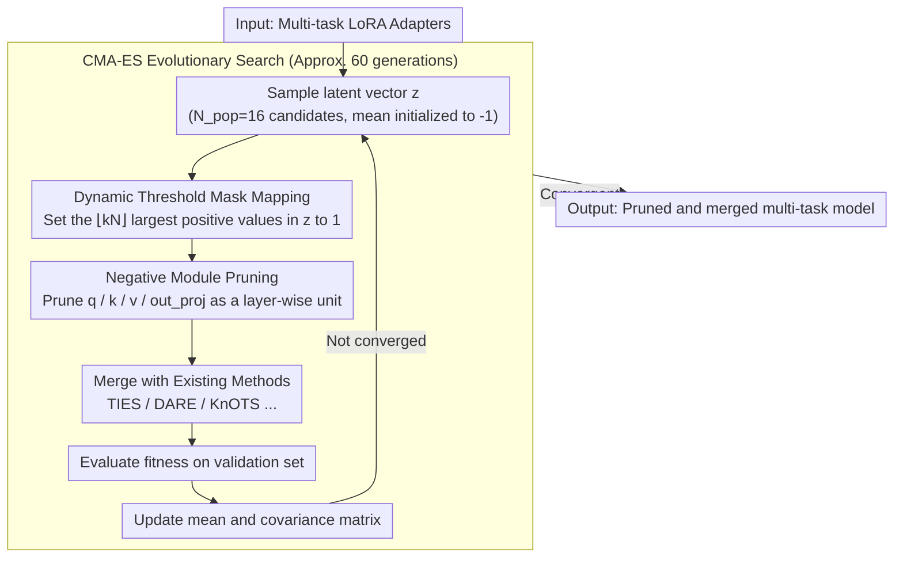

# Evolutionary Negative Module Pruning for Better LoRA Merging

**Conference**: ACL 2026  
**arXiv**: [2604.17753](https://arxiv.org/abs/2604.17753)  
**Code**: [github](https://github.com/CaoAnda/ENMP-LoRAMerging)  
**Area**: Model Merging / LoRA Fusion  
**Keywords**: LoRA Merging, Negative Module Pruning, Evolutionary Search, Multi-task Deployment, CMA-ES

## TL;DR

The ENMP method is proposed to discover and prune "negative modules" that degrade performance during LoRA merging through an evolutionary search strategy. As a plug-and-play enhancement, it comprehensively improves the performance of existing merging algorithms in both NLP and vision domains.

## Background & Motivation

**Background**: LoRA has become the mainstream method for fine-tuning large models due to its parameter efficiency and good convergence. In practical deployment, it is often necessary to merge multiple task-specific LoRA adapters into a single backbone network to achieve efficient multi-task inference.

**Limitations of Prior Work**: Existing merging methods (e.g., Task Arithmetic, TIES, DARE, KnOTS, CoreSpace, etc.) implicitly assume that all LoRA matrices contribute positively to the merged model. However, the authors find that specific LoRA modules in certain layers actually degrade global performance during merging—referred to as the existence of "negative modules."

**Key Challenge**: The impact of negative modules is interdependent: a module that appears "negative" in the full set may become beneficial after other harmful modules are removed, and vice versa. This conditional dependence prevents greedy strategies from capturing high-order interactions, and the $2^N$ search space makes exhaustive search infeasible.

**Goal**: Design a method capable of automatically locating and pruning these negative modules as a universal enhancement plugin for existing merging algorithms.

**Key Insight**: Model the module selection problem as a combinatorial optimization problem, utilizing evolutionary strategies to efficiently search for the optimal pruning configuration in a continuous latent space.

**Core Idea**: Utilize the covariance matrix of the CMA-ES evolutionary strategy to model dependencies between modules, mapping the search from a continuous space to discrete pruning masks to precisely remove harmful modules.

## Method

### Overall Architecture

The ENMP framework consists of two core stages: (1) sampling candidate pruning masks in a continuous latent space via CMA-ES evolutionary search; (2) applying masks to LoRA adapters to prune negative modules before completing the merge using existing methods (e.g., TIES, DARE). The search process iteratively optimizes distribution parameters based on validation set performance.

### Key Designs

**1. Negative Module Pruning Mechanism: Remove "drag" LoRA layers before merging**

Existing merging methods assume every LoRA module is helpful, but the author's leave-one-out analysis refutes this assumption—removing LoRA modules from certain layers actually improves merging performance, indicating these layers are "negative modules" with a net negative contribution. ENMP thus defines a binary pruning mask $\mathbf{m} \in \{0,1\}^{L \times T}$ ($L$ layers, $T$ tasks), where $0$ indicates retention and $1$ indicates pruning. The smallest unit of pruning is not a single weight matrix, but all attention projections (q/k/v/out_proj) within a Transformer layer processed together—this is done to maintain semantic consistency within the attention mechanism and avoid fragmented states like pruning q while leaving k.

**2. CMA-ES Evolutionary Search: Capture dependencies via covariance matrices to bypass the $2^N$ combinatorial explosion**

The difficulty lies in the entangled influence of negative modules—a module might be negative in the full set but turn beneficial once other harmful modules are removed. This conditional dependence means greedy strategies only see local optima and fail to capture high-order interactions, while the $2^N$ discrete search space makes exhaustive search impractical. ENMP relaxes the discrete mask search into a continuous space: it introduces a continuous latent vector $\mathbf{z} \in \mathbb{R}^N$ as a learnable "negative score" for each module, and then performs evolutionary search on $\mathbf{z}$ using CMA-ES. The covariance matrix maintained by CMA-ES happens to model the pairwise dependencies between modules, which is exactly the high-order interaction missed by greedy methods. The mean is initialized to $-1$ (conservative initialization), allowing the search to start from a "full merge" state where nothing is pruned and then explore outwards.

**3. Dynamic Threshold Mask Mapping: Translate continuous scores to discrete masks with adaptive sparsity constrained by an upper bound**

The search runs on continuous $\mathbf{z}$, but applying it to LoRA requires a discrete 0/1 mask; this step bridges the two. The approach is to set a maximum pruning ratio $k$ and set the $\lfloor k \cdot N \rfloor$ largest positive elements in $\mathbf{z}$ to 1 (pruned), with the rest set to 0 (retained). Crucially, $k$ is only an upper bound rather than a fixed pruning amount—in experiments, the algorithm does not use up the entire quota but converges to an optimal level of sparsity on its own. Thus, this hyperparameter does not require fine-tuning; a loose upper bound is sufficient.

### Loss & Training

The evolutionary search is a one-time offline calculation. Population size $N_{\text{pop}}=16$, iterations 60 generations, initial step size $\sigma=0.5$, and maximum pruning ratio $k=0.2$. Candidate solutions are evaluated in parallel on 8 RTX 4090 GPUs, converging in approximately 2.3 hours, with most gains obtained within the first 10 generations.

## Key Experimental Results

### Main Results (NLP Benchmark - Llama-3-8B)

| Method | Avg. Normalized Accuracy | Gain |
|------|-----------------|------|
| TA | 90.25% | - |
| TA + ENMP | 93.49% | +3.24% |
| TIES | 89.99% | - |
| TIES + ENMP | 96.39% | +6.40% |
| DARE | 89.20% | - |
| DARE + ENMP | 96.17% | +6.97% |
| KnOTS | 92.47% | - |
| KnOTS + ENMP | 97.29% | +4.82% |
| CoreSpace | 94.18% | - |
| CoreSpace + ENMP | 96.73% | +2.55% |

### Ablation Study

| Configuration | Avg. Normalized Accuracy | Description |
|------|-----------------|------|
| TA + Random Pruning | 89.10% | Random pruning degrades performance |
| TA + ENMP | 93.49% | Accurate positioning is key |
| k=0.0 | 90.25% | No pruning |
| k=0.1 | 93.37% | Significant gains with minimal pruning |
| 64 samples/task | 91.17% | Effective with small amounts of validation data |

### Key Findings
- ENMP brings consistent improvements across all baseline methods, indicating that negative modules are a universal bottleneck in LoRA merging.
- Achieved over +20% recovery on the sensitive QNLI task, suggesting that task interference is non-uniformly distributed.
- Prune-then-Align outperforms Align-then-Prune, as it prevents negative modules from "contaminating" the shared subspace.
- Equally effective in the vision domain (KnOTS +5.54%), demonstrating cross-modal generality.

## Highlights & Insights
- Systematically reveals the "negative module" phenomenon in LoRA merging for the first time, challenging the implicit assumption that "all modules contribute positively."
- Plug-and-play design: can be combined with any existing merging algorithm without modifying the algorithm itself.
- Adaptive sparsity: the search algorithm automatically determines the optimal number of pruned modules without fine-tuning.
- The merged model maintains the same structure as the original backbone, incurring zero additional overhead during inference.

## Limitations & Future Work
- Evolutionary search requires a one-time offline calculation (approx. 2.3 hours), which remains challenging to scale to extremely large models (70B+).
- Relies on a validation set to calculate fitness, making it unsuitable for strictly data-free merging scenarios.
- Future work could explore more efficient sampling strategies and data-free pruning methods.

## Related Work & Insights
- **vs Task Arithmetic/TIES/DARE**: These methods handle interference at the parameter level, while ENMP eliminates interference at the module level. The two are complementary.
- **vs KnOTS/CoreSpace**: Subspace alignment methods assume all modules contribute positively; ENMP yields better results by removing harmful modules before alignment.
- **vs Greedy Pruning**: Greedy strategies ignore cross-layer dependencies, leading to performance degradation (55.76%), whereas evolutionary search captures high-order interactions.

## Rating
- Novelty: ⭐⭐⭐⭐ First systematic revelation of the negative module phenomenon with an evolutionary search solution.
- Experimental Thoroughness: ⭐⭐⭐⭐⭐ Validation in both NLP and CV domains, comparison with 6 baselines, and extensive ablation studies.
- Writing Quality: ⭐⭐⭐⭐ Clear motivation, with logical flow from phenomenon to method and experiments.
- Value: ⭐⭐⭐⭐ High practical value as a plug-and-play tool, providing important insights for the LoRA merging field.

<!-- RELATED:START -->

## Related Papers

- [\[ACL 2026\] LoRA on the Go: Instance-level Dynamic LoRA Selection and Merging](lora_on_the_go_instance-level_dynamic_lora_selection_and_merging.md)
- [\[CVPR 2026\] Preference-Aligned LoRA Merging: Preserving Subspace Coverage and Addressing Directional Anisotropy](../../CVPR2026/model_compression/preference-aligned_lora_merging_preserving_subspace_coverage_and_addressing_dire.md)
- [\[CVPR 2025\] IterIS: Iterative Inference-Solving Alignment for LoRA Merging](../../CVPR2025/model_compression/iteris_iterative_inference-solving_alignment_for_lora_merging.md)
- [\[ICLR 2026\] AdaRank: Adaptive Rank Pruning for Enhanced Model Merging](../../ICLR2026/model_compression/adarank_adaptive_rank_pruning_for_enhanced_model_merging.md)
- [\[CVPR 2026\] LoPrune: Efficient Data Pruning for LoRA-Based Fine-Tuning of Vision Transformer](../../CVPR2026/model_compression/loprune_efficient_data_pruning_for_lora-based_fine-tuning_of_vision_transformer.md)

<!-- RELATED:END -->
