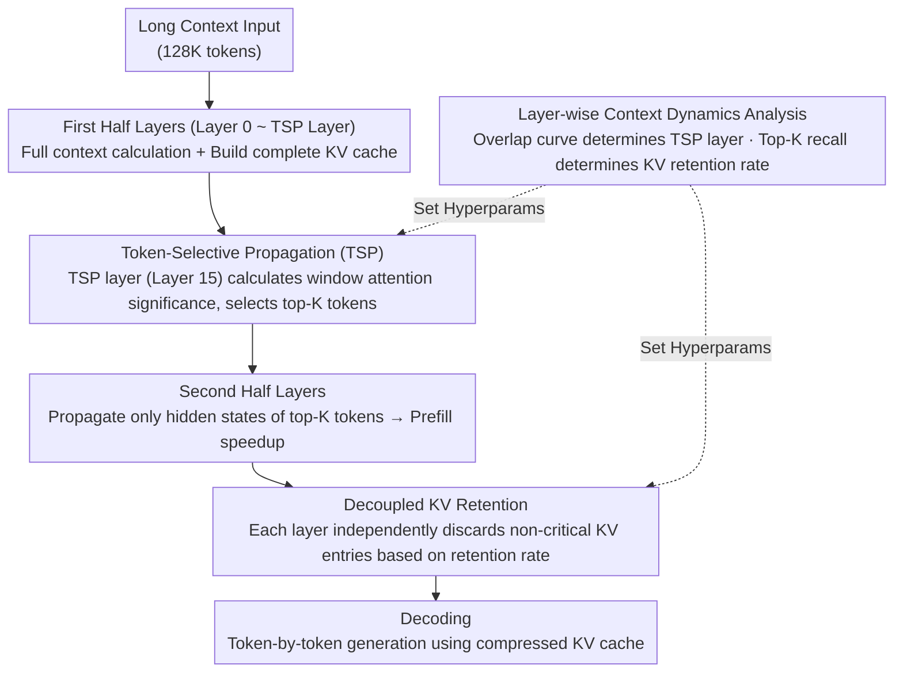

# FastKV: Decoupling of Context Reduction and KV Cache Compression for Prefill-Decoding Acceleration

**Conference**: ACL 2026 Findings  
**arXiv**: [2502.01068](https://arxiv.org/abs/2502.01068)  
**Code**: [GitHub](https://github.com/dongwonjo/FastKV)  
**Area**: Model Compression / Inference Acceleration  
**Keywords**: KV Cache Compression, Prefill Acceleration, Token-Selective Propagation, Inter-layer Context Dynamics, Decoding Acceleration

## TL;DR

This paper proposes FastKV, which decouples context reduction (Token-Selective Propagation during prefill) from KV cache compression (layer-wise KV retention during decoding). It achieves 1.82× prefill and 2.87× decoding speedup on LLaMA-3.1-8B-Instruct, while maintaining accuracy within a 1% drop on LongBench.

## Background & Motivation

**Background**: LLMs support context windows of 128K or even millions of tokens, but long-context inference faces two-stage bottlenecks: attention computation in the prefill stage grows quadratically with input length, and the linearly growing KV cache in the decoding stage becomes a memory and bandwidth bottleneck.

**Limitations of Prior Work**: (1) Decoding-side methods (e.g., SnapKV, H2O) only compress already generated KV caches and do not accelerate prefill; (2) Prefill-side methods (e.g., GemFilter) prune tokens starting from early layers, but critical tokens in early layers are highly unstable, and premature pruning leads to irrecoverable information loss; (3) Existing prefill-aware methods tightly couple context reduction with KV budget—to achieve sufficient decoding speedup, aggressive prefill pruning is required, leading to accuracy degradation.

**Key Challenge**: The prefill stage requires processing the full context to maintain accuracy, while recovery in the decoding stage depends on very few tokens—coupling the two prevents simultaneous optimization of both stages.

**Goal**: Decouple context reduction during prefill from KV compression during decoding to independently control the efficiency-accuracy trade-offs for both stages.

**Key Insight**: Leveraging two critical observations: (1) Critical tokens in early layers are highly unstable (low overlap rate) but tend to stabilize in later layers (high overlap rate); (2) All layers only depend on a very small number of tokens during decoding (Top-512, or 0.38%, captures most of the attention quality).

**Core Idea**: Set a TSP split point at a stable layer—process the full context in the first half to maintain flexibility, and propagate only critical tokens in the second half to accelerate prefill; simultaneously, retain a small proportion of the KV cache independently for each layer for decoding. Both ratios are independently adjustable.

## Method

### Overall Architecture

FastKV operates in two steps: (1) Two-stage prefill—the first half (Layer 0 to the TSP layer) processes the full context and builds the complete KV cache; the TSP layer selects top-K tokens based on attention weights of window tokens and propagates only their hidden states to subsequent layers. (2) Layer-wise KV retention—each layer independently discards non-critical KV entries, retaining only a specified cache ratio for decoding. The two core hyperparameters (TSP layer position and KV retention rate) are data-driven based on layer-wise context dynamics analysis and are independently tunable.

### Key Designs

**1. Token-Selective Propagation (TSP): Truncating context after critical tokens stabilize to accelerate second-half prefill**

Prefill-side methods like GemFilter prune tokens from very early layers, but critical tokens selected in early layers are extremely unstable. FastKV's analysis shows that as layer distance increases, the overlap rate of critical tokens between layers drops sharply; premature pruning risks discarding critical information that cannot be recovered. TSP's counter-strategy is to delay pruning until the middle of the network: the first half (Layer 0 to the TSP layer) proceeds with full context calculation, and pruning occurs only at the TSP layer (optimal at Layer 15 in experiments, where overlap decay has slowed and critical tokens have converged). Specifically, at the TSP layer, the significance score for each token is calculated as the average attention weight when queried by recent window tokens: $S_i^{TSPlayer} = \frac{1}{H}\sum_{h=0}^{H-1} S_i^{TSPlayer,h}$. Tokens are ranked and the top tokens are selected to propagate their hidden states. Subsequent layers thus compute attention on a much smaller subset, accelerating prefill while the full context in the first half preserves accuracy.

**2. Decoupled KV Retention: Independently tuning decoding KV budget and prefill compression rate**

Previous methods (GemFilter, PyramidInfer) tied "prefill pruning intensity" and "decoding KV cache volume" into a single knob—maximizing decoding speed required aggressive prefill pruning, which compromised accuracy. FastKV decouples these: the prefill side is controlled by the TSP rate (how many tokens are propagated), while the decoding side uses a layer-wise KV retention rate to discard non-critical KV entries based on attention scores. Although layers in the first half process the full context, their KV caches can still be compressed to a very small size because decoding inherently depends on very few tokens in each layer. Since the two ratios are independent, the KV retention rate can be kept very low to accelerate decoding even if the TSP rate is set higher to preserve accuracy.

**3. Layer-wise Context Dynamics Analysis: Data-driven evidence for "when to compress" and "how much"**

The two core hyperparameters of FastKV (TSP layer position and KV retention rate) are derived from measurements of the model itself. The authors fed 128K tokens into LLaMA-3.1-8B-Instruct and calculated the inter-layer overlap rate for the top-512 critical tokens: for layers $\le 15$, the overlap rate drops sharply with layer distance (indicating instability), while for layers $> 15$, decay slows (indicating stability). This curve determines the TSP layer position. Another analysis of Top-K attention recall showed that only 0.38% of tokens (K=512) dominate the attention quality across all layers, providing the basis for the KV retention rate. These observations transform FastKV design from manual tuning to data-driven optimization.

### Loss & Training

FastKV is a training-free method applied only during inference. It was primarily validated on LLaMA-3.1-8B-Instruct using LongBench as the main evaluation benchmark.

## Key Experimental Results

### Main Results

| Method | Prefill | Decoding | Accuracy |
|------|---------|---------|------|
| Full-context | Slow | Slow | High |
| StreamingLLM | Slow | Fast | Low |
| SnapKV | Slow | Fast | High |
| GemFilter | Fast | Fast | Low |
| **FastKV** | **Fast (1.82×)** | **Fast (2.87×)** | **High (<1% drop)** |

### Ablation Study

| Analysis Dimension | Result |
|----------|------|
| TSP Layer Position | Layer 15 is optimal—earlier causes accuracy drop, later reduces speedup gain |
| Decoupling TSP vs KV Rate | Decoupling allows independent optimization, superior to coupled schemes |
| Inter-layer Token Overlap | Drops sharply for $\le 15$ layers, stabilizes for $> 15$ |
| Top-K Attention Recall | K=512 (0.38%) captures most attention quality |

### Key Findings

- FastKV is the only method to simultaneously achieve prefill acceleration, decoding acceleration, and high accuracy.
- The decoupled design allows for flexible efficiency-accuracy trade-offs—the two ratios can be adjusted independently.
- The two-stage characteristic of layer-wise context dynamics (unstable → stable) provides clear guidance for token pruning timing.
- Accuracy degradation of <1% on LongBench indicates that later layers have low dependence on the full context.

## Highlights & Insights

- The idea of "decoupling" prefill and decoding compression is simple yet profound—previous methods implicitly assumed the two must be synchronized, which is an unnecessary constraint.
- Analysis of inter-layer critical token overlap provides a data-driven basis for TSP layer selection, avoiding black-box hyperparameter tuning.
- The discovery of sparse context utilization (0.38% tokens dominate attention) provides theoretical support for extreme KV compression.

## Limitations & Future Work

- Primarily validated on LLaMA-3.1-8B-Instruct; generalization to larger models and different architectures needs verification.
- Analysis of 128K tokens may not fully apply to even longer contexts.
- The TSP layer is fixed—adaptive selection might further enhance performance.
- Not yet combined with orthogonal compression techniques like quantization.

## Related Work & Insights

- **vs SnapKV/H2O**: These methods only compress decoding-side KV caches, while prefill still requires full computation; FastKV accelerates both.
- **vs GemFilter**: GemFilter selects tokens from a single layer's attention and forces all subsequent layers to use them, harming early layers; FastKV retains full context in the first half.
- **vs PyramidInfer**: Prunes progressively from the first layer, which is too aggressive; FastKV waits until stability is reached.

## Rating

- Novelty: ⭐⭐⭐⭐ The decoupling approach and TSP design are simple and effective, though significant work already exists in KV compression.
- Experimental Thoroughness: ⭐⭐⭐⭐ Strong evaluation on LongBench, though model coverage is limited.
- Writing Quality: ⭐⭐⭐⭐⭐ Clear motivational analysis, rigorous experimental design, and intuitive comparison tables.
- Value: ⭐⭐⭐⭐⭐ Extremely high practical value for simultaneously accelerating prefill and decoding while maintaining accuracy.

<!-- RELATED:START -->

## Related Papers

- [\[ACL 2026\] DASH-KV: Accelerating Long-Context LLM Inference via Asymmetric KV Cache Hashing](dash-kv_accelerating_long-context_llm_inference_via_asymmetric_kv_cache_hashing.md)
- [\[ACL 2026\] HeteroCache: A Dynamic Retrieval Approach to Heterogeneous KV Cache Compression for Long-Context LLM Inference](heterocache_a_dynamic_retrieval_approach_to_heterogeneous_kv_cache_compression_f.md)
- [\[ACL 2026\] The Pitfalls of KV Cache Compression](the_pitfalls_of_kv_cache_compression.md)
- [\[ACL 2026\] No-Worse Context-Aware Decoding: Preventing Neutral Regression in Context-Conditioned Generation](no-worse_context-aware_decoding_preventing_neutral_regression_in_context-conditi.md)
- [\[ICML 2025\] RocketKV: Accelerating Long-Context LLM Inference via Two-Stage KV Cache Compression](../../ICML2025/model_compression/rocketkv_accelerating_long-context_llm_inference_via_two-stage_kv_cache_compress.md)

<!-- RELATED:END -->
