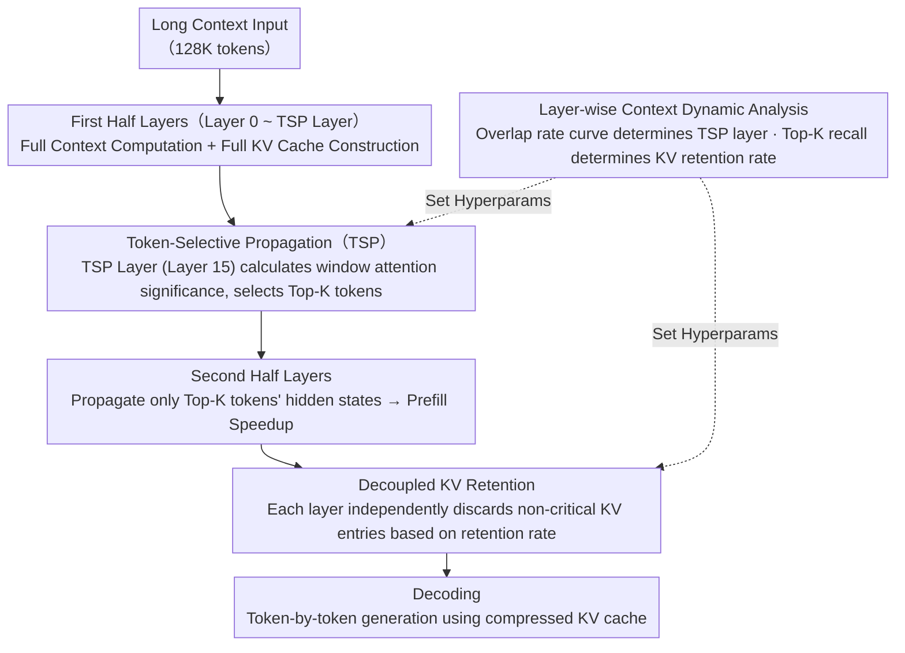

# FastKV: Decoupling of Context Reduction and KV Cache Compression for Prefill-Decoding Acceleration

**Conference**: ACL 2026 Findings  
**arXiv**: [2502.01068](https://arxiv.org/abs/2502.01068)  
**Code**: [GitHub](https://github.com/dongwonjo/FastKV)  
**Area**: Model Compression / Inference Acceleration  
**Keywords**: KV Cache Compression, Prefill Acceleration, Token-Selective Propagation, Inter-layer Context Dynamics, Decoding Acceleration

## TL;DR

This paper proposes FastKV, which decouples context reduction (Token-Selective Propagation in the prefill stage) from KV cache compression (layer-wise KV retention in the decoding stage). It achieves 1.82× prefill and 2.87× decoding acceleration on LLaMA-3.1-8B-Instruct while maintaining accuracy within a 1% drop on LongBench.

## Background & Motivation

**Background**: LLMs support context windows of 128K or even millions of tokens. However, long-context inference faces two-stage bottlenecks: the prefill stage suffers from quadratic growth in attention computation relative to input length, while the linear growth of the KV cache during the decoding stage becomes a memory and bandwidth bottleneck.

**Limitations of Prior Work**: (1) Decoding-side methods (e.g., SnapKV, H2O) only compress the already generated KV cache and do not accelerate the prefill stage; (2) Prefill-side methods (e.g., GemFilter) prune tokens starting from early layers, but critical tokens in early layers are highly unstable, and premature pruning leads to irrecoverable information loss; (3) Existing prefill-aware methods tightly couple context reduction with the KV budget—achieving sufficient decoding acceleration requires aggressive prefill pruning, leading to accuracy degradation.

**Key Challenge**: The prefill stage requires full-context processing to maintain accuracy, whereas the decoding stage depends on only a minimal set of tokens. Coupling the two stages means they cannot be optimized simultaneously.

**Goal**: Decouple prefill context reduction from decoding KV compression to independently control the efficiency-accuracy trade-offs for both stages.

**Key Insight**: Leveraging two critical observations: (1) Critical tokens in early layers are highly unstable (low overlap rate), while they tend to stabilize in later layers (high overlap rate); (2) All layers rely on only a few tokens during decoding (Top-512, or 0.38%, captures most of the attention quality).

**Core Idea**: Set a TSP (Token-Selective Propagation) split point in stable layers—the first half performs full-context computation to maintain flexibility, and the second half propagates only critical tokens to accelerate prefill. Simultaneously, each layer independently retains a small proportion of the KV cache for decoding, with both ratios being independently tunable.

## Method

### Overall Architecture

FastKV operates in two steps: (1) Two-stage prefill—the first half (Layer 0 to TSP layer) processes the full context and constructs a complete KV cache; the TSP layer selects top-K tokens based on window token attention weights and passes only their hidden states to subsequent layers. (2) Layer-wise KV retention—each layer independently discards non-critical KV entries, retaining only a specified cache ratio for decoding. The two core hyperparameters (TSP layer position and KV retention rate) are determined by layer-wise context dynamic analysis and are independently adjustable.

### Key Designs

**1. Token-Selective Propagation (TSP): Accelerating the second half of prefill by truncating context after critical tokens stabilize.**

Prefill-side methods like GemFilter prune tokens from very early layers, but the critical tokens selected in early layers are highly unstable. FastKV’s analysis shows that as the layer distance increases, the inter-layer overlap rate of critical tokens drops sharply; premature pruning is essentially a wrong bet, and lost information cannot be recovered. TSP's strategy is to delay pruning until the middle of the network: the first half (Layer 0 to TSP layer) processes the full context normally, and pruning only occurs at the TSP layer (Layer 15 is found to be optimal in experiments, as the overlap decay slows down and critical tokens converge). Specifically, the TSP layer calculates a significance score for each token as the average attention weight when queried by recent window tokens $S_i^{TSPlayer} = \frac{1}{H}\sum_{h=0}^{H-1} S_i^{TSPlayer,h}$. Only top-ranked tokens based on a predefined TSP rate have their hidden states passed forward. Subsequent layers perform attention on a much smaller token subset, accelerating prefill while the first half preserves accuracy through full context.

**2. Decoupled KV Retention: Independently tuning the decoding KV budget and prefill compression rate.**

Previous methods (GemFilter, PyramidInfer) tied "how much to prune in prefill" and "how much to keep in KV cache" into a single knob—improving decoding speed required aggressive prefill pruning, which collapsed accuracy. FastKV separates these tasks: the prefill side uses the TSP rate to control token propagation, while the decoding side sets an independent KV retention rate for each layer, discarding non-critical KV entries according to attention scores. Although early layers process the full context, their KV caches are still compressed to a very small size based on the retention rate—because decoding naturally relies on few tokens in every layer. As the two ratios are independent, the KV retention rate can be kept very low to accelerate decoding even if the TSP rate is high (propagating more tokens to preserve accuracy), allowing both stages to be optimized separately.

**3. Layer-wise Context Dynamic Analysis: Data-driven guidance for "when to compress and how much."**

The two core hyperparameters of FastKV (TSP layer position and KV retention rate) are derived from empirical measurements of the model. The authors fed 128K tokens into LLaMA-3.1-8B-Instruct and calculated inter-layer overlap rates for the top-512 critical token indices: the overlap rate drops sharply for layers $\le 15$ (indicating instability), but the decay slows down for layers $> 15$ (indicating stability). This curve directly identifies where the TSP layer should be set. Another Top-K attention recall analysis shows that only 0.38% of tokens (K=512) dominate the majority of attention quality across all layers, which justifies extremely low KV retention rates. These observations transform the design of FastKV from manual hyperparameter tuning to a data-driven approach.

### Loss & Training

FastKV is a training-free method applied during inference. It was primarily validated on LLaMA-3.1-8B-Instruct, with LongBench serving as the main evaluation benchmark.

## Key Experimental Results

### Main Results

| Method | Prefill | Decoding | Accuracy |
|------|---------|---------|------|
| Full-context | Slow | Slow | High |
| StreamingLLM | Slow | Fast | Low |
| SnapKV | Slow | Fast | High |
| GemFilter | Fast | Fast | Low |
| **Ours (FastKV)** | **Fast (1.82×)** | **Fast (2.87×)** | **High (<1% drop)** |

### Ablation Study

| Analysis Dimension | Result |
|----------|------|
| TSP Layer Position | Layer 15 is optimal—earlier leads to accuracy loss, later reduces acceleration gain |
| TSP Rate vs. KV Retention Rate Decoupling | Decoupling allows independent optimization, outperforming coupled schemes |
| Inter-layer Critical Token Overlap | Drops sharply $\le 15$, stabilizes $> 15$ |
| Top-K Attention Recall | K=512 (0.38%) captures most attention quality |

### Key Findings

- FastKV is the only method that simultaneously achieves prefill acceleration, decoding acceleration, and high accuracy.
- The decoupled design allows for flexible efficiency-accuracy trade-offs by independently adjusting the two ratios.
- The two-stage nature of inter-layer context dynamics (instability vs. stability) provides clear guidance for token pruning timing.
- Accuracy degradation of <1% on LongBench demonstrates that later layers have a low dependency on the full context.

## Highlights & Insights

- The idea of "decoupling" prefill and decoding compression is simple yet profound—previous methods implicitly assumed synchronization, which is an unnecessary constraint.
- The analysis of inter-layer critical token overlap provides a data-driven basis for TSP layer selection, avoiding blind hyperparameter tuning.
- The discovery of sparse context utilization (0.38% of tokens dominating attention) provides theoretical support for extreme KV compression.

## Limitations & Future Work

- Validation was primarily on the LLaMA-3.1-8B-Instruct; generalization to larger models and different architectures needs verification.
- Analysis on 128K tokens might not fully apply to even longer context windows.
- The TSP layer is fixed; adaptive selection could potentially further improve performance.
- Combinations with orthogonal compression techniques like quantization were not explored.

## Related Work & Insights

- **vs. SnapKV/H2O**: These methods only compress decoding-side KV caches while the prefill stage requires full computation; FastKV accelerates both.
- **vs. GemFilter**: GemFilter selects tokens from a single layer and forces all subsequent layers to use them, harming early layers; FastKV preserves the full context in the first half.
- **vs. PyramidInfer**: Prunes progressively from the first layer, which is too aggressive; FastKV waits for stability before pruning.

## Rating

- Novelty: ⭐⭐⭐⭐ The decoupling idea and TSP design are simple and effective, though KV compression is a crowded field.
- Experimental Thoroughness: ⭐⭐⭐⭐ Solid evaluation on LongBench, though model variety is limited.
- Writing Quality: ⭐⭐⭐⭐⭐ Clear motivation, rigorous experimental design, and intuitive comparison tables.
- Value: ⭐⭐⭐⭐⭐ High practical value for simultaneously accelerating prefill and decoding while maintaining accuracy.

<!-- RELATED:START -->

## Related Papers

- [\[ACL 2026\] DASH-KV: Accelerating Long-Context LLM Inference via Asymmetric KV Cache Hashing](dash-kv_accelerating_long-context_llm_inference_via_asymmetric_kv_cache_hashing.md)
- [\[ACL 2026\] HeteroCache: A Dynamic Retrieval Approach to Heterogeneous KV Cache Compression for Long-Context LLM Inference](heterocache_a_dynamic_retrieval_approach_to_heterogeneous_kv_cache_compression_f.md)
- [\[ACL 2026\] The Pitfalls of KV Cache Compression](the_pitfalls_of_kv_cache_compression.md)
- [\[ICML 2025\] RocketKV: Accelerating Long-Context LLM Inference via Two-Stage KV Cache Compression](../../ICML2025/model_compression/rocketkv_accelerating_long-context_llm_inference_via_two-stage_kv_cache_compress.md)
- [\[NeurIPS 2025\] KVzip: Query-Agnostic KV Cache Compression with Context Reconstruction](../../NeurIPS2025/model_compression/kvzip_query-agnostic_kv_cache_compression_with_context_reconstruction.md)

<!-- RELATED:END -->
