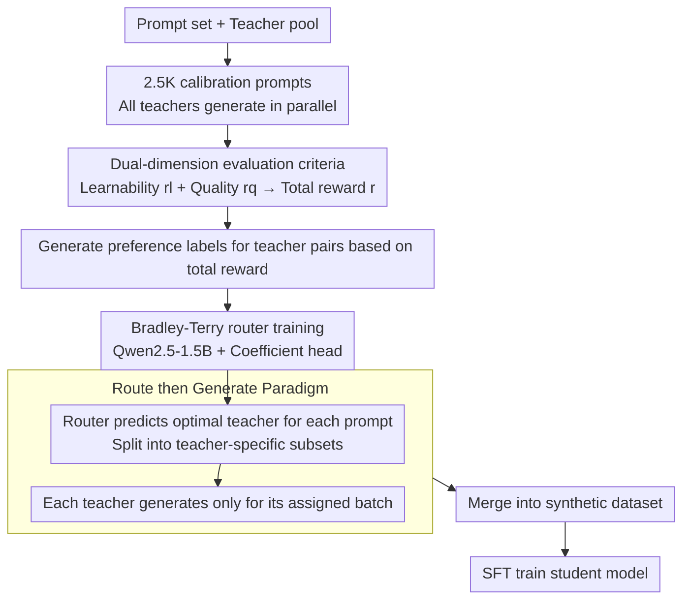

# Find Your Optimal Teacher: Personalized Data Synthesis via Router-Guided Multi-Teacher Distillation

**Conference**: ACL 2026  
**arXiv**: [2510.10925](https://arxiv.org/abs/2510.10925)  
**Code**: None (but opensources PerSyn-Math dataset)  
**Area**: Model Compression / Knowledge Distillation  
**Keywords**: Knowledge Distillation, Synthetic Data, Multi-teacher, Routing Mechanism, Personalized Distillation

## TL;DR

This paper proposes PerSyn (Personalized data Synthesis), which adopts a "Route then Generate" paradigm where a router assigns the optimal teacher model for each prompt. It considers both student learnability and teacher response quality. This approach is more efficient and effective than the traditional "Generate then Select" paradigm, consistently surpassing all baselines in instruction tuning and mathematical reasoning scenarios.

## Background & Motivation

**Background**: Utilizing powerful teacher models to generate synthetic data for training small student models is a mainstream approach in knowledge distillation. It is generally assumed that stronger teachers produce higher-quality data, leading to better student performance.

**Limitations of Prior Work**: Recent studies indicate that "a stronger model is not necessarily a better teacher"—outputs from strong models may be overly complex or deviate from the student's distribution, making it difficult for the student to learn effectively. "Mix" methods combine data from strong and weak teachers, while CAR methods select a single best teacher. However, both follow a "Generate then Select" paradigm, requiring all teachers to generate responses for all prompts, resulting in costs that scale linearly with the number of teachers.

**Key Challenge**: (1) Efficiency—"Generate then Select" requires every candidate teacher to generate a response for every prompt (e.g., 20 teachers × 100K prompts = 2 million generations). (2) Granularity—existing methods choose a single teacher or use fixed mixing ratios, ignoring the fact that different prompts require different teachers.

**Goal**: Design a prompt-level optimal teacher assignment mechanism to construct personalized synthetic datasets at a lower cost.

**Key Insight**: The authors observe that the optimal teacher varies across different prompts—some simple prompts are better suited for weak teachers (whose output matches student levels), while difficult prompts necessitate strong teachers.

**Core Idea**: Train a lightweight router (based on Qwen2.5-1.5B) to predict the optimal teacher for each prompt based on student learnability and teacher quality, shifting the paradigm from "Generate then Select" to a more efficient "Route then Generate" approach.

## Method

### Overall Architecture

Given a set of prompts $\mathcal{X}$ and a teacher model pool $\mathcal{M}$, the PerSyn router $\pi(x)$ outputs a score vector $\mathbf{o} \in \mathbb{R}^{|\mathcal{M}|}$ for each prompt $x$, selecting the teacher with the highest score. Each teacher generates responses only for its assigned subset of prompts. All outputs are merged into the final synthetic dataset $\mathcal{D}$ for SFT training of the student model. The full parallel generation cost is paid only on a small calibration set to train the router; subsequently, teacher assignment for the full prompt set requires only a single lightweight forward pass.

### Key Designs

**1. Dual-dimension Teacher Evaluation: Balancing Teacher Strength and Student Capacity**

"A stronger teacher is not always a better teacher"—complex outputs from strong models can deviate from student distributions. Conversely, selecting only the easiest responses might lead to low-quality content. PerSyn scores teacher responses using two rewards: a learnability reward $r_l$ (average log-likelihood of the student model on the response) and a quality reward $r_q$ (provided by external reward models like Skywork-Reward for instruction tuning or binary correctness for math). These are combined into a weighted total reward:

$$r(y_i^{\mathcal{M}_n}, \theta) = (1-\alpha) \cdot r_q(y_i^{\mathcal{M}_n}) + \alpha \cdot r_l(y_i^{\mathcal{M}_n}, \theta)$$

Setting $\alpha=0.4$ prioritizes quality slightly. Ablation studies show that removing the quality reward causes a larger performance drop than removing learnability, though both are essential.

**2. Bradley-Terry Router Training: Generalizing from a Small Calibration Set**

To avoid the high cost of parallel generation, PerSyn uses a small calibration set of 2.5K prompts. All teachers generate responses for these prompts to create preference labels based on the total reward. These are used to train a Bradley-Terry model:

$$\mathbb{P}(B \succ A \mid z, x) = \sigma(z^\top \pi(x))$$

where $z$ is a two-hot encoding of the teacher pair and $\pi(x)$ is the router's score vector. The router (Qwen2.5-1.5B) uses a coefficient head and is trained with binary cross-entropy. This 2.5K sample set is sufficient for the router's Hit@3 to stabilize, achieving 20–40x higher efficiency than an Oracle router requiring full parallel generation.

**3. "Route then Generate" Paradigm: Efficient Resource Allocation**

By reversing the process—routing before generating—PerSyn eliminates the linear cost growth relative to the number of teachers. Routing is a lightweight forward pass. Furthermore, experiments show that $>95\%$ of prompts are routed to smaller teacher models, significantly reducing the usage of expensive ultra-large models.

### Loss & Training

The router is trained using binary cross-entropy loss. Student models undergo standard SFT with loss calculated only on response tokens. Models smaller than 14B use full-parameter fine-tuning, while larger models use LoRA.

## Key Experimental Results

### Main Results

Average performance (%) of five student models across six benchmarks:

| Student Model | Strong | Mix | CAR | **PerSyn** |
|----------|--------|-----|-----|-----------|
| Qwen2.5-0.5B | 28.51 | 30.75 | 32.77 | **34.13** |
| Qwen2.5-1.5B | 46.82 | 47.79 | 49.21 | **50.63** |
| Gemma-2-2B | 28.45 | 29.76 | 31.41 | **32.85** |
| Qwen2.5-3B | 55.38 | 55.39 | 57.17 | **58.09** |
| Llama-3.2-3B | 31.37 | 31.75 | 32.99 | **34.81** |

Specific gains for Llama-3.2-3B (PerSyn vs CAR): IFEval +5.8%, TruthfulQA +4.1%, MATH +7.5%.

### Ablation Study

Ablation of learnability and quality rewards (average across all student models):

| Setting | Impact |
|------|------|
| PerSyn (Full) | Peak performance |
| PerSyn w/o Learnability | ~1-2% decrease |
| PerSyn w/o Quality | ~2-4% decrease (more significant) |

Router efficiency comparison:

| Router | Qwen2.5-0.5B | Qwen2.5-3B | Llama-3.2-3B |
|--------|-------------|------------|-------------|
| PerSyn Router | 27.18 | 40.53 | 30.35 |
| Oracle Router | 27.63 | 41.02 | 30.18 |

### Key Findings

- $>95\%$ of prompts are routed to smaller teacher models; ultra-large models like Llama-3.1-405B receive minimal allocations.
- Qwen2.5-72B-Instruct is the most general teacher, receiving high allocations across all student models.
- Long-CoT models (e.g., DeepSeek-R1) receive fewer allocations but are indispensable; replacing them with Short-CoT teachers leads to a 1.3% drop.
- Training strictly on Long-CoT data (Strong baseline) yields worse results due to repetitive reasoning behaviors.

## Highlights & Insights

- The shift to the "Route then Generate" paradigm elegantly addresses the efficiency bottleneck of multi-teacher distillation.
- The Bradley-Terry router generalizes well with only 2.5K calibration samples, offering high practicality.
- Quality is more critical than learnability ($\alpha=0.4$), but both are necessary—correcting the misconceptions of using either "only the strongest" or "only the most matching" teacher.

## Limitations & Future Work

- Validated only in instruction tuning and math reasoning; code generation and multimodal domains remain unexplored.
- Student models are limited to under 14B; whether larger models benefit from personalized distillation remains to be verified.
- The router requires separate training for each (setting, student model) pair, which may incur cumulative costs if settings change frequently.

## Related Work & Insights

- Li et al. (2025) first identified the "learnability gap" and proposed the Mix strategy; PerSyn refines this from dataset-level to prompt-level.
- CAR (Xu et al., 2025) selects a single teacher. PerSyn proves that different prompts require different teachers.
- Insight: Distillation is not just a "data quality" issue but a "data-student matching" issue. Routing mechanisms could extend to other data selection scenarios.

## Rating

- Novelty: ⭐⭐⭐⭐ Clear paradigm shift and practical router design, though the core intuition is relatively straightforward.
- Experimental Thoroughness: ⭐⭐⭐⭐⭐ Extensive benchmarks across five student models, three families, and two scenarios with detailed ablations.
- Writing Quality: ⭐⭐⭐⭐ Excellent visualization; Table 1 provides a direct and powerful comparison; the overall narrative is smooth.

<!-- RELATED:START -->

## Related Papers

- [\[CVPR 2026\] How to Choose Your Teacher for Fine Grained Image Recognition](../../CVPR2026/model_compression/how_to_choose_your_teacher_for_fine_grained_image_recognition.md)
- [\[CVPR 2026\] Teacher-Guided Routing for Sparse Vision Mixture-of-Experts](../../CVPR2026/model_compression/teacher-guided_routing_for_sparse_vision_mixture-of-experts.md)
- [\[ICLR 2026\] Pedagogically-Inspired Data Synthesis for Language Model Knowledge Distillation](../../ICLR2026/model_compression/pedagogically-inspired_data_synthesis_for_language_model_knowledge_distillation.md)
- [\[CVPR 2026\] Distilling Balanced Knowledge from a Biased Teacher](../../CVPR2026/model_compression/distilling_balanced_knowledge_from_a_biased_teacher.md)
- [\[ICLR 2026\] STAR: Similarity-guided Teacher-Assisted Refinement for Super-Tiny Function Calling Models](../../ICLR2026/model_compression/star_similarity-guided_teacher-assisted_refinement_for_super-tiny_function_calli.md)

<!-- RELATED:END -->
