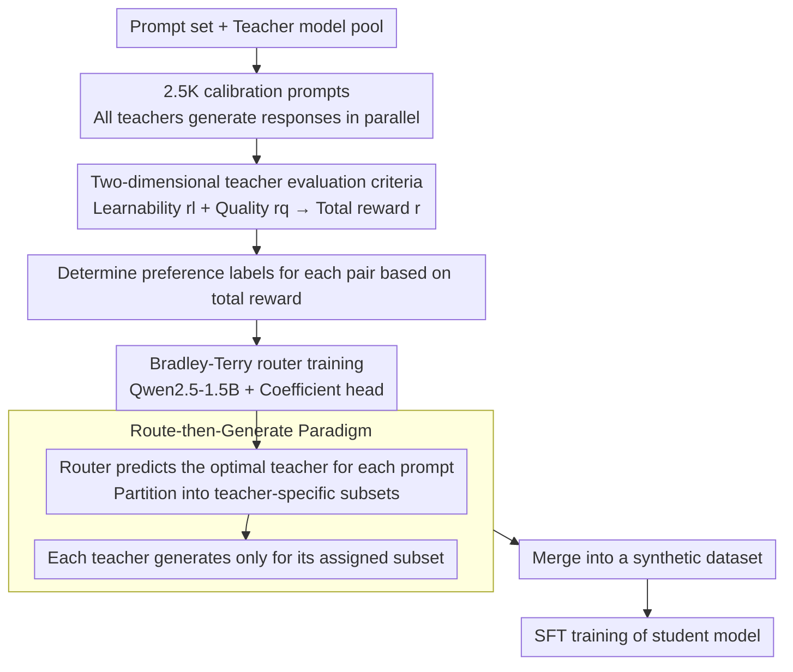

# Find Your Optimal Teacher: Personalized Data Synthesis via Router-Guided Multi-Teacher Distillation

**Conference**: ACL 2026  
**arXiv**: [2510.10925](https://arxiv.org/abs/2510.10925)  
**Code**: None (but opensources PerSyn-Math dataset)  
**Area**: Model Compression / Knowledge Distillation  
**Keywords**: Knowledge Distillation, Synthetic Data, Multi-teacher, Routing Mechanism, Personalized Distillation

## TL;DR

Ours propose PerSyn (Personalized data Synthesis), which utilizes a "Route-then-Generate" paradigm where a router assigns the optimal teacher model for each prompt. By considering both student learnability and teacher response quality, this approach is more efficient and effective than the traditional "Generate-then-Select" paradigm, consistently surpassing all baselines in both instruction tuning and mathematical reasoning scenarios.

## Background & Motivation

**Background**: Using powerful teacher models to generate synthetic data for training small student models is a mainstream approach in knowledge distillation. It is generally assumed that stronger teachers produce higher quality data, leading to better student learning.

**Limitations of Prior Work**: Recent research has found that "a stronger model is not necessarily a better teacher"—outputs from strong models may be overly complex, deviating from the student's distribution and making it difficult for the student to learn effectively. The Mix method blends data from strong and weak teachers, while the CAR method selects a single best teacher. However, both follow a "Generate-then-Select" paradigm, requiring all teachers to generate responses for all prompts, which leads to costs that scale linearly with the number of teachers.

**Key Challenge**: (1) Efficiency—The "Generate-then-Select" approach requires every candidate teacher to generate a response for every prompt (e.g., 20 teachers × 100K prompts = 2 million generations); (2) Granularity—Existing methods select a single teacher or use a fixed mixing ratio, ignoring the fact that different prompts require different teachers.

**Goal**: Design a prompt-level optimal teacher assignment mechanism to construct personalized synthetic datasets at a lower cost.

**Key Insight**: The authors observe that the optimal teacher varies for different prompts—some simple prompts are better suited for weak teachers (whose output matches the student's level), while some difficult prompts require strong teachers.

**Core Idea**: Train a lightweight router (based on Qwen2.5-1.5B) to predict the optimal teacher for each prompt based on student learnability and teacher quality, shifting the paradigm from "Generate-then-Select" to the more efficient "Route-then-Generate".

## Method

### Overall Architecture

The input consists of a prompt set $\mathcal{X}$ and a teacher model pool $\mathcal{M}$. The PerSyn router $\pi(x)$ outputs a score vector $\mathbf{o} \in \mathbb{R}^{|\mathcal{M}|}$ for each prompt $x$, and the teacher corresponding to the highest score is selected. This teacher only generates responses for its assigned subset of prompts. The outputs from all teachers are merged into the final synthetic dataset $\mathcal{D}$ for SFT training of the student model. The entire pipeline only incurs the cost of "all teachers generating" on a small calibration set used to train the router; subsequently, teacher assignment for the full prompt set is completed with a single lightweight forward pass.

### Key Designs

**1. Two-dimensional teacher evaluation criteria: Quality depends not only on teacher strength but also on student learnability**

"A stronger teacher is not always a better teacher"—the outputs of strong models are often too complex and deviate from the student's distribution, making them hard for the student to ingest. Inversely, selecting only the responses easiest for a student to mimic may result in simple or low-quality content. PerSyn thus scores each teacher response using two rewards: a learnability reward $r_l$ measured by the student model's average log-likelihood for that response (higher indicates a better fit for the student's current ability), and a quality reward $r_q$ provided by an external reward model (Skywork-Reward for instruction tuning, and binary correctness of the answer for mathematical reasoning). Both are normalized and weighted to form the total reward:

$$r(y_i^{\mathcal{M}_n}, \theta) = (1-\alpha) \cdot r_q(y_i^{\mathcal{M}_n}) + \alpha \cdot r_l(y_i^{\mathcal{M}_n}, \theta)$$

With $\alpha=0.4$, the quality weight is slightly higher than learnability. Ablation studies confirm that this bias is correct—removing the quality reward leads to a larger performance drop than removing learnability, but both are indispensable.

**2. Bradley-Terry router training: Learning a generalizable router using only 2.5K calibration prompts**

Calculating the rewards mentioned above requires every teacher to have generated a response for every prompt—which is exactly why the "Generate-then-Select" paradigm is expensive. PerSyn addresses this by only paying this cost on a small calibration set: all teachers generate responses for only 2.5K prompts, preference labels are determined for each pair based on total rewards, and the Bradley-Terry model is used to model pairwise preferences as probabilities:

$$\mathbb{P}(B \succ A \mid z, x) = \sigma(z^\top \pi(x))$$

where $z$ is a two-hot encoding of the teacher pair, and $\pi(x)$ is the router's teacher score vector for prompt $x$. The router itself is a Qwen2.5-1.5B model, with the language modeling head replaced by a coefficient head (output dimension equals the number of teachers), trained using binary cross-entropy loss. These 2.5K parallel responses are sufficient for the router’s Hit@3 to stabilize. Compared to an Oracle router requiring parallel responses for the full dataset, this is 20–40 times more efficient.

**3. "Route-then-Generate" paradigm: Each teacher only works on its assigned prompts**

Traditional "Generate-then-Select" requires all candidate teachers to generate for every prompt (20 teachers × 100K prompts = 2 million generations), causing costs to scale linearly with the number of teachers. PerSyn reverses the process: the trained router performs a single forward pass to predict the optimal teacher for each prompt, partitioning the entire prompt set into subsets $\mathcal{X}_{\mathcal{M}_i}$ (assigned to teacher $\mathcal{M}_i$). Each teacher then only generates for its specific subset, which are finally merged. Routing itself is a lightweight forward pass with negligible cost; furthermore, experiments show that >95% of prompts are routed to smaller teacher models, further reducing the call volume to expensive ultra-large models.

### Loss & Training

Router training: binary cross-entropy loss; Student model training: standard SFT, calculating loss only on response tokens. Student models smaller than 14B undergo full-parameter fine-tuning, while larger models use LoRA.

## Key Experimental Results

### Main Results

Average performance (%) of five student models across six benchmarks:

| Student Model | Strong | Mix | CAR | **PerSyn** |
|----------|--------|-----|-----|-----------|
| Qwen2.5-0.5B | 28.51 | 30.75 | 32.77 | **34.13** |
| Qwen2.5-1.5B | 46.82 | 47.79 | 49.21 | **50.63** |
| Gemma-2-2B | 28.45 | 29.76 | 31.41 | **32.85** |
| Qwen2.5-3B | 55.38 | 55.39 | 57.17 | **58.09** |
| Llama-3.2-3B | 31.37 | 31.75 | 32.99 | **34.81** |

Specific gains on Llama-3.2-3B (PerSyn vs CAR): IFEval +5.8%, TruthfulQA +4.1%, MATH +7.5%.

### Ablation Study

Ablating learnability and quality rewards (averaged across all student models):

| Setting | Impact |
|------|------|
| PerSyn (Full) | Highest performance |
| PerSyn w/o Learnability | Drop of ~1-2% |
| PerSyn w/o Quality | Drop of ~2-4% (Larger) |

Router efficiency comparison:

| Router | Qwen2.5-0.5B | Qwen2.5-3B | Llama-3.2-3B |
|--------|-------------|------------|-------------|
| PerSyn Router | 27.18 | 40.53 | 30.35 |
| Oracle Router | 27.63 | 41.02 | 30.18 |

### Key Findings

- >95% of prompts are routed to smaller teacher models; ultra-large models like Llama-3.1-405B receive minimal assignments.
- Qwen2.5-72B-Instruct consistently achieves high assignment ratios across all student models, proving to be the most versatile teacher.
- Long-CoT models (e.g., DeepSeek-R1) only account for a small fraction of assignments but are indispensable—replacing them with Short-CoT teachers leads to a 1.3% performance drop.
- The Strong baseline trained entirely on Long-CoT data performs worse, as models tend to produce repetitive reasoning.

## Highlights & Insights

- The "Route-then-Generate" paradigm shift is simple and elegant, fundamentally resolving the efficiency bottleneck of multi-teacher distillation.
- The Bradley-Terry router generalizes effectively with only 2.5K calibration samples, making it highly practical.
- Quality is more important than learnability ($\alpha=0.4$), but both are essential—this corrects the extreme views of "using only the strongest teacher" versus "using only the most compatible teacher."

## Limitations & Future Work

- Validated only in instruction tuning and mathematical reasoning scenarios; code generation and multimodal tasks have not been explored.
- Student model scales are limited to below 14B; whether larger models benefit from personalized distillation remains to be verified.
- The router needs to be trained separately for each (setting, student model) combination, potentially accumulating costs when settings change frequently.

## Related Work & Insights

- Li et al. (2025) first revealed the "learnability gap" problem and proposed the Mix strategy; PerSyn refines this from the dataset level to the prompt level.
- CAR (Xu et al., 2025) selects a single teacher; PerSyn demonstrates that different prompts require different teachers.
- Insight: Distillation is not just a "data quality" issue, but more importantly a "data-student matching" issue. The routing mechanism could potentially be extended to other data selection scenarios.

## Rating

- Novelty: ⭐⭐⭐⭐ The paradigm shift is clear and the router design is practical, though the core idea (different samples using different teachers) is relatively intuitive.
- Experimental Thoroughness: ⭐⭐⭐⭐⭐ Five student models × three families × two scenarios × six benchmarks, with extremely detailed ablation and analysis.
- Writing Quality: ⭐⭐⭐⭐ Excellent chart design; the comparison in Table 1 is intuitive and powerful, with a smooth narrative overall.

<!-- RELATED:START -->

## Related Papers

- [\[CVPR 2026\] Teacher-Guided Routing for Sparse Vision Mixture-of-Experts](../../CVPR2026/model_compression/teacher-guided_routing_for_sparse_vision_mixture-of-experts.md)
- [\[ICLR 2026\] Pedagogically-Inspired Data Synthesis for Language Model Knowledge Distillation](../../ICLR2026/model_compression/pedagogically-inspired_data_synthesis_for_language_model_knowledge_distillation.md)
- [\[CVPR 2026\] SigLino: Efficient Multi-Teacher Distillation for Agglomerative Vision Foundation Models](../../CVPR2026/model_compression/siglino_efficient_multi-teacher_distillation_for_agglomerative_vision_foundation.md)
- [\[CVPR 2026\] Distilling Balanced Knowledge from a Biased Teacher](../../CVPR2026/model_compression/distilling_balanced_knowledge_from_a_biased_teacher.md)
- [\[ICLR 2026\] STAR: Similarity-guided Teacher-Assisted Refinement for Super-Tiny Function Calling Models](../../ICLR2026/model_compression/star_similarity-guided_teacher-assisted_refinement_for_super-tiny_function_calli.md)

<!-- RELATED:END -->
