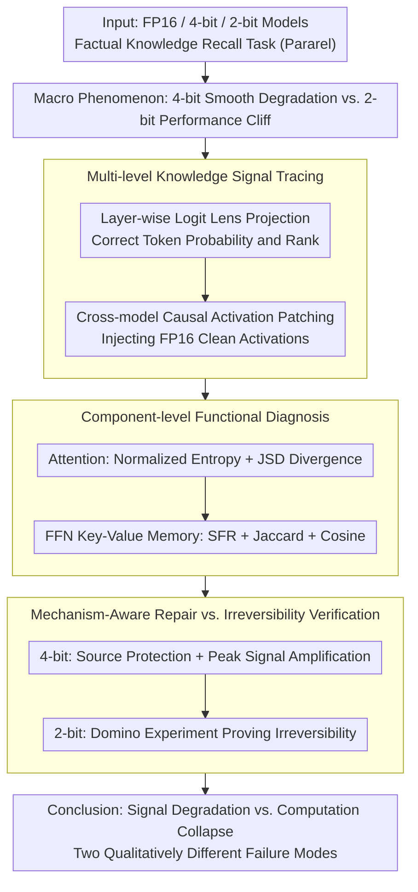

# From Signal Degradation to Computation Collapse: Uncovering the Two Failure Modes of LLM Quantization

**Conference**: ACL 2026 Findings  
**arXiv**: [2604.19884](https://arxiv.org/abs/2604.19884)  
**Code**: None  
**Area**: Model Quantization / Interpretability  
**Keywords**: Post-training Quantization, Signal Degradation, Computation Collapse, Mechanistic Interpretability, Causal Tracing, Knowledge Recall, PTQ

## TL;DR

Through systematic mechanistic interpretability analysis, this paper reveals that LLM quantization exhibits two qualitatively different failure modes: 4-bit Signal Degradation (computational patterns remain intact but precision is impaired, allowing for local repair) and 2-bit Computation Collapse (functional destruction of key components, requiring structural reconstruction).

## Background & Motivation

**Background**: Post-Training Quantization (PTQ) is a critical technology for the efficient deployment of LLMs. While 4-bit quantization is widely regarded as the optimal balance between precision and compression, 2-bit quantization typically triggers a catastrophic "performance cliff"—where accuracy plummets to near zero.

**Limitations of Prior Work**: Existing research focuses on three directions: (1) Macro-evaluation (measuring the magnitude of performance degradation); (2) Algorithmic improvement (numerical optimizations like outlier suppression and rotation matrices); (3) Preliminary mechanistic exploration (layer/component sensitivity analysis). A common limitation is treating quantization damage solely as a "numerical problem" without investigating why internal model mechanisms fail.

**Key Challenge**: Is the catastrophic failure of 2-bit quantization merely a quantitative accumulation of 4-bit degradation, or does it represent a qualitative shift? If it is a qualitative shift, it implies that current numerical optimization-based repair strategies are fundamentally misdirected for 2-bit quantization.

**Goal**: This work aims to reveal the internal mechanistic differences in quantization failures through systematic mechanistic interpretability analysis (layer-wise information flow, causal paths, component functions, representation space) and verify that different failure modes correspond to different repair strategies.

**Key Insight**: Quantization failure is analogous to signal processing—is the signal weakened by noise (degradation) or is the calculation pipeline itself broken (collapse)?

**Core Idea**: The difference between 4-bit and 2-bit failures is essential rather than incremental. Signal degradation can be recovered through targeted training-free repairs, whereas computation collapse requires structural reconstruction (e.g., fine-tuning). This difference is the strongest evidence for distinguishing the two modes.

## Method

**Overall Architecture**: Taking Llama-3.1-8B as the primary subject, the study systematically compares the internal behaviors of FP16, 4-bit, and 2-bit models on a factual knowledge recall task (Pararel). Starting from macro-performance phenomena, the analysis proceeds through layer-wise signal tracing, component functional diagnosis, and mechanism-oriented repair to confirm "which component fails in what way," finally using "repairability" to prove the essential difference between the two failure modes.

**Key Designs**:

**1. Multi-level Knowledge Signal Tracing: Determining if the signal is "weakened" or "never generated"**

The first step in distinguishing the two failure modes is clarifying the state of knowledge signals for the correct answer. The authors use Logit Lens to project hidden states of each layer back to the vocabulary space, observing the probability and rank of the correct token. In 4-bit models, signals still emerge in middle-to-late layers but with weakened intensity (typical degradation); in 2-bit models, signals remain near zero throughout, appearing as if they were never generated. To confirm this, cross-model causal activation patching is performed—injecting "clean" activations from the FP16 model at critical positions (the last subject token) into the quantized models. The 4-bit model restores output upon receiving the correct activation, whereas the 2-bit model shows no response. This proves that 2-bit failure is not about signals being buried in noise but a broken computational pipeline.

**2. Component-level Functional Diagnosis: Attributing signal loss to specific components**

After identifying signal-level differences, the failure is localized to Attention or FFN modules. For Attention, normalized entropy measures the global concentration of attention distribution, and JSD divergence measures the focus shift relative to FP16. For FFN (viewed as key-value memory), the authors use three metrics: Symbol Flipping Rate (SFR, where >30% indicates severe instability), Jaccard overlap of Top-1% activated neurons ($\approx 0.1$ indicates almost complete misalignment), and output cosine similarity ($\approx 0$ indicates total semantic deviation). 2-bit models exhibit functional collapse across all component metrics, confirming that macro-signal loss stems from component failure rather than mere numerical precision loss.

**3. Mechanism-Aware Two-Stage Repair vs. Irreversibility Verification: Proving modes by "Repairability"**

If the two failures are essentially different, they should respond differently to repairs. For 4-bit signal degradation, a "Source Protection + Signal Recovery" approach is designed: protecting early layers with higher precision (8-bit for the first 2 layers in Llama/Mistral, ~4.25 avg bits; kurtosis-selected layers for Qwen/Gemma, ~4.1 avg bits) and applying $\alpha$-fold logit amplification to peak signals. This training-free scheme restores accuracy from 0% to 64–81% in the failure subset. Conversely, the same strategy and EORA low-rank compensation both fail on 2-bit models. The "Domino Experiment" further clinches this: quantizing only the first 2 layers of a 100% accurate model to 2-bit drops accuracy to 41.65%, even if the remaining 30 layers stay in FP16. This demonstrates the irreversibility of computation collapse.

## Key Experimental Results

**4-bit Repair Experiments (Accuracy on Failure Subset)**:

| Model | Baseline (4-bit) | +Basic Repair | +Signal Amp (Final) |
|-------|------------------|---------------|---------------------|
| Llama3.1-8B | 0.00% | 67.91% | 75.19% ($\alpha=3$) |
| Mistral-7B | 0.00% | 66.86% | 81.26% ($\alpha=9$) |
| Qwen3-8B | 0.00% | 40.24% | 79.88% ($\alpha=7$) |
| Gemma2-9B | 0.00% | 33.85% | 64.08% ($\alpha=2$) |

**2-bit "Domino Effect" (Llama3.1-8B)**:

| Quantized Layers | Robust Subset | Failure Subset |
|------------------|---------------|----------------|
| None (FP16) | 100.00% | 100.00% |
| Layer 0 | 65.47% | 15.03% |
| Layers 0-1 | 41.65% | 5.29% |
| Layers 0-5 | 2.51% | 0.38% |

**Representation Space Analysis**:
- **4-bit**: CKA maintains a clear diagonal structure; activation subspace similarity with FP16 $> 0.8$.
- **2-bit**: CKA is almost entirely dark (structural collapse); activation subspace similarity $\approx 0$.
- **4-bit** error subspace alignment with signal $\approx 0.3$ (resembles random noise).
- **2-bit** error subspace alignment with signal $\approx 0.8$ (systematically interferes with core features).

**Key Findings**:
- 4-bit is characterized by "answer rank drop" (correct answer remains in Top-5), while 2-bit is "rank collapse" (drops to thousands, equivalent to random guessing).
- Architecture-dependent degradation patterns: Llama/Mistral show an "early representation bottleneck," while Qwen/Gemma show "uniform degradation."
- 2-bit models cannot process high-precision signal inputs correctly—the components themselves are defunct.
- The distinction between the two failure modes is consistent across both GPTQ and AWQ quantization methods.

## Highlights & Insights

- **Framework Value of Qualitative Distinction**: The paper is the first to systematically prove that 4-bit and 2-bit are not different degrees on a continuum but two fundamentally different failure modes.
- **Closed Loop from Diagnosis to Repair**: Mechanistic analysis directly guides the design of repair strategies, and the difference in repair effectiveness validates the diagnosis.
- **Persuasiveness of the "Domino Experiment"**: Showing that quantizing just the first 2 layers to 2-bit causes catastrophic collapse that 30 FP16 layers cannot fix provides a vivid demonstration of the irreversibility of computation collapse.
- **Deep Insights from Error Direction Analysis**: Higher alignment of 2-bit quantization error with the signal subspace implies that noise is not random but systematically destroys the model's core features.

## Limitations & Future Work

- Focused on weight-only quantization; failure modes of activation quantization remain to be investigated.
- Evaluations are anchored to factual recall tasks; performance in complex reasoning tasks needs verification.
- Repair strategies incur extra precision overhead (~4.1-4.25 avg bits); practical utility needs optimization.
- The boundary between the two modes (behavior of 3-bit) deserves in-depth study.
- The threshold for failure mode transitions may vary across different model architectures.

## Related Work & Insights

- **GPTQ (Frantar et al., 2023)**: The most widely used weight-only PTQ method, serving as the main quantization baseline.
- **Causal Tracing (Meng et al., 2022)**: A knowledge localization method, extended here into cross-model repair experiments.
- **Logit Lens (nostalgebraist, 2020)**: Tool for decoding intermediate layers.
- **SpQR (Dettmers et al., 2023)**: Mixed-precision approach, echoed by the source protection strategy in this paper.
- **Insight**: Quantization research should move beyond numerical optimization; mechanistic understanding is vital for breaking performance bottlenecks. The practical implementation of 2-bit quantization requires a shift from "compensation" to "reconstruction."

## Rating

- **Novelty**: ★★★★★ — The systematic distinction and validation of two failure modes is a fresh and significant contribution.
- **Experimental Thoroughness**: ★★★★★ — Evidence chain is complete across 4 models, multi-level analysis, and multiple metrics.
- **Writing Quality**: ★★★★★ — Narrative progresses clearly from phenomenon to hypothesis, validation, and intervention.
- **Value**: ★★★★☆ — Provides an important diagnostic framework and mechanistic insights for quantization research.

<!-- RELATED:START -->

## Related Papers

- [\[ACL 2026\] Two-Stage Regularization-Based Structured Pruning for LLMs](two-stage_regularization-based_structured_pruning_for_llms.md)
- [\[ICML 2025\] Speculative Decoding in Decentralized LLM Inference: Turning Communication Latency into Computation Throughput](../../ICML2025/model_compression/speculative_decoding_in_decentralized_llm_inference_turning_communication_latenc.md)
- [\[ICLR 2026\] Rethinking Residual Errors in Compensation-based LLM Quantization](../../ICLR2026/model_compression/rethinking_residual_errors_in_compensation-based_llm_quantization.md)
- [\[ICLR 2026\] Rethinking Continual Learning with Progressive Neural Collapse](../../ICLR2026/model_compression/rethinking_continual_learning_with_progressive_neural_collapse.md)
- [\[ICLR 2026\] ParoQuant: Pairwise Rotation Quantization for Efficient Reasoning LLM Inference](../../ICLR2026/model_compression/paroquant_pairwise_rotation_quantization_for_efficient_reasoning_llm_inference.md)

<!-- RELATED:END -->
