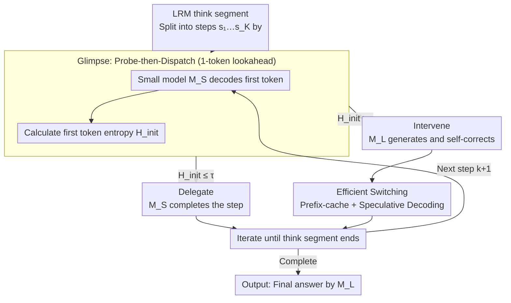

# GlimpRouter: Efficient Collaborative Inference by Glimpsing One Token of Thoughts

**Conference**: ACL 2026 Findings  
**arXiv**: [2601.05110](https://arxiv.org/abs/2601.05110)  
**Code**: https://github.com/Zengwh02/GlimpRouter  
**Area**: Model Collaborative Inference / LLM Acceleration / Inference Efficiency  
**Keywords**: Collaborative Inference, Speculative Decoding, step-wise routing, initial token entropy, Aha Moment

## TL;DR
This paper proposes **GlimpRouter**: in step-level LRM collaborative inference, the small model first decodes only the "first token" of each reasoning step. Its entropy $\mathbf{H}_{\text{init}}$ is used to estimate step difficulty; if low, the small model continues; if high, it switches to the large model. It is training-free, requires no large model verifier, achieves +10.7% accuracy with −25.9% latency improvement on AIME25 compared to a standalone large model, and is orthogonally compatible with token-level Speculative Decoding.

## Background & Motivation

**Background**: LRMs such as DeepSeek-R1 and o1/o3 achieve strong performance using long CoT explicit reasoning, but at the cost of significant latency and compute per query. The community has attempted to mitigate this via "collaborative inference"—distributing tasks among models based on difficulty. Token-level methods include Speculative Decoding (small model drafts, large model verifies), while step-level methods include RSD (trained PRM), SpecCoT (small model multi-candidates + large model selection), and SpecReason (small model generation + large model judgment).

**Limitations of Prior Work**:
- *Token-level*: Granularity is too fine, leading to frequent switching overhead.
- *Step-level*: Either requires training a reward model (RSD) or necessitates generating the entire step before assessing quality (SpecReason, SpecCoT). This turns "rejected steps" into **sunk costs**, failing to save time as intended.
- *Averaging metrics fail*: Routing based on $\mathbf{H}_{\text{step}}$ or $\mathbf{PPL}_{\text{step}}$ is diluted by long sequences of deterministic syntactic tokens, resulting in narrow, unimodal distributions that lack discriminative power.

**Key Challenge**: The fundamental difficulty in collaborative inference is determining step difficulty *before* generation; however, current step-level methods rely on "Generate-then-Measure," where the overhead offsets the collaboration benefits.

**Goal**: To identify a signal that is available at the start of a step, computationally near-free, and highly sensitive to difficulty, enabling "Probe-then-Dispatch."

**Key Insight**: Inspired by the "Aha Moment" phenomenon in LRMs—where reasoning steps often begin with discourse cues like "Wait/But/So"—the authors hypothesize that *difficulty information is concentrated in the first token*. Based on empirical analysis of 10M+ tokens from Qwen3-4B/32B and DeepSeek-R1-Distill-Qwen-32B on AIME/LiveCodeBench, the authors found that $\mathbf{H}_{\text{init}}$ exhibits a *bimodal + heavy-tail* distribution, whereas $\mathbf{H}_{\text{step}}$ and $\mathbf{PPL}_{\text{step}}$ are narrow and unimodal. This proves $\mathbf{H}_{\text{init}}$ is a natural "high-sensitivity discriminator."

**Core Idea**: Glimpsing the entropy of a single token is sufficient—low-entropy steps are delegated to the small model, while high-entropy steps are handled by the large model. This avoids both sunk costs and verifier training.

## Method

### Overall Architecture
The LRM `think` segment is partitioned into $\mathcal{T}=\{s_1,\dots,s_K\}$ (split by double newlines), and the final answer is generated by $M_L$. At each step $k$: (1) The small model $M_S$ decodes only the first token based on prefix $\mathbf{c}_k$ to obtain $\mathbf{H}_{\text{init}}(s_k)=\mathbf{H}(P_\theta(t_1|\mathbf{c}_k))$; (2) If $\mathbf{H}_{\text{init}}\leq\tau$ → Delegate, where $M_S$ completes the step autoregressively; otherwise → Intervene, where $M_L$ takes over. All collaborative actions are training-free, introduced via a single hyperparameter $\tau$.

### Key Designs

**1. Glimpse: Probe-then-Dispatch at 1-token cost**

A common flaw in step-level methods is "Generate-then-Measure"—the need to draft a full step before evaluation. If rejected, the compute for that step becomes a sunk cost. GlimpRouter minimizes this: at the start of step $k$, $M_S$ computes the distribution of the first token $P_\theta(t_1|\mathbf{c}_k)$ once. The entropy $\mathbf{H}_{\text{init}}(s_k)$ determines the routing. Even if the system switches to $M_L$ and discards this token, the loss is only a single token, which is 1–2 orders of magnitude smaller than discarding a full step in SpecReason.

The "first token" is sufficient because the authors quantified the "alignment between small and large model completions" using BLEU-4 and SBERT. They found a *strict monotonic negative correlation* with $\mathbf{H}_{\text{init}}$: in low-entropy regions, outputs are nearly identical (small model is sufficient), while in high-entropy regions, they diverge sharply (large model is necessary).

**2. Intervene: Large model for high-entropy steps with implicit self-correction**

When $\mathbf{H}_{\text{init}}>\tau$, the context $\mathbf{c}_k$ is passed to the large model. Since LRMs possess self-correction capabilities, $M_L$ implicitly re-evaluates the context and rewrites incorrect premises rather than just continuing mechanically. An example in Appendix F.2 shows that the small model misinterprets "four direction changes" as "four straight lines," but $M_L$, triggered at Step 4, corrects this to "5 straight lines," bringing the reasoning back on track.

This implicit self-correction explains why collaborative inference can outperform a standalone large model (51.67% vs 46.67% on AIME25). High-entropy steps serve as "buoys" where logical drift occurs, providing the large model an opportunity to intervene and fix prior errors.

**3. Efficient Switching: Orthogonal to Speculative Decoding**

Step-level routing and token-level SD address different bottlenecks—the former reduces *calls to the large model*, while the latter reduces the *per-token cost of each call*. GlimpRouter leverages vLLM/SGLang prefix-caching to make context re-computation a parallelizable prefill phase. When the large model is scheduled, the small model acts as an SD drafter (draft length $n=3$) to parallelize subsequent tokens. This "Global Planner (GlimpRouter) + Local Executor (SD)" hybrid achieved the lowest latency (130s on AIME25).

### Loss & Training
Completely training-free, unsupervised, and requires no fine-tuning. Only one hyperparameter $\tau$ is used (recommended intervention rate of 20–30%). All inference utilized vLLM on A100-80G with a max thinking budget of 8192 tokens, temperature 0.6, and top-p 0.95.

## Key Experimental Results

### Main Results (SLM = Qwen3-4B, 5 Benchmarks)

| LLM | Method | AIME24 Acc/Lat | AIME25 Acc/Lat | GPQA Acc/Lat | LCBv5 Acc/Lat | LCBv6 Acc/Lat |
|-----|--------|----------------|----------------|--------------|---------------|---------------|
| DeepSeek-32B | LLM only | 57.50/197 | 46.67/220 | 61.62/176 | 52.40/219 | 46.86/214 |
| DeepSeek-32B | SpecReason | 57.50/158 | 49.17/169 | 63.76/213 | 53.59/185 | 47.57/189 |
| DeepSeek-32B | **GlimpRouter** | **60.83/143** | **51.67/163** | **64.02/129** | **54.64/160** | **48.29/160** |
| Qwen3-32B | LLM only | 60.00/220 | 48.33/231 | 61.87/194 | 52.69/249 | 47.43/241 |
| Qwen3-32B | **GlimpRouter** | **60.83/145** | **51.67/147** | **63.01/142** | **52.69/162** | **47.14/165** |

Compared to standalone large models, GlimpRouter reduces latency by 25.2–27.4% across all datasets. On AIME25, it achieves **+10.7% Accuracy and −25.9% Latency**. On GPQA, SpecReason's latency (213s) exceeded the standalone model (176s), validating the sunk cost hypothesis.

### Ablation Study

| Experiment | Key Result | Description |
|------|----------|------|
| Metric Choice (AIME25) | $\mathbf{H}_{\text{init}}$ 51.67/163 vs $\mathbf{H}_{\text{step}}$ 46.67/178 vs $\mathbf{PPL}_{\text{step}}$ 47.50/181 | Confirms "signal dilution" hypothesis |
| Heterogeneous Pairs (SLM=DS-1.5B + LLM=DS-32B) | AIME25 39.17/166, still outperforms SpecReason 31.67/171 | "1-token probe" is model-family agnostic |
| Threshold Scanning (AIME25) | $\tau=1.8$ → 2% interven., acc 45.83; $\tau=0.01$ → 83% interven., acc 55.83 | $\tau$ monotonically tunes acc/lat Pareto frontier |
| SD Integration (AIME25) | GlimpRouter+SD=130s vs LLM+SD=149s | Lowest composite latency |

### Key Findings
- **Bimodal + Heavy-tail Distribution**: Low-entropy peaks correspond to routine derivation (high alignment), while high-entropy tails correspond to cognitive pivots (divergence).
- **Collaboration > Standalone LLM**: The AIME25 performance gain is explained via LRM self-correction—high-entropy steps act as "red flags" for historical drift.
- **Sunk Cost Bottleneck**: SpecReason's latency grows superlinearly with intervention rate, whereas GlimpRouter's growth is linear and gentle.
- **Structural Orthogonality**: GlimpRouter acts as a "global planner" while SD acts as a "local executor."
- **Scalability**: Consistent gains across different SLM sizes (1.5B to 4B) and LLM families (Qwen/DeepSeek) indicate $\mathbf{H}_{\text{init}}$ is an intrinsic property of LRMs.

## Highlights & Insights
- **"1-token glimpse" is a sharp, minimalist design**: Compressing decision costs to a single token is critical for productionizing collaborative inference.
- **Engineering the "Aha Moment"**: Translating cognitive science hypotheses into an executable entropy threshold mechanism provides a blueprint for other adaptive reasoning tasks.
- **Collaborative Outperformance**: It reveals that collaboration is not just about "offloading computation," but about "providing re-evaluation opportunities at critical junctures."
- **Layered Acceleration**: The hybrid architecture of step-level routing and token-level SD offers more structural value than single-dimension optimization.

## Limitations & Future Work
- **Static Global Threshold $\tau$**: The threshold is fixed across queries; adaptive/instance-aware thresholding is the next step.
- **Dependency on Structural Delimiters**: Step partitioning currently relies on double newlines, which may not apply to models without structured CoT.
- **Routing Jitter**: Steps with "medium difficulty" might oscillate near the threshold, causing frequent switching.
- **Two-player Limit**: The study focuses on SLM-LLM binary routing; expansion to routing trees (3+ models) remains unexplored.
- **Interpretability Analysis**: While self-correction is proposed as the reason for accuracy gains, a large-scale categorical analysis of what the large model corrects is needed.

## Related Work & Insights
- **vs Speculative Decoding**: SD is token-level with fine-grained verification; GlimpRouter is step-level and orthogonal.
- **vs SpecCoT**: SpecCoT's multi-candidate generation is heavy; GlimpRouter uses a 1-token probe.
- **vs SpecReason**: SpecReason suffers from sunk costs due to "Draft-then-Verify" fallback restarts; GlimpRouter pre-emptively routes.
- **vs RSD**: RSD requires training a PRM; GlimpRouter is training-free.
- **vs Entropy-based Routing**: Previous methods used step-wise average entropy, which suffers from signal dilution compared to $\mathbf{H}_{\text{init}}$.

## Rating
- Novelty: ⭐⭐⭐⭐⭐ Compressing step-level routing to a 1-token signal is elegant; distribution analysis is comprehensive.
- Experimental Thoroughness: ⭐⭐⭐⭐⭐ Cover 5 benchmarks, multiple model pairs, threshold sweeps, and SD integration.
- Writing Quality: ⭐⭐⭐⭐⭐ Strong terminology (Probe-then-Dispatch, Glimpse of Thought) and clear Pareto visualisations.
- Value: ⭐⭐⭐⭐⭐ Provides a practical, training-free scheme to accelerate LRM inference that significantly outperforms prior baselines like SpecReason.

<!-- RELATED:START -->

## Related Papers

- [\[ICML 2026\] Token Sparse Attention: Efficient Long-Context Inference with Interleaved Token Selection](../../ICML2026/model_compression/token_sparse_attention_efficient_long-context_inference_with_interleaved_token_s.md)
- [\[ACL 2026\] Adaptive Layer Selection for Layer-Wise Token Pruning in LLM Inference](adaptive_layer_selection_for_layer-wise_token_pruning_in_llm_inference.md)
- [\[ICML 2025\] OrthoRank: Token Selection via Sink Token Orthogonality for Efficient LLM Inference](../../ICML2025/model_compression/orthorank_token_selection_via_sink_token_orthogonality_for_efficient_llm_inferen.md)
- [\[ACL 2026\] Calibrated Speculative Decoding: Frequency-Guided Candidate Selection for Efficient Inference](calibrated_speculative_decoding_frequency-guided_candidate_selection_for_efficie.md)
- [\[AAAI 2026\] InfoCom: Kilobyte-Scale Communication-Efficient Collaborative Perception with Information-Aware Feature Compression](../../AAAI2026/model_compression/infocom_kilobyte-scale_communication-efficient_collaborative_perception_with_inf.md)

<!-- RELATED:END -->
