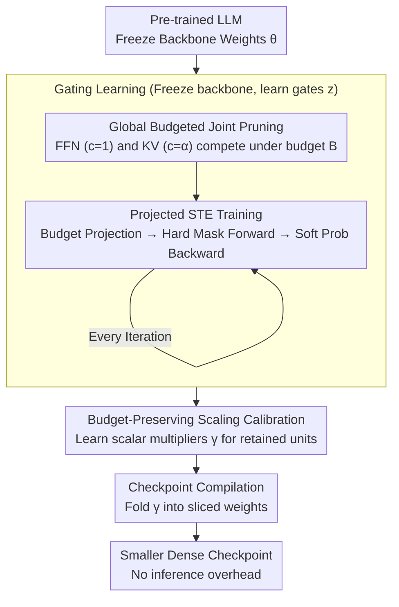

# GRASPrune: Global Gating for Budgeted Structured Pruning of Large Language Models

**Conference**: ACL 2026  
**arXiv**: [2604.19398](https://arxiv.org/abs/2604.19398)  
**Code**: [GitHub](https://github.com/ZiY-Wang/GRASPrune)  
**Area**: Robotics  
**Keywords**: Structured Pruning, Global Budget, Gating Learning, KV Head Pruning, Projected STE

## TL;DR
GRASPrune proposes a structured pruning framework with global budget constraints. By using a Projected Straight-Through Estimator (Projected STE) to enforce hard mask budget constraints during each training step, it jointly prunes FFN channels and KV head groups. It achieves 12.18 PPL on LLaMA-2-7B with 50% parameter retention, requiring only 6 minutes of training on a single A100 GPU.

## Background & Motivation

**Background**: The inference cost of LLMs is expensive—model parameters, attention computation, and KV cache all impose significant memory and latency overheads. Structured pruning generates smaller dense checkpoints by removing channels or head groups, which can be directly deployed using standard inference stacks.

**Limitations of Prior Work**: (1) FFN channels and KV head groups are typically pruned separately using different criteria, yet they share the same deployment budget and representation capacity; (2) Many methods use predefined layer-wise retention rates or depth-dependent schedules, which hard-code budget allocations rather than learning a globally optimal distribution; (3) Existing pipelines estimate importance scores first and then impose budgets—training is unconstrained, and constraints are only applied during selection, leading to a decoupling between score learning and the final mask.

**Key Challenge**: The issue is not the lack of better saliency metrics, but a mismatch between how scores are learned and how final masks are selected—scores learned without constraints may yield sub-optimal allocations when constraints are eventually applied.

**Goal**: Enforce budget feasibility inside the optimization loop so that gating scores are learned under the same constraints as the final deployment mask.

**Key Insight**: Formalize structured pruning as a joint optimization problem under a single global budget constraint, where FFN channels and KV head groups compete for the same budget with different unit costs.

**Core Idea**: Use Projected STE to perform budget projection → hard mask forward pass → soft score backward pass in each training step, followed by scaling calibration to produce smaller dense checkpoints with no additional inference overhead.

## Method

### Overall Architecture
The framework consists of three stages: (1) Gating Learning—freeze backbone weights and optimize scalar gating scores using Projected STE, performing budget-feasible hard mask projections at each step; (2) Scaling Calibration—freeze masks and learn scalar multipliers for retained units to mitigate scale shifts caused by pruning; (3) Checkpoint Compilation—fold scaling factors into sliced weights to output smaller dense checkpoints. The first two key designs occur during the gating learning stage (budget modeling + Projected STE training), the third corresponds to scaling calibration, and checkpoint compilation is the final step to export results.

### Key Designs

**1. Global Budgeted Joint Pruning: FFN and KV Competition**

Previously, FFN channels and KV head groups were often pruned using separate saliency criteria. However, they share the same deployment budget and representation capacity. Pruning them separately prevents the system from allocating capacity to the most critical areas globally. GRASPrune places both structures into a single budget constraint: each prunable unit $i \in \mathcal{S}$ has a binary retention variable $z_i$ and a unit cost $c_i$—for FFN channels $c_i=1$, and for KV head groups $c_i=\alpha$ (where $\alpha = \frac{(2G+2)d_h}{3}$ is the parameter approximation ratio). The global budget is $B = \rho \sum c_i$. The optimization objective is:

$$\min_{\mathbf{z}} \mathcal{L}(\theta; \mathbf{z})\quad \text{s.t.}\quad \sum_i c_i z_i \leq B,$$

where backbone weights $\theta$ are fixed and only gates $\mathbf{z}$ are learned. This allows the system to automatically determine whether to retain more capacity in FFN or KV layers instead of using manually defined layer-wise rates.

**2. Projected Straight-Through Estimator (Projected STE): Differentiable Optimization for Budget Feasibility**

Mask selection is inherently discrete and non-differentiable. Pipelines that "learn scores then select masks" allow scores to be learned *unconstrained*, applying constraints only at selection time, which decouples scores from the final mask. Projected STE brings constraints into every training step: it first projects continuous gating probabilities $\mathbf{p}$ into a budget-feasible hard mask $\mathbf{m} = \text{Project}(\mathbf{p}, \mathbf{c}, B)$ by greedily selecting based on descending $p_i$ until the budget is exhausted. The forward pass uses the hard mask $m_i$, while the backward pass uses the straight-through gradient of the soft probabilities:

$$\tilde{z}_i = m_i + \big(p_i - \text{stopgrad}(p_i)\big).$$

A crucial detail is sorting by $p_i$ instead of $p_i/c_i$: normalizing by cost biases the allocation toward cheaper units. Although seemingly counter-intuitive, because scores are learned under constraints, the model internalizes cost differences into $p_i$, and dividing by $c_i$ again would result in double-penalization.

**3. Budget-Preserving Scaling Calibration: Correcting Scale Shifts**

Removing attention heads or channels causes shifts in output scales, leading to performance degradation unless the model is fine-tuned. Since full fine-tuning is expensive, GRASPrune freezes the hard mask $\mathbf{m}$ and introduces a scalar multiplier $\gamma_i$ for each retained unit. These are optimized on the calibration set while keeping backbone weights frozen—the number of trainable parameters is only $O(|\mathcal{I}|)$ and FLOPs remain unchanged. After calibration, $\gamma$ is folded into the weights, resulting in a smaller dense checkpoint with zero overhead during inference.

### Loss & Training
The language modeling loss is optimized on a calibration set to learn gating scores. The process uses 512 unlabeled sequences over 4 epochs, taking approximately 6 minutes on a single A100. No full model fine-tuning is required.

## Key Experimental Results

### Main Results

| Parameter Ratio | Method | Wiki PPL↓ | Zero-shot Avg Acc |
|---------|------|----------|-------------|
| 50% | LLM-Pruner | ~18 | 0.61 |
| 50% | SliceGPT | ~15 | - |
| 50% | **Ours** | **12.18** | **Strongly Competitive** |
| 40% | **Ours** | **16.65** | - |

### Ablation Study

| Configuration | Description |
|------|------|
| Sort by $p_i/c_i$ | Allocation biased toward cheap units, performance drops |
| No Scaling Calibration | PPL increases |
| Perturb $\alpha$ | Moderately insensitive to $\alpha$ |
| Projection Overhead | Sorting time accounts for only 0.11% of total training time |

### Key Findings
- Achieving a PPL of 12.18 at 50% parameter retention outperforms all baseline methods.
- Sorting by $p_i$ (rather than $p_i/c_i$) yields better results—counter-intuitive but justified as scores are learned under constraints.
- Training is extremely efficient—gating learning and calibration complete in 6 minutes on one GPU.
- Reduction in KV cache provides actual inference acceleration.

## Highlights & Insights
- The insight regarding **"Learning under constraint" vs. "Constraining after learning"** is profound—it addresses a widely overlooked issue in structured pruning.
- Joint FFN+KV pruning using a unified cost model $\alpha$ elegantly handles fair competition between heterogeneous structures.
- The extremely low training cost (6 minutes on a single GPU) makes the method highly practical.

## Limitations & Future Work
- The cost model is based on parameter count approximations and does not directly optimize for latency or throughput.
- Evaluations were only conducted on the LLaMA-2 series; applicability to newer models (LLaMA-3+) needs verification.
- No subsequent fine-tuning stage—extremely high compression rates (<30%) might require integration with fine-tuning.

## Related Work & Insights
- **vs LLM-Pruner**: LLM-Pruner uses Taylor scores and layer-wise scheduling, while GRASPrune uses a global budget and Projected STE.
- **vs ZipLM**: ZipLM also performs global sorting but ignores cost differences; GRASPrune explicitly models heterogeneous costs.
- **vs DISP-LLM**: DISP-LLM performs dimension-independent architecture search, whereas GRASPrune is simpler and more training-efficient.

## Rating
- Novelty: ⭐⭐⭐⭐ The idea of Projected STE with in-budget training is novel.
- Experimental Thoroughness: ⭐⭐⭐⭐ Multiple compression rates, detailed ablations, and efficiency analysis.
- Writing Quality: ⭐⭐⭐⭐⭐ Sharp problem analysis and rigorous methodological derivation.
- Value: ⭐⭐⭐⭐ An efficient and practical solution for LLM structured pruning.

<!-- RELATED:START -->

## Related Papers

- [\[ICML 2025\] SlimLLM: Accurate Structured Pruning for Large Language Models](../../ICML2025/model_compression/slimllm_accurate_structured_pruning_for_large_language_models.md)
- [\[ICLR 2026\] RCPU: Rotation-Constrained Error Compensation for Structured Pruning of Large Language Models](../../ICLR2026/model_compression/rcpu_rotation-constrained_error_compensation_for_structured_pruning_of_large_lan.md)
- [\[ICML 2025\] Olica: Efficient Structured Pruning of Large Language Models without Retraining](../../ICML2025/model_compression/olica_efficient_structured_pruning_of_large_language_models_without_retraining.md)
- [\[ACL 2026\] Two-Stage Regularization-Based Structured Pruning for LLMs](two-stage_regularization-based_structured_pruning_for_llms.md)
- [\[ACL 2026\] LightReasoner: Can Small Language Models Teach Large Language Models Reasoning?](lightreasoner_can_small_language_models_teach_large_language_models_reasoning.md)

<!-- RELATED:END -->
