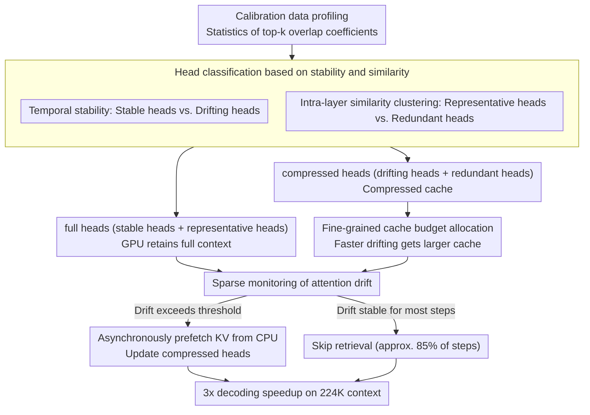

# HeteroCache: A Dynamic Retrieval Approach to Heterogeneous KV Cache Compression for Long-Context LLM Inference

**Conference**: ACL 2026  
**arXiv**: [2601.13684](https://arxiv.org/abs/2601.13684)  
**Code**: [GitHub](https://github.com/ponytaill/HeteroCache)  
**Area**: Model Compression  
**Keywords**: KV Cache Compression, Attention Head Heterogeneity, Dynamic Retrieval, Intra-layer Redundancy, Asynchronous Prefetching

## TL;DR

HeteroCache is proposed as a training-free dynamic KV cache compression framework. Based on the temporal heterogeneity (stable heads vs. drifting heads) and intra-layer redundancy (clustering of similar heads) of attention heads, it implements a fine-grained role assignment strategy—allocating larger cache budgets to drifting heads and utilizing representative heads for sparse monitoring of attention drift to trigger asynchronous on-demand retrieval. It achieves a 3x decoding speedup on a 224K context.

## Background & Motivation

**Background**: The linear growth of KV cache during Transformer inference is the primary bottleneck for long contexts. Static compression methods (SnapKV, H2O) permanently evict unimportant tokens based on historical attention scores but risk losing critical information for subsequent steps. Dynamic methods (ShadowKV, OmniKV) preserve full context by offloading to the CPU and retrieving on demand.

**Limitations of Prior Work**: (1) Irreversible eviction strategies in static compression pose fundamental risks—initially unimportant information may become critical later due to attention drift; (2) ShadowKV/OmniKV employ coarse-grained retrieval strategies, ignoring heterogeneity between layers and heads; (3) Retrieving at every step introduces unnecessary I/O overhead and potential accuracy degradation.

**Key Challenge**: While dynamic retrieval avoids information loss, it incurs heavy I/O overhead; conversely, static eviction is efficient but risks information loss. How can the intrinsic characteristics of attention heads be leveraged to intelligently decide "when to retrieve" and "for whom to retrieve"?

**Goal**: Design a fine-grained dynamic compression framework that exploits attention head heterogeneity to minimize I/O overhead while maintaining high fidelity.

**Key Insight**: By analyzing two dimensions of attention heads—temporal heterogeneity (the rate at which attention patterns change across decoding steps) and intra-layer redundancy (the similarity of attention patterns among heads in the same layer)—heads can be categorized into different roles and managed differentially.

**Core Idea**: Attention heads are classified into stable heads (consistent focus) and drifting heads (rapidly changing), as well as representative heads (unique patterns) and redundant heads (approximated by representative heads). Representative heads monitor attention drift, triggering asynchronous retrieval updates for compressed heads only when significant drift is detected.

## Method

### Overall Architecture

HeteroCache consists of three steps: (1) **Head Classification**—heads are categorized into full heads (retaining full context) and compressed heads (compressed cache) based on stability and similarity; (2) **Fine-grained Cache Allocation**—larger budgets are allocated to drifting heads within the compressed heads; (3) **Sparse Monitoring + Asynchronous Retrieval**—full heads continuously monitor attention drift, and upon detecting significant drift, data is asynchronously prefetched from the CPU to update compressed heads.

### Key Designs

**1. Head Classification based on Stability and Similarity: Defining roles for each attention head**

Dynamic retrieval methods (ShadowKV, OmniKV) treat all heads equally with coarse-grained retrieval, wasting the structural prior that "different heads behave differently." HeteroCache first profiles heads using an overlap coefficient (the ratio of the intersection of two sets of top-k important tokens) across two dimensions: temporal stability $S^{(h)}_{stable}$ is the median overlap between the decoding phase and the prefill phase, measuring how fast a head's attention drifts. Intra-layer similarity uses the overlap coefficient between heads in the same layer for clustering to identify redundant heads. Heads are thus divided into two categories: full heads (stable and representative heads, kept in GPU with full context) and compressed heads (drifting and redundant heads, with compressed cache). This allows stable heads to use minimal resources while representative heads serve as "sentinels" for drift on behalf of redundant heads.

**2. Fine-grained Cache Budget Allocation: Budgeting by drift speed rather than one-size-fits-all**

Allocating the same cache size to all compressed heads is suboptimal—stable heads may not use it, while drifting heads may find it insufficient. HeteroCache correlates budgets with drift speed: heads with lower stability (faster drift) are allocated larger token budgets, ensuring heads with rapidly changing patterns have enough capacity for dynamic information, thus spending limited VRAM where it is truly needed.

**3. Sparse Monitoring + Asynchronous Retrieval: Retrieving only when necessary**

Retrieving full KV from the CPU at every step brings significant unnecessary I/O, while no retrieval at all risks the information loss of static eviction. HeteroCache allows the full heads remaining on the GPU to continuously monitor attention drift. Only when the shift exceeds a threshold is the full KV asynchronously prefetched from the CPU to update compressed heads. Retrieval and computation are executed overlappingly to hide I/O latency. Since attention patterns are stable for the majority of decoding steps, this mechanism reduces retrieval frequency to approximately 15%—losing only 0.3% accuracy compared to per-step retrieval while saving most I/O overhead, resulting in a 3x speedup on 224K context.

### Loss & Training

This is a training-free method. It uses a small-scale calibration dataset for a one-time head classification analysis (profiling), which is then directly applied during inference.

## Key Experimental Results

### Main Results

**Long Context Benchmark (Llama-3.1-8B-Instruct, 224K Context)**

| Method | LongBench | LongBench v2 | InfiniteBench | Decoding Speedup |
|------|-----------|-------------|--------------|---------|
| Full KV | Baseline | Baseline | Baseline | 1× |
| SnapKV | -3.2% | -5.1% | -4.8% | 1.5× |
| ShadowKV | -1.8% | -2.3% | -2.5% | 2.0× |
| **Ours (HeteroCache)** | **-0.5%** | **-0.8%** | **-1.0%** | **3.0×** |

### Ablation Study

| Configuration | Accuracy Retention | Retrieval Frequency |
|------|----------|---------|
| Per-step retrieval | 99.5% | 100% |
| Fixed interval retrieval | 98.2% | 50% |
| **Drift-triggered retrieval** | **99.2%** | **~15%** |

### Key Findings

- Sparse monitoring reduces retrieval frequency to ~15% with only a 0.3% loss in accuracy—most decoding steps have stable attention patterns and do not require retrieval.
- It is equally effective on the DeepSeek-R1-Distill-Llama-8B reasoning model—attention drift patterns in CoT reasoning scenarios are consistent with standard inference.
- Intra-layer redundancy rates are as high as 50-60%—significant information duplication exists between heads in the same layer, making cluster-based compression efficient.
- Orthogonal to quantization methods, it can be combined to further reduce memory usage.

## Highlights & Insights

- Optimizing dynamic cache from the perspective of "when to retrieve" is an overlooked but critical problem—most work focuses on "what to keep."
- Dual-dimension head classification (stability/similarity) is more precise than single-dimension approaches.
- The engineering design of asynchronous prefetching successfully hides I/O latency.

## Limitations & Future Work

- The profiling phase for head classification requires a small amount of calibration data and is not entirely zero-overhead.
- Drift detection thresholds are preset and lack adaptive adjustment.
- Validation was primarily performed on standard Transformer architectures; applicability to architectures like MoE remains unknown.
- Asynchronous CPU-GPU transfer may be limited by bus bandwidth in some hardware configurations.

## Related Work & Insights

- **vs. SnapKV/H2O**: Static compression permanently evicts tokens; HeteroCache uses dynamic retrieval to avoid information loss.
- **vs. ShadowKV**: ShadowKV uses coarse-grained per-step retrieval and a uniform strategy; HeteroCache uses fine-grained head-level management and sparse monitoring.
- **vs. HERMES**: HERMES targets video streaming scenarios; HeteroCache targets long-context text inference.

## Rating

- Novelty: ⭐⭐⭐⭐ The design of head heterogeneity analysis and sparse monitoring to trigger retrieval is novel.
- Experimental Thoroughness: ⭐⭐⭐⭐ Validated across multiple models, benchmarks, reasoning models, and efficiency analyses.
- Writing Quality: ⭐⭐⭐⭐ The logical chain from observation to method to experiment is clear.
- Value: ⭐⭐⭐⭐ A 3x speedup provides direct value for the deployment of long-context inference.

<!-- RELATED:START -->

## Related Papers

- [\[ACL 2026\] DASH-KV: Accelerating Long-Context LLM Inference via Asymmetric KV Cache Hashing](dash-kv_accelerating_long-context_llm_inference_via_asymmetric_kv_cache_hashing.md)
- [\[NeurIPS 2025\] ChunkKV: Semantic-Preserving KV Cache Compression for Efficient Long-Context LLM Inference](../../NeurIPS2025/model_compression/chunkkv_semanticpreserving_kv_cache_compression_for_efficien.md)
- [\[ICML 2025\] RocketKV: Accelerating Long-Context LLM Inference via Two-Stage KV Cache Compression](../../ICML2025/model_compression/rocketkv_accelerating_long-context_llm_inference_via_two-stage_kv_cache_compress.md)
- [\[ACL 2026\] The Pitfalls of KV Cache Compression](the_pitfalls_of_kv_cache_compression.md)
- [\[ACL 2026\] FastKV: Decoupling of Context Reduction and KV Cache Compression for Prefill-Decoding Acceleration](fastkv_decoupling_of_context_reduction_and_kv_cache_compression_for_prefill-deco.md)

<!-- RELATED:END -->
