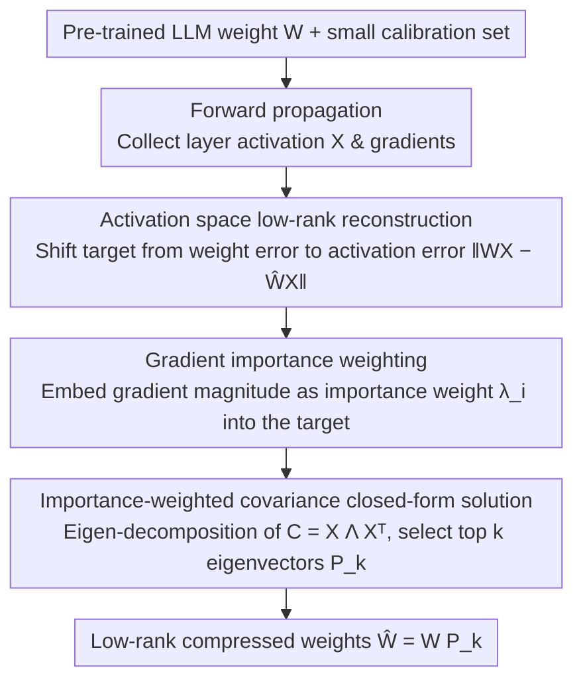

# IMPACT: Importance-Aware Activation Space Reconstruction

**Conference**: ACL 2026  
**arXiv**: [2507.03828](https://arxiv.org/abs/2507.03828)  
**Code**: None  
**Area**: Model Compression  
**Keywords**: Low-rank compression, activation space reconstruction, importance-aware, gradient weighting, Large Language Models

## TL;DR

The IMPACT framework is proposed to shift LLM low-rank compression from minimizing weight reconstruction error to minimizing importance-weighted activation reconstruction error. By incorporating gradient information into the activation covariance matrix, a closed-form optimal solution is derived, achieving up to 55.4% model size reduction while maintaining accuracy.

## Background & Motivation

**Background**: Large Language Models (LLMs) demonstrate superior performance across various tasks, but their massive parameter scale makes deployment difficult in resource-constrained environments. Low-rank compression is a common technique to reduce parameters and computation by decomposing weight matrices into low-rank approximations.

**Limitations of Prior Work**: Traditional low-rank compression methods (such as SVD-based weight decomposition) assume that weight matrices themselves have low-rank structures. However, LLM weight matrices often fail to satisfy this assumption, leading to suboptimal compression. Some methods shift toward minimizing activation reconstruction error (as LLM activation spaces exhibit more significant low-rank structures), but they treat all activation dimensions equally, ignoring the varying contributions of different dimensions to model performance.

**Key Challenge**: Optimizing compression solely through "reconstruction error minimization" is insufficient—the ultimate goal of compression is to preserve model output quality rather than minimize reconstruction error itself. The importance of different activation dimensions to the final prediction varies significantly, and treating them uniformly leads to precision loss.

**Goal**: To design a compression framework that directly links compression optimization with model performance, ensuring the compressed model prioritizes retaining activation dimensions most critical to the output rather than pursuing global reconstruction error minimization.

**Key Insight**: The authors observe that the activation space of LLMs possesses more pronounced low-rank structures than the weight space. Simultaneously, gradient signals can measure the sensitivity of each activation dimension to the model loss. Combining these factors allows for the construction of an "accuracy-preservation-oriented" compression optimization problem.

**Core Idea**: Gradient information is embedded as importance weights into the activation covariance matrix to derive an importance-weighted closed-form optimal compression basis, thereby achieving explicit accuracy-preservation-oriented low-rank compression.

## Method

### Overall Architecture

IMPACT addresses what low-rank compression should actually minimize. Its input consists of pre-trained LLM weight matrices and a small amount of calibration data; the output is the low-rank compressed weights. The pipeline runs in a single pass: first, forward propagation with calibration data is used to collect activations and gradients for each layer; second, gradients are treated as importance signals and integrated into the activation covariance matrix; finally, an eigenvalue decomposition is performed on this weighted covariance matrix, where the top $k$ eigenvectors form the optimal compression basis. The method is non-iterative, allowing a single layer to be compressed in seconds due to its closed-form solution.

### Key Designs

**1. Activation space low-rank reconstruction: Shifting optimization from weight error to activation error**

Traditional SVD methods directly decompose the weight matrix $W$, implicitly assuming $W$ is low-rank—however, LLM weights often do not satisfy this, causing accuracy degradation during compression. IMPACT minimizes the activation output error $\|WX - \hat{W}X\|$, where $X$ represents real activation inputs from calibration data. This makes the compression basis data-driven: it no longer approximates a non-low-rank weight matrix but instead fits the subspace actually utilized by the model under real inputs. This is effective because LLM activation spaces exhibit clearer low-rank structures than weight spaces, and targeting activations leverages this prior effectively.

**2. Gradient importance weighting: Prioritizing rank budget for dimensions with high impact**

Minimizing general activation reconstruction error still risks wasting the rank budget on dimensions that, even if reconstructed accurately, do not significantly affect the output. IMPACT calculates the gradient magnitude of each activation dimension as an importance metric $\lambda_i$, rewriting the objective from $\|WX - \hat{W}X\|^2$ into a weighted form $\sum_i \lambda_i \|w_i x - \hat{w}_i x\|^2$. Since gradients reflect the sensitivity of a dimension to the loss function, dimensions with higher impact on the output are preserved more completely. Ablation studies show that removing this component causes the method to revert to standard activation reconstruction performance, identifying it as the primary source of accuracy preservation.

**3. Closed-form optimal solution for importance-weighted covariance: Global optimal basis via single eigen-decomposition**

The weighted objective is mathematically equivalent to finding the principal subspace of an importance-weighted activation covariance matrix $C = X \Lambda X^T$ (where $\Lambda$ is a weight matrix with $\lambda_i$ on the diagonal). Consequently, one only needs to perform eigenvalue decomposition on $C$ and take the top $k$ eigenvectors to form the projection matrix $P_k$. The compressed weight is then $\hat{W} = WP_k$. This solution is globally optimal and requires no iteration, eliminating iterative optimization overhead while ensuring mathematical optimality—this is the foundation of IMPACT's efficiency and theoretical reliability.

## Key Experimental Results

### Main Results

| Model | Compression Rate | IMPACT Perplexity | Baseline SOTA Perplexity | Size Reduction Advantage |
|------|--------|--------------|-----------------|-------------|
| LLaMA-2-7B | 20% | Comparable to baseline | ASVD/SliceGPT | Accuracy maintained at higher compression |
| LLaMA-2-13B | 25% | Better than baseline | Weight SVD methods | 55.4% greater volume reduction |
| OPT-6.7B | 20% | Better than baseline | Activation-aware methods | Significant perplexity reduction |
| LLaMA-3-8B | 30% | Comparable to baseline | ASVD | Performance maintained under aggressive compression |

### Ablation Study

| Configuration | Effect Change | Description |
|------|---------|------|
| Full IMPACT | Optimal | Full scheme with importance weighting + activation reconstruction |
| w/o Gradient weighting (Uniform) | Perplexity increase | Proves critical contribution of importance weighting |
| Weight space reconstruction (SVD) | Significant degradation | Proves activation space is superior to weight space |
| Calibration set size | Stable at 256 samples | Method is insensitive to the amount of calibration data |

### Key Findings

- Gradient importance weighting is the largest contributor to performance—removing it causes the method to degrade to standard activation reconstruction levels.
- IMPACT's advantages are more pronounced at high compression rates: as the compression increases (lower retained rank), the accuracy preservation effect of importance weighting becomes more significant.
- The method is effective across different model families (LLaMA, OPT, etc.) and scales, demonstrating good generalization.
- The closed-form solution makes compression efficiency significantly higher than iterative methods, with single-layer compression requiring only seconds.

## Highlights & Insights

- The approach of **decoupling then re-associating compression with performance** is ingenious: it avoids minimizing a proxy loss directly and instead links the compression target to final task performance via gradient signals while maintaining an elegant closed-form solution.
- The insight regarding **activation space vs. weight space** is universal: the discovery that LLM activations are lower-rank than weights can guide the design of other compression or quantization tasks.
- The design of the **importance-weighted covariance matrix** can be transferred to other scenarios requiring low-rank approximation, such as selecting important subspaces during LoRA fine-tuning or feature alignment in knowledge distillation.

## Limitations & Future Work

- Evaluation is primarily based on language modeling perplexity, with limited assessment of the impact on downstream tasks (QA, reasoning, etc.).
- Gradient information depends on the calibration data distribution; a large discrepancy between calibration data and actual usage scenarios may affect performance.
- Currently, layers are compressed independently without considering inter-layer interactions—joint optimization of compression bases across multiple layers may further improve results.
- Integration with quantization methods (low-rank + quantization) is a promising direction, though not explored in depth in this paper.

## Related Work & Insights

- **vs ASVD**: ASVD also utilizes activation information for SVD but lacks importance weighting, leading to significant accuracy loss at high compression rates; IMPACT significantly improves this via gradient weighting.
- **vs SliceGPT**: SliceGPT removes parameters via orthogonal transformations and is a structural pruning method; IMPACT maintains the low-rank decomposition framework but optimizes basis selection, making the two complementary.
- **vs GPTQ/AWQ**: These are quantization methods rather than low-rank decomposition; IMPACT can be combined with them to achieve higher overall compression ratios.

## Rating

- Novelty: ⭐⭐⭐⭐ Incorporating gradient importance into the activation covariance matrix for closed-form low-rank compression is a clean and elegant innovation.
- Experimental Thoroughness: ⭐⭐⭐⭐ Sufficient comparisons across multiple models and compression rates; ablation studies validate the contributions of each component.
- Writing Quality: ⭐⭐⭐⭐ Mathematical derivations are clear, and the logical chain for the motivation is complete.
- Value: ⭐⭐⭐⭐ Provides a concise and efficient LLM compression method that is practical, easy to understand, and implement.

<!-- RELATED:START -->

## Related Papers

- [\[AAAI 2026\] KVmix: Gradient-Based Layer Importance-Aware Mixed-Precision Quantization for KV Cache](../../AAAI2026/model_compression/kvmix_gradient-based_layer_importance-aware_mixed-precision_.md)
- [\[ICLR 2026\] SERQ: Saliency-Aware Low-Rank Error Reconstruction for LLM Quantization](../../ICLR2026/model_compression/serq_saliency-aware_low-rank_error_reconstruction_for_llm_quantization.md)
- [\[ACL 2026\] Analytical FFN-to-MoE Restructuring via Activation Pattern Analysis](analytical_ffn-to-moe_restructuring_via_activation_pattern_analysis.md)
- [\[ACL 2026\] Enabling Agents to Communicate Entirely in Latent Space](enabling_agents_to_communicate_entirely_in_latent_space.md)
- [\[ICLR 2026\] Training Dynamics Impact Post-Training Quantization Robustness](../../ICLR2026/model_compression/training_dynamics_impact_post-training_quantization_robustness.md)

<!-- RELATED:END -->
