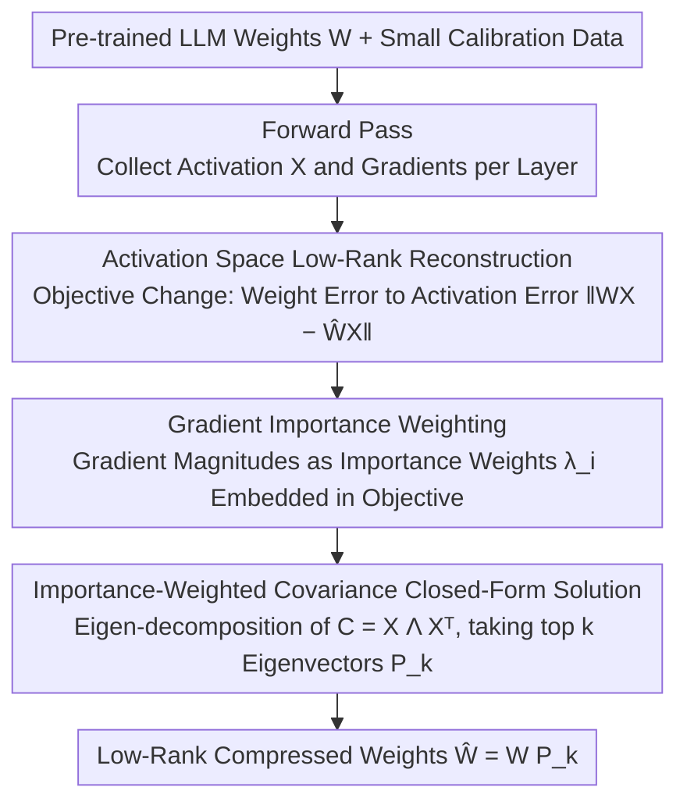

# IMPACT: Importance-Aware Activation Space Reconstruction

**Conference**: ACL 2026  
**arXiv**: [2507.03828](https://arxiv.org/abs/2507.03828)  
**Code**: None  
**Area**: Model Compression  
**Keywords**: Low-rank compression, activation space reconstruction, importance-aware, gradient-weighted, Large Language Models

## TL;DR

Proposes the IMPACT framework, shifting LLM low-rank compression from minimizing weight reconstruction error to minimizing importance-weighted activation reconstruction error. By incorporating gradient information into the activation covariance matrix, a closed-form optimal solution is derived, achieving up to 55.4% model size reduction while maintaining accuracy.

## Background & Motivation

**Background**: Large Language Models (LLMs) demonstrate superior performance across various tasks but are difficult to deploy in resource-constrained environments due to their massive parameter scales. Low-rank compression is a common approach that reduces parameters and computation by decomposing weight matrices into low-rank approximations.

**Limitations of Prior Work**: Traditional low-rank compression methods (such as SVD-based weight decomposition) assume that the weight matrix itself possesses a low-rank structure. However, LLM weight matrices often fail to satisfy this assumption, leading to suboptimal compression. Some methods pivot to minimizing activation reconstruction error (as LLM activation spaces exhibit more significant low-rank structures), but they treat all activation dimensions equally, ignoring the varying contributions of different dimensions to model performance.

**Key Challenge**: Optimizing compression solely from the perspective of "reconstruction error minimization" is insufficient—the ultimate goal of compression is to preserve model output quality rather than the reconstruction error itself. The importance of different activation dimensions for final predictions varies drastically; uniform treatment leads to accuracy loss.

**Goal**: Design a compression framework that directly links compression optimization with model performance—allowing the compressed model to prioritize retaining activation dimensions most critical to the output rather than pursuing global reconstruction error minimization.

**Key Insight**: The authors observe that the activation space of LLMs possesses a more distinct low-rank structure than the weight space. Simultaneously, gradient signals can measure the sensitivity of each activation dimension to the model loss. Combining these allows for the construction of an "accuracy-preservation-oriented" compression optimization problem.

**Core Idea**: Embed gradient information as importance weights into the activation covariance matrix to derive a closed-form optimal compression basis, thereby achieving low-rank compression explicitly oriented toward accuracy preservation.

## Method

### Overall Architecture

IMPACT addresses what low-rank compression should ultimately minimize. Its input consists of pre-trained LLM weight matrices and a small set of calibration data, and its output is the low-rank compressed weights. The entire pipeline runs in a single pass: first, forward propagation is performed using calibration data to collect activations and gradients for each layer; then, gradients are integrated into the activation covariance matrix as importance signals; finally, an eigenvalue decomposition is performed on this weighted covariance matrix, where the top $k$ eigenvectors serve as the compression basis to be retained. This method requires no iteration, and compressing a single layer takes only seconds because the solution is closed-form.

### Key Designs

**1. Activation Space Low-Rank Reconstruction: Shifting the target from weight error to activation error**

Traditional SVD methods directly decompose the weight matrix $W$ as $W \approx UV$, implicitly assuming $W$ is inherently low-rank—however, LLM weights often do not satisfy this, and forced compression harms accuracy. IMPACT instead minimizes the activation output error $\|WX - \hat{W}X\|$, where $X$ represents real activation inputs from calibration data. This change makes the compression basis data-driven: instead of approximating a non-low-rank weight matrix, it fits the subspace actually utilized by the model under practical inputs. This is effective because the activation space of LLMs exhibits a significantly clearer low-rank structure than the weight space.

**2. Gradient Importance Weighting: Prioritizing rank budget for dimensions with high impact on output**

Minimizing activation reconstruction error alone has a drawback—it treats every activation dimension equally, potentially wasting rank budget on dimensions where precise reconstruction is irrelevant to performance. IMPACT calculates the gradient magnitude of each activation dimension as an importance metric $\lambda_i$, rewriting the objective from $\|WX - \hat{W}X\|^2$ into a weighted form $\sum_i \lambda_i \|w_i x - \hat{w}_i x\|^2$. Since gradients reflect sensitivity to the loss function, dimensions with higher influence on the output are preserved more completely during compression. Ablation studies show that removing this component causes the method to regress to standard activation reconstruction levels, identifying it as the primary source of accuracy preservation.

**3. Closed-Form Optimal Solution for Importance-Weighted Covariance: Global optimal basis via a single eigen-decomposition**

By rearranging the weighted objective above, it is proven equivalent to finding the principal subspace of an importance-weighted activation covariance matrix $C = X \Lambda X^T$ (where $\Lambda$ is a diagonal matrix containing importance weights $\lambda_i$). Consequently, one only needs to perform an eigenvalue decomposition on $C$ and select the top $k$ eigenvectors to form the projection matrix $P_k$. The compressed weight is then $\hat{W} = WP_k$. This solution is globally optimal and requires no iteration, eliminating iterative optimization overhead while mathematically ensuring optimality—this is the fundamental reason why IMPACT is both efficient and theoretically sound.

## Key Experimental Results

### Main Results

| Model | Compression Rate | IMPACT Perplexity | Prev. SOTA Perplexity | Volume Reduction Advantage |
|------|--------|--------------|-----------------|-------------|
| LLaMA-2-7B | 20% | Comparable to baseline | ASVD/SliceGPT | Accuracy maintained at higher rates |
| LLaMA-2-13B | 25% | Better than baseline | Weight SVD methods | 55.4% greater volume reduction |
| OPT-6.7B | 20% | Better than baseline | Activation-aware methods | Significant perplexity reduction |
| LLaMA-3-8B | 30% | Comparable to baseline | ASVD | Performance maintained under aggressive compression |

### Ablation Study

| Configuration | Performance Change | Description |
|------|---------|------|
| Full IMPACT | Optimal | Importance weighting + activation reconstruction complete scheme |
| w/o Gradient Weighting (Uniform) | Perplexity increase | Proves the critical contribution of importance weighting |
| Weight Space Reconstruction (Traditional SVD) | Significant degradation | Proves activation space is superior to weight space |
| Different Calibration Set Sizes | Stable at 256 samples | Method is insensitive to the amount of calibration data |

### Key Findings

- Gradient importance weighting is the largest contributor to performance—without it, the method degrades to a level comparable to standard activation reconstruction.
- IMPACT's advantages are more pronounced at high compression rates: the higher the compression (lower retained rank), the more significant the accuracy preservation effect brought by importance weighting.
- The method is effective across different model families (LLaMA, OPT, etc.) and scales, demonstrating good generalization.
- The closed-form solution makes compression significantly more efficient than iterative optimization methods, with single-layer compression taking only seconds.

## Highlights & Insights

- The approach of **decoupling and then re-linking compression and performance** is ingenious: instead of minimizing a proxy loss directly, it links the compression objective to final task performance via gradient signals while maintaining the elegance of a closed-form solution.
- The insight regarding **activation space vs. weight space** is universal: the discovery that LLM activations are more low-rank than weights can guide the design of other compression or quantization tasks.
- The design of the **importance-weighted covariance matrix** can be migrated to other scenarios requiring low-rank approximations, such as selecting important subspaces for LoRA fine-tuning or feature alignment in knowledge distillation.

## Limitations & Future Work

- The paper primarily evaluates language modeling perplexity, with limited assessment of the impact on downstream tasks (QA, reasoning, etc.).
- Gradient information depends on the distribution of calibration data; significant differences between calibration and actual usage scenarios may affect performance.
- Currently, compression is performed layer-wise independently without considering inter-layer interactions—jointly optimizing the compression bases of multiple layers might further improve results.
- Integration with quantization (low-rank + quantization) is a promising direction, but the paper does not explore it in depth.

## Related Work & Insights

- **vs ASVD**: ASVD also utilizes activation information for SVD but ignores importance weighting, leading to large accuracy losses at high compression rates; IMPACT significantly mitigates this via gradient weighting.
- **vs SliceGPT**: SliceGPT removes parameters via orthogonal transformations and is a form of structured pruning; IMPACT maintains the low-rank decomposition framework but optimizes basis selection, making them complementary.
- **vs GPTQ/AWQ**: These are quantization methods rather than low-rank decomposition; IMPACT can be combined with them to achieve higher overall compression ratios.

## Rating

- Novelty: ⭐⭐⭐⭐ Integrating gradient importance into the closed-form low-rank compression of activation covariance is a clean and elegant innovation.
- Experimental Thoroughness: ⭐⭐⭐⭐ Sufficient comparisons across multiple models and compression rates; ablation studies verify the contributions of each component.
- Writing Quality: ⭐⭐⭐⭐ Mathematical derivations are clear, and the motivation is presented with a complete logical chain.
- Value: ⭐⭐⭐⭐ Provides a simple and efficient LLM compression method that is practical, easy to understand, and implement.

<!-- RELATED:START -->

## Related Papers

- [\[AAAI 2026\] KVmix: Gradient-Based Layer Importance-Aware Mixed-Precision Quantization for KV Cache](../../AAAI2026/model_compression/kvmix_gradient-based_layer_importance-aware_mixed-precision_.md)
- [\[ACL 2026\] Analytical FFN-to-MoE Restructuring via Activation Pattern Analysis](analytical_ffn-to-moe_restructuring_via_activation_pattern_analysis.md)
- [\[ACL 2026\] Enabling Agents to Communicate Entirely in Latent Space](enabling_agents_to_communicate_entirely_in_latent_space.md)
- [\[NeurIPS 2025\] DuoGPT: Training-free Dual Sparsity through Activation-aware Pruning in LLMs](../../NeurIPS2025/model_compression/duogpt_training-free_dual_sparsity_through_activation-aware_pruning_in_llms.md)
- [\[CVPR 2026\] Quant Experts: Token-aware Adaptive Error Reconstruction with Mixture of Experts for Large Vision-Language Models Quantization](../../CVPR2026/model_compression/quant_experts_token_aware_vlm_quantization.md)

<!-- RELATED:END -->
