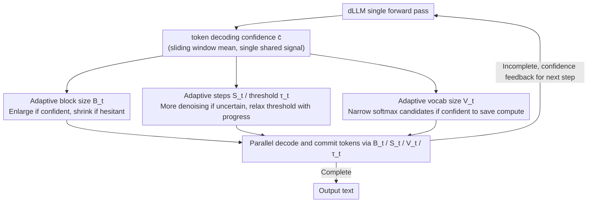

# CadLLM: Improving the Throughput of Diffusion-based LLMs via Training-Free Confidence-Aware Calibration

**Conference**: ACL 2026 Findings  
**arXiv**: [2512.07173](https://arxiv.org/abs/2512.07173)  
**Code**: Yes  
**Area**: Model Compression  
**Keywords**: Diffusion Language Model, Inference Acceleration, Adaptive Decoding, Confidence Calibration, Training-free method

## TL;DR
CadLLM is proposed as a training-free adaptive inference acceleration method that utilizes token decoding confidence signals from Diffusion Language Models (dLLMs) to dynamically adjust four dimensions: block size, steps, vocabulary sampling range, and commitment threshold. It achieves 1.1-2.28× throughput improvement on LLaDA and DREAM while maintaining competitive accuracy.

## Background & Motivation

**Background**: Masked diffusion language models (e.g., LLaDA, DREAM) generate text through iterative refinement of noisy states via a multi-step denoising Markov process. fast-dLLM introduced parallel decoding acceleration based on static confidence thresholds.

**Limitations of Prior Work**: fast-dLLM employs fixed block sizes, fixed steps, and fixed sampling widths, ignoring dynamic confidence variations across sequences and steps. Specifically: (1) fixed block sizes disregard difficulty differences across regions; (2) uniform sampling widths ignore certainty variations; (3) fixed commitment thresholds do not adapt to confidence changes at different inference stages.

**Key Challenge**: Static scheduling strategies lead to over-refinement of easy blocks (wasting computation) and under-refinement of hard blocks (harming quality)—computational resources must be adaptively allocated based on confidence signals.

**Goal**: Design a training-free, model-agnostic plug-and-play method to adaptively control multiple resource dimensions in dLLM inference using confidence signals.

**Key Insight**: Analysis of confidence dynamics across blocks and steps reveals significant variations—intra-block confidence rises rapidly before stabilizing, and difficulty varies greatly between different blocks.

**Core Idea**: Use token decoding confidence as a single shared signal to drive four closed-loop control strategies (block size, steps, vocabulary size, and threshold), allocating computational resources where uncertainty persists and saving resources where predictions are stable.

## Method

### Overall Architecture
After each forward pass of the dLLM, CadLLM utilizes token confidence as a feedback signal. It dynamically updates block size $B_t$, steps $S_t$, vocabulary size $V_t$, and threshold $\tau_t$ through four linear interpolation strategies, forming a closed-loop controller. This plug-and-play approach is compatible with dLLMs using KV caching.

### Key Designs

**1. Adaptive block size $B_t$: Deciding parallel decoding range based on confidence**

Fixed block sizes are problematic due to varying difficulty levels across regions (Figure 1(a))—small blocks for simple segments waste forward passes, while large blocks for difficult segments commit too many uncertain tokens. CadLLM adjusts block size according to confidence: $B_t = \text{clip}(B_{\min} + (B_{\max} - B_{\min}) \cdot \bar{c}, B_{\min}, B_{\max})$, where $\bar{c}$ is the average confidence within a sliding window ($\Delta=2$). When confident, the block size increases to amortize forward pass costs; when hesitant, the block size decreases to focus computation on refining short segments.

**2. Adaptive steps $S_t$ and adaptive threshold $\tau_t$: Controlling refinement depth and commitment aggressiveness**

While the block size defines the decoding range, fixing the refinement steps and commitment criteria within each block is suboptimal. CadLLM uses two complementary curves: steps are inversely correlated with confidence $S_t = \text{clip}(S_{\text{base}} + (S_{\max} - S_{\text{base}})(1 - \bar{c}), S_{\text{base}}, S_{\max})$, increasing denoising effort for uncertain blocks. The commitment threshold $\tau_t = \tau_{\text{base}}(1-g_t) + \tau_{\min} g_t$ relaxes as generation progress $g_t$ increases, starting strictly to prevent premature commitment and opening up later to avoid unnecessary delays. The adaptive threshold is critical—removing it causes a 71.6% drop in throughput because it determines how many tokens are "released" at each step.

**3. Adaptive vocabulary size $V_t$: Dynamically pruning softmax candidates**

Softmax latency increases sharply with vocabulary size (Figure 1(b)); the full ~50K vocabulary is nearly an order of magnitude slower than a small subset. CadLLM defines the subset size as $V_t = \text{clip}(V_{\text{phase}}(g_t) \cdot f_{\text{conf}}(\bar{c}) \cdot f_{\text{rep}}(r_t), V_{\min}, V_{\max})$. The vocabulary is expanded during early generation or low confidence to maintain robustness and narrowed during high confidence to reduce softmax overhead. The factor $f_{\text{rep}}(r_t)$ is a repetition detector designed to prevent the model from entering degenerate loops caused by overly narrow vocabularies—a common pitfall in fast decoding.

### Loss & Training
CadLLM is entirely training-free. All strategies are implemented via linear interpolation and clipping, introducing no additional computation during inference.

## Key Experimental Results

### Main Results
Results on LLaDA-Instruct (single H100):

| Benchmark | CadLLM Accuracy | CadLLM Throughput Gain | Fast-dLLM Accuracy | Generation Length |
|------|-------------|-----------------|----------------|---------|
| GSM8K | 78.01% | 1.33× | 79.00% | 256 |
| MATH | 32.06% | 1.34× | 32.40% | 256 |
| HumanEval | 35.97% | **2.28×** | 37.19% | 256 |
| HumanEval | 43.29% | 1.74× | 45.12% | 512 |

### Ablation Study

| Configuration | Token/s | Accuracy | Description |
|------|---------|-------|------|
| All ON | 121.72 | 78.01% | Full model |
| No $V_t$ | 119.67 | 74.41% | 4.6% accuracy drop |
| No $S_t$ | 136.76 | 76.12% | Faster but lower accuracy |
| No $B_t$ | 111.19 | 78.32% | 8.6% throughput drop |
| No $\tau_t$ | 34.57 | 78.17% | **71.6% throughput drop** |
| All OFF | 34.32 | 78.01% | No adaptation |

### Key Findings
- The adaptive threshold is the core of efficiency: removing it causes throughput to collapse from 121.72 to 34.57 token/s, with NFE increasing by 289%.
- Speedup is most significant on HumanEval (2.28×) due to greater confidence variance in code generation.
- The method remains effective on DREAM (1.1-1.4× gain), validating model-agnosticism.
- Adaptive vocabulary has little impact on speed but significantly affects accuracy (-4.6%), highlighting the importance of sampling width control.

## Highlights & Insights
- The closed-loop controller using a single confidence signal to drive four resource dimensions is concise and elegant; this "minimal adaptation" significantly outperforms static scheduling.
- The repetition detector, which prevents degradation from vocabulary narrowing, is a practical engineering detail that avoids common traps in fast decoding.
- The choice of linear interpolation strategies is intentional—proving that even the simplest monotonic mappings provide significant benefits establishes a solid baseline for more complex strategies.

## Limitations & Future Work
- Validation was limited to LLaDA and DREAM; performance on larger-scale models remains unknown.
- Hyperparameters ($B_{\min}, B_{\max}, S_{\max}$, etc.) require manual setting, though sensitivity analysis (±20%) shows stability.
- Accuracy is comparable to the baseline but not entirely lossless, with a 1-2% drop observed in HumanEval.
- Future work could explore non-linear control strategies or reinforcement learning to optimize strategy parameters.

## Related Work & Insights
- **vs fast-dLLM**: Static thresholds and fixed block sizes cause imbalanced resource allocation; CadLLM addresses this via adaptive strategies.
- **vs Autoregressive Acceleration (Speculative Decoding, etc.)**: dLLMs naturally support parallel decoding; CadLLM optimizes the degree of parallelism on this foundation.
- **vs Lu et al. (Concurrent work)**: They similarly observed that fixed block sizes lead to premature commitment of low-confidence tokens, aligning with this paper's motivation.

## Rating
- Novelty: ⭐⭐⭐⭐ The unified design of four-dimensional adaptive control is new for dLLM acceleration.
- Experimental Thoroughness: ⭐⭐⭐⭐ Detailed ablation and validation across multiple tasks and lengths.
- Writing Quality: ⭐⭐⭐⭐ Clear motivation analysis and precise methodological description.
- Value: ⭐⭐⭐⭐ Direct practical value for dLLM inference deployment.

<!-- RELATED:START -->

## Related Papers

- [\[ACL 2026\] BaseCal: Unsupervised Confidence Calibration via Base Model Signals](basecal_unsupervised_confidence_calibration_via_base_model_signals.md)
- [\[ACL 2026\] TELL-TALE: Task Efficient LLMs with Task Aware Layer Elimination](tell-tale_task_efficient_llms_with_task_aware_layer_elimination.md)
- [\[ACL 2026\] VecCISC: Improving Confidence-Informed Self-Consistency with Reasoning Trace Clustering and Candidate Answer Selection](veccisc_improving_confidence-informed_self-consistency_with_reasoning_trace_clus.md)
- [\[NeurIPS 2025\] DuoGPT: Training-free Dual Sparsity through Activation-aware Pruning in LLMs](../../NeurIPS2025/model_compression/duogpt_training-free_dual_sparsity_through_activation-aware_pruning_in_llms.md)
- [\[ACL 2026\] Training-Free Test-Time Contrastive Learning for Large Language Models](training-free_test-time_contrastive_learning_for_large_language_models.md)

<!-- RELATED:END -->
