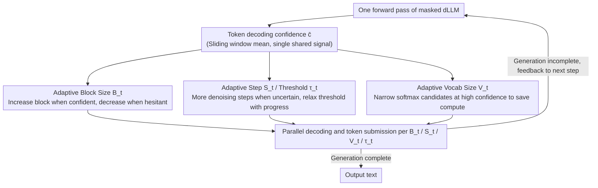

# CadLLM: Improving the Throughput of Diffusion-based LLMs via Training-Free Confidence-Aware Calibration

**Conference**: ACL 2026 Findings  
**arXiv**: [2512.07173](https://arxiv.org/abs/2512.07173)  
**Code**: Available  
**Area**: Model Compression  
**Keywords**: Diffusion Language Models, Inference Acceleration, Adaptive Decoding, Confidence Calibration, Training-free method

## TL;DR
CadLLM is proposed as a training-free adaptive inference acceleration method that utilizes token decoding confidence signals from diffusion language models (dLLMs) to dynamically adjust four dimensions: block size, step count, vocabulary sampling range, and submission threshold. It achieves 1.1-2.28× throughput gains on LLaDA and DREAM while maintaining competitive accuracy.

## Background & Motivation

**Background**: Masked diffusion language models (e.g., LLaDA, DREAM) generate text by iteratively refining noisy states through a multi-step denoising Markov process, demonstrating strong generative capabilities. fast-dLLM previously proposed parallel decoding acceleration based on static confidence thresholds.

**Limitations of Prior Work**: fast-dLLM employs fixed block sizes, fixed step counts, and a uniform sampling width, ignoring the dynamic variations of confidence across sequences and steps. Specifically: (1) fixed block sizes ignore the difficulty variance across different regions; (2) uniform sampling widths overlook differences in determinism; (3) fixed submission thresholds fail to adapt to confidence fluctuations across different inference stages.

**Key Challenge**: Static scheduling strategies lead to over-refinement of easy blocks (wasting computation) and under-refinement of difficult blocks (compromising quality)—necessitating adaptive allocation of computational resources based on confidence signals.

**Goal**: To design a training-free, model-agnostic, and plug-and-play method that leverages confidence signals to adaptively control multiple resource dimensions during dLLM inference.

**Key Insight**: An analysis of confidence dynamics across different blocks and steps reveals significant variations—intra-block confidence rises rapidly before leveling off, while difficulty varies substantially between different blocks.

**Core Idea**: Use token decoding confidence as a single shared signal to drive four closed-loop control strategies (block size, step count, vocabulary size, and threshold), allocating computational resources where uncertainty persists and saving them where predictions are stable.

## Method

### Overall Architecture
After each forward pass of the dLLM, CadLLM utilizes token confidence as a feedback signal. It dynamically updates the block size $B_t$, step count $S_t$, vocabulary size $V_t$, and threshold $\tau_t$ through four linear interpolation strategies, forming a closed-loop controller. This method is plug-and-play and compatible with dLLMs using KV caching.

### Key Designs

**1. Adaptive Block Size $B_t$: Determining Parallel Decoding Range by Confidence**

The issue with fixed block sizes is the vast difference in difficulty across regions (Figure 1(a))—assigning small blocks to easy passages wastes forward passes, while assigning large blocks to difficult passages results in submitting too many uncertain tokens. CadLLM scales the block size with confidence: $B_t = \text{clip}(B_{\min} + (B_{\max} - B_{\min}) \cdot \bar{c}, B_{\min}, B_{\max})$, where $\bar{c}$ is the mean confidence within a sliding window ($\Delta=2$). When the model is confident, the block expands to amortize the cost of one forward pass over more tokens; when hesitant, the block shrinks to focus computation on repeated refinement of a small segment.

**2. Adaptive Step Count $S_t$ and Adaptive Threshold $\tau_t$: Controlling Refinement Depth and Submission Aggressiveness**

Once the block size defines the "decoding range," it is still suboptimal to keep the internal refinement steps and submission boldness fixed. CadLLM adjusts these using two complementary curves: the step count is inversely correlated with confidence $S_t = \text{clip}(S_{\text{base}} + (S_{\max} - S_{\text{base}})(1 - \bar{c}), S_{\text{base}}, S_{\max})$, where more steps are spent on denoising when uncertain. The submission threshold relaxes as generation progress $g_t$ increases: $\tau_t = \tau_{\text{base}}(1-g_t) + \tau_{\min} g_t$, starting strictly to prevent early errors and loosening later to avoid unnecessary delays. This threshold is the lifeblood of the method—removing it in ablations causes throughput to plummet by 71.6%, as it directly determines how many tokens are "released" at each step.

**3. Adaptive Vocabulary Size $V_t$: Dynamically Pruning Softmax Candidates to Save Compute**

Softmax latency increases sharply with vocabulary size (Figure 1(b)); the full ~50K vocabulary is nearly an order of magnitude slower than a small subset, yet the model rarely needs to select from the full set. CadLLM defines the vocabulary subset size as $V_t = \text{clip}(V_{\text{phase}}(g_t) \cdot f_{\text{conf}}(\bar{c}) \cdot f_{\text{rep}}(r_t), V_{\min}, V_{\max})$. The vocabulary expands during early generation or low-confidence phases for robustness and narrows at high confidence to save softmax overhead. The factor $f_{\text{rep}}(r_t)$ is a repetition detection factor specifically designed to prevent the vocabulary from narrowing so much that it forces the model into degraded repetitive loops—a common pitfall in fast decoding.

### Loss & Training
CadLLM is entirely training-free. All strategies are implemented via linear interpolation and clipping, introducing no extra computational overhead during inference.

## Key Experimental Results

### Main Results
Results on LLaDA-Instruct (single H100):

| Benchmark | CadLLM Accuracy | CadLLM Throughput Gain | Fast-dLLM Accuracy | Generation Length |
|------|-------------|-----------------|----------------|---------|
| GSM8K | 78.01% | 1.33× | 79.00% | 256 |
| MATH | 32.06% | 1.34× | 32.40% | 256 |
| HumanEval | 35.97% | **2.28×** | 37.19% | 256 |
| HumanEval | 43.29% | 1.74× | 45.12% | 512 |

### Ablation Study

| Configuration | Token/s | Accuracy | Description |
|------|---------|-------|------|
| All ON | 121.72 | 78.01% | Full Model |
| No $V_t$ | 119.67 | 74.41% | Accuracy drops 4.6% |
| No $S_t$ | 136.76 | 76.12% | Faster but lower accuracy |
| No $B_t$ | 111.19 | 78.32% | Throughput drops 8.6% |
| No $\tau_t$ | 34.57 | 78.17% | **Throughput plummets 71.6%** |
| All OFF | 34.32 | 78.01% | No adaptation |

### Key Findings
- The adaptive threshold is the core driver of efficiency: removing it causes throughput to drop from 121.72 to 34.57 token/s, while NFE increases by 289%.
- The most significant acceleration occurs on HumanEval (2.28×), as code generation exhibits greater confidence variance.
- The method is equally effective on DREAM (1.1-1.4× gain), validating its model-agnostic nature.
- Adaptive vocabulary size has a negligible impact on speed but significantly affects accuracy (-4.6%), highlighting the importance of sampling width control.

## Highlights & Insights
- The design of a closed-loop controller using a single confidence signal to drive four resource dimensions is elegant and concise; this "minimal adaptivity" already significantly outperforms static scheduling.
- The repetition detector (preventing degradation loops from vocabulary narrowing) is a practical engineering detail that avoids common traps in fast decoding.
- The choice of linear interpolation strategies was intentional—demonstrating that even the simplest monotonic mappings yield significant benefits, establishing a lower bound for more complex strategies.

## Limitations & Future Work
- Validated only on LLaDA and DREAM; its effectiveness on larger-scale models remains unknown.
- Hyperparameters ($B_{\min}, B_{\max}, S_{\max}$, etc.) require manual configuration, although sensitivity analysis within ±20% shows stability.
- Accuracy is competitive with the baseline but not perfectly lossless, with a 1-2% drop observed on HumanEval.
- Future work could explore non-linear control strategies or reinforcement learning to optimize strategy parameters.

## Related Work & Insights
- **vs fast-dLLM**: Static thresholds and fixed block sizes cause imbalanced resource allocation; CadLLM resolves this with adaptive strategies.
- **vs Autoregressive Acceleration (Speculative Decoding, etc.)**: dLLMs inherently support parallel decoding; CadLLM optimizes this parallelism further.
- **vs Lu et al. (Concurrent Work)**: They also observed that fixed block sizes lead to premature submission of low-confidence tokens, aligning with the motivation of this work.

## Rating
- Novelty: ⭐⭐⭐⭐ The unified design of four-dimensional adaptive control is new in dLLM acceleration.
- Experimental Thoroughness: ⭐⭐⭐⭐ Detailed ablations and validation across multiple tasks and lengths.
- Writing Quality: ⭐⭐⭐⭐ Clear motivation analysis and precise methodology description.
- Value: ⭐⭐⭐⭐ Directly practical for dLLM inference deployment.

<!-- RELATED:START -->

## Related Papers

- [\[ACL 2026\] BaseCal: Unsupervised Confidence Calibration via Base Model Signals](basecal_unsupervised_confidence_calibration_via_base_model_signals.md)
- [\[ICLR 2026\] Gradient-Aligned Calibration for Post-Training Quantization of Diffusion Models](../../ICLR2026/model_compression/gradient-aligned_calibration_for_post-training_quantization_of_diffusion_models.md)
- [\[ICML 2026\] FAIR-Calib: Frontier-Aware Instability-Reweighted Calibration for Post-Training Quantization of Diffusion Large Language Models](../../ICML2026/model_compression/fair-calib_frontier-aware_instability-reweighted_calibration_for_post-training_q.md)
- [\[ACL 2026\] TELL-TALE: Task Efficient LLMs with Task Aware Layer Elimination](tell-tale_task_efficient_llms_with_task_aware_layer_elimination.md)
- [\[ACL 2026\] VecCISC: Improving Confidence-Informed Self-Consistency with Reasoning Trace Clustering and Candidate Answer Selection](veccisc_improving_confidence-informed_self-consistency_with_reasoning_trace_clus.md)

<!-- RELATED:END -->
