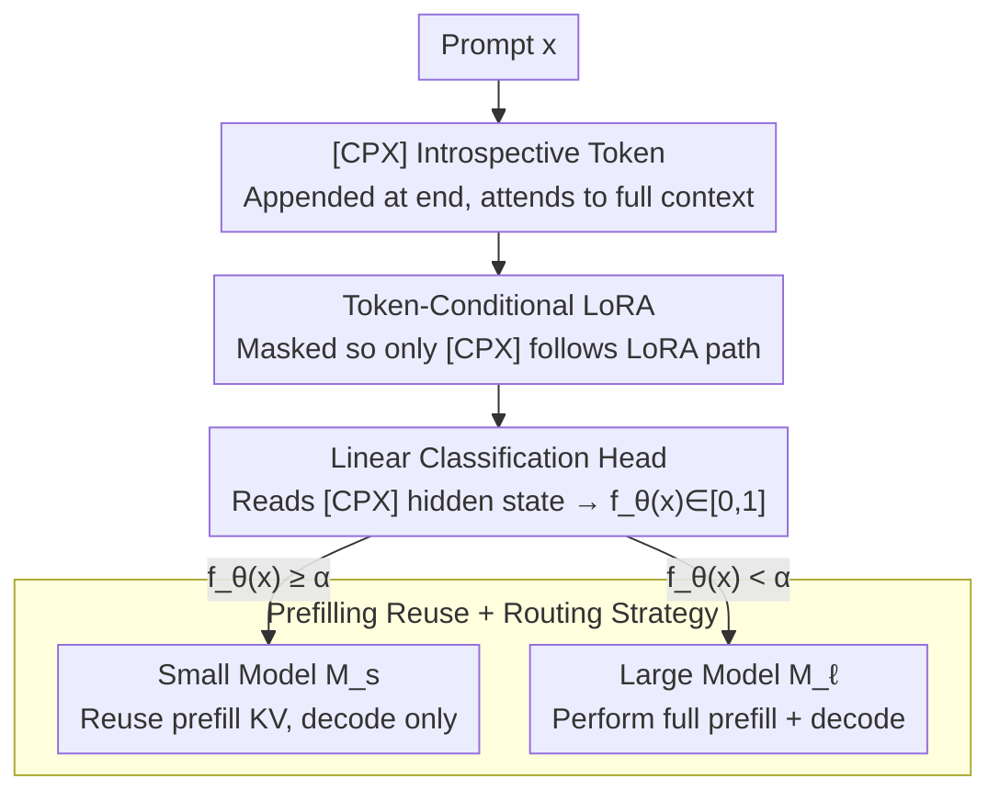

# IntroLM: Introspective Language Models via Prefilling-Time Self-Evaluation

**Conference**: ACL 2026 Findings  
**arXiv**: [2601.03511](https://arxiv.org/abs/2601.03511)  
**Code**: https://github.com/hhosseini1377/LLM_routing (Available)  
**Area**: LLM Inference / Model Routing / Introspective Self-Evaluation  
**Keywords**: Self-evaluation, Complexity prediction, prefilling, token-conditional LoRA, LLM routing

## TL;DR
IntroLM appends special `[CPX]` introspective tokens to the end of a prompt and utilizes a "token-conditional LoRA" that is active only for these tokens. It calculates the probability of the model answering correctly during the prefilling stage. This self-evaluation does not enter the KV cache and does not affect generation. On long-context QA tasks like HotpotQA, it achieves a ROC-AUC 14 points higher than DeBERTa-v3-Large. When used for model routing, it saves up to 50% of large model calls and reduces end-to-end latency by 33%.

## Background & Motivation
**Background**: LLM deployment commonly employs routing strategies where a "small model is tried first, and complex queries are escalated to a large model." The key is to predict whether a prompt exceeds the small model's capability before generation. The mainstream approach involves training an independent BERT-style classifier (e.g., DeBERTa, MiniLM) for pre-routing.

**Limitations of Prior Work**: (a) The context window of BERT is limited to 512 tokens, whereas input for modern RAG or long-document QA often ranges from thousands to hundreds of thousands of tokens, which BERT cannot fully process; (b) using a stronger independent LLM as an evaluator offsets the cost-saving purpose of routing; (c) posterior verification schemes (e.g., FrugalGPT, AutoMix) only judge after generation, incurring high latency costs; (d) existing "confidence token" works (e.g., Chuang 2025's `<CN>/<UN>`) generate tokens at the end of decoding, still requiring generation before judgment.

**Key Challenge**: Complexity prediction requires "sufficiently strong semantic modeling + visibility of the full long context," but running an additional LLM evaluator brings costs back to the starting point. Meanwhile, modifying the primary model for evaluation risks disrupting its generation behavior.

**Goal**: Enable causal LLMs to predict their own output quality during the prefilling stage without introducing new models, modifying the KV cache, or altering the generation distribution.

**Key Insight**: During prefilling, every token aggregates information from the entire prompt via self-attention. By "attaching" special tokens to the end of the prompt to read the full context and using a small classification head to read their hidden states, self-evaluation can be completed with zero additional inference cost.

**Core Idea**: Use `[CPX]` introspective tokens + token-conditional LoRA (low-rank adaptation effective only for `[CPX]`) to decouple the "introspection path" from the "generation path," where the former handles complexity estimation and the latter maintains the base model's behavior unchanged.

## Method

### Overall Architecture
Given a prompt $x$, IntroLM appends several `[CPX]` tokens to the end of $x$ and sends them into the LLM for prefilling. Each `[CPX]` token reads the complete $x$ through unidirectional attention. Its hidden state is mapped by a lightweight linear classification head to $f_\theta(x) \in [0, 1]$ (the probability of the small model being correct). Critical engineering isolation includes:

- `[CPX]` is not written to the KV cache: This ensures tokens in the decoding stage cannot see `[CPX]`, keeping the generation distribution identical to the base model.
- Decoding starts from the hidden state of the "original prompt's last token": This avoids starting from `[CPX]`, preventing the prompt representation from being contaminated by the self-evaluation objective.
- Backbone parameters are frozen: Trainable parameters include the `[CPX]` token embedding + classification head + token-conditional LoRA (< 1% of model size).

Downstream application: Compare $f_\theta(x)$ with a threshold $\alpha$ to decide whether to route to the small model $M_s$ or the large model $M_\ell$. If $M_s$ is chosen, its prefilling state can be directly reused for decoding without waste.

### Key Designs

**1. `[CPX]` Introspective Token: A dedicated "complexity reading slot" at the prompt end**

Directly using the hidden state of the last prompt token is suboptimal, as confirmed by the "Backbone only" ablation—that token is optimized for "generating the next word," not "judging the difficulty of the task." IntroLM appends special `[CPX]` tokens. Being at the end of a decoder-only model, each `[CPX]` attends to the full $x$ during prefilling, aggregating prompt semantics. A linear head then outputs the binary classification logit $f_\theta(x) \in [0, 1]$. To ensure no interference, `[CPX]` is excluded from the KV cache, and decoding initiates from the original prompt's final token representation, keeping the generation distribution intact.

**2. Token-Conditional LoRA: Restricting low-rank updates to `[CPX]` for zero distortion**

Standard LoRA modifies all token representations. Customizing features for introspection would inevitably perturb generation—a core conflict. IntroLM applies a token-level mask: for any linear layer, the output is calculated as $HW + (H\Delta W) \odot M$, where the binary mask $M$ is 1 only for `[CPX]` positions. This creates a parallel computation path within the same weights: original tokens use the frozen backbone, while `[CPX]` utilizes the LoRA adaptation. Adaptation is targeted at query (`q_proj`), output (`o_proj`), and FFN gates/up/down projections, while key and value projections remain frozen to preserve the overall attention pattern.

**3. Prefilling Reuse + Routing Strategy: Integrating results to skip redundant prefilling**

If $f_\theta(x) \ge \alpha$, the small model $M_s$ is deemed capable, and decoding continues using the existing prefilling KV cache. Otherwise, it upgrades to the large model $M_\ell$ for full processing. Since self-evaluation is piggybacked onto the $M_s$ prefilling, the cost of $M_s$ routing is reduced solely to decoding. The expected latency is:
$$T^\alpha_{\text{IntroLM}}(L) = \mathrm{TTFT}_{M_s} + (1-c_\ell)(L-1)\mathrm{TPOT}_{M_s} + c_\ell T_{M_\ell}(L)$$
Unlike BERT routers, which decide before $M_s$ runs, IntroLM reuses the KV cache because the small model has already performed prefilling, leading to a 33% reduction in end-to-end latency.

### Loss & Training
- **Loss**: Class-weighted binary cross-entropy; labels are generated via LLM-as-judge (LLaMA-3.1-8B-Instruct for General QA, Qwen2.5-32B-Instruct for Chat using a 0–10 score thresholded at 8).
- **LoRA Config**: Rank 32, $\alpha=64$; batch size 64; context 2048; cosine LR + 10% warmup; weight decay 0.002.
- **Data**: General QA (MMLU, MMLU-Pro, GSM8K; 136K samples); HotpotQA (97K samples); LMSYS-Chat-1M (100K English prompts). Split 80/10/10.

## Key Experimental Results

### Main Results
Complexity prediction performance (ROC-AUC / PR-AUC):

| Method | General QA ROC | General QA PR | HotpotQA ROC | HotpotQA PR | Chat ROC |
| :--- | :---: | :---: | :---: | :---: | :---: |
| DeBERTa-v3-Base (184M) | 74.3 | 44.3 | 69.4 | 24.3 | 82.6 |
| DeBERTa-v3-Large (435M) | 75.8 | 45.5 | 71.8 | 26.8 | 86.3 |
| Matrix Factorization | 69.2 | 39.8 | 52.1 | 14.0 | 76.1 |
| **IntroLM (Qwen3-8B)** | **89.1** | **63.4** | **86.3** | **46.7** | **90.1** |

On HotpotQA, ROC-AUC exceeds DeBERTa-Large by 14.5 points (71.8 → 86.3), and PR-AUC nearly doubles (26.8 → 46.7), highlighting the advantage in long-context scenarios where BERT is constrained.

End-to-end routing gains ($M_s$=Qwen3-8B, $M_\ell$=Qwen3-32B):

| Dataset | Reduction in Large Model Calls | Latency Reduction |
| :--- | :--- | :--- |
| General QA | Up to 50% (Mean 30%) | Up to 34% (Mean 15%) |
| HotpotQA | Up to 49% (Mean 41%) | Up to 30% (Mean 18%) |

### Ablation Study

Necessity of `[CPX]` token (HotpotQA):

| Configuration | ROC | PR | Description |
| :--- | :---: | :---: | :--- |
| Backbone only | 81.0 | 35.8 | Using last prompt token's hidden state |
| **IntroLM (Qwen3-8B, w/ `[CPX]`)** | **86.3** | **46.7** | +5.3 ROC, +10.9 PR |

Token-conditional LoRA target ablation (General QA, Qwen3-8B):

| LoRA Target | ROC | PR |
| :--- | :---: | :---: |
| No LoRA (Soft prompt only) | 85.7 | 56.4 |
| Attention only (q/o) | 88.5 | 61.0 |
| FFN only | 89.1 | 63.0 |
| Attention + FFN (Default) | 89.1 | 63.1 |

### Key Findings
- **Token-conditional LoRA is the critical inflection point**: Removal causes ROC-AUC to drop by 3.4 points and PR-AUC by 6.7 points, proving that "soft prompts" alone are insufficient; learnable pathways for `[CPX]` are necessary.
- **FFN-only LoRA is sufficient**: Adapting only FFN (89.1) performs identically to full attention+FFN adaptation, allowing for further parameter savings.
- **Long context is BERT's Achilles' heel**: IntroLM almost doubles PR-AUC on HotpotQA, validating the fundamental advantage of full-context prefilling.
- **Early signals from middle layers**: Qwen3-8B achieves 87.9 ROC using only the first 24/36 layers (vs. 89.1 for the full model), suggesting potential for early-exit routing.
- **Cross-model feasibility**: Qwen3-8B can predict Qwen3-1.7B success with 83.8 ROC, nearly matching self-evaluation (84.2) and significantly outperforming DeBERTa (75.7).

## Highlights & Insights
- **Introspection without side effects**: The combination of `[CPX]` exclusion from KV cache and token-conditional LoRA achieves a "zero-distortion" constraint for the main task, which is highly transferable for alignment or safety monitoring.
- **Mutual gain in latency and cost**: Shifting the decision from a "pre-BERT" to "post-prefilling" allows for KV cache reuse. This makes the small model path nearly free of extra overhead, which is the source of the 33% latency reduction.
- **Layer-wise signal escalation**: Decent introspection signals emerge at middle layers, suggesting routing can be triggered during prefilling (early exit), offering huge potential for RAG over extremely long contexts.

## Limitations & Future Work
- The authors acknowledge: (a) experiments focus on QA and chat, leaving creative writing or code generation unverified; (b) training costs are higher than BERT-based classifiers; (c) labels depend on LLM-as-judge, introducing potential bias.
- Personal observations: (d) ROC-AUC does not account for calibration errors; (e) hyper-parameters like the count of `[CPX]` tokens were not systematically scanned; (f) the advantage over BERT narrows on short prompts, suggesting "short prompts may not be worth" the introspective overhead.

## Related Work & Insights
- **vs FrugalGPT / AutoMix**: These judge quality after generation, incurring decoding costs; IntroLM provides the answer during prefilling, potentially saving a whole decoding cycle.
- **vs RouteLLM / BEST-Route**: BERT-style routers are capped at a 512-token context; IntroLM inherently supports arbitrary lengths using the LLM backbone.
- **vs Chuang 2025 (`<CN>/<UN>`)**: Their confidence tokens are generated at the end of decoding; IntroLM moves this to the prefilling stage and isolates it from the generation trajectory.

## Rating
- Novelty: ⭐⭐⭐⭐⭐ The "token-conditional LoRA + non-KV cache introspective token" is a clean, paradigm-level design for non-disruptive self-evaluation.
- Experimental Thoroughness: ⭐⭐⭐⭐ Solid across datasets and backbones, though lacking calibration and production-load testing.
- Writing Quality: ⭐⭐⭐⭐ Formulas and diagrams are clear, with well-documented engineering details.
- Value: ⭐⭐⭐⭐⭐ High practical value; saving 33% latency and half of large model calls is significant for LLM serving.

<!-- RELATED:START -->

## Related Papers

- [\[ACL 2026\] Training-Free Test-Time Contrastive Learning for Large Language Models](training-free_test-time_contrastive_learning_for_large_language_models.md)
- [\[ICLR 2026\] BeyondBench: Contamination-Resistant Evaluation of Reasoning in Language Models](../../ICLR2026/model_compression/beyondbench_contamination-resistant_evaluation_of_reasoning_in_language_models.md)
- [\[ACL 2026\] LightReasoner: Can Small Language Models Teach Large Language Models Reasoning?](lightreasoner_can_small_language_models_teach_large_language_models_reasoning.md)
- [\[ACL 2026\] JudgeMeNot: Personalizing Large Language Models to Emulate Judicial Reasoning in Hebrew](judgemenot_personalizing_large_language_models_to_emulate_judicial_reasoning_in_.md)
- [\[NeurIPS 2025\] Learning to Better Search with Language Models via Guided Reinforced Self-Training](../../NeurIPS2025/model_compression/learning_to_better_search_with_language_models_via_guided_reinforced_self-traini.md)

<!-- RELATED:END -->
