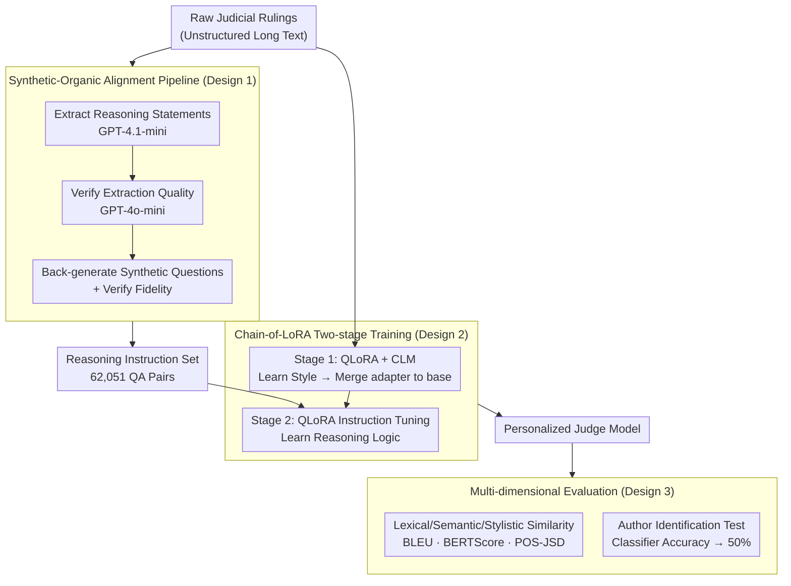

# JudgeMeNot: Personalizing Large Language Models to Emulate Judicial Reasoning in Hebrew

**Conference**: ACL 2026 Findings  
**arXiv**: [2604.18041](https://arxiv.org/abs/2604.18041)  
**Code**: [GitHub](https://github.com/Socially-Embedded-Lab/JudgeMeNot)  
**Area**: Model Compression  
**Keywords**: LLM Personalization, Judicial Reasoning, Low-resource language, PEFT, Synthetic instruction data

## TL;DR
This paper proposes a synthetic-organic supervision pipeline to transform raw judicial rulings into reasoning instruction tuning data. It achieves high-fidelity simulation of individual judges' reasoning styles through a "Chain-of-LoRA" strategy (CLM → Instruction Tuning). In Hebrew low-resource scenarios, the generated content is indistinguishable from real judicial writing.

## Background & Motivation

**Background**: LLM personalization research has grown rapidly in recent years, but mostly focuses on user preferences (style, recommendation) rather than modeling the reasoning processes of specific decision-makers. In the legal domain, judicial rulings are not mechanical applications of laws but reflect individual reasoning patterns, argumentative focus, and rhetorical structures.

**Limitations of Prior Work**: (1) Raw judicial rulings are unstructured long texts where reasoning is intertwined with procedural templates and factual statements, making them difficult to use directly for training; (2) Judicial reasoning in text is "unprompted"—there are no explicit trigger questions; (3) Data for individual judges is limited, making it a challenge to capture strong individual signals efficiently.

**Key Challenge**: Personalization requires sufficient reasoning supervision signals, but judicial reasoning signals are heavily diluted by non-reasoning text. Direct Causal Language Modeling (CLM) on raw text is inefficient.

**Goal**: Design a framework that requires no human annotation and scales to many judges, allowing LLMs to faithfully simulate specific judicial styles and logic.

**Key Insight**: The legal domain naturally provides decomposable reasoning traces—judges regularly process complex decisions and write detailed arguments. By decomposing rulings into fine-grained reasoning statements (rather than just final verdicts), rich reasoning training signals can be obtained.

**Core Idea**: Use an agentic workflow to automatically extract reasoning statements from rulings and generate synthetic questions to construct instruction sets. High-efficiency personalization is then achieved via a two-stage Chain-of-LoRA (CLM → Instruction Tuning).

## Method

### Overall Architecture

This paper addresses how to make an LLM faithfully mimic a specific judge's thinking and writing when raw materials consist only of unstructured rulings. The pipeline is divided into two parts: "purifying" rulings into trainable reasoning signals and injecting these signals into the model using a lightweight two-stage LoRA system. The first part uses multiple LLM agents to extract reasoning sentences and back-generate synthetic questions to create a QA-style instruction set. The second part first learns stylistic features through CLM on all rulings and then learns logic via the instruction set. Finally, personalization is verified through multi-dimensional metrics, including author identification tests.

### Key Designs

**1. Synthetic-Organic Alignment Pipeline: Purifying rulings into QA-style reasoning supervision**
Directly using raw rulings for CLM faces a fatal issue: sentences reflecting reasoning are diluted by procedural templates and facts. Human annotation is not scalable. This pipeline uses multiple LLM agents in a multi-round agentic workflow: GPT-4.1-mini (temp=0.3) extracts reasoning statements, GPT-4o-mini (temp=0.1) verifies quality, and synthetic questions are generated for each statement. The "synthetic question" is a key design: reasoning in rulings is "unprompted," but since models are used in QA formats, back-generating a question aligns the training distribution with the inference distribution.

**2. Chain-of-LoRA (CoLA) Two-stage Training: Separating "how to write" from "how to think"**
To learn strong individual signals within computational constraints, CoLA splits the process into two steps. Step one uses QLoRA on all raw rulings for CLM to capture stylistic features (vocabulary, syntax, rhetoric), then merges the adapter weights back into the base. Step two performs another round of QLoRA on the purified synthetic reasoning instruction set to learn logic. Separating style from reasoning prevents the gradients of the two different objectives (surface distribution vs. argumentative structure) from interfering.

**3. Multi-dimensional Evaluation: Quantifying style and reasoning separately**
Personalization quality is multi-faceted. The evaluation covers lexical similarity (BLEU, ROUGE), semantic similarity (BERTScore), stylistic similarity (JSD of Part-of-Speech distributions), and a binary author identification test. If a classifier's accuracy in distinguishing model-generated text from real judicial text approaches 50%, the personalization is considered successful.

### Loss & Training
Gemma 3 (4B) is used as the base with QLoRA configuration (rank=8). Each judge has an individual LoRA adapter, while base weights remain frozen. Standard Causal Language Modeling loss is used for the CLM stage, and standard SFT loss is used for the instruction tuning stage.

## Key Experimental Results

### Main Results (QA Task, CoLA improvement relative to baselines)

| Method | BLEU↑ | BS-F↑ | R-L↑ | POS-JSD↓ |
|------|-------|-------|------|----------|
| Vanilla-Gemma (Baseline) | 0 | 0 | 0 | 0 |
| Gemini-3-Pro RAG | -3.22 | -0.09 | -0.12 | +0.02 |
| Pers-CLM | -0.25 | -0.03 | -0.01 | +0.02 |
| Pers-IT | -7.02 | -0.09 | -0.15 | +0.02 |
| **CoLA (Ours)** | **Best** | **Best** | **Best** | **Best** |

### Author Identification Test

| Method | Accuracy | Note |
|------|--------|------|
| Random Guess | 50.0% | Baseline |
| Human vs. Human | 84.3% | Judges do have distinct differences |
| Vanilla-Gemma | 70.3% | Easily distinguishable |
| CLM-only | 56.2% | Still distinguishable |
| **CoLA** | **49.8%** | Indistinguishable from random |
| **IT-only** | **49.6%** | Indistinguishable from random |

### Key Findings
- **CoLA generation is indistinguishable from real judges**: The author identification classifier accuracy dropped to the random level (49.8%), indicating extremely high generation quality.
- **Data volume is more important than model size**: Ablation shows doubling data leads to a +2.68 BLEU gain, while doubling LoRA rank only yields +0.77 BLEU.
- **CLM+IT synergy**: Cross-judge specificity tests confirm that personalization is judge-specific rather than a general improvement.
- **RAG excels at surface style but fails at reasoning**: RAG performed well on POS-JSD but lagged in semantic metrics, proving that parameter adaptation is necessary to capture reasoning.

## Highlights & Insights
- The decomposition of **"persona = style layer + reasoning layer"** is insightful: RAG captures surface style but not reasoning logic, whereas parameter tuning is the opposite. This suggests personalization requires a combination of both paths.
- The **Synthetic Supervision Pipeline** is highly practical: The pattern of using multi-agent workflows to extract reasoning and generate questions from unstructured documents can be transferred to medicine, education, or any field requiring expert decision-making simulation.
- Achieving high-fidelity personalization on a **4B parameter model** challenges the notion that reasoning requires massive models and data—the key lies in the structure of the supervision signals.

## Limitations & Future Work
- Focuses only on fine-grained reasoning statements and does not model the overall reasoning chain at the case level.
- Does not account for the drift of judicial reasoning style over time.
- Validated only in the Hebrew legal system; cross-lingual/cross-jurisdictional generalization is unknown.
- Model weights are not released to prevent misuse, which limits reproducibility.
- Future work could explore explicit dependency modeling in reasoning chains and incorporate factual grounding.

## Related Work & Insights
- **vs OnePeFTPerUser**: The latter combines PEFT and retrieval for personalization but focuses on labeled tasks (classification/tagging) rather than reasoning modeling.
- **vs DRAFT**: DRAFT improves tool documentation through trial and error, similar to this paper's synthetic pipeline, but targets tool use rather than reasoning simulation.
- **vs General Reasoning Models (e.g., o3)**: Reasoning models typically require verifiable steps (Math/Code), whereas legal reasoning lacks such objective signals. This work uses simulation fidelity instead of "correctness" as the optimization goal.

## Rating
- Novelty: ⭐⭐⭐⭐ The synthetic-organic pipeline and CoLA strategy are innovative, though individual components are relatively mature.
- Experimental Thoroughness: ⭐⭐⭐⭐⭐ Extremely comprehensive with multiple tasks, baselines, ablations, cross-judge validation, and robustness tests.
- Writing Quality: ⭐⭐⭐⭐⭐ Clear structure, thorough ethical discussion, and logical motivation.
- Value: ⭐⭐⭐⭐ Provides significant insights for LLM reasoning personalization, despite the niche application domain.

<!-- RELATED:START -->

## Related Papers

- [\[ACL 2026\] LightReasoner: Can Small Language Models Teach Large Language Models Reasoning?](lightreasoner_can_small_language_models_teach_large_language_models_reasoning.md)
- [\[AAAI 2026\] Efficient Reasoning for Large Reasoning Language Models via Certainty-Guided Reflection Suppression](../../AAAI2026/model_compression/efficient_reasoning_for_large_reasoning_language_models_via_certainty-guided_ref.md)
- [\[ICLR 2026\] Landscape of Thoughts: Visualizing the Reasoning Process of Large Language Models](../../ICLR2026/model_compression/landscape_of_thoughts_visualizing_the_reasoning_process_of_large_language_models.md)
- [\[ACL 2026\] Training-Free Test-Time Contrastive Learning for Large Language Models](training-free_test-time_contrastive_learning_for_large_language_models.md)
- [\[ACL 2026\] TLoRA: Task-aware Low Rank Adaptation of Large Language Models](tlora_task-aware_low_rank_adaptation_of_large_language_models.md)

<!-- RELATED:END -->
