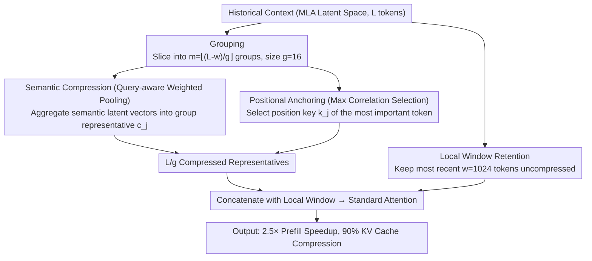

# Latent-Condensed Transformer for Efficient Long Context Modeling

**Conference**: ACL 2026  
**arXiv**: [2604.12452](https://arxiv.org/abs/2604.12452)  
**Code**: None  
**Area**: Model Compression  
**Keywords**: Long-context modeling, KV cache compression, MLA, Latent space compression, Efficient attention

## TL;DR

LCA proposes performing context compression directly within the latent space of MLA—utilizing query-aware weighted pooling to aggregate semantic latent vectors and anchor selection for positional keys to maintain positional accuracy—achieving 2.5× prefill acceleration and 90% KV cache compression in 128K contexts while maintaining competitive performance.

## Background & Motivation

**Background**: LLM long-context processing faces two major bottlenecks: linear KV cache growth and quadratic self-attention complexity. MLA (Multi-head Latent Attention) effectively reduces per-token KV cache size by projecting tokens into a low-dimensional latent space, widely adopted by DeepSeek-V2/V3. Sparse attention methods reduce computation by skipping or evicting unimportant tokens.

**Limitations of Prior Work**: These two technical routes cannot be directly combined—sparse attention methods require reconstructing the full KV matrix from the MLA latent representation before sparsification, completely negating the latent space compression advantages of MLA.

**Key Challenge**: Although MLA compresses the per-token cache, it still retains all $L$ tokens for attention computation. To reduce the token count within the latent space, semantic latent vectors $\mathbf{C}^{KV}$ can be aggregated, but positional keys $\mathbf{K}^R$ (RoPE) cannot be simply mixed.

**Goal**: Design an efficient attention mechanism that operates natively in the MLA latent space while simultaneously reducing KV cache and computation.

**Key Insight**: Semantic information is continuous and smooth, thus aggregatable, while positional encoding is non-linear and necessitates hard selection. Different compression strategies are applied to these two components.

**Core Idea**: Group the context, apply query-aware weighted pooling to aggregate semantic latent vectors $\mathbf{C}^{KV}$ per group, and use maximum correlation selection to maintain positional key $\mathbf{K}^R$ accuracy, compressing $L$ tokens into $L/g$ representatives.

## Method

### Overall Architecture

LCA aims to address both bottlenecks of long context simultaneously: continuing to benefit from MLA's per-token latent space compression while reducing the **number** of tokens involved in attention—something sparse attention cannot achieve (as it must reconstruct full KV before sparsification). It operates directly in the MLA latent space: historical context is sliced into $m = \lfloor(L-w)/g\rfloor$ groups (group size $g=16$), with each group compressed into one representative. The most recent $w=1024$ tokens are kept intact to maintain precision. The $L/g$ compressed representatives are then concatenated with the local window for standard attention. The core mechanism treats continuous semantic latent vectors and non-linear positional encodings separately—the former are aggregated, while the latter are hard-selected—aligning with the decoupled design of the method.

### Key Designs

**1. Semantic Compression (Query-aware Weighted Pooling): Aggregating each group of semantic latent vectors into an information-preserving representative**

To compress a group of tokens into one representative, the most naïve approach is to drop most tokens, which causes irreversible information loss. LCA chooses aggregation instead of discarding: it uses the average vector $\bar{\mathbf{q}}$ of the most recent $g$ queries as a "summary query" to calculate importance scores for tokens within the group. Softmax normalization yields weights $\alpha_i^{(j)}$, which are used for weighted pooling:

$$\mathbf{c}_j^{rep} = \sum_i \alpha_i^{(j)} \mathbf{c}_i^{KV}.$$

The paper proves (Proposition 1) that this weighted pooling is the optimal solution for minimizing expected reconstruction error, ensuring the representative preserves information from all tokens in the group rather than just the "most important" one. Using current queries for weighting also makes the compression query-aware, biasing toward tokens relevant to current decoding.

**2. Positional Anchoring (Max Correlation Selection): Using hard selection for positional keys to prevent RoPE from being blurred by pooling**

The weighted pooling strategy used for semantics does not work for positional keys $\mathbf{K}^R$. RoPE is a non-linear function that encodes absolute positions into phases; pooling different positional keys would cause phase interference and positional distortion. Therefore, positional keys follow a different path: the token with the highest importance score in the group is directly selected as the positional anchor:

$$\mathbf{k}_j^{R_{rep}} = \mathbf{k}_{I_j}^R,$$

Using a hard selection maintains an exact coordinate rather than a "mean position." This divide-and-conquer strategy—aggregating semantics while preserving positions—is consistent with the philosophy of MLA, which decouples content and position.

**3. Local Window Retention: Keeping recent tokens uncompressed to preserve fine-grained local context**

Next-token prediction is highly dependent on the immediate preceding context; compressing these would significantly degrade prediction quality. LCA leaves a fast lane for the most recent $w=1024$ tokens—keeping them completely intact—and only applies group compression to earlier history. This focuses compression on "low-density, long-distance" parts while leaving sensitive nearby context untouched.

### Loss & Training

There are no additional learnable parameters; only 1000 steps of lightweight fine-tuning on SlimPajama are required. Optimized with Triton kernels, experiments were completed on 8×H200 GPUs.

## Key Experimental Results

### Main Results (RULER 4-128K)

| Method | Avg. | 128K Latency |
|------|------|----------|
| MLA Original | 58.91 | 10.78s |
| MInference | 37.60 | 5.66s (1.9×) |
| FlexPrefill | 39.11 | 5.38s (2.0×) |
| KDA | 54.63 | 4.96s (2.2×) |
| **LCA** | **58.80** | **4.40s (2.5×)** |

### Ablation Study

| Configuration | Performance | Note |
|------|------|------|
| Semantic Pooling + Positional Anchoring | 58.80 | Full LCA |
| Pure Pooling (Including Positional) | Decrease | RoPE mixing causes positional distortion |
| Pure Sparsity | Severe Decrease | Irreversible information loss |

### Key Findings

- 2.5× prefill speedup + 90% KV cache compression.
- Performance is nearly lossless (58.80 vs 58.91), significantly outperforming sparse methods.
- MInference/FlexPrefill collapse at 32K+, while LCA remains stable.
- Design is architecture-agnostic and extendable to GQA.
- The approximate error bound is independent of context length.

## Highlights & Insights

- The decoupled compression principle (aggregate semantics, preserve position) is consistent with the MLA design philosophy.
- Theoretical optimality of weighted pooling is proven (Proposition 1).
- High practical value due to zero extra parameters and lightweight fine-tuning.

## Limitations & Future Work

- Currently only verified on DeepSeek-V2-Lite (16B).
- Fixed group size $g=16$; adaptive sizes might yield better results.
- Positional anchoring uses hard selection, losing positional details of other tokens in the group.

## Related Work & Insights

- **vs FlexPrefill/MInference**: These reconstruct full KV before sparsification, failing to leverage the MLA latent space advantage and leading to performance collapse in long contexts.
- **vs KDA**: Requires integration during training from scratch, whereas LCA can be applied to existing models via lightweight fine-tuning.

## Rating

- Novelty: ⭐⭐⭐⭐ First to perform context compression within the MLA latent space.
- Experimental Thoroughness: ⭐⭐⭐⭐ Multi-dimensional evaluation but limited to one model.
- Writing Quality: ⭐⭐⭐⭐⭐ Clear organization of theory, algorithm, and experiments.
- Value: ⭐⭐⭐⭐⭐ Solves practical issues in combining MLA with efficient attention.

**Conference**: ACL2026  
**arXiv**: [2604.12452](https://arxiv.org/abs/2604.12452)

<!-- RELATED:START -->

## Related Papers

- [\[ICML 2025\] Core Context Aware Transformers for Long Context Language Modeling](../../ICML2025/model_compression/core_context_aware_transformers_for_long_context_language_modeling.md)
- [\[ICCV 2025\] Context Guided Transformer Entropy Modeling for Video Compression](../../ICCV2025/model_compression/context_guided_transformer_entropy_modeling_for_video_compression.md)
- [\[ACL 2026\] HeteroCache: A Dynamic Retrieval Approach to Heterogeneous KV Cache Compression for Long-Context LLM Inference](heterocache_a_dynamic_retrieval_approach_to_heterogeneous_kv_cache_compression_f.md)
- [\[ICML 2025\] LaCache: Ladder-Shaped KV Caching for Efficient Long-Context Modeling of Large Language Models](../../ICML2025/model_compression/lacache_ladder-shaped_kv_caching_for_efficient_long-context_modeling_of_large_la.md)
- [\[ICML 2026\] Token Sparse Attention: Efficient Long-Context Inference with Interleaved Token Selection](../../ICML2026/model_compression/token_sparse_attention_efficient_long-context_inference_with_interleaved_token_s.md)

<!-- RELATED:END -->
