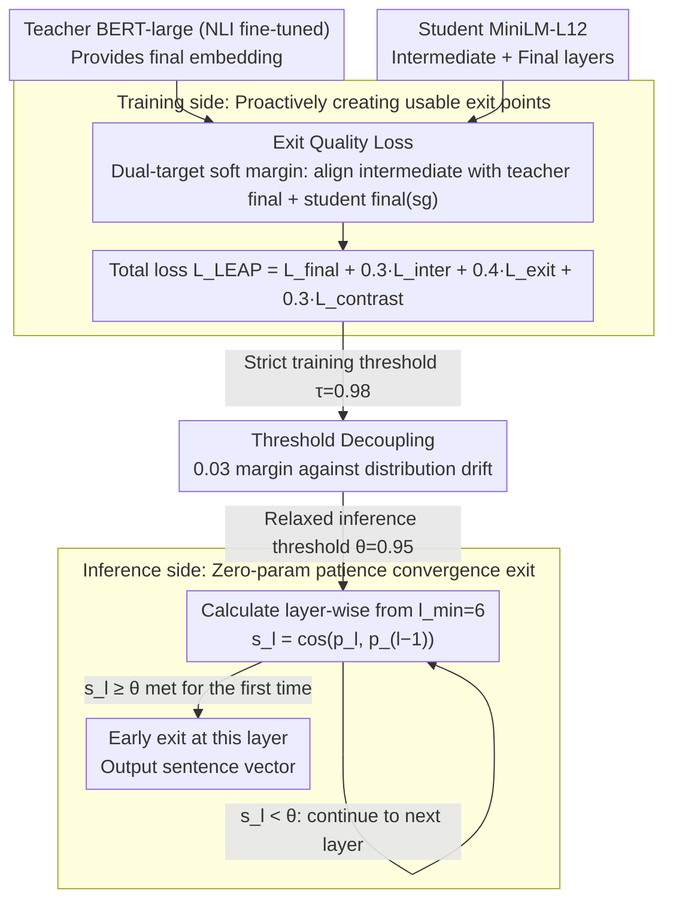

# LEAP: Layer-wise Exit-Aware Pretraining for Efficient Transformer Inference

**Conference**: ACL 2026 (Industry Track · Emerging)  
**arXiv**: [2605.01058](https://arxiv.org/abs/2605.01058)  
**Code**: TBD  
**Area**: Model Compression / Early Exit / Knowledge Distillation / Sentence Embeddings  
**Keywords**: Early Exit, Layer-wise Distillation, MiniLM, Sentence Embeddings, Inference Acceleration

## TL;DR
The authors theoretically and empirically demonstrate that "layer-wise alignment distillation" and "convergence-based early exit" are **systemically incompatible** under standard deployment—distilled models utilize every layer efficiently, leaving no redundancy for early exit. They propose LEAP, a zero-additional-parameter auxiliary training objective that forces intermediate layers to approximate the final layer representation early. LEAP achieves a .61× measured wall-clock speedup on MiniLM-L12 (with batch=1, 91.9% of samples exit at L7).

## Background & Motivation

**Background**: Dense text embedding is the core of modern retrieval, semantic search, RAG, and recommendation systems. Two mainstream acceleration routes have been refined for years: (a) **Knowledge Distillation**: MiniLM, DistilBERT, and TinyBERT use layer-wise alignment targets to compress large teachers into small students; (b) **Early Exit**: DeeBERT, FastBERT, PABEE, BERxiT, and CALM observe whether intermediate representations "converge" to exit early. Intuitively, these routes should be combinable: "distill then exit" to gain dual acceleration.

**Limitations of Prior Work**: The authors found that in industrial practice, attaching early exit infrastructure to distilled models like MiniLM results in **convergence thresholds being triggered at intermediate layers**, yet **measured wall-clock time increases** rather than decreases. This happens because the overhead of layer-wise similarity monitoring outweighs the gains from early termination. In short, "early exit seems to work but never actually saves time."

**Key Challenge**: Layer-wise alignment distillation ($\mathcal{L}_{\text{distill}}=\sum_l \text{KL}(\mathbf{h}_s^{(l)} \| \mathbf{h}_t^{(\pi(l))})$) distributes the teacher's capacity **evenly** across every student layer, optimizing for the objective that "every layer is important." Conversely, early exit requires "subsequent layers to perform decreasing amounts of work" to stop early. These two goals are **mutually exclusive**. Consequently, the inter-layer similarity curve $\cos(\mathbf{e}_l, \mathbf{e}_L)$ of distilled models remains < 0.3 for the first 11 layers and only jumps to 1.0 at L12—offering no natural exit points.

**Goal**: (1) Formalize this "distance-exit incompatibility" and provide measurable diagnostic metrics; (2) Design a training objective that **does not change architecture or add inference parameters**, allowing distilled models to retain both compression gains and early exit capability; (3) Provide an actionable deployment guide (thresholds, wall-clock, fallback conditions) for practitioners.

**Key Insight**: For early exit to be effective, intermediate representations must essentially approximate final representations. The authors propose adding an **explicit approximation constraint** alongside the distillation loss—forcing intermediate layers to match both the teacher's final layer and the student's own final layer, using a soft margin + sigmoid to create "progressive" pressure.

**Core Idea**: Beyond standard distillation and final alignment, an "Exit Quality Loss" $\mathcal{L}_{\text{exit}}$ is added (dual targets: teacher final + student final with stop-gradient). Using a sigmoid soft margin, intermediate layers are forced to cross the $\tau=0.98$ similarity line early, **proactively creating** exit points. During inference, a patience-based convergence criterion ($\cos(\mathbf{p}_l, \mathbf{p}_{l-k}) \geq \theta=0.95$) enables zero-parameter early exit.

## Method

### Overall Architecture

LEAP is a scheme that **only modifies the training loss without altering the architecture or adding inference parameters**:

- Training Phase: Teacher BERT-large (NLI fine-tuned) → Student MiniLM-L12, objective function $\mathcal{L}_{\text{LEAP}} = \mathcal{L}_{\text{final}} + \alpha \mathcal{L}_{\text{inter}} + \beta \mathcal{L}_{\text{exit}} + \delta \mathcal{L}_{\text{contrast}}$, where $\alpha=0.3, \beta=0.4, \delta=0.3$.
- Inference Phase: Starting from $l_{\min}=6$, each layer calculates $s_l = \cos(\mathbf{p}_l, \mathbf{p}_{l-k})$ (patience $k=1$). The model exits at the first instance where $s_l \geq \theta=0.95$, with zero additional learnable parameters.
- The training threshold $\tau=0.98$ is strictly higher than the inference threshold $\theta=0.95$, providing headroom for distribution drift.

### Key Designs

**1. Exit Quality Loss $\mathcal{L}_{\text{exit}}$ (Dual-target soft margin): Proactively creating usable exit points during training**

This is the core of the method. Ablations in Appendix C.5 show that removing it causes LEAP to fail. It targets a specific pain point: distillation spreads teacher capacity evenly across student layers, meaning intermediate layers do not resemble the final layer. LEAP's counter-strategy is to apply two dual approximation losses to each intermediate layer $l$. The **Teacher-side** loss forces intermediate layers to match the teacher's final embedding:

$$\mathcal{L}_{\text{exit}}^{(t)} = \frac{1}{L_s}\sum_l w_l \cdot \sigma\!\big(10\cdot(\tau - \cos(\mathbf{e}_s^{(l)}, \mathbf{e}_t^{(L_t)}))\big),$$

The **Student-side** loss uses a stop-gradient to force intermediate layers to match the student's own final output:

$$\mathcal{L}_{\text{exit}}^{(s)} = \frac{1}{L_s-1}\sum_l w_l \cdot \sigma\!\big(10\cdot(\tau - \cos(\mathbf{e}_s^{(l)}, \text{sg}(\mathbf{e}_s^{(L_s)})))\big),$$

Combined, they form $\mathcal{L}_{\text{exit}} = \mathcal{L}_{\text{exit}}^{(t)} + 0.7\mathcal{L}_{\text{exit}}^{(s)}$. The sigmoid with factor 10 creates a "soft margin" that saturates once the $\tau$ threshold is crossed, preventing ineffective gradients for layers that already meet the requirement. Dual targets are necessary because aligning solely with the teacher's final layer conflicts with layer-wise distillation $\mathcal{L}_{\text{inter}}$; the student-side target with stop-gradient ensures that intermediate layers are **inferentially consistent** with the student's final output.

**2. Decoupling Training/Inference Thresholds: $\tau=0.98$ vs $\theta=0.95$**

The biggest engineering risk for early exit is the "threshold reachability gap"—where thresholds met during training are never reached in production. LEAP decouples training strictness from inference aggressiveness: training forces layers toward high-line $\tau=0.98$, while inference allows exit at $\theta=0.95$. This 0.03 margin absorbs real-world distribution perturbations. This decoupling makes $\theta$ the sole knob for production tuning: Pareto curves show that for $\theta\in[0.93,0.97]$, STS-B scores remain stable (0.753–0.762) while the average exit layer moves from 4.6 to 8.9.

**3. Zero-parameter patience-based convergence exit: No learnable modules at inference**

Methods like DeeBERT (classification heads per layer) or PABEE (learnt exit heads) do not work well for sentence embeddings because there are no downstream labels for task-specific fine-tuning (DeeBERT on MiniLM-L12 yields an STS-B Spearman of 0.26 vs. LEAP's 0.76). LEAP relies purely on geometric judgment: from $l_{\min}=6$, it calculates $s_l=\cos(\mathbf{p}_l, \mathbf{p}_{l-k})$ with patience $k=1$. The judgment requires only one mean-pool and one cosine calculation—far lighter than running a classification head. This parameter-free, task-agnostic approach is key to seamless integration into industrial embedding services.

### Loss & Training

The total objective is $\mathcal{L}_{\text{LEAP}} = \mathcal{L}_{\text{final}} + 0.3\mathcal{L}_{\text{inter}} + 0.4\mathcal{L}_{\text{exit}} + 0.3\mathcal{L}_{\text{contrast}}$, where $\mathcal{L}_{\text{final}}=1-\cos(\mathbf{e}_s^{(L_s)},\mathbf{e}_t^{(L_t)})$, $\mathcal{L}_{\text{inter}}$ is layer-wise cosine alignment, and $\mathcal{L}_{\text{contrast}}$ is KL alignment of the batch similarity matrices. Training used AllNLI 1.5M pairs, 10 epochs, batch size 64, lr $5\times 10^{-5}$, taking $\sim$14h (4×L4).

## Key Experimental Results

### Main Results

Comparison between MiniLM-L12 (standard distillation) and LEAP-MiniLM-L12 on STS-B sentence embedding tasks:

| Model | STS-B $\rho$ | Layer Reduction | Wall-clock Speedup | $\mathbb{E}[\text{layer}]$ | Exit@L7 |
|------|--------------|----------------|--------------------|----------------------------|---------|
| Published MiniLM-L12-v2 | 0.831 | 1.00× | 1.00× | 12.0 | 0% |
| MiniLM-L12 (baseline, same pipeline) | 0.777 | 1.00× | 1.00× | 12.0 | 0% |
| **LEAP-MiniLM-L12** | **0.760 ±0.006** | **1.80×** | **1.61×** | **6.7** | **91.9%** |

LEAP achieves a 1.61× wall-clock speedup at a cost of only 2.2% in STS-B quality. Even with the LEAP inference protocol, the original MiniLM has a 0% exit rate (L7 similarity is 0.29 vs. LEAP's 0.96), verifying that incompatibility is **intrinsic to distillation targets** rather than training pipelines.

**Cross-distillation compatibility** (Max Exit Rate):

| Model | Distillation Type | Max Exit Rate |
|------|----------|---------------|
| TinyBERT-6 | Layer-wise alignment (MSE on hidden) | 0.0% |
| MiniLM-L6-v2 | Layer-wise alignment (KL on attention) | 0.7% |
| DistilBERT-6 | Output-only distillation | **71.5%** |

Only DistilBERT, which avoids layer-wise alignment, retains natural early exit capability—confirming "layer-wise alignment" as the root cause.

### Ablation Study / Key Findings

**Layer-wise Similarity Comparison** (Mechanism):

| Layer | MiniLM (baseline) Sim | MiniLM Exit% | LEAP Sim | LEAP Exit% |
|-------|-----------------------|--------------|----------|------------|
| 6 | 0.162 | 0.0% | 0.945 | 38.9% |
| 7 | 0.215 | 0.0% | 0.963 | 91.9% |
| 8 | 0.285 | 0.0% | 0.968 | 97.6% |
| 10 | 0.547 | 0.0% | 0.975 | 99.5% |
| 12 | 1.000 | 100% | 1.000 | 100% |

LEAP raises intermediate similarity above 0.9 starting at L6, whereas the baseline only reaches 0.86 at L11.

**Key Findings**
- **Layer-wise alignment is the culprit, not distillation itself**: DistilBERT supports early exit because it only uses KD on the final output. TinyBERT/MiniLM "kill" exit paths by locking every layer with KL/MSE targets.
- **Speedup highly depends on batch size**: With larger batches, GPU parallelism amortizes per-layer costs (1.61× → 1.24× at batch 32). LEAP is a victory for **real-time low-latency scenarios**, not throughput-heavy ones.
- **Training/Inference decoupling provides robustness**: Training at $\tau=0.98$ and inferring at $\theta=0.95$ creates a 0.03 buffer that flattens the Pareto quality curve.
- **Exit costs are task-dependent**: On BEIR, ArguAna sees a 24.7% drop while NFCorpus remains stable. Viability must be validated using target corpora using the three diagnostic metrics (flat similarity curve / zero exit rate / monitoring overhead).

## Highlights & Insights
- **Explicitly forcing "intermediate ≈ final" is a textbook-style simple intervention**: By focusing on **creating exit conditions during training** rather than complicating the inference side (heads, counters), LEAP follows a "create space during training, utilize at zero-cost during inference" philosophy.
- **"Dual-target + stop-gradient" is an elegant self-distillation implementation**: It balances teacher-driven quality with student-driven inference self-consistency while preventing final layer corruption via stop-gradients.
- **The "Falsifiable Prediction" section is a rare scientific highlight for an industry paper**: The authors explicitly state that any distilled model that maintains monotonic convergence of intermediate layers toward the final layer would not need LEAP to use early exit.

## Limitations & Future Work
- **Backbone Scope**: Validated only on 12-layer MiniLM; larger models (Sentence-BERT, E5-large) or multilingual variants remain untested.
- **Task Scope**: Limited to sentence embeddings; does not address token-level early exit (MT, text generation) which requires per-token decisions.
- **Training Cost**: +20% training overhead is non-trivial for massive models.
- **Fixed Minimum Layer ($l_{\min}=6$)**: Every sample must process 6 layers, leaving potential waste for extremely simple inputs.
- **Task-specific costs**: High quality drop on ArguAna (-24.7%) underscores the need for "task difficulty" prediction to decide when NOT to exit early.

## Related Work & Insights
- **vs. DeeBERT / PABEE**: These adapt at **inference time** with exit heads; LEAP eliminates the root cause at **training time** for a zero-parameter inference setup.
- **vs. MiniLM / TinyBERT**: LEAP is an **orthogonal enhancement** to standard distillation, adding a loss target rather than replacing components.
- **vs. Matryoshka Representations**: Matryoshka handles "width adaptation," while LEAP handles "depth adaptation." Combining them could provide multiplicative efficiency gains.
- **vs. LayerDrop / Pruning**: These are "static compression" (fixed small models); LEAP is "dynamic adaptive inference" based on sample difficulty.

## Rating
- Novelty: ⭐⭐⭐⭐ Combination of "identifying incompatibility" + "zero-parameter training intervention" is solid.
- Experimental Thoroughness: ⭐⭐⭐⭐ Broad coverage of STS-B/BEIR and wall-clock metrics, though limited to one backbone.
- Writing Quality: ⭐⭐⭐⭐⭐ Exemplary Industry Track style—clear problem statement and actionable diagnostics.
- Value: ⭐⭐⭐⭐⭐ High ROI for teams using distilled encoders in production RAG/Retrieval systems.

<!-- RELATED:START -->

## Related Papers

- [\[ACL 2026\] Adaptive Layer Selection for Layer-Wise Token Pruning in LLM Inference](adaptive_layer_selection_for_layer-wise_token_pruning_in_llm_inference.md)
- [\[ACL 2026\] TELL-TALE: Task Efficient LLMs with Task Aware Layer Elimination](tell-tale_task_efficient_llms_with_task_aware_layer_elimination.md)
- [\[ACL 2026\] A Layer-wise Analysis of Supervised Fine-Tuning](a_layer-wise_analysis_of_supervised_fine-tuning.md)
- [\[ICML 2026\] ReSpinQuant: Efficient Layer-Wise LLM Quantization via Subspace Residual Rotation Approximation](../../ICML2026/model_compression/respinquant_efficient_layer-wise_llm_quantization_via_subspace_residual_rotation.md)
- [\[ICML 2026\] FlattenGPT: Depth Compression for Transformer with Layer Flattening](../../ICML2026/model_compression/flattengpt_depth_compression_for_transformer_with_layer_flattening.md)

<!-- RELATED:END -->
