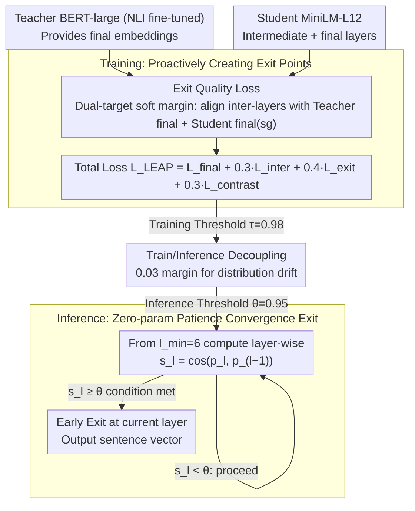

# LEAP: Layer-wise Exit-Aware Pretraining for Efficient Transformer Inference

**Conference**: ACL 2026 (Industry Track · Emerging)  
**arXiv**: [2605.01058](https://arxiv.org/abs/2605.01058)  
**Code**: TBD  
**Area**: Model Compression / Early Exit / Knowledge Distillation / Sentence Embeddings  
**Keywords**: Early Exit, Layer-wise Distillation, MiniLM, Sentence Embeddings, Inference Acceleration

## TL;DR
The authors theoretically and empirically demonstrate that "layer-wise alignment distillation" and "convergence-based early exit" are **systemically incompatible** under standard deployment—distilled models utilize every layer efficiently with no redundancy for early exit. They propose LEAP, a training objective with zero extra parameters that forces intermediate layers to approximate final layer representations. On MiniLM-L12, it achieves a 1.61× measured wall-clock speedup (batch=1, with 91.9% of samples exiting at L7).

## Background & Motivation

**Background**: Dense text embeddings are central to modern retrieval, semantic search, RAG, and recommendation systems. Two mainstream acceleration routes have been refined for years: (a) **Knowledge Distillation**: MiniLM, DistilBERT, and TinyBERT compress large teachers into small students using layer-wise alignment; (b) **Early Exit Inference**: DeeBERT, FastBERT, PABEE, BERxiT, and CALM observe intermediate representations for "convergence" to exit early. Intuitively, these should be combinable: "distill then exit" for dual acceleration.

**Limitations of Prior Work**: The authors find that in industrial practice, attaching early-exit infrastructure to distilled models like MiniLM results in the **convergence threshold being triggered in intermediate layers**, but **measured wall-clock time increases** rather than decreases. The overhead of monitoring similarity at each layer exceeds the gains from early termination. Essentially, "early exit appears to work but never actually exits significantly early."

**Key Challenge**: Layer-wise alignment distillation ($\mathcal{L}_{\text{distill}}=\sum_l \text{KL}(\mathbf{h}_s^{(l)} \| \mathbf{h}_t^{(\pi(l))})$) distributes teacher capacity **uniformly** across every student layer, optimizing for "every layer is important." Early exit requires later layers to perform progressively less work to stop early. These objectives **conflict**. Consequently, the inter-layer similarity $\cos(\mathbf{e}_l, \mathbf{e}_L)$ in distilled models remains < 0.3 for the first 11 layers and jumps to 1.0 only at L12—offering no natural exit points.

**Goal**: (1) Formalize this "distance-exit incompatibility" and provide measurable diagnostic metrics; (2) Design a training objective that requires **no architectural changes or extra inference parameters**, allowing distilled models to retain compression gains and early-exit capability; (3) Provide an actionable deployment guide (thresholds, wall-clock, fallback conditions).

**Key Insight**: For early exit to be effective, intermediate representations must approximate final representations. The authors propose adding an **explicit approximation constraint** besides distillation loss—forcing intermediate layers to match both the teacher's final layer and the student's own final layer using a soft margin + sigmoid for "progressive" pressure.

**Core Idea**: In addition to standard distillation and final alignment, an "Exit Quality Loss" $\mathcal{L}_{\text{exit}}$ is added (dual targets: teacher final + student final with stop-gradient). Using a sigmoid soft margin, intermediate layers are forced to cross a similarity threshold of $\tau=0.98$ early, **proactively creating** exit points. At inference, a patience-based convergence criterion ($\cos(\mathbf{p}_l, \mathbf{p}_{l-k}) \geq \theta=0.95$) enables zero-parameter early exit.

## Method

### Overall Architecture

LEAP modifies **only the training loss without altering the architecture or adding inference parameters**:

- Training phase: Teacher BERT-large (NLI fine-tuned) → Student MiniLM-L12. Objective: $\mathcal{L}_{\text{LEAP}} = \mathcal{L}_{\text{final}} + \alpha \mathcal{L}_{\text{inter}} + \beta \mathcal{L}_{\text{exit}} + \delta \mathcal{L}_{\text{contrast}}$, with $\alpha=0.3, \beta=0.4, \delta=0.3$.
- Inference phase: Starting from $l_{\min}=6$, compute $s_l = \cos(\mathbf{p}_l, \mathbf{p}_{l-k})$ (patience $k=1$) at each layer. Exit at the first layer where $s_l \geq \theta=0.95$.
- The training threshold $\tau=0.98$ is stricter than the inference threshold $\theta=0.95$, providing headroom for distribution shift.

### Key Designs

**1. Exit Quality Loss $\mathcal{L}_{\text{exit}}$ (Dual-target soft margin): Proactively creating exit points during training**

This is the core of the method. Ablations (Appendix C.5) show LEAP fails without it. It addresses the fact that distillation spreads capacity evenly, leaving intermediate layers unlike the final layer. LEAP applies two approximation losses to each intermediate layer $l$. The **Teacher target** forces intermediate layers toward the teacher's final embedding:

$$\mathcal{L}_{\text{exit}}^{(t)} = \frac{1}{L_s}\sum_l w_l \cdot \sigma\!\big(10\cdot(\tau - \cos(\mathbf{e}_s^{(l)}, \mathbf{e}_t^{(L_t)}))\big),$$

The **Student target** uses stop-gradient to force intermediate layers toward the student's own final output:

$$\mathcal{L}_{\text{exit}}^{(s)} = \frac{1}{L_s-1}\sum_l w_l \cdot \sigma\!\big(10\cdot(\tau - \cos(\mathbf{e}_s^{(l)}, \text{sg}(\mathbf{e}_s^{(L_s)})))\big),$$

Combined: $\mathcal{L}_{\text{exit}} = \mathcal{L}_{\text{exit}}^{(t)} + 0.7\mathcal{L}_{\text{exit}}^{(s)}$. The sigmoid with a coefficient of 10 creates a "soft margin" that saturates once $\tau$ is crossed, removing gradients for layers that already meet the requirement. Dual targets are necessary: the teacher target alone conflicts with $\mathcal{L}_{\text{inter}}$; adding the student target with stop-gradient ensures intermediate layers are **inference-consistent** with the student's own final output.

**2. Training / Inference Threshold Decoupling: $\tau=0.98$ vs $\theta=0.95$**

The engineering risk of early exit is a threshold that is reachable on training data but never met in production. LEAP decouples these: training enforces a strict $\tau=0.98$, while inference uses a more aggressive $\theta=0.95$. This 0.03 margin absorbs real-world distribution perturbations. $\theta$ becomes the sole knob for production deployment. Pareto curves show that in the $\theta\in[0.93,0.97]$ interval, STS-B performance remains stable (0.753–0.762) while the average exit layer ranges from 4.6 to 8.9.

**3. Zero-parameter patience-based convergence exit: No learnable modules at inference**

Methods like DeeBERT (classification heads) or PABEE (learned exit heads) fail in sentence embedding scenarios where no downstream labels are available for task-specific fine-tuning (DeeBERT on MiniLM yields 0.26 Spearman vs. 0.76 for LEAP). LEAP relies on geometry: starting from $l_{\min}=6$, compute $s_l=\cos(\mathbf{p}_l, \mathbf{p}_{l-k})$ (patience $k=1$). Exit at the first $s_l \geq \theta$. This check requires only mean-pooling and one cosine calculation, which is much lighter than a classification head.

### Loss & Training

The total objective is $\mathcal{L}_{\text{LEAP}} = \mathcal{L}_{\text{final}} + 0.3\mathcal{L}_{\text{inter}} + 0.4\mathcal{L}_{\text{exit}} + 0.3\mathcal{L}_{\text{contrast}}$. Where $\mathcal{L}_{\text{final}}=1-\cos(\mathbf{e}_s^{(L_s)},\mathbf{e}_t^{(L_t)})$; $\mathcal{L}_{\text{inter}}$ is layer-wise cosine alignment; $\mathcal{L}_{\text{contrast}}$ uses KL alignment of the batch similarity matrix. Trained on AllNLI 1.5M pairs, 10 epochs, batch 64, lr $5\times 10^{-5}$, total training time $\sim$14h (4×L4).

## Key Experimental Results

### Main Results

Comparison of LEAP-MiniLM-L12 vs. standard MiniLM-L12 (without $\mathcal{L}_{\text{exit}}$) on STS-B:

| Model | STS-B $\rho$ | Layer Reduction | Wall-clock Speedup | $\mathbb{E}[\text{layer}]$ | Exit@L7 |
|------|--------------|-----------------|--------------------|----------------------------|---------|
| Published MiniLM-L12-v2 | 0.831 | 1.00× | 1.00× | 12.0 | 0% |
| MiniLM-L12 (baseline) | 0.777 | 1.00× | 1.00× | 12.0 | 0% |
| **LEAP-MiniLM-L12** | **0.760 ±0.006** | **1.80×** | **1.61×** | **6.7** | **91.9%** |

Ours achieves 1.61× wall-clock speedup with only a 2.2% drop in STS-B. The published MiniLM yields 0% exits even with the LEAP inference protocol (L7 similarity is only 0.29 vs. LEAP's 0.96), confirming incompatibility is **intrinsic to the distillation objective**.

**Compatibility check across distillation methods** (Max Exit Rate):

| Model | Distillation Type | Max Exit Rate |
|------|-------------------|---------------|
| TinyBERT-6 | Layer-wise (MSE on hidden) | 0.0% |
| MiniLM-L6-v2 | Layer-wise (KL on attention) | 0.7% |
| DistilBERT-6 | Output-only distillation | **71.5%** |

Only DistilBERT, which lacks layer-wise alignment, retains natural early-exit capability.

### Ablation Study / Key Findings

**Layer-wise Similarity Comparison** (Mechanism):

| Layer | MiniLM (baseline) Sim | MiniLM Exit% | LEAP Sim | LEAP Exit% |
|-------|-----------------------|--------------|----------|------------|
| 6 | 0.162 | 0.0% | 0.945 | 38.9% |
| 7 | 0.215 | 0.0% | 0.963 | 91.9% |
| 8 | 0.285 | 0.0% | 0.968 | 97.6% |
| 10 | 0.547 | 0.0% | 0.975 | 99.5% |
| 12 | 1.000 | 100% | 1.000 | 100% |

LEAP ensures intermediate similarity exceeds 0.9 from L6 onwards, while the baseline reaches only 0.86 at L11.

**Pareto Curve** ($\theta$ vs. Quality/Speed):

| $\theta$ | STS-B | Layer Reduction | $\mathbb{E}[\text{layer}]$ |
|----------|-------|-----------------|---------------------------|
| 0.90 | 0.756 | 2.58× | 4.6 |
| 0.95 (recommended) | 0.763 | 1.80× | 6.7 |
| 0.99 | 0.762 | 1.08× | 11.1 |

**Wall-clock vs. Batch size** (NVIDIA L4):

| Batch | Full (ms) | EE (ms) | Gain |
|-------|-----------|---------|------|
| 1 | 8.46 | 5.25 | 1.61× |
| 8 | 11.51 | 8.75 | 1.32× |
| 32 | 13.14 | 10.61 | 1.24× |

**BEIR Retrieval** (NDCG@10): LEAP performs better than the baseline on 3/5 tasks (+3.3% average), indicating $\mathcal{L}_{\text{exit}}$ has almost no cost to embedding quality. Early exit performance drops on ArguAna (-24.7%, requiring deep semantics) but remains stable on NFCorpus/FiQA, suggesting early exit costs are **task-dependent**.

### Key Findings
- **Layer-wise alignment is the culprit**: DistilBERT supports early exit naturally by distilling only the output; TinyBERT and MiniLM kill this by locking every layer with KL/MSE.
- **Benefits depend on batch size**: As batch size increases, GPU parallelism amortizes per-layer costs (1.61× → 1.24×). LEAP is optimal for **real-time, low-latency** scenarios.
- **Threshold decoupling provides robustness**: Setting $\tau=0.98$ for training and $\theta=0.95$ for inference creates a safety margin that handles distribution drift.
- **Task-dependent exit costs**: Huge drops in ArguAna vs stable results in NFCorpus suggest deployment requires viability validation using destination corpora.
- **Falsifiability**: The authors provide a "falsifiable prediction"—distillation models that maintain monotonic convergence toward the final layer do not need LEAP.

## Highlights & Insights
- **Explicitly forcing intermediate layers to match the final layer is a simple yet powerful intervention**: Unlike DeeBERT/PABEE which complicate the inference side, LEAP **creates exit conditions during training**, allowing for zero-parameter inference.
- **Dual-target + Stop-gradient is an elegant implementation of self-distillation**: The teacher target ensures quality, while the student target ensures inference consistency; the stop-gradient prevents intermediate layers from corrupting the final output.
- **Identifying the "Incompatibility" is a high-value contribution**: Many teams fail at combining distillation and early exit due to hyperparameter tuning; this paper provides a formal explanation via shrinkage rates and three diagnostic metrics.

## Limitations & Future Work
- **Backbone scale**: Only validated on 12-layer MiniLM; not yet tested on deeper models like E5-large or generative cross-encoders.
- **Task scope**: Limited to sentence embeddings; does not address token-level early exit (e.g., translation, generation).
- **Training overhead**: +20% training cost may be non-trivial for large-scale pretraining.
- **Fixed lower bound $l_{\min}=6$**: Every sample runs at least 6 layers, leaving potential waste for extremely simple inputs.
- **Task-related exit costs**: While "task-dependent" is noted, no predictive signal is given to decide **prior** to inference whether a query should skip early exit.

## Related Work & Insights
- **vs DeeBERT/PABEE/BERxiT**: These adapt at **inference** using learned heads; LEAP eliminates the root cause at **training** with zero inference parameters.
- **vs MiniLM/TinyBERT/DistilBERT**: LEAP Treats "intermediate redundancy" as an explicit objective rather than a byproduct.
- **vs Matryoshka Representations**: Matryoshka provides "width-adaptive" (dimension) embeddings; LEAP provides "depth-adaptive" (layer) embeddings. These are orthogonal and can be combined.
- **vs CALM**: CALM uses token-level early exit for generation with learned classifiers; LEAP uses geometric convergence for sentence embeddings with lower overhead.

## Rating
- Novelty: ⭐⭐⭐⭐ Combining "incompatibility insight" with "zero-parameter training intervention" is solid.
- Experimental Thoroughness: ⭐⭐⭐⭐ Covers STS-B, BEIR, wall-clock speedups, and Pareto analysis.
- Writing Quality: ⭐⭐⭐⭐⭐ Exemplary Industry Track style—clear problem statement and actionable diagnostic framework.
- Value: ⭐⭐⭐⭐⭐ High ROI for teams using MiniLM/DistilBERT for RAG or search in production.

<!-- RELATED:START -->

## Related Papers

- [\[ACL 2026\] Adaptive Layer Selection for Layer-Wise Token Pruning in LLM Inference](adaptive_layer_selection_for_layer-wise_token_pruning_in_llm_inference.md)
- [\[ACL 2026\] TELL-TALE: Task Efficient LLMs with Task Aware Layer Elimination](tell-tale_task_efficient_llms_with_task_aware_layer_elimination.md)
- [\[ACL 2026\] A Layer-wise Analysis of Supervised Fine-Tuning](a_layer-wise_analysis_of_supervised_fine-tuning.md)
- [\[ICML 2026\] ReSpinQuant: Efficient Layer-Wise LLM Quantization via Subspace Residual Rotation Approximation](../../ICML2026/model_compression/respinquant_efficient_layer-wise_llm_quantization_via_subspace_residual_rotation.md)
- [\[CVPR 2026\] One Layer's Trash is Another Layer's Treasure: Adaptive Layer-wise Visual Token Selection in LVLMs](../../CVPR2026/model_compression/one_layers_trash_is_another_layers_treasure_adaptive_layer-wise_visual_token_sel.md)

<!-- RELATED:END -->
