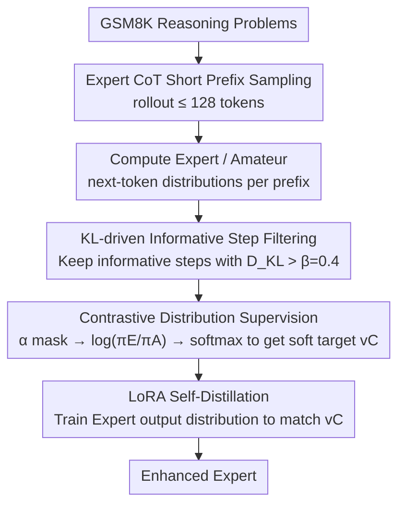

# LightReasoner: Can Small Language Models Teach Large Language Models Reasoning?

**Conference**: ACL 2026  
**arXiv**: [2510.07962](https://arxiv.org/abs/2510.07962)  
**Code**: https://github.com/HKUDS/LightReasoner  
**Area**: Model Compression / LLM Reasoning / Efficient Fine-tuning  
**Keywords**: Small model teacher, reasoning distillation, KL divergence, selective fine-tuning, LoRA

## TL;DR
LightReasoner uses the token distribution difference between a weaker Amateur model and a stronger Expert model to automatically identify high-value reasoning steps. It then performs contrastive self-distillation only on these steps, allowing mathematical reasoning models to match or exceed SFT performance while significantly reducing sampling, training time, and tuning tokens.

## Background & Motivation
**Background**: A common route to enhance the mathematical reasoning capabilities of LLMs is rejection-sampling SFT: first, the model generates multiple reasoning trajectories, correct trajectories are filtered using answers or verifiers, and then the entire trajectory is used as supervised data for fine-tuning. This approach is direct, effective, and compatible with reasoning enhancement paradigms like Chain-of-Thought and RFT.

**Limitations of Prior Work**: Rejection SFT is extremely costly. It requires the full generation of candidate solutions, filtering using ground truth or external verifiers, and optimizes all tokens along the reasoning chain equally. The paper points out that many tokens are merely routine connectors or low-information steps; the points that truly determine the success or failure of reasoning are often a few critical turning points. Therefore, full-trajectory training wastes computational resources on low-return tokens.

**Key Challenge**: Strong models already possess partial latent reasoning capabilities, but existing training signals often rely on external answers or human-constructed data. On the other hand, while weak models lack capability, they can expose "where things go wrong" under the same prefix. The key challenge of this paper is: how to identify the reasoning moments where the Expert model truly has an advantage over the Amateur model without using labels or complete trajectories.

**Goal**: The authors aim to construct a verifier-free reasoning enhancement framework that automatically localizes high-value tokens, trains the Expert only on these tokens, and ensures the training signal is not just the Expert's own one-hot output, but a distribution reflecting the Expert's advantage relative to the Amateur.

**Key Insight**: The authors observe the next-token distribution of the Expert and Amateur under the same prefix. If the two are highly consistent, the token is likely a routine step. If the KL divergence suddenly spikes, it may correspond to critical reasoning points such as arithmetic operations, logical transitions, or intermediate conclusions. The paper also provides statistics: approximately 60% of tokens have a KL in $[0.0, 0.1)$, and only about 20% exceed 0.4; when the Expert and Amateur top-1 are inconsistent, the average KL is 1.99, compared to 0.166 when the top-1 is consistent.

**Core Idea**: Use the Expert-Amateur distribution difference as a substitute for human labels and full-trajectory SFT, turning the weak model into a "negative reference" to distill only the most obvious reasoning advantages of the Expert relative to the Amateur.

## Method
LightReasoner can be understood as a selective self-distillation for reasoning models. It does not have the small model generate answers for the large model directly, nor does it perform dual-model contrastive decoding during inference. Instead, it compares the token distributions of both during the data construction phase and converts high-disparity steps into soft supervision.

### Overall Architecture
The input is a batch of reasoning problems; the main experiments use the GSM8K training set to generate supervised samples. For each problem, the Expert model first samples a short-prefix reasoning trajectory in a CoT manner, with the rollout length limited to 128 tokens. For each prefix $s_t$ on the trajectory, the Expert distribution $\pi_E(\cdot\mid s_t)$ and the Amateur distribution $\pi_A(\cdot\mid s_t)$ are calculated simultaneously.

The first stage is sampling and filtering: if $D_{KL}(\pi_E\|\pi_A)>\beta$, the step is considered an informative step. The second stage is constructing contrastive supervision: the contrastive score $\log \pi_E(a\mid s_t) / \pi_A(a\mid s_t)$ is calculated on a masked support set of high-confidence Expert tokens and then normalized into a soft target $v_C$. The third stage is fine-tuning: the same Expert is trained using LoRA to align its output distribution with $v_C$, thereby strengthening the reasoning decisions where the Expert already outperforms the Amateur.

### Key Designs

**1. KL-driven Informative Step Filtering: Localizing high-value tokens using divergence between strong and weak models**

Most tokens in a reasoning trajectory are merely conjunctions or low-information steps; spreading the training budget across all tokens is wasteful and dilutes key signals. LightReasoner compares the next-token distributions of the Expert and Amateur under the same prefix $s_t$, using the KL divergence $D_{KL}(\pi_E(\cdot\mid s_t)\|\pi_A(\cdot\mid s_t))$ as a proxy for whether the step is "worth training." A larger KL indicates a more pronounced difference in choice between the two models, often corresponding to bottleneck steps like arithmetic operations, symbolic transformations, or logical jumps. The main experiment sets a threshold $\beta=0.4$, and only steps exceeding this value are labeled as informative steps for subsequent training. Compared to fixed prefix lengths or manual rules, this divergence signal follows the actual difficulties of each trajectory—statistical data in the paper also supports its discriminative power: about 60% of tokens fall in $[0.0, 0.1)$, with an average KL of only 0.166 when top-1 matches, compared to 1.99 when top-1 differs.

**2. Contrastive Distribution Supervision: Training labels encode "where Expert is stronger than Amateur" rather than Expert’s one-hot output**

Using the Expert-generated tokens directly as hard labels loses distributional information and risks treating accidental Expert outputs as the sole truth. LightReasoner adopts a contrastive soft label: first, an $\alpha=0.2$ mask removes the low-probability tail of the Expert distribution, keeping only tokens satisfying $\pi_E(a\mid s_t)\geq\alpha\max_b\pi_E(b\mid s_t)$. On this support set, the contrastive score is calculated as $v'_C(a\mid s_t)=\log\pi_E(a\mid s_t)/\pi_A(a\mid s_t)$, which is then normalized via softmax into the soft target $v_C$. This target emphasizes the Expert's advantage margin over the Amateur rather than absolute confidence, preserving the distribution shape while mitigating low-confidence noise. Ablations show this step is critical: removing contrastive supervision drops the average score from 54.0 to 44.8.

**3. Short Rollout and LoRA Self-Distillation: Compressing supervision construction and fine-tuning to low cost**

Generating full long answers is not only expensive but also subjects later tokens to error propagation, producing false-positive "high-value" steps. LightReasoner therefore limits the sampling rollout to the first 128 tokens—the paper posits that early reasoning steps are more stable, whereas later steps are easily led astray by preceding errors. During the fine-tuning phase, the same Expert is reused and trained with LoRA for 1000 steps, with 16 contrastive supervision samples per step. The loss aims to match the Expert's output to $v_C$. The combination of short rollouts, selective tokens, and lightweight LoRA allows LightReasoner to use significantly fewer sampled questions and tuned tokens than rejection SFT.

### Loss & Training
The training objective is to align the Expert's output distribution with the contrastive supervision $v_C$: $\mathcal{L}(s_t)=D_{KL}(v_C(\cdot\mid s_t)\|\pi_E(\cdot\mid s_t))$. Since $v_C$ is a constant with respect to the current training parameters, this target is equivalent to $-\sum_a v_C(a\mid s_t)\log\pi_E(a\mid s_t)$. In the experiments, Experts include Qwen2.5-Math-1.5B/7B, Instruct versions, and DeepSeek-R1-Distill-Qwen-1.5B, while the Amateur is fixed as Qwen2.5-0.5B.

## Key Experimental Results

### Main Results
The main results use zero-shot pass@1 or the corresponding evaluation settings stated in the text, covering 7 mathematical reasoning benchmarks. The table below extracts AVG and several representative models, showing that LightReasoner exceeds or approaches rejection SFT on most models.

| Expert Model | Method | GSM8K | MATH | SVAMP | ASDiv | MMLU STEM | AVG |
|--------|------|------|------|-------|-------|-----------|-----|
| Qwen2.5-Math-1.5B | Baseline | 42.5 | 34.2 | 68.8 | 68.1 | 49.8 | 42.4 |
| Qwen2.5-Math-1.5B | SFT | 69.2 | 57.1 | 64.1 | 70.2 | 47.7 | 50.1 |
| Qwen2.5-Math-1.5B | LightR | 70.6 | 59.3 | 76.0 | 79.8 | 54.9 | 54.2 |
| DeepSeek-R1-Distill-Qwen-1.5B | Baseline | 75.2 | 54.2 | 79.9 | 84.9 | 22.3 | 50.3 |
| DeepSeek-R1-Distill-Qwen-1.5B | SFT | 78.2 | 60.3 | 81.5 | 87.4 | 26.2 | 53.3 |
| DeepSeek-R1-Distill-Qwen-1.5B | LightR | 79.5 | 60.2 | 83.5 | 87.5 | 26.2 | 55.9 |
| Qwen2.5-Math-7B | Baseline | 57.5 | 51.8 | 67.9 | 72.7 | 69.8 | 50.0 |
| Qwen2.5-Math-7B | SFT | 64.4 | 63.3 | 76.2 | 76.6 | 68.5 | 54.5 |
| Qwen2.5-Math-7B | LightR | 67.9 | 57.8 | 77.2 | 80.6 | 70.5 | 54.7 |

### Ablation Study
Ablations on Qwen2.5-Math-1.5B step-by-step remove step selection and contrastive supervision. The full LightReasoner achieves an average of 54.0, higher than the 50.6 of rejection SFT; removing contrast drops the average to 44.8, indicating that contrastive supervision is more critical than mere token filtering.

| Configuration | GSM8K | MATH | SVAMP | ASDiv | Minerva Math | Olympiad Bench | AVG |
|------|------|------|-------|-------|--------------|----------------|-----|
| Baseline | 42.5 | 34.2 | 68.8 | 68.1 | 9.9 | 23.7 | 41.2 |
| Rejection SFT | 69.2 | 57.1 | 64.1 | 70.2 | 15.1 | 27.6 | 50.6 |
| GT Supervision | 43.4 | 34.8 | 70.4 | 69.7 | 10.2 | 19.8 | 41.4 |
| Full LightReasoner | 70.6 | 59.3 | 76.0 | 79.8 | 11.4 | 27.1 | 54.0 |
| W/o step selection, w/ contrast | 67.6 | 58.8 | 78.7 | 80.5 | 11.0 | 26.4 | 53.8 |
| W/ step selection, w/o contrast | 62.0 | 53.1 | 56.6 | 61.0 | 10.7 | 25.5 | 44.8 |
| Both removed | 55.5 | 50.2 | 50.0 | 65.4 | 10.4 | 24.0 | 42.6 |

### Key Findings
- Efficiency data shows that while SFT on Qwen2.5-Math-1.5B requires 4.0h, 3952 questions, and 1.77M tuned tokens, LightReasoner only needs 0.5h, 1000 questions, and 0.02M tuned tokens, with the average gain increasing from +7.7% to +11.8%.
- On Qwen2.5-Math-7B, SFT takes 9.5h, 6029 questions, and 2.20M tokens, while LightReasoner takes 0.75h, 1000 questions, and 0.02M tokens, with similar or slightly higher average gains.
- Overall, the paper reports up to a 28.1% accuracy improvement while saving approximately 90% of time, 80% of sampled problems, and 99% of tuned tokens.
- Mechanism analysis indicates that a suitable capability gap between Expert and Amateur makes the contrastive signal more effective; if the Amateur is close to or stronger than the Expert, benefits diminish or regress.

## Highlights & Insights
- The ingenuity of LightReasoner lies in flipping the "weak model" from a student in traditional distillation to a reference for identifying the strong model's advantages. It doesn't have the small model teach the large model answers; it has the small model expose its own failures, thereby reminding the large model which tokens are most worth strengthening.
- The method ports the idea of contrastive decoding from inference time to training time. This retains the benefits of Expert-Amateur contrast while avoiding the latency and memory overhead of running dual models during each inference.
- Evidence for selective token training is substantial: the KL distribution, top-1 divergence, ablation tables, and efficiency metrics all point to the same conclusion—reasoning ability is not uniformly distributed across a trajectory but concentrated in a few high-leverage decision points.
- The insight for model compression and efficient fine-tuning is that compression doesn't necessarily only mean migrating knowledge from large to small models; it can also involve using the failure modes of small models to reversely improve the training efficiency of large models.

## Limitations & Future Work
- The paper primarily evaluates mathematical reasoning, including GSM8K, MATH, SVAMP, ASDiv, Minerva Math, Olympiad Bench, and MMLU STEM; whether it is equally effective in fields like code reasoning, tool calling, or open-ended planning remains to be verified.
- The Expert-Amateur pairing relies on a suitable capability gap. Too small a gap leads to insufficient contrastive signals, while a negative gap might even mislead the Expert. Thus, automated Amateur selection or dynamic pairing adjustment is a key future problem.
- $\alpha$ mask and $\beta$ filtering are additional hyperparameters. Although the paper provides defaults ($\alpha=0.2, \beta=0.4$), different tasks and model families may require re-tuning.
- The experiments cover small- to medium-scale open-source models; scalability to larger closed-source models or stronger reasoning models has not yet been demonstrated.

## Related Work & Insights
- **vs rejection SFT / RFT**: SFT relies on full trajectories and answer verification. This method constructs supervision using only distribution differences of short prefixes, offering lower costs and independence from ground truth, though it requires access to the logits of both models.
- **vs Contrastive Decoding**: CD runs both Expert and Amateur during inference. This method distills the contrastive signal into the Expert, avoiding dual-model overhead at inference but requiring extra sampling and distribution calculation before training.
- **vs RHO-1 / selective token training**: Methods like RHO-1 focus on token learning value. LightReasoner differs by defining token value based on the domain capability gap of models from the same family, without needing an external reference scorer.
- **Insights for future work**: The Expert-Amateur KL could be used as a general "learning value probe" for constructing local supervision in code repair, tool planning, or multimodal reasoning.

## Rating
- Novelty: ⭐⭐⭐⭐⭐ Reversely enhancing strong models using weak model failure modes is a highly distinct perspective.
- Experimental Thoroughness: ⭐⭐⭐⭐ Covers 5 Experts and 7 math benchmarks with clear ablations, though cross-domain verification is lacking.
- Writing Quality: ⭐⭐⭐⭐ Methodological motivation and efficiency arguments are clear, though some table layouts in the cached text are dense.
- Value: ⭐⭐⭐⭐⭐ Directly valuable for efficient reasoning fine-tuning, label-scarce scenarios, and selective training.

<!-- RELATED:START -->

## Related Papers

- [\[ACL 2026\] JudgeMeNot: Personalizing Large Language Models to Emulate Judicial Reasoning in Hebrew](judgemenot_personalizing_large_language_models_to_emulate_judicial_reasoning_in_.md)
- [\[AAAI 2026\] Efficient Reasoning for Large Reasoning Language Models via Certainty-Guided Reflection Suppression](../../AAAI2026/model_compression/efficient_reasoning_for_large_reasoning_language_models_via_certainty-guided_ref.md)
- [\[ICLR 2026\] Landscape of Thoughts: Visualizing the Reasoning Process of Large Language Models](../../ICLR2026/model_compression/landscape_of_thoughts_visualizing_the_reasoning_process_of_large_language_models.md)
- [\[ACL 2026\] GRASPrune: Global Gating for Budgeted Structured Pruning of Large Language Models](grasprune_global_gating_for_budgeted_structured_pruning_of_large_language_models.md)
- [\[ACL 2026\] TLoRA: Task-aware Low Rank Adaptation of Large Language Models](tlora_task-aware_low_rank_adaptation_of_large_language_models.md)

<!-- RELATED:END -->
