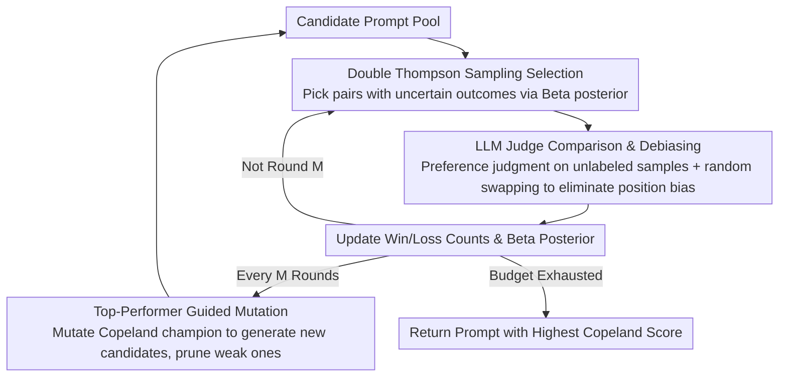

# LLM Prompt Duel Optimizer: Efficient Label-Free Prompt Optimization

**Conference**: ACL 2026 Findings  
**arXiv**: [2510.13907](https://arxiv.org/abs/2510.13907)  
**Code**: [GitHub](https://github.com/meta-llama/prompt-ops)  
**Area**: Model Compression  
**Keywords**: Automatic Prompt Optimization, Label-free optimization, Dueling Bandit, LLM Judge, Thompson Sampling

## TL;DR
This paper formalizes label-free prompt optimization as a dueling bandit problem and proposes the Prompt Duel Optimizer (PDO). By utilizing Double Thompson Sampling to efficiently select the most informative prompt pairs for comparison and combining it with a top-performer mutation strategy to expand the search space, PDO identifies stronger prompts with fewer judge calls on BBH and MS MARCO.

## Background & Motivation

**Background**: Automatic Prompt Optimization (APO) identifies high-performance instructions by iteratively generating and evaluating candidate prompts. Existing methods such as APE, OPRO, and Breeder have shown strong performance when labeled validation sets are available.

**Limitations of Prior Work**: The majority of APO methods rely on ground-truth labels to score candidate prompts. However, in practical deployment, acquiring large-scale labeled data is costly and slow. For instance, in industrial scenarios, users often need to deploy LLM classification services before large-scale human annotation is completed, necessitating label-free prompt optimization solutions.

**Key Challenge**: In label-free scenarios, an LLM can serve as a judge for pairwise preference comparisons, but this faces two issues: (1) LLM judges are noisy due to invocation uncertainty, position bias, and verbosity bias; (2) The overhead of pairwise comparisons scales quadratically with the number of candidates, making exhaustive search infeasible.

**Goal**: To efficiently find the optimal prompt under a restricted judge budget by minimizing the number of comparisons while addressing judge noise.

**Key Insight**: Model prompt selection as a dueling bandit problem, leveraging Bayesian sampling strategies to concentrate comparisons on the most informative prompt pairs, while simultaneously exploring new prompts via mutation strategies.

**Core Idea**: Use Double Thompson Sampling for efficient pairwise selection and top-performer guided mutation to expand the search space, unifying two layers of optimization (identifying the best within the pool and exploring outside the pool) into a single framework.

## Method

### Overall Architecture
In each round, PDO: (1) Uses D-TS to select the two prompts most worthy of comparison from the candidate pool; (2) Conducts pairwise comparisons using an LLM judge on a batch of unlabeled samples and records wins/losses; (3) Mutates the current Copeland champion every $M$ rounds to generate new candidates for the pool. Finally, it returns the prompt with the highest Copeland score.

### Key Designs

**1. Double Thompson Sampling (D-TS) Prompt Selection: Focusing limited budget on "undecided" key duels**

In label-free scenarios, every comparison incurs a judge call cost. Since pairwise comparisons grow quadratically with candidates, exhaustive evaluation is impossible. PDO maintains a Beta posterior $\theta_{ij}\sim\text{Beta}(W_{ij}+1,W_{ji}+1)$ for the win rate of each prompt pair $(p_i,p_j)$. In each round, it selects a pair in two steps: first, it filters the pool via optimistic Copeland scores and uses Thompson sampling to pick the first prompt; then, it samples the second prompt from "uncertain opponents." This concentrates comparisons on pairs where the winner is not yet clear, theoretically providing $O(K^2 \log T)$ Copeland regret. Compared to random pairing or UCB, Bayesian sampling is more flexible in characterizing uncertainty.

**2. Top-Performer Guided Mutation: Allowing the search to jump out of fixed pools toward optimal regions**

D-TS can only find the best within a given pool. To reach superior prompts outside the pool, PDO retrieves the current Copeland champion every $M$ rounds and generates variants through template editing, text gradient guidance, or LLM rewriting. This gradually focuses the search on better regions near the champion, similar to the zooming-in strategy in Lipschitz bandits. D-TS handles efficient selection within the pool, while mutation handles exploration outside, allowing the two-layered optimization to progress continuously.

**3. LLM Judge Design and Debiasing: Ensuring reliable label-free preference signals**

The framework's performance depends on the reliability of the LLM judge's preference signals. PDO designs different protocols for various tasks: multiple-choice tasks use "Dual-judgment" (selecting the correct answer when choices differ, comparing reasoning quality when choices are identical); open-ended tasks are scored across four dimensions: accuracy, completeness, relevance, and clarity. To mitigate position bias, the order of the two outputs is randomly swapped for every comparison. This protocol ensures that the sampling strategies receive clean preference signals.

### Loss & Training
PDO does not involve model training but is a black-box optimization framework. The core objective is to maximize the Copeland score: $C(i) = |\{j \neq i : \mu(i,j) > \frac{1}{2}\}|$.

## Key Experimental Results

### Main Results

| Dataset | Metric | PDO | SPO | CoT | PoS | Gain |
|--------|------|-----|-----|-----|-----|------|
| BBH (16 Tasks) | Best Task Count | **13/16** | 1/16 | 1/16 | 2/16 | Dominant Win |
| BBH-Tracking7 | Accuracy | 0.641 | 0.543 | 0.532 | 0.538 | +9.8pp |
| BBH-Web of Lies | Accuracy | 0.942 | 0.818 | 0.796 | 0.861 | +8.1pp |
| BBH-Navigate | Accuracy | 0.900 | 0.874 | 0.878 | 0.866 | +2.2pp |
| MS MARCO (4 Tasks) | Convergence Speed | Fastest | Slower | - | - | Surpasses baseline in few rounds |

### Ablation Study

| Configuration | Effect | Description |
|------|------|------|
| D-TS Sampling | Best Convergence | Finds high-quality prompts faster than RUCB and Random |
| RUCB replacing D-TS | Slower Convergence | UCB strategies are less flexible than Bayesian sampling |
| Random Sampling | Slowest Convergence | Random pairing wastes judge budget |
| Cross-model Validation | Robust Results | PDO maintains its advantage when re-evaluated with different judge models |

### Key Findings
- D-TS sampling efficiency significantly outperforms RUCB and random sampling, surpassing the SPO baseline within a few rounds on MS MARCO.
- PDO performs well even in labeled settings, proving that the discovered prompts are high-quality and not just optimized for a specific evaluation method.
- Judge noise correlates with task difficulty—judgments are more reliable for simple tasks (e.g., Navigate) than for complex ones (e.g., Geometric Shapes).
- Cross-family judge validation indicates that PDO's advantage does not depend on a specific judge model.

## Highlights & Insights
- **Novel Dueling Bandit Perspective**: Converting prompt optimization from "point-wise scoring" to "pairwise comparison" naturally fits the output format of LLM judges and avoids calibration issues associated with absolute scores.
- **Separation of Two-Layer Optimization**: D-TS handles efficient identification within the pool, while mutation handles exploration outside. This clear division is theoretically grounded and effective.
- **High Practicality**: Requires zero labeled data, making it ideal for the cold-start phase of industrial deployments. The code is open-sourced in Meta’s prompt-ops repository.

## Limitations & Future Work
- Dependency on LLM judge quality—if the judge lacks capability for a specific task, PDO's effectiveness may diminish.
- The mutation strategy is currently relatively simple (LLM rewriting); more structured prompt space search might yield further improvements.
- Computational scalability for extremely large candidate pools has not been fully discussed, as Copeland score calculation grows linearly with pool size.
- In scenarios with extreme noise, D-TS convergence guarantees may be insufficient, requiring more robust statistical tests.

## Related Work & Insights
- **vs SPO (Xiang et al. 2025)**: SPO also uses LLM judges for label-free optimization but adopts a simple iterative selection, lacking the sampling efficiency of bandit theory. PDO finds better prompts under the same budget.
- **vs OPRO (Yang et al. 2024)**: OPRO requires labeled validation sets and uses models to generate prompts directly rather than pairwise selection; the two approaches are complementary.
- **vs EvoPrompt (Fernando et al. 2023)**: EvoPrompt’s evolutionary strategy inspired PDO’s mutation mechanism, but EvoPrompt requires labeled data for fitness evaluation.

## Rating
- Novelty: ⭐⭐⭐⭐ The formalization of prompt optimization as a dueling bandit problem is elegant.
- Experimental Thoroughness: ⭐⭐⭐⭐ 16 BBH tasks + 4 MS MARCO tasks with multiple baselines and ablations.
- Writing Quality: ⭐⭐⭐⭐⭐ Theoretical motivation and experimental design are exceptionally clear.
- Value: ⭐⭐⭐⭐ Label-free prompt optimization addresses a real-world demand with a highly versatile framework.

<!-- RELATED:START -->

## Related Papers

- [\[CVPR 2026\] FOZO: Forward-Only Zeroth-Order Prompt Optimization for Test-Time Adaptation](../../CVPR2026/model_compression/fozo_forward-only_zeroth-order_prompt_optimization_for_test-time_adaptation.md)
- [\[ICLR 2026\] HiFo-Prompt: Prompting with Hindsight and Foresight for LLM-based Automatic Heuristic Design](../../ICLR2026/model_compression/hifo-prompt_prompting_with_hindsight_and_foresight_for_llm-based_automatic_heuri.md)
- [\[NeurIPS 2025\] Graph Your Own Prompt](../../NeurIPS2025/model_compression/graph_your_own_prompt.md)
- [\[ICCV 2025\] Achieving More with Less: Additive Prompt Tuning for Rehearsal-Free Class-Incremental Learning](../../ICCV2025/model_compression/achieving_more_with_less_additive_prompt_tuning_for_rehearsal-free_class-increme.md)
- [\[ACL 2025\] Prompt Candidates, then Distill: A Teacher-Student Framework for LLM-driven Data Annotation](../../ACL2025/model_compression/prompt_distill_teacher_student.md)

<!-- RELATED:END -->
