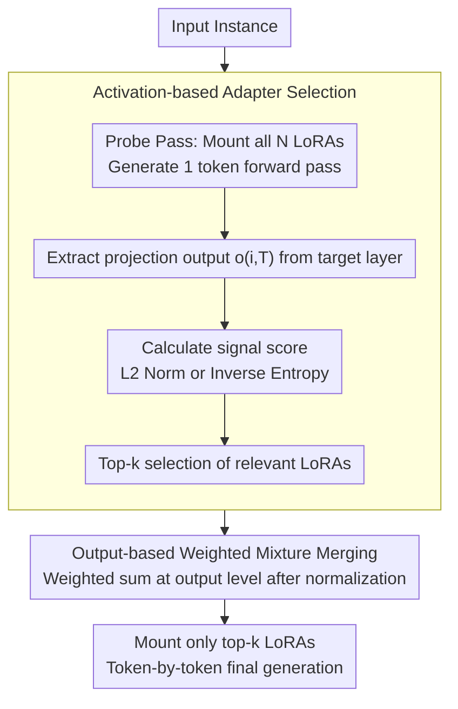

# LoRA on the Go: Instance-level Dynamic LoRA Selection and Merging

**Conference**: ACL 2026  
**arXiv**: [2511.07129](https://arxiv.org/abs/2511.07129)  
**Code**: [GitHub](https://github.com/archon159/LoGo)  
**Area**: Model Compression / Parameter-Efficient Fine-Tuning  
**Keywords**: LoRA Dynamic Selection, Multi-adapter Merging, Training-free Framework, Instance-level Adaptation, PEFT

## TL;DR

LoGo (LoRA on the Go) is proposed as a training-free framework that extracts LoRA activation signals (norm or entropy) via a single forward pass to dynamically select and merge the most relevant LoRA adapters at the instance level, enabling cross-task generalization without labeled data or additional training.

## Background & Motivation

**Background**: LoRA, as a parameter-efficient fine-tuning method, has been widely applied for task-specific adaptation of Large Language Models (LLMs). However, a single LoRA adapter is typically trained for a specific task, limiting its applicability in real-world scenarios where user queries span multiple domains (e.g., summarization, translation, programming). Utilizing multiple LoRA adapters simultaneously to handle heterogeneous inputs remains a critical challenge.

**Limitations of Prior Work**: Existing multi-LoRA methods rely on additional labeled data or task-specific training. LoRAHub requires learning fixed combination weights from labeled samples of the target distribution. LoRARetriever trains a retrieval model to select relevant LoRAs but still depends on labeled data to compute retrieval embeddings. This dependence on labeled data and task homogeneity severely limits scalability—in practical deployments, LoRA pools evolve dynamically (adding or retiring adapters), and collecting labeled data is costly.

**Key Challenge**: How to dynamically select appropriate LoRA adapters for each input instance without labeled data or retraining, especially when facing a dynamically evolving LoRA pool and highly heterogeneous inputs?

**Goal**: To design a completely training-free, instance-level LoRA selection and merging framework that adapts instantly to each input and supports the dynamic addition or removal of LoRA adapters.

**Core Idea**: LoRA activations themselves encode relevance signals—when a LoRA is highly relevant to an input, its low-rank projection output produces stronger activations (larger norms or lower entropy). These signals can be extracted in a single forward pass without any additional training.

## Method

### Overall Architecture

The workflow of LoGo consists of three steps: (1) **Probe Pass**: All LoRA adapters are mounted onto the base model, a single forward pass is executed for the input, and the projection outputs of each LoRA are extracted from a specified Transformer layer; (2) **Selection**: The top-k most relevant adapters are selected based on the extracted signal scores (norm or inverse entropy); (3) **Merging**: The selected adapters are combined using an output-level mixture weighted by the signal scores to generate the final output.

### Key Designs

**1. Activation-based Adapter Selection: Identifying relevance via a single forward pass**

Existing multi-LoRA methods (e.g., LoRAHub for combination weights, LoRARetriever for retrieval models) rely on labeled data and training, making them difficult to scale with dynamic LoRA pools. The key insight of LoGo is that when a LoRA is highly relevant to the input, its low-rank projection activation is stronger. By mounting all LoRAs on the base model for one forward pass and extracting the projection output $\mathbf{o}_{i,T}=\Delta\mathbf{W}_{i,T}^{(Q)}\mathbf{h}_T$ from the target Transformer layer $B_T$, the signal score can be calculated using either the $\ell_2$ norm $s_i=\|\mathbf{o}_{i,T}\|_2$ (larger norm indicates stronger activation) or inverse entropy $s_i=(-\sum_j p_{i,T}^{(j)}\log p_{i,T}^{(j)})^{-1}$ (lower entropy indicates more concentrated response). The top-k adapters are then selected: $\mathcal{S}=\operatorname{TopK}(\{(L_i,s_i)\}_{i=1}^N,k)$. Experiments show these signals exhibit clear block-diagonal patterns—LoRAs for similar tasks activate similarly on related data, providing a natural training-free routing signal.

**2. Mixture Merging: Output-level combination without parameter modification**

After selecting the top-k adapters, they must be integrated. LoGo performs weighted mixing directly at the output level: signal scores are normalized into weights $\tilde{w}_i=s_i/\sum_{j\in\mathcal{S}}s_j$, followed by a weighted sum $\mathbf{o}_{\text{merge}}=\sum_{i\in\mathcal{S}}\tilde{w}_i\mathbf{o}_{i,T}$. Implementation only requires adjusting the scaling factors of selected adapters without rewriting or reloading parameter matrices. Compared to parameter-level Fusion, which requires recomputing and reloading merged weights at each step, output-level Mixture avoids this overhead and is better suited for real-time deployment. Ablations show that Mixture outperforms Fusion in both efficiency and performance.

**3. Probe Pass Efficiency Optimization: Minimizing overhead for large-scale pools**

For instance-level selection across a pool of hundreds of LoRAs, the detection phase must not be a bottleneck. The probe pass in LoGo only generates a single token, which is sufficient to calculate signal scores. Subsequent token-by-token generation only uses the selected $k$ adapters. For tasks with long outputs (e.g., summarization, chain-of-thought), this one-time probe overhead is amortized across many tokens, allowing actual throughput to remain competitive with baseline methods.

### Loss & Training

LoGo itself is entirely training-free. In experiments, LoRA pools were trained for three model families on 260 tasks from FLANv2 (one LoRA per task) to serve as the candidate adapter library for selection and merging.

## Key Experimental Results

### Main Results

Evaluations across 5 NLP benchmarks, 27 datasets, and 3 model families (LLaMA-3.1-8B, Qwen-2.5-7B, DeepSeek-LLM-7B):

| Task Type | # Datasets | LoGo vs LoRAHub | LoGo vs LoRARetriever | LoGo vs Adapter Soup |
|---------|---------|----------------|---------------------|-------------------|
| BBH | 8 | Superior (38.3 vs 37.0) | Comparable (38.3 vs 40.4) | Comparable (38.3 vs 42.5) |
| Translation | 6 | Significantly Superior (BLEU +3-5) | Comparable | Comparable |
| Struct-to-Text | 4 | Significantly Superior (+3.6%) | Superior | Superior |
| Closed-Book QA | 3 | Superior | Comparable | Comparable |
| NLI | 6 | Significantly Superior (+3.6%) | Superior | Superior |

| Throughput Comparison | LoRARetriever | LoGo (Norm) | LoGo (Entropy) |
|-----------|--------------|-------------|----------------|
| Relative to Base Model | ~0.95x | ~0.90x | ~0.88x |

### Ablation Study

- **Signal Type**: Norm and Entropy signals show relative strengths across different tasks, with Norm being overall more stable.
- **Top-k Selection**: $k=5$ is optimal in most settings; too few ($k=1$) lacks information, while too many ($k=50+$) introduces noise.
- **Target Layer Selection**: Layers in the mid-to-late range (e.g., layers 16-24 of a 32-layer model) perform best.
- **Mixture vs Fusion**: Output-level merging (Mixture) outperforms parameter-level merging (Fusion) in both efficiency and accuracy.

### Key Findings

- Without any training or labeled data, LoGo outperforms the training-based baseline (LoRAHub) by 3.6% on tasks like Struct-to-Text and NLI.
- LoRA activation signals exhibit a block-diagonal structure, confirming that similar tasks are naturally clustered semantically.
- In long-output tasks, the probe pass overhead is well-amortized, making the actual inference throughput comparable to baseline methods.
- Entropy signals outperform Norm on certain reasoning-intensive tasks, though Norm is generally more robust.

## Highlights & Insights

- **Zero-cost Adaptation**: The training-free design allows effortless handling of dynamic LoRA pool changes without additional overhead.
- **Simple yet Effective Signals**: Using only the norm or entropy of projection outputs effectively measures adapter relevance, embodying the insight that "LoRA activation itself is a selection signal."
- **Block-diagonal Activation Patterns**: Provides intuitive evidence for task semantic clustering in multi-LoRA scenarios, serving as an analytical tool for future research.
- **High Practicality**: The lack of requirements for labeled data or retraining, combined with dynamic scalability, makes it highly suitable for real-world deployment.

## Limitations & Future Work

- On reasoning-intensive tasks like BBH, LoGo lags behind certain training-required methods (e.g., Adapter Soup), possibly because reasoning requires more precise adapter combinations.
- The probe pass requires mounting all LoRAs; for extremely large pools (e.g., 1000+), memory and computation overhead may become a bottleneck.
- Extracting signals from only a single layer may miss complementary information from other layers.
- Entropy signals on DeepSeek models are unstable (performance drops near zero on some tasks), requiring improvements in signal robustness.

## Related Work & Insights

- **vs LoRAHub**: LoRAHub learns fixed merging weights for each new task requiring labeled data; LoGo dynamically selects at the instance level and is entirely training-free.
- **vs LoRARetriever**: LoRARetriever trains a retrieval model and depends on data samples and embedding spaces; LoGo is more lightweight by directly utilizing the activation signals of LoRAs.
- **vs Mixture of Experts (MoE)**: LoGo can be viewed as a training-free sparse MoE mechanism where LoRAs are "experts" and activation signals serve as the "router."

## Rating

- Novelty: ⭐⭐⭐⭐ The insight that "LoRA activation is the selection signal" is novel, and training-free instance-level selection is a significant practical innovation.
- Experimental Thoroughness: ⭐⭐⭐⭐⭐ 5 benchmarks, 27 datasets across 3 model families provide extensive coverage, supplemented by comprehensive ablations.
- Writing Quality: ⭐⭐⭐⭐ Clear structure, well-defined motivation, and complete mathematical derivations.
- Value: ⭐⭐⭐⭐ Highly practical for multi-LoRA deployment scenarios, though there is room for improvement in reasoning tasks.

<!-- RELATED:START -->

## Related Papers

- [\[ACL 2026\] Evolutionary Negative Module Pruning for Better LoRA Merging](evolutionary_negative_module_pruning_for_better_lora_merging.md)
- [\[ICLR 2026\] TiTok: Transfer Token-level Knowledge via Contrastive Excess to Transplant LoRA](../../ICLR2026/model_compression/titok_transfer_token-level_knowledge_via_contrastive_excess_to_transplant_lora.md)
- [\[CVPR 2026\] SG-LoRA: Semantic-guided LoRA Parameters Generation](../../CVPR2026/model_compression/sg-lora_semantic-guided_lora_parameters_generation.md)
- [\[CVPR 2025\] IterIS: Iterative Inference-Solving Alignment for LoRA Merging](../../CVPR2025/model_compression/iteris_iterative_inference-solving_alignment_for_lora_merging.md)
- [\[ICLR 2026\] LD-MoLE: Learnable Dynamic Routing for Mixture of LoRA Experts](../../ICLR2026/model_compression/ld-mole_learnable_dynamic_routing_for_mixture_of_lora_experts.md)

<!-- RELATED:END -->
