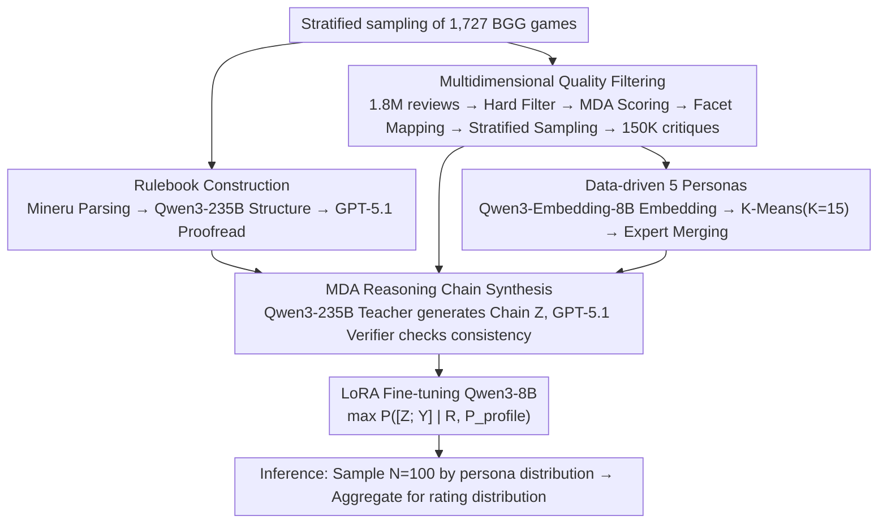

# MeepleLM: A Virtual Playtester Simulating Diverse Subjective Experiences

**Conference**: ACL 2026  
**arXiv**: [2601.07251](https://arxiv.org/abs/2601.07251)  
**Code**: https://github.com/leroy9472/MeepleLM  
**Area**: Human-AI Collaboration / LLM Simulation / Board Game Design  
**Keywords**: Virtual Playtesting, MDA Reasoning, Persona Simulation, board game, persona-conditional fine-tuning

## TL;DR
The authors develop a "virtual playtester" for board game designers. By providing official rulebooks and five distinct player personas to a fine-tuned Qwen3-8B (MeepleLM), the system performs three-step reasoning via the Mechanics→Dynamics→Aesthetics (MDA) framework to generate ratings and reviews. Across 207 games, MeepleLM outperforms GPT-5.1 and Gemini3-Pro in community distribution alignment (Wasserstein 0.22 vs. GPT-5.1's 0.95), content diversity (Div 4.34 vs. 4.26), and Opinion Recovery (69.77 vs. 63.44), while achieving over 70% preference in blind A/B testing.

## Background & Motivation
**Background**: LLMs have been utilized for various board game tasks, including chess agents, role-playing, social simulation, mechanism generation, and rule-to-code synthesis (Code World Models). However, as a "co-designer," no existing system provides feedback based on **actual player experiences**; they are limited to rule validation or balancing via self-play (e.g., RuleSmith).

**Limitations of Prior Work**: (1) Feeding rulebooks to general LLMs (GPT-5.1, Gemini3) for reviews results in severe **central tendency bias**, where all games receive average scores of 7-8, failing to capture the polarization of player communities. (2) General LLM reviews sound like marketing copy (e.g., "social WD-40") rather than actual community jargon (e.g., "alpha gamer," "variant rules," "roll-and-move hell"). (3) Existing player simulations either use classifiers to learn objective features (such as a failed DeBERTa case misclassifying "house rules" as System Purist when it was a Thrill Seeker adjusting variance) or rely on forward-model playtesting (which requires individual game engines and cannot scale).

**Key Challenge**: (a) **Static Rules ↔ Emergent Experience**: Rulebooks are "code," but "fun" is a causal chain that emerges at runtime; LLMs cannot execute rules without a game engine. (b) **Average Consensus ↔ Subjective Heterogeneity**: The same mechanic yields opposite reactions from different players (e.g., high randomness excites a Socializer but frustrates a Strategist); "one-size-fits-all" evaluations are useless for design.

**Goal**: (1) Construct a dataset of 1,727 rulebooks and 150K high-quality reviews covering significant breadth and quality. (2) Explicitly model the "rule-to-experience" causal chain as a CoT using the classical Mechanics-Dynamics-Aesthetics (MDA) game design theory. (3) Data-drivenly cluster five player personas from 1.8M raw reviews. (4) Use persona-conditional instruction tuning to internalize persona-specific reasoning in Qwen3-8B.

**Key Insight**: The authors observe that the MDA framework (Hunicke 2004) is originally a causal model of "how mechanics trigger dynamics and how dynamics produce aesthetics." Using it as a CoT template allows the LLM to externalize implicit reasoning into three verifiable steps.

**Core Idea**: `[Rule, Persona] -- MDA CoT --> Critique`. The persona is not a mere label but a full semantic profile written into the system prompt, forcing the model to use the persona as a contextual prior to modulate the Dynamics→Aesthetics transition.

## Method

### Overall Architecture

MeepleLM addresses a specific question: given a rulebook, what rating **distribution** and reviews will the actual player community produce, while preserving the polarization seen across different personas? Since LLMs lack a game engine, the strategy is to synthesize high-quality training data using large models and then distill the "rule-to-experience" causal reasoning into an 8B student model.

The pipeline consists of four steps. The first three involve data construction: 1,727 BGG board games are stratified and sampled; PDF parsing (Mineru), structuralization (Qwen3-235B), and proofreading (GPT-5.1) produce clean standard rulebooks. Simultaneously, 1.8M raw reviews are filtered into 150K high-density critiques. These are embedded using Qwen3-Embedding-8B and clustered via K-Means into 5 expert-refined player personas. Finally, Qwen3-235B acts as a teacher to synthesize an MDA reasoning chain $Z$ for each (rule, persona, review) triplet, verified for consistency by GPT-5.1. The fourth step is training: LoRA fine-tuning on Qwen3-8B to maximize the joint likelihood $P([Z; Y] \mid R, P_{profile})$.

### Key Designs

**1. Multidimensional Quality Filtering + Stance Distribution Fidelity: Extracting 150K useful critiques from 1.8M noisy samples**

Raw reviews often include noise such as brief comments, off-topic remarks, or contradictions between ratings and text. The authors apply four filter layers: 1) Hard Filter for trash removal; 2) **MDA Scoring** across three 1-5 dimensions—mechanism\_anchoring, causal\_attribution, and constructiveness—using few-shot prompts to decouple dimensions and avoid the halo effect; 3) Facet Identification to map reviews to 8 topics (Rule Clarity, Cognitive Load, etc.); 4) Coverage-max stratified sampling to maximize facet diversity while maintaining the original rating distribution (Pearson $r=0.92$).

**2. Data-driven 5 Personas + Semantic Profiles in System Prompts: Replacing symbolic labels with commonsense interpolation**

Subjective heterogeneity is central to board game evaluation. The authors use a Cluster-then-Refine approach: embedding reviews (text + logic scores + facets) with Qwen3-Embedding-8B and applying K-Means ($K=15$). Personas were derived by GPT-5.1 profiling and expert merging into 5 types: System Purist, Efficiency Essentialist, Narrative Architect, Social Lubricator, and Thrill Seeker.

Crucially, the persona $P$ is not a label token but a full semantic profile describing core values and preferences within the system instruction. This allows the LLM to use its own commonsense to interpolate persona dimensions, generalizing to subtle preference combinations outside the training set.

**3. MDA-Guided Reasoning: Bridging the "Rule-to-Experience" gap with a three-step causal chain**

General LLMs often jump from the rulebook $R$ to the review $Y$, resulting in surface emotions and central tendency bias. By adopting MDA theory—Mechanics (objective rules) → Dynamics (runtime interaction) → Aesthetics (subjective emotion)—the authors format the causal chain as an explicit CoT: Step 1 grounds the critique in specific rule components; Step 2 infers runtime behaviors; Step 3 synthesizes the emotional response modulated by persona $P$, formalized as $[R, P] \xrightarrow{Z_{MDA}} Y$.

### A Complete Example: Generating a Rating Distribution for a New Game

Take a new board game characterized by "high-randomness card drawing + player take-that":

1.  **Input**: The standard rulebook $R$ and a specific persona profile $P_{profile}$ (e.g., Thrill Seeker: prefers high variance, dramatic reversals) are placed in the system prompt.
2.  **MDA Reasoning**: The model first lists the Mechanics (e.g., "draw 3 event cards," "discard to attack"). It then infers Dynamics (e.g., "frequent reversals," "leader targeted"). Finally, under the Thrill Seeker prior, it produces positive Aesthetics (e.g., "exciting," "gambler's rush") resulting in a high rating and community-flavored review.
3.  **Persona Resampling**: Changing to an "Efficiency Essentialist" (seeking optimal strategies), the same Dynamics are interpreted as "randomness drowning decisions," leading to a low rating.
4.  **Distribution Aggregation**: By sampling $N=100$ times based on the game's actual persona distribution, a **polarized** rating distribution is recovered rather than a flattened mean.

### Loss & Training
LoRA is applied to all linear layers via LLaMA-Factory. The objective is to maximize $L = -\sum_{t=1}^{|S|} \log P(s_t \mid s_{<t}, R, P_{profile})$, where $S = [Z; Y]$ is the concatenated sequence of the MDA reasoning chain and the critique. Teacher: Qwen3-235B; Student: Qwen3-8B. At inference, $N=100$ samples are aggregated according to the persona distribution.

## Key Experimental Results

### Main Results: 207 held-out games (Selected from Table 2)

| Model | MAE ↓ | Wasserstein ↓ | Kendall τ ↑ | Fact. ↑ | Dist-2 ↑ | Div. ↑ | Op-Rec ↑ |
|---|---|---|---|---|---|---|---|
| GPT-5.1 | 0.987 | 0.950 | 0.256 | **99.46** | 0.693 | 4.26 | 63.44 |
| Gemini3-Pro | 1.428 | 0.509 | 0.247 | 98.28 | 0.648 | 3.98 | 57.74 |
| Qwen3-235B | 1.229 | 0.635 | 0.145 | 98.95 | 0.657 | 3.56 | 54.27 |
| Qwen3-8B (backbone) | 0.891 | 1.012 | 0.049 | 97.88 | 0.594 | 1.58 | 11.39 |
| **MeepleLM (Ours)** | **0.658** | **0.221** | **0.282** | 98.86 | **0.712** | **4.34** | **69.77** |

The most critical comparison is the **Wasserstein distance (0.22 vs. GPT-5.1's 0.95)**. MeepleLM accurately recreates the polarized community distribution, whereas GPT-5.1 suffers from mode collapse.

### Ablation Study

| Configuration | MAE ↓ | WD ↓ | τ ↑ | Fact. ↑ | Div. ↑ | Op-Rec ↑ |
|---|---|---|---|---|---|---|
| **Full MeepleLM** | 0.658 | 0.221 | 0.282 | 98.86 | 4.34 | 69.77 |
| w/o MDA (No CoT) | 0.740 | 0.415 | 0.227 | 91.56 | 3.70 | 55.35 |
| w/o Persona (Generic prompt) | 0.789 | 0.363 | 0.135 | 92.13 | 3.56 | 53.84 |
| w/o Rulebook (Blind generation)| 0.704 | 0.550 | 0.003 | **59.87** | 3.30 | 9.99 |

### Key Findings
- **Rulebooks are critical for factual grounding**: Removing the rulebook causes Factuality to drop from 98.86 to 59.87.
- **Persona is key to Kendall $\tau$**: Without personas, $\tau$ drops by 52%, implying that ranking requires modeling subjective heterogeneity.
- **MDA is key to Opinion Recovery**: Removing MDA CoT causes Op-Rec to drop by 21%, proving that explicit causal reasoning helps surface distinct viewpoints.
- **Robustness to high-variance personas**: MeepleLM performs particularly well on "vibes-based" personas like Social Lubricator and Thrill Seeker.

## Highlights & Insights
- **Migration of MDA as a CoT template**: Using a domain theory (Mechanics → Dynamics → Aesthetics) as a generation template is an elegant "domain-theory-as-prompt" paradigm.
- **Central tendency bias in LLM evaluators**: The authors use Wasserstein distance to quantify this issue, cautioning that MAE alone overestimates general LLMs' evaluation capabilities.
- **Full profiles over labels**: The authors prove that using full semantic profiles in the prompt is superior to categorical labels, as it allows the model to leverage commonsense for nuanced preferences.

## Limitations & Future Work
- The system currently only processes text, ignoring visual cues from cards or boards.
- The 5 personas are coarse-grained and lack individual player differences.
- Future work: and individualized user models with long-term memory and multimodal grounding.

## Related Work & Insights
- **vs. LLM-as-judge (G-Eval)**: This work moves beyond static text quality to evaluate emergent experiences in interactive systems.
- **vs. Forward-Model Playtest**: Unlike engine-based simulations, this approach derives subjective experience directly from rules, offering a complementary perspective.
- **vs. Persona Modeling (Generative Agents)**: grounding personas in behavioral review data minimizes the risk of stereotyping compared to purely prompt-based personas.

## Rating
- Novelty: ⭐⭐⭐⭐☆ First systematic study of LLM-based board game evaluation.
- Experimental Thoroughness: ⭐⭐⭐⭐⭐ Extensive metrics (MAE/WD/$\tau$/etc.) and clear significance testing.
- Writing Quality: ⭐⭐⭐⭐☆ Clear narrative and intuitive case studies.
- Value: ⭐⭐⭐⭐☆ Directly applicable to board game design and transferable to HCI/UX evaluation.

<!-- RELATED:START -->

## Related Papers

- [\[ICML 2026\] SPEED-Bench: A Unified and Diverse Benchmark for Speculative Decoding](../../ICML2026/model_compression/speed-bench_a_unified_and_diverse_benchmark_for_speculative_decoding.md)
- [\[ICLR 2026\] Inheriting Generalizable Knowledge from LLMs to Diverse Vertical Tasks](../../ICLR2026/model_compression/inheriting_generalizable_knowledge_from_llms_to_diverse_vertical_tasks.md)
- [\[ACL 2026\] UKP_Psycontrol at SemEval-2026 Task 2: Modeling Valence and Arousal Dynamics from Text](ukp_psycontrol_at_semeval-2026_task_2_modeling_valence_and_arousal_dynamics_from.md)
- [\[ACL 2026\] A BERTology View of LLM Orchestrations: Token- and Layer-Selective Probes for Efficient Single-Pass Classification](a_bertology_view_of_llm_orchestrations_token-_and_layer-selective_probes_for_eff.md)
- [\[ACL 2026\] LoRA on the Go: Instance-level Dynamic LoRA Selection and Merging](lora_on_the_go_instance-level_dynamic_lora_selection_and_merging.md)

<!-- RELATED:END -->
