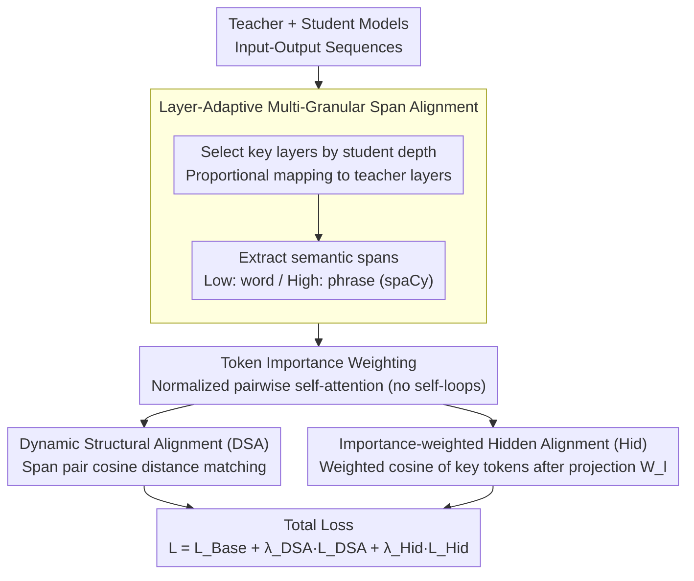

# MTA: Multi-Granular Trajectory Alignment for Large Language Model Distillation

**Conference**: ACL2026  
**arXiv**: [2605.01374](https://arxiv.org/abs/2605.01374)  
**Code**: No public code (repository link not provided in the paper)  
**Area**: Model Compression  
**Keywords**: Large Language Model Distillation, Trajectory Alignment, Hierarchical Semantics, Structural Distillation, Hidden State Alignment

## TL;DR
MTA advances LLM distillation from "aligning specific static layers" to "aligning representation evolution trajectories based on network depth": lower layers align word-level information, while higher layers align phrase-level relationship geometry. As a plug-in, it consistently improves the ROUGE-L performance of FDD, DistiLLM, and DistiLLM-2 on instruction-following tasks.

## Background & Motivation
**Background**: In LLM compression, knowledge distillation (KD) remains a primary approach. Typical methods involve matching the student model's output distribution to the teacher's, such as token-level KL divergence. Advanced methods align intermediate hidden states, attention maps, or feature dynamics between layers, allowing the student to learn internal representations rather than just final answers.

**Limitations of Prior Work**: Many intermediate distillation methods default to using a single alignment granularity across all layers. They typically perform hidden-state alignment at the token level or align prediction distributions after mapping selected layers to the vocabulary space. While simple, this ignores the functional specialization of Transformer layers: lower layers act as lexical and local pattern processors, while higher layers focus on abstract semantics and compositional reasoning.

**Key Challenge**: Student models must inherit internal teacher knowledge. However, teacher knowledge is not a set of independent layer snapshots but a representation trajectory that evolves with depth. Constraints using a uniform token-level target force both low-level lexical foundations and high-level phrase composition into the same supervisory signal, leading to imprecise knowledge transfer.

**Goal**: The paper aims to address three specific issues: first, enabling the student to learn the teacher's hierarchical evolution from lexis to semantic composition; second, selecting a small number of key layers for alignment across different parameter scales and model families; and third, integrating this alignment as a module into existing distillation frameworks without redesigning the entire KD process.

**Key Insight**: The authors draw on the hierarchical compositionality of language and findings from Transformer interpretability studies: language is composed of words forming phrases, where lower layers favor lexical and factual memory, and higher layers favor abstract semantics and complex subtasks. Consequently, distillation should adapt semantic units according to layer depth rather than relying solely on tokens.

**Core Idea**: Use layer-adaptive multi-granular span relationship alignment, where lower layers align word spans and higher layers align noun/verb phrase spans, allowing the student to replicate the teacher's trajectory of "how representation geometry changes with depth."

## Method
MTA is a module designed to augment existing LLM distillation methods. It does not replace original logit KD, FDD, or DistiLLM objectives but adds two additional constraints: Dynamic Structural Alignment (DSA) for aligning the relative geometric structure between spans, and Hidden Representation Alignment (Hid) for pulling student hidden states of key tokens closer to the teacher's.

### Overall Architecture
Given a teacher model and a smaller student model, MTA first selects a set of key layers based on the student's depth and identifies corresponding teacher layers using proportional mapping. For GPT-2 120M, the paper selects the 6th layer for word-level alignment and the 9th and 12th layers for phrase-level alignment; for Qwen1.5-0.5B and OPT-1.3B, more key layers are selected at greater depths.

At each selected layer, MTA extracts semantic spans from input-output sequences. Lower-layer spans are full words to preserve lexical grounding, while higher-layer spans are noun and verb phrases representing abstract compositional semantics, obtained via syntactic parsers like spaCy.

Next, MTA calculates importance weights for tokens. Since causal attention in auto-regressive models naturally biases towards early tokens, the authors estimate "to what extent each token is attended to by others" using normalized pairwise self-attention without self-loops. These teacher-side token weights are used for span aggregation and pairwise span weighting.

Finally, the total training objective combines the base distillation loss with two MTA terms: $L_{Total}=L_{Base}+\lambda_{DSA}L_{DSA}+\lambda_{Hid}L_{Hid}$. Here, $L_{Base}$ can be derived from FDD, DistiLLM, or DistiLLM-2, with $\lambda_{DSA}$ and $\lambda_{Hid}$ typically set to 2/0.2 or 3/0.3 in experiments.

### Key Designs

**1. Layer-Adaptive Multi-Granular Span Alignment: Switching supervision granularity with network depth to match Transformer functional specialization.**

Many intermediate distillation methods use a uniform alignment granularity, either token-level throughout or mapping every layer to the vocabulary space. However, Transformer layers have specialized roles: lower layers process lexical/local patterns, whereas higher layers handle abstract semantics/reasoning. MTA treats network depth as a trajectory from "lexical foundation to compositional semantics." It aligns lower layers with word spans (preserving lexical grounding) and higher layers with noun/verb phrase spans (representing abstract composition), extracted via syntactic parsers. Ablations show that mixed strategies outperform word-only or phrase-only strategies, proving the benefits of switching granularity.

**2. Dynamic Structural Alignment (DSA): Aligning relative geometry between spans rather than point-wise representation replication.**

Student and teacher hidden dimensions often differ, making direct vector matching difficult and unnecessary. DSA aligns **relational structures**: in each selected layer, span representations $U_{k,l}$ are computed via importance-weighted averaging of constituent token hidden states. The cosine distances between all span pairs in a layer are calculated. The objective minimizes the squared difference between student and teacher span-pair distances, weighted by the product of teacher-side span salience. This relative geometry better captures how the teacher organizes relations between semantic units, making DSA robust across teachers and students with different widths.

**3. Importance-weighted Hidden Representation Alignment (Hid): Directly pulling specific key token features closer, complementary to structure.**

While DSA manages relations between spans, it does not constrain specific feature values. MTA uses a complementary Hid term to align key token hidden states directly. To handle dimension mismatch, a linear projection $W_l$ is learned for each key layer to project student hidden states into the teacher's space. Weighted cosine distance is calculated only for tokens covered by extracted spans, using teacher-side token importance weights. This focuses the model on high-information tokens rather than low-contribution tokens like stop words or padding.

### Loss & Training
DSA focuses on intra-layer pairwise distance matching. For student layer $l$ and mapped teacher layer $\phi(l)$, the loss for span pair $(i,j)$ is $w_{ij}^{sp}(d(U^S_{i,l},U^S_{j,l})-d(U^T_{i,\phi(l)},U^T_{j,\phi(l)}))^2$, where $d$ is cosine distance and $w_{ij}^{sp}$ is the teacher-side span weight.

Hid performs weighted cosine alignment of projected token hidden states. Student representation $H^S_{t,l}$ is projected via $W_l$ to the teacher dimension and aligned with $H^T_{t,l}$. Weights are derived from teacher-side token importance, prioritizing high-information tokens.

Training is conducted on Dolly-15k, with evaluations on Dolly, SelfInst, VicunaEval, and Super-Natural Instructions. GPT-2 and Qwen1.5 undergo full-parameter fine-tuning, while OPT uses LoRA. Generation evaluation reports average ROUGE-L across 5 random seeds. MTA only adds cost during training; no syntactic parsing or extra modules are required during inference.

## Key Experimental Results

### Main Results
MTA is applied to FDD, DistiLLM, and DistiLLM-2 across three model families: GPT-2 1.5B → 120M, Qwen1.5 1.8B → 0.5B, and OPT 6.7B → 1.3B. The metric is the average ROUGE-L across four instruction-following datasets.

| Model Pair | Base Method | Avg. ROUGE-L | With MTA | Gain |
|:---|:---|:---|:---|:---|
| GPT-2 1.5B → 120M | FDD | 19.48 | 20.50 | +1.02 |
| GPT-2 1.5B → 120M | DistiLLM | 20.21 | 21.45 | +1.24 |
| GPT-2 1.5B → 120M | DistiLLM-2 | 18.59 | 19.94 | +1.35 |
| Qwen1.5 1.8B → 0.5B | FDD | 19.27 | 20.92 | +1.65 |
| Qwen1.5 1.8B → 0.5B | DistiLLM | 19.80 | 21.01 | +1.21 |
| Qwen1.5 1.8B → 0.5B | DistiLLM-2 | 23.39 | 24.73 | +1.34 |
| OPT 6.7B → 1.3B | FDD | 21.74 | 22.90 | +1.16 |
| OPT 6.7B → 1.3B | DistiLLM | 22.98 | 23.97 | +0.99 |
| OPT 6.7B → 1.3B | DistiLLM-2 | 22.96 | 23.22 | +0.26 |

MTA is consistently effective across architectures and distillation frameworks. Significant gains occur with smaller student models, such as Qwen1.5-0.5B + FDD (+1.65), indicating that internal trajectory supervision is particularly helpful for capacity-constrained students.

### Ablation Study
Ablations on GPT-2 1.5B → 120M validate DSA, Hid, multi-granularity strategy, span weighting, and layer selection.

| Configuration | Dolly | SelfInst | Vicuna | S-NI | Avg. | Description |
|:---|:---|:---|:---|:---|:---|:---|
| DistiLLM | 25.65 | 13.39 | 16.50 | 25.28 | 20.21 | Baseline |
| + Hid | 25.89 | 13.68 | 16.86 | 25.77 | 20.55 | Hidden set alignment only |
| + DSA | 25.77 | 14.24 | 16.27 | 27.40 | 20.92 | Structural geometry only |
| + Full MTA | 25.77 | 14.19 | 16.67 | 29.18 | 21.45 | Best loss combination |
| DistiLLM + All Word | 25.82 | 13.54 | 16.67 | 27.16 | 20.80 | Word spans for all layers |
| DistiLLM + All Phrase | 25.96 | 14.25 | 17.03 | 27.42 | 21.17 | Phrase spans for all layers |
| DistiLLM + MTA | 25.77 | 14.19 | 16.67 | 29.18 | 21.45 | 1 Word + 2 Phrase layers |
| DistiLLM + MTA w/o weight | 25.95 | 14.10 | 16.38 | 26.21 | 20.66 | Without importance weights |
| DistiLLM + MTA w/ weight | 25.77 | 14.19 | 16.67 | 29.18 | 21.45 | With teacher span/token weights |

### Key Findings
- DSA generally contributes more than Hid, particularly on S-NI, suggesting that maintaining relational structures between spans enhances generalization better than point-wise matching.
- Full MTA outperforms individual terms, showing "relational geometry" and "feature reconstruction" are complementary.
- Mixed granularity strategies outperform word-only or phrase-only strategies.
- Span weighting is critical. Removing weights reduces the average score from 21.45 to 20.66 in the DistiLLM setting, indicating teacher-side salience filtering is essential.
- Accuracy does not scale linearly with the number of layers; returns diminish or turn negative beyond a certain count (e.g., 3 layers for GPT-2) due to redundancy.
- Training costs increase (e.g., DistiLLM increases from 0.26s to 0.48s per step), but inference remains cost-free.

## Highlights & Insights
- **From Point to Trajectory Alignment**: Rather than simply matching specific layers, the paper asks if the student follows the teacher's evolution from lexical to semantic representations.
- **Span Relationships as Distillation Targets**: DSA aligns relative distances between span pairs rather than raw values, making relational supervision robust for differing hidden dimensions.
- **Multi-granularity Grounded in Layer Function**: Distinguishing lower-layer words and higher-layer phrases matches Transformer architecture findings.
- **Plugin Architecture**: MTA functions as an additional representation regularizer for existing frameworks like FDD and DistiLLM.
- **Honest Efficiency Analysis**: The paper addresses the overhead of spaCy extraction and uses time-matched baselines to prove gains exceed those from simply longer training.

## Limitations & Future Work
- **Dependency on External Parsers**: Syntactic parsing (noun/verb phrases) adds overhead and may impact quality in multi-lingual or specialized domains (e.g., code).
- **Task Scope**: Evaluation focuses on instruction-following generation; performance on reasoning, factuality, or long context is unverified.
- **Tokenizer Constraints**: Current settings prefer shared tokenizers between teacher and student. Cross-tokenizer settings would require additional alignment.
- **Heuristic Layer Selection**: Layer and granularity assignments rely on empirical rules rather than automated selection.
- **Computational Complexity**: Pairwise distances in DSA may scale poorly with sequence length or span count.

## Related Work & Insights
- **vs FDD**: FDD focuses on aligning intermediate prediction trajectories via finite differences, whereas MTA aligns the relationship geometry of internal span representations.
- **vs DistiLLM / DistiLLM-2**: These methods improve KL forms and data efficiency. MTA complements them by adding internal representation constraints.
- **vs TinyBERT / MiniLM**: Traditional methods use fixed-granularity alignment of hidden states or attention. MTA adapts granularity by layer depth.
- **Inspiration**: Findings that Transformer layers evolve from surface to semantic features are translated into a trainable loss function for model compression.

## Rating
- Novelty: ⭐⭐⭐⭐☆ Combining hierarchical linguistics with feature trajectory distillation is natural; DSA relations are distinctive.
- Experimental Thoroughness: ⭐⭐⭐⭐☆ Strong baselines and ablations, though task variety is slightly limited.
- Writing Quality: ⭐⭐⭐⭐☆ Clear motivation and logic; implementation details could be further expanded.
- Value: ⭐⭐⭐⭐☆ Practical as an enhancement module for KD, though training overhead is a factor.

<!-- RELATED:START -->

## Related Papers

- [\[ACL 2026\] SRA: Span Representation Alignment for Large Language Model Distillation](sra_span_representation_alignment_for_large_language_model_distillation.md)
- [\[ACL 2026\] Alignment Tuning for Large Language Models: A Data-Centric Lens on Alignment Data Pipelines](alignment_tuning_for_large_language_models_a_data-centric_lens_on_alignment_data.md)
- [\[CVPR 2025\] Multi-modal Knowledge Distillation-based Human Trajectory Forecasting](../../CVPR2025/model_compression/multi-modal_knowledge_distillation-based_human_trajectory_forecasting.md)
- [\[ACL 2025\] Quantification of Large Language Model Distillation](../../ACL2025/model_compression/quantification_of_large_language_model_distillation.md)
- [\[ACL 2025\] AlignDistil: Token-Level Language Model Alignment as Adaptive Policy Distillation](../../ACL2025/model_compression/aligndistil_token_level_alignment.md)

<!-- RELATED:END -->
