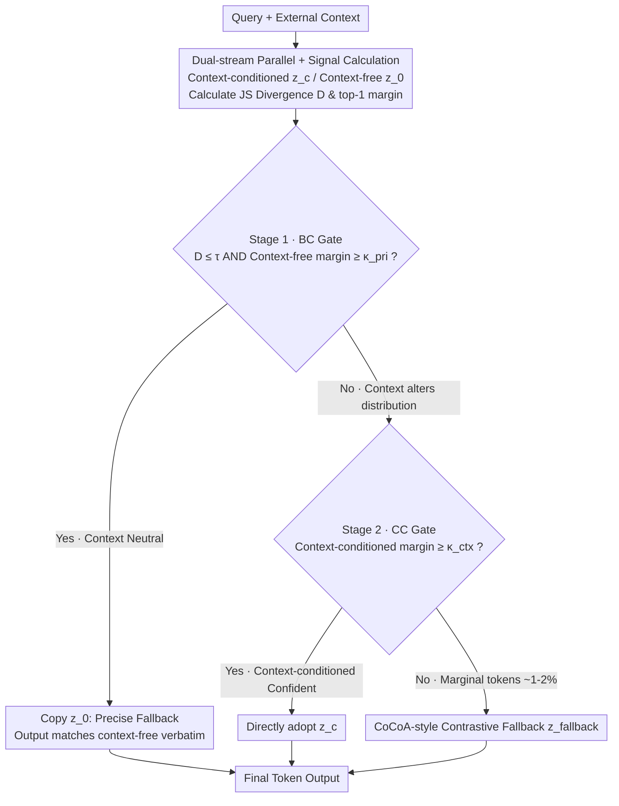

# No-Worse Context-Aware Decoding: Preventing Neutral Regression in Context-Conditioned Generation

**Conference**: ACL 2026 Findings  
**arXiv**: [2604.16686](https://arxiv.org/abs/2604.16686)  
**Code**: [GitHub](https://github.com/CastGryff/NWCAD)  
**Area**: Model Compression/Decoding Strategy  
**Keywords**: Context-Aware Decoding, Neutral Regression, Retrieval-Augmented Generation, Two-Stage Gating, Decoding-Time Adapter

## TL;DR

Ours propose NWCAD, a decoding-time adapter that utilizes a two-stage gating mechanism to precisely fall back to context-free decoding when the context is uninformative (preventing neutral regression) and leverage the context for correction when it is helpful, balancing "do-no-harm" and "effectiveness."

## Background & Motivation

**Background**: Large Language Models (LLMs) in scenarios like Retrieval-Augmented Generation (RAG) must generate answers based on external contexts (e.g., retrieved passages). Existing context-aware decoding methods (e.g., CAD, AdaCAD, CoCoA) enhance context utilization by contrasting token distributions with and without context, performing well in conflict scenarios.

**Limitations of Prior Work**: These continuous logit-leaning methods suffer from "neutral regression"—even when the context provides no useful information, the model may change an originally correct answer due to minor distribution differences. This degradation is difficult to detect in aggregate accuracy as correct and incorrect changes often cancel each other out.

**Key Challenge**: A fundamental trade-off exists between "do-no-harm" and "context utilization." When the context is uninformative, the decoder should retain context-free output; when the context is informative, the decoder should utilize it to correct the answer. Continuous logit-leaning methods cannot make an explicit choice between the two because they are always perturbing the logits.

**Goal**: To design a decoding-time adapter capable of (1) precisely falling back to context-free decoding when the context is uninformative to guarantee no regression, and (2) effectively utilizing context to correct answers when it is informative.

**Key Insight**: The authors observe that most context-aware decoding can be reduced to "choosing between the context-free stream and the context-conditioned stream," with very few steps (only ~1-2% of tokens) actually requiring contrastive mixing. This implies an explicit routing/gating mechanism is more suitable than continuous mixing.

**Core Idea**: Replace continuous logit leaning with a two-stage gate—Stage 1 determines whether to fall back to the context-free stream (preventing neutral regression), and Stage 2 chooses between the context-conditioned stream and a CAD-style fallback decoder (utilizing context).

## Method

### Overall Architecture

NWCAD maintains two parallel forward passes (context-conditioned vs. context-free) and selects which stream's logits to use at each decoding step via a two-stage gate. The input consists of a query and optional external context, and the output is the final generated text. The entire process follows a three-way routing: context-free decoding / context-conditioned decoding / CAD-style fallback decoding.

### Key Designs

**1. Dual-stream Parallel + Signal Calculation: Providing "is it useful" and "is it confident" metrics**

To determine whether to use context, quantifiable evidence is required. NWCAD runs two parallel forward passes at each decoding step $t$ to obtain context-conditioned logits $z_c^t$ and context-free logits $z_0^t$, corresponding to distributions $p_c^t$ and $p_0^t$. Two signals are extracted: the JS divergence $D^t = \text{JS}(p_c^t \| p_0^t)$ (approximated using the top-50 tokens), which measures whether the context substantially alters the distribution; and the top-1 margin (the difference between the highest and second-highest probability), which measures the model's "decisiveness" at the current step.

Combining these signals allows for the precise identification of "safe fallback" scenarios: a low $D^t$ indicates the context is neutral, while a high margin indicates the context-free stream is confident. Only when both are satisfied can one conclude that using context is unnecessary.

**2. Stage 1 — BC Gate (Baseline-Correct Gate): Precise fallback when context is useless**

Continuous logit-leaning methods like CAD often suffer from "neutral regression"—even useless context can flip a correct answer due to minor distribution shifts. NWCAD employs an explicit fallback: when $D^t \leq \tau$ (distributions match) and the context-free margin $\geq \kappa_{\text{pri}}$ (context-free is confident), it directly copies the context-free logits ($z'^t = z_0^t$). 

Unlike CAD, which reduces leaning intensity, this approach performs **zero leaning**. Under greedy decoding, copying logits guarantees the output token matches the context-free stream verbatim, turning "do-no-harm" into a provable guarantee. The threshold $\tau$ controls conservatism: a smaller value makes the model more prone to falling back.

**3. Stage 2 — CC Gate (Context-Confident Gate): Choosing between direct adoption and contrastive fallback**

If Stage 1 is not triggered (context shifted the distribution), the model must decide how to use it. NWCAD checks the context-conditioned stream's margin: if $\geq \kappa_{\text{ctx}}$ (confident), it adopts $z_c^t$ directly. Otherwise, it falls back to a CAD-style contrastive decoder $z_{\text{fallback}}^t$ (defaulting to CoCoA) to mix the streams.

A key observation is that the context-conditioned stream is usually confident enough on its own. Only ~1-2% of tokens require expensive contrastive mixing. This flips the "mix every step" assumption, routing between single streams for most steps and only using contrastive mixing for marginal cases, which saves computation and avoids unnecessary perturbation. This fallback is plug-and-play—CAD, AdaCAD, or CoCoA can be used.

### Loss & Training

NWCAD is a purely decoding-time method and requires no training. The three hyperparameters ($\tau$, $\kappa_{\text{pri}}$, $\kappa_{\text{ctx}}$) were tuned on a controlled dataset using Llama-3.1-8B and transferred directly to other models without re-tuning.

## Key Experimental Results

### Main Results

Evaluated on Augmented NQ-open (split into Restated/Distractor/Helpful subsets):

| Method | Restated (↑) | Distractor (↑) | Helpful (↑) | Weighted Avg |
|------|-------------|----------------|-------------|---------|
| No-context | 100% | 100% | 0% (by design) | — |
| With-context | ~95% | ~85% | ~65% | — |
| CAD | Heavy Regression | Heavy Regression | Medium | Low |
| CoCoA | Heavy Regression | Heavy Regression | Medium | Low |
| NWCAD | ~99% | ~97% | ~62% | **Best** |

Ours achieves overall superiority across 12 QA benchmarks and 2 non-QA tasks (ToFuEval, ExpertQA).

### Ablation Study

| Configuration | Restate-hard | Distractor-hard | Helpful | NQ-SWAP |
|------|-------------|----------------|---------|---------|
| No-context | 48% | 50% | 8% | 0% |
| With-context | 83% | 29% | 64% | 52% |
| NWCAD_BC (Stage 1 only) | 80% | 31% | 52% | 52% |
| No-fallback | 85% | 31% | 62% | 52% |
| NWCAD (full) | 85% | 31% | 62% | 51% |

### Key Findings

- Stage 2 provides a 5.2% average Gain, primarily in Helpful scenarios, indicating the CC gate effectively utilizes context.
- The fallback decoder is invoked for only 1-2% of tokens, showing most gains come from routing decisions rather than contrastive mixing.
- NWCAD acts as an adapter that can be stacked on top of CAD/AdaCAD/CoCoA, consistently improving performance by 7-40 percentage points.
- Latency is comparable to or faster than the base decoder (ratio 0.88-1.01) by skipping contrastive calculations when routing to single streams.

## Highlights & Insights

- **Routing Insight**: The insight that most context-aware decoding reduces to routing is profound. Proving that only 1-2% of tokens need contrastive mixing challenges the "mix every step" assumption of the CAD family.
- **Transferable Design**: The precise fallback logic is transferable to any scenario involving switching between two strategies (e.g., multi-modal fusion, MoE routing).
- **Controlled Evaluation**: Segmenting evaluations into neutral and helpful scenarios prevents aggregate metrics from hiding regression issues.

## Limitations & Future Work

- Currently limited to greedy decoding; not yet extended to sampling-based generation.
- Requires access to token-level logits, making it inapplicable to black-box API models (e.g., GPT series).
- Hyperparameters were transferred from a single model; they may not be optimal for all domains.
- Effectiveness in long-form generation (e.g., summarization) requires further validation.

## Related Work & Insights

- **vs CAD/AdaCAD/CoCoA**: These methods continuously skew logits and cannot guarantee zero regression. NWCAD shifts the focus from "how to mix" to "whether to mix" via explicit gating.
- **vs Selective Answering**: While abstention methods make decisions at the response level, NWCAD operates at the token level, offering finer granularity without requiring extra models.

## Rating

- Novelty: ⭐⭐⭐⭐ The two-stage gate is simple yet effective, though the components (JS divergence, margin) are standard.
- Experimental Thoroughness: ⭐⭐⭐⭐⭐ Controlled evaluations are well-designed with extensive cross-model/task validation.
- Writing Quality: ⭐⭐⭐⭐⭐ Problem definition is clear, and the logic is self-consistent.
- Value: ⭐⭐⭐⭐ High practical significance for RAG reliability, though limited by the greedy decoding constraint.

<!-- RELATED:START -->

## Related Papers

- [\[ACL 2026\] FastKV: Decoupling of Context Reduction and KV Cache Compression for Prefill-Decoding Acceleration](fastkv_decoupling_of_context_reduction_and_kv_cache_compression_for_prefill-deco.md)
- [\[ICML 2025\] Core Context Aware Transformers for Long Context Language Modeling](../../ICML2025/model_compression/core_context_aware_transformers_for_long_context_language_modeling.md)
- [\[ICML 2025\] Context Tuning for In-Context Optimization](../../ICML2025/model_compression/context_tuning_for_in-context_optimization.md)
- [\[ACL 2026\] DASH-KV: Accelerating Long-Context LLM Inference via Asymmetric KV Cache Hashing](dash-kv_accelerating_long-context_llm_inference_via_asymmetric_kv_cache_hashing.md)
- [\[ACL 2026\] Latent-Condensed Transformer for Efficient Long Context Modeling](latent-condensed_transformer_for_efficient_long_context_modeling.md)

<!-- RELATED:END -->
