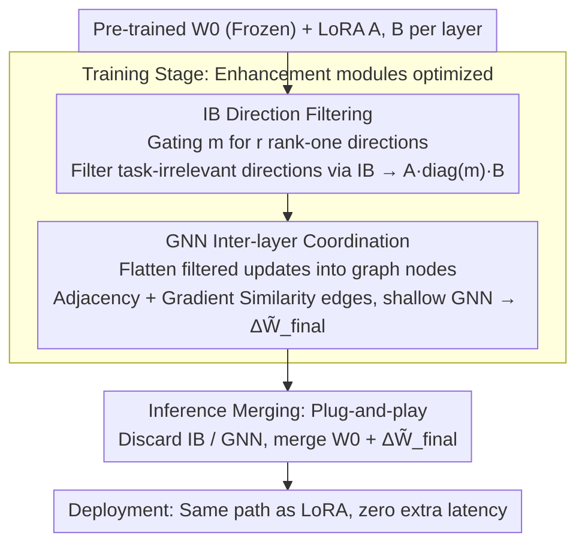

# Not All Directions Matter: Towards Structured and Task-Aware Low-Rank Model Adaptation

**Conference**: ACL 2026  
**arXiv**: [2603.14228](https://arxiv.org/abs/2603.14228)  
**Code**: https://xixiaouab.github.io/StructLoRA/  
**Area**: Model Compression / Parameter-Efficient Fine-Tuning / LoRA / Structured Adaptation  
**Keywords**: LoRA, PEFT, Information Bottleneck, Graph Neural Networks, Inter-layer Coordination

## TL;DR
Ours proposes StructLoRA: it utilizes an Information Bottleneck (IB) to filter out task-irrelevant directions in low-rank updates and employs a Graph Neural Network (GNN) during training to coordinate LoRA updates across different layers. It consistently outperforms LoRA, AdaLoRA, DoRA, and Sensitivity-LoRA across language, vision, and multimodal tasks while maintaining zero additional inference overhead.

## Background & Motivation

**Background**: The mainstream engineering path for fine-tuning Large Language Models (LLMs) has shifted from full fine-tuning to PEFT. LoRA is the most widely used method: it freezes pre-trained weights $W_0$ and learns a low-rank increment $\Delta W = AB$. Since $AB$ can be merged back into the original weights after training, there is no additional latency during deployment. Numerous improvements around LoRA exist, such as QLoRA for memory efficiency via quantization, AdaLoRA / DyLoRA / Sensitivity-LoRA for dynamic rank allocation, DoRA for decoupling magnitude and direction, and LoRA-Dropout / LoRAPrune for controlling overfitting and redundancy through sparsification.

**Limitations of Prior Work**: Most existing methods rely on two assumptions. First, every direction within a given rank deserves equal training effort. Second, different Transformer layers can learn their respective LoRA updates independently. The authors argue these assumptions are problematic in low-rank, low-data, and complex multimodal scenarios: noise directions may infiltrate the low-rank subspace, and updates across layers may lack coordination, causing limited parameter budgets to be spent on ineffective or harmful directions.

**Key Challenge**: While LoRA appears to compress parameter counts, the "quality of update information" actually determines performance. When the rank is small, the model must consider not only "how much rank to give each layer" but also "which rank-one directions truly serve the task." When the model is deep, it must ensure updates in adjacent layers follow a consistent semantic trajectory. The paper summarizes these issues as **semantic drift** and **structural incoherence**: the former stems from indiscriminately retaining low-rank directions, while the latter results from layer-wise independent adaptation.

**Goal**: The authors aim to solve both direction selection and inter-layer coordination without altering the LoRA inference interface. Specifically, the goals include: (1) retaining task-relevant directions while suppressing noise at the rank dimension; (2) ensuring smoother and more consistent update trajectories across layers; (3) maintaining low training overhead and zero inference overhead; (4) verifying the method's effectiveness across LLMs, VLMs, and ViTs.

**Key Insight**: The authors observe that low-rank updates are combinations of rank-one directions rather than indivisible entities. Similarly, updates across deep network layers can be viewed as signals arranged along the model depth. StructLoRA decomposes LoRA updates into two controllable dimensions: filtering directions within each layer using an Information Bottleneck and coordinating these filtered updates across layers via Graph Message Passing.

**Core Idea**: Advancing LoRA from "fixed low-rank parameter compression" to "task-aware information filtering + structure-aware inter-layer synergy." This ensures only useful directions remain and that these directions co-adapt consistently across the model depth.

## Method

### Overall Architecture

StructLoRA maintains the basic interface of standard LoRA. For pre-trained weights $W_0 \in \mathbb{R}^{d\times k}$, LoRA learns $A \in \mathbb{R}^{d\times r}$ and $B \in \mathbb{R}^{r\times k}$ with a forward pass of $y=(W_0+\alpha AB)x$. StructLoRA keeps this deployment form but replaces $AB$ during training with "cleaner" and more "coordinated" updates.

The process involves two steps. Step one is intra-layer direction filtering: a gating vector $m\in[0,1]^r$ is introduced for the rank dimension, representing the update as $\Delta\tilde{W}=A\operatorname{diag}(m)B$, assigning a learnable importance to each rank-one direction. Step two is inter-layer coordination: the filtered $\Delta\tilde{W}_\ell$ from each layer is flattened into node features to construct a graph based on layer adjacency and gradient similarity, followed by a shallow GNN for message passing to obtain the final update $\Delta\tilde{W}^{\text{final}}_\ell$.

During training, the IB filter and GNN coordinator are optimized. During inference, these modules are discarded, and only the final low-rank updates are merged into $W_0$. Thus, the inference path of StructLoRA is identical to LoRA, requiring no extra forward passes, heads, or routers.

### Key Designs

**1. IB-driven Low-rank Direction Filtering: Retaining task-specific directions in the rank dimension**

Standard LoRA treats $r$ rank-one directions in $AB$ equally. However, under tight budgets (e.g., $r\leq 8$), noise directions occupy scarce capacity, leading to semantic drift. StructLoRA assigns a learnable gate $m_j\in[0,1]$ to each direction, rewriting the update as $A\operatorname{diag}(m)B$. Gate values are not determined by norm or random dropout but by an Information Bottleneck objective $\mathcal{L}_{\text{IB}}=\mathcal{L}_{\text{task}}+\beta I(\Delta\tilde{W};X)-\gamma I(\Delta\tilde{W};Y)$. The $\beta$ term penalizes dependencies on irrelevant input variations, while the $\gamma$ term rewards the retention of label-relevant information. Continuous gates use KL bounds for Variational IB, while discrete choices use Gumbel-Softmax for differentiable approximation.

**2. GNN-based Inter-layer Update Coordination: Moving adjacent layer updates along consistent semantic trajectories**

Independent adaptation leads to structural incoherence—adjacent layer LoRA gradients show low cosine similarity (0.27-0.41). StructLoRA treats each layer as a node in a graph, with features $h_\ell^{(0)}=\operatorname{vec}(\Delta\tilde{W}_\ell)$. Edges include structural adjacency and semantic edges based on batch-averaged gradient cosine similarity. A shallow GCN/GAT updates nodes via residual message passing:

$$h_\ell^{(t+1)}=h_\ell^{(t)}+\sigma\Big(\sum_{j\in\mathcal{N}(\ell)\cup\{\ell\}}\tfrac{1}{\sqrt{d_\ell d_j}}h_j^{(t)}\Theta^{(t)}\Big)$$

The result is mapped back to the parameter space as $\Delta\tilde{W}^{\text{final}}_\ell$. Unlike fixed regularization, GNNs dynamically learn which layers should assist each other, avoiding hardcoded coupling strengths. This acts as Laplacian smoothing, reducing drift energy $\sum_\ell\|u_{\ell+1}-u_\ell\|_2^2$.

**3. Plug-and-play Interface: Training enhancement with zero-latency deployment**

StructLoRA restricts the IB gates and GNN coordinator to the training phase. The final model stores only $W_0+\Delta\tilde{W}^{\text{final}}$. Since auxiliary modules are discarded at inference, the deployment is identical to vanilla LoRA. Ours usually inserts PEFT modules into $W_q$ and $W_v$ of the attention mechanism, following standard LoRA settings (e.g., $r=8, \alpha=16$). It can also be stacked on QLoRA or VeRA as an enhancement layer.

### Loss & Training

The total objective combines task loss and IB regularization: $\mathcal{L}_{\text{total}}=\mathcal{L}_{\text{task}}(Y,f(X;W_0+\Delta\tilde{W}^{\text{final}}))+\lambda_{\text{IB}}\mathcal{L}_{\text{IB}}(m)$.

All backbone weights are frozen. Ours uses PyTorch 2.2 on A100 GPUs with AdamW ($\beta_1=0.9, \beta_2=0.999$, weight decay 0.01). Learning rates are selected from $\{1\times10^{-4}, 2\times10^{-4}, 5\times10^{-4}\}$, batch sizes from $\{16, 32, 64\}$, and warmup ratio is 0.06. Most experiments use $r=8$ and report averages over 3 seeds with paired two-sided t-tests against LoRA.

## Key Experimental Results

### Main Results

Ours outperforms various LoRA variants across language reasoning, vision classification, and VQA, approaching full fine-tuning performance.

| Method | BoolQ Acc | PIQA Acc | CIFAR-100 Acc | ImageNet Acc | COCO CIDEr | VQAv2 Acc |
|------|-----------|----------|---------------|--------------|------------|-----------|
| Full Fine-tuning | 82.6 | 85.3 | 85.9 | 78.8 | 123.5 | 76.2 |
| LoRA | 79.1 | 82.4 | 81.5 | 76.2 | 116.2 | 73.5 |
| QLoRA | 80.0 | 83.1 | 82.7 | 76.9 | 119.1 | 74.2 |
| DoRA | 80.6 | 83.7 | 83.2 | 77.3 | 120.3 | 75.0 |
| Sensitivity-LoRA | 80.9 | 84.0 | 83.5 | 77.5 | 120.8 | 75.2 |
| **Ours** | **82.1** | **84.9** | **85.1** | **78.6** | **122.9** | **75.9** |

On GLUE (RoBERTa-base), Ours scores 86.5 on average, surpassing Sensitivity-LoRA by 0.5 and LoRA by 1.4.

| Method | MNLI | SST-2 | MRPC | CoLA | QNLI | QQP | RTE | STS-B | Avg. |
|------|------|-------|------|------|------|-----|-----|-------|------|
| LoRA | 87.3 | 93.5 | 87.1 | 58.8 | 93.0 | 90.5 | 79.4 | 91.0 | 85.1 |
| AdaLoRA | 87.3 | 93.6 | 87.3 | 59.0 | 93.1 | 90.6 | 79.6 | 91.2 | 85.2 |
| DyLoRA | 87.2 | 93.7 | 87.3 | 59.0 | 93.0 | 90.6 | 79.6 | 91.2 | 85.2 |
| Sensitivity-LoRA | 87.6 | 94.6 | 87.7 | 60.2 | 93.6 | 90.7 | 81.8 | 91.3 | 86.0 |
| **Ours** | **88.1** | **95.0** | **88.5** | **61.5** | **94.1** | **91.0** | **82.3** | **91.5** | **86.5** |

Low-rank experiments show that **Gain** is most significant under tight budgets (e.g., COCO CIDEr $+6.2$ at $r=8$).

| Rank | Params % | BoolQ LoRA | BoolQ Ours | CIFAR LoRA | CIFAR Ours | COCO LoRA | COCO Ours |
|------|----------|------------|------------|------------|------------|-----------|-----------|
| 2 | 0.12% | 75.1 | 77.4 (+2.3) | 78.3 | 80.1 (+1.8) | 111.2 | 114.3 (+3.1) |
| 4 | 0.24% | 77.6 | 79.9 (+2.3) | 79.7 | 82.2 (+2.5) | 113.8 | 117.0 (+3.2) |
| 8 | 0.48% | 79.1 | 81.3 (+2.2) | 81.5 | 84.1 (+2.6) | 116.2 | 122.4 (+6.2) |

Low-data experiments show that IB filtering effectively prevents overfitting to noise when data is scarce.

| Dataset / Metric | Method | 10% Data | 25% Data | 50% Data | 100% Data |
|---------------|------|----------|----------|----------|-----------|
| BoolQ Acc | LoRA | 68.5 | 73.2 | 76.4 | 79.1 |
| BoolQ Acc | Ours | 71.2 (+2.7) | 76.3 (+3.1) | 78.9 (+2.5) | 81.3 (+2.2) |
| COCO CIDEr | LoRA | 100.2 | 108.3 | 114.0 | 116.2 |
| COCO CIDEr | Ours | 103.7 (+3.5) | 112.4 (+4.1) | 117.9 (+3.9) | 122.4 (+6.2) |

### Ablation Study

IB filtering provides the largest contribution, while GNN coordination remains consistently effective.

| Config | BoolQ Acc | CIFAR-100 Acc | COCO CIDEr |
|------|-----------|---------------|------------|
| StructLoRA Full | 81.3 | 84.1 | 122.4 |
| w/o IB Filter | 79.4 | 81.9 | 117.8 |
| w/o GNN Coordination | 80.1 | 82.6 | 119.4 |
| w/o Both (LoRA) | 79.1 | 81.5 | 116.2 |

GNN design shows 1-layer with mixed edges is optimal; deeper GNNs lead to over-smoothing.

| GNN Config | BoolQ Acc |
|----------|-----------|
| 1-layer + Mixed Graph | 81.3 |
| 2-layer GNN | 80.4 |
| Adjacency Only | 80.5 |

Training overhed is minimal: for LLaMA-7B, training time is 1.06x and peak memory increases slightly (+0.7GB).

### Key Findings
- **IB is more fine-grained than rank allocation**: While AdaLoRA decides rank *amounts*, StructLoRA decides *which* directions are useful.
- **GNN coordination transcends static regularization**: Learning-based message passing captures data-dependent couplings, raising adjacent layer gradient cosine similarity from 0.34 to 0.62.
- **Multimodal tasks benefit significantly**: The noise filtering and inter-layer alignment are particularly crucial for vision-language alignment.

## Highlights & Insights
- **Focus on Information Quality**: Shifts the PEFT focus from "how many parameters to compress" to "which directions hold task semantics."
- **Harmonious IB + GNN**: IB handles intra-layer selection, while GNN manages inter-layer consistency.
- **Laplacian Smoothing Perspective**: Treating layer updates as graph signals allows measuring and reducing "drift energy."
- **Inference-Efficiency First**: Complex training modules are discarded, maintaining LoRA's architectural advantages for production.

## Limitations & Future Work
- **Training Overhead**: While small for 7B models, costs may scale with hundreds of layers.
- **Hyperparameter Sensitivity**: The IB objective involves multiple coefficients and estimators that may require tuning.
- **Flattened Features**: Flattening updates into node features is high-dimensional; more efficient projections are needed for extremely large modules.
- **Generative Quality**: Further evaluation is needed on hallucination and factual consistency in long-form generation.

## Related Work & Insights
- **vs LoRA**: Ours adds task-aware selection and structural coordination during training without changing the inference interface.
- **vs AdaLoRA/Sensitivity-LoRA**: These methods focus on rank allocation; StructLoRA focuses on direction semantic filtering.
- **vs DoRA**: DoRA improves optimization geometry via magnitude-direction decoupling; StructLoRA applies information-theoretic selection and structural message passing.
- **vs Static Regularization**: Learning-based GNNs outperform fixed cosine/Laplacian penalties by capturing dynamic layer couplings.

## Rating
- Novelty: ⭐⭐⭐⭐ 
- Experimental Thoroughness: ⭐⭐⭐⭐⭐ 
- Writing Quality: ⭐⭐⭐⭐ 
- Value: ⭐⭐⭐⭐ 

<!-- RELATED:START -->

## Related Papers

- [\[ACL 2026\] TLoRA: Task-aware Low Rank Adaptation of Large Language Models](tlora_task-aware_low_rank_adaptation_of_large_language_models.md)
- [\[ICML 2026\] Energy-Structured Low-Rank Adaptation for Continual Learning](../../ICML2026/model_compression/energy-structured_low-rank_adaptation_for_continual_learning.md)
- [\[ACL 2026\] TalkLoRA: Communication-Aware Mixture of Low-Rank Adaptation for Large Language Models](talklora_communication-aware_mixture_of_low-rank_adaptation_for_large_language_m.md)
- [\[ICLR 2026\] FlexLoRA: Entropy-Guided Flexible Low-Rank Adaptation](../../ICLR2026/model_compression/flexlora_entropy-guided_flexible_low-rank_adaptation.md)
- [\[ACL 2026\] Polynomial Expansion Rank Adaptation: Enhancing Low-Rank Fine-Tuning with High-Order Interactions](polynomial_expansion_rank_adaptation_enhancing_low-rank_fine-tuning_with_high-or.md)

<!-- RELATED:END -->
