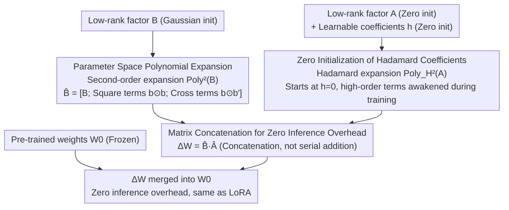

# Polynomial Expansion Rank Adaptation: Enhancing Low-Rank Fine-Tuning with High-Order Interactions

**Conference**: ACL 2026 Findings  
**arXiv**: [2604.11841](https://arxiv.org/abs/2604.11841)  
**Code**: [https://github.com/zhangwenhao6/PERA](https://github.com/zhangwenhao6/PERA)  
**Area**: Parameter-Efficient Fine-Tuning / Model Compression  
**Keywords**: Low-Rank Adaptation, Polynomial Expansion, High-Order Feature Interaction, PEFT, LoRA Improvement

## TL;DR

This paper proposes PERA (Polynomial Expansion Rank Adaptation), which expands the linear adaptation space of LoRA into a polynomial manifold by introducing structured polynomial expansion (square and cross terms) within the parameter space of low-rank factors. It significantly enhances weight update expressiveness without increasing rank or inference overhead, consistently outperforming methods such as LoRA, DoRA, and HiRA on commonsense reasoning and NLU tasks.

## Background & Motivation

**Background**: Parameter-Efficient Fine-Tuning (PEFT) has become the standard paradigm for adapting Large Language Models. LoRA achieves efficient adaptation by restricting weight updates to a low-rank subspace $\Delta W = BA$. However, its strictly bilinear structure only captures first-order linear dependencies between low-rank factors, limiting the model's capacity to model non-linear and high-order parameter interactions.

**Limitations of Prior Work**: (1) LoRA's weight update $\Delta W = \sum_{i=1}^{r} \mathbf{b}_i \mathbf{a}_i^T$ is a linear combination of rank-one matrices, whose expressiveness is constrained by rank $r$; (2) DoRA improves via magnitude-direction decomposition but remains a linear transformation; (3) MoRA achieves high-rank adaptation via compression-transformation-decompression but introduces additional overhead; (4) HiRA enriches representation through Hadamard modulation with pre-trained weights, yet the update mechanism remains linear regarding trainable parameters and relies on external weight coupling.

**Key Challenge**: From a function approximation perspective, there is a fundamental difference in expressiveness between a first-order linear function $f(x) = c + c_1 x$ and a polynomial function containing high-order terms $f(x) = c + c_1 x + c_2 x^2 + \cdots$. If LoRA is viewed as a first-order linear approximation of weight updates, the limitation in its expressiveness is intrinsic.

**Goal**: To enhance the expressiveness of low-rank adaptation by introducing high-order feature interactions without increasing rank or inference costs.

**Key Insight**: Inspiration is drawn from polynomial feature expansion techniques in classical feature engineering—applying them to the parameter space of low-rank factors rather than the input feature space.

**Core Idea**: Structural polynomial expansion and Hadamard-based polynomial expansion are applied to the low-rank matrices $B$ and $A$ respectively to generate square terms ($\mathbf{b}_i \odot \mathbf{b}_i$) and cross terms ($\mathbf{b}_i \odot \mathbf{b}_j$). By using matrix concatenation (instead of addition), extra inference overhead is avoided while expanding the adaptation space from a linear subspace to a polynomial manifold.

## Method

### Overall Architecture

PERA follows the decomposition framework of LoRA, decomposing weight updates into $B \in \mathbb{R}^{m \times r}$ and $A \in \mathbb{R}^{r \times n}$. The core improvement involves performing polynomial expansion on both factors before combination: standard second-order polynomial expansion $\text{Poly}^2(B)$ for $B$, and Hadamard-based polynomial expansion $\text{Poly}_H^2(A)$ (with learnable coefficients $\mathbf{h}$ to ensure stability) for $A$. The final update is $\Delta W = \text{Poly}^2(B) \cdot \text{Poly}_H^2(A)$. This process constitutes a "dual-path expansion—concatenation" parameter construction pipeline: $B$ and $A$ paths undergo polynomial expansion independently, are multiplied via concatenation to form $\Delta W$, and are subsequently merged into the frozen $W_0$. This occurs entirely during parameter construction in the training phase, making the inference form identical to LoRA.

### Key Designs

**1. Parameter Space Polynomial Expansion: High-order interactions of low-rank factor column vectors**

The ceiling of LoRA is rigid: $\Delta W = \sum_{i=1}^{r}\mathbf{b}_i\mathbf{a}_i^T$ is merely a linear superposition of $r$ rank-one matrices, with expressiveness restricted by rank $r$, capturing only first-order linear dependencies. PERA shifts polynomial expansion from input space to parameter space—column vectors of low-rank factors are treated as a set of "adaptation directions." Second-order expansion captures non-linear coupling between these directions. Specifically, for $B=[\mathbf{b}_1,\ldots,\mathbf{b}_r]$, second-order expansion yields $\hat{B}=[B; B_{square}; B_{cross}]$, where $B_{square}=\{\mathbf{b}_i\odot\mathbf{b}_i\}$ contains $r$ square terms, and $B_{cross}=\{\mathbf{b}_i\odot\mathbf{b}_j\mid i<j\}$ contains $C(r,2)$ cross terms. $A$ undergoes a corresponding Hadamard expansion, increasing dimensions from $r$ to $2r+C(r,2)$.

The resulting weight update is $\Delta W = \sum_{i}\mathbf{b}_i\mathbf{a}_i^T + \sum_{i=j}h_{ij}(\mathbf{b}_i\odot\mathbf{b}_j)(\mathbf{a}_i^T\odot\mathbf{a}_j^T) + \sum_{i<j}h_{ij}(\mathbf{b}_i\odot\mathbf{b}_j)(\mathbf{a}_i^T\odot\mathbf{a}_j^T)$. The first term is standard LoRA, while the latter terms expand the adaptation space into a polynomial manifold. The effective rank upper bound increases from $r_0+r$ to $r_0+2r+C(r,2)$, explaining why PERA approximates high-rank performance even with very low rank.

**2. Zero Initialization of Hadamard Coefficients: Progressive awakening of high-order terms**

Introducing square and cross terms directly may cause training instability due to volatile high-order gradients. PERA assigns learnable coefficients $\mathbf{h}=\{h_{ij}\}$ to the expansion on the $A$ side, initialized to zero. Consequently, at the start of training, all high-order contributions are zero, and PERA precisely simplifies to standard LoRA.

As training progresses, the model learns which $h_{ij}$ to increase and which high-order interactions are beneficial. This "progressive introduction of nonlinearity" maintains the smoothness of early optimization without sacrificing the upper bound of expressiveness, effectively integrating high-order terms into the optimization trajectory via a gentle "annealing" process.

**3. Matrix Concatenation for Zero Inference Overhead: Integration via concatenation instead of serial addition**

High expressiveness is only practical if it does not increase inference latency. PERA implements high-order terms as column/row concatenations of $B$ and $A$ rather than sequential additions. The expanded $\hat{B}\in\mathbb{R}^{m\times(2r+C(r,2))}$ and $\hat{A}\in\mathbb{R}^{(2r+C(r,2))\times n}$ are multiplied, resulting in an $\mathbb{R}^{m\times n}$ matrix.

During inference, $\Delta W=\hat{B}\hat{A}$ can be pre-computed and merged into $W_0$, introducing no additional latency or VRAM usage compared to standard LoRA. High-order interactions occur entirely within the parameter construction of the training phase, while the deployment remains zero-overhead.

### Loss & Training

Standard next-token prediction loss is employed. During training, only the low-rank matrices $A$, $B$, and Hadamard coefficients $\mathbf{h}$ are optimized, while pre-trained weights $W_0$ remain frozen. The learning rate is set to $1 \times 10^{-4}$, with other hyperparameters consistent with HiRA baselines. $A$ is zero-initialized, and $B$ is Gaussian-initialized.

## Key Experimental Results

### Main Results

| Model | Method | Params(%) | Commonsense Reasoning Avg Acc |
|------|------|----------|---------------|
| LLaMA2-7B | LoRA (r=32) | 0.83% | 77.61 |
| LLaMA2-7B | DoRA (r=32) | 0.83% | 79.69 |
| LLaMA2-7B | HiRA (r=32) | 0.83% | 81.42 |
| LLaMA2-7B | **PERA (r=16)** | **0.41%** | **82.61** |
| LLaMA3-8B | LoRA (r=16) | 0.35% | 82.80 |
| LLaMA3-8B | HiRA (r=16) | 0.35% | 86.08 |
| LLaMA3-8B | **PERA (r=16)** | **0.35%** | **87.38** |
| Qwen2.5-7B | LoRA (r=16) | 0.35% | 73.80 |
| Qwen2.5-7B | HiRA (r=16) | 0.35% | 85.40 |
| Qwen2.5-7B | **PERA (r=16)** | **0.35%** | **88.29** |

| Model | Method | Params | GLUE Avg |
|------|------|-------|----------|
| RoBERTa-base | LoRA | 0.3M | 83.40 |
| RoBERTa-base | DeLoRA | 0.3M | 84.60 |
| RoBERTa-base | **PERA** | 0.3M | **85.10** |
| RoBERTa-large | LoRA | 0.8M | 87.30 |
| RoBERTa-large | **PERA** | 0.8M | **88.13** |

### Ablation Study

| Config | Weight Update Formula | Avg Accuracy |
|------|-----------|----------|
| LoRA (First-order only) | Eq.8 | 82.80 |
| LoRA + Square terms only | Eq.10 | 87.48 |
| LoRA + Cross terms only | Eq.11 | 86.83 |
| PERA (Square + Cross) | Eq.9 | 87.38 |

### Key Findings

- **Significant Gains from High-Order Terms**: PERA outperforms LoRA by 5 percentage points on LLaMA2-7B (82.61% vs 77.61%) and 14.5 percentage points on Qwen2.5-7B (88.29% vs 73.80%).
- **Square Terms are the Most Critical High-Order Component**: The gain from adding only square terms (87.48%) is higher than adding only cross terms (86.83%), suggesting that non-linear interactions within the same dimension are more significant than cross-dimension interactions.
- **Superior Performance at Extremely Low Rank**: PERA achieves 86.91% at $r=2$ and 87.01% at $r=4$, nearing the best result of 87.38% at $r=16$. This is attributed to polynomial expansion increasing the effective rank upper bound from $r$ to $2r + C(r,2)$.
- **Training and Inference Costs Comparable to LoRA**: Training memory is 19.12GB vs LoRA's 18.70GB; inference memory is 19.70GB vs LoRA's 19.50GB. Training time is significantly better than DoRA (13h30m vs 22h07m).
- **Exceeding LoRA with Only 10% Data**: PERA achieves 83.07% using 10% of commonsense170K data, surpassing LoRA's 82.80% trained on 100% of the data, demonstrating exceptional data efficiency.

## Highlights & Insights

- **Elegant Transfer from Feature to Parameter Engineering**: Migrating polynomial feature expansion from input space to the parameter space of low-rank adaptation is a novel and insightful design that is simple yet effective.
- **LoRA as a Special Case of PERA**: When $\mathbf{h}=0$, PERA degrades to LoRA, providing theoretical unification and justifying the progressive introduction strategy via zero initialization.
- **Theoretical Increase in Rank Upper Bound**: PERA raises the rank upper bound of adaptation weights from $r_0 + r$ to $r_0 + 2r + C(r,2)$. For $r=16$, this increases the capacity from $r_0+16$ to $r_0+152$, nearly a 10-fold theoretical improvement.
- **Hessian Interaction Strength Analysis**: By calculating the interaction strength matrix of second-order partial derivatives, PERA is shown to possess a stronger capacity for modeling global feature interactions compared to LoRA.

## Limitations & Future Work

- Evaluation is limited to commonsense reasoning and GLUE; arithmetic reasoning, code generation, and multimodal tasks are not yet covered.
- Only second-order expansion is explored; the effects of higher-order expansions ($k>2$) remain unknown.
- Cross terms show limited contribution (87.38% vs 87.48% for square-only), indicating potential redundancy and a need for finer selection strategies.
- Comparisons with recent Mixture-of-Experts LoRA (e.g., MELoRA) or adaptive rank methods (e.g., AdaLoRA) are missing.
- Polynomial expansion may lead to dimension explosion at large ranks ($C(r,2)$ grows quadratically with $r$), requiring research into scalability for high-rank scenarios.

## Related Work & Insights

- **vs LoRA**: PERA is a strict generalization of LoRA that introduces high-order terms. LoRA corresponds to the special case in PERA where $\mathbf{h}=0$.
- **vs HiRA**: HiRA introduces nonlinearity via Hadamard products with pre-trained weights, relying on external weight coupling; PERA introduces high-order interactions internally without external dependencies.
- **vs DoRA**: DoRA decomposes magnitude and direction but remains a linear transformation; PERA introduces genuine non-linear parameter interactions.
- **vs MoRA**: MoRA increases expressiveness through high-rank transformations at the cost of inference overhead; PERA maintains zero inference overhead.

## Rating

- Novelty: ⭐⭐⭐⭐ Innovative application of polynomial expansion to low-rank parameter spaces with clear theoretical analysis.
- Experimental Thoroughness: ⭐⭐⭐⭐ Validated across multiple models and tasks with comprehensive rank, module, and data ablation.
- Writing Quality: ⭐⭐⭐⭐ Clear methodological description, rigorous mathematical derivation, and elegant proof of the relationship with LoRA.
- Value: ⭐⭐⭐⭐ Provides a simple and effective enhancement to LoRA with high practical utility.

<!-- RELATED:START -->

## Related Papers

- [\[ICML 2026\] ScaLoRA: Optimally Scaled Low-Rank Adaptation for Efficient High-Rank Fine-Tuning](../../ICML2026/model_compression/scalora_optimally_scaled_low-rank_adaptation_for_efficient_high-rank_fine-tuning.md)
- [\[ICLR 2026\] LoFT: Low-Rank Adaptation That Behaves Like Full Fine-Tuning](../../ICLR2026/model_compression/loft_low-rank_adaptation_that_behaves_like_full_fine-tuning.md)
- [\[AAAI 2026\] Group Orthogonal Low-Rank Adaptation for RGB-T Tracking](../../AAAI2026/model_compression/group_orthogonal_low-rank_adaptation_for_rgb-t_tracking.md)
- [\[ACL 2026\] TLoRA: Task-aware Low Rank Adaptation of Large Language Models](tlora_task-aware_low_rank_adaptation_of_large_language_models.md)
- [\[ACL 2026\] TalkLoRA: Communication-Aware Mixture of Low-Rank Adaptation for Large Language Models](talklora_communication-aware_mixture_of_low-rank_adaptation_for_large_language_m.md)

<!-- RELATED:END -->
