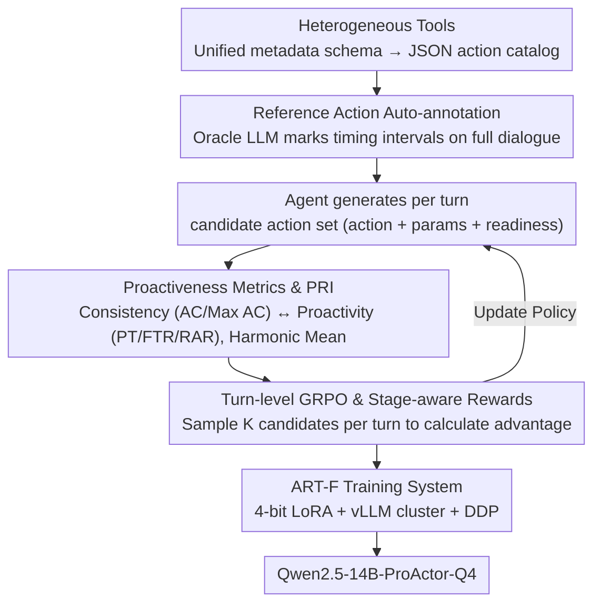

# ProActor: Timing-Aware Reinforcement Learning for Proactive Task Scheduling Agents

**Conference**: ACL2026  
**arXiv**: [2605.24900](https://arxiv.org/abs/2605.24900)  
**Code**: Planned for open source, no explicit URL provided for cache  
**Area**: LLM Agent / Reinforcement Learning  
**Keywords**: Proactive Agent, Task Scheduling, Timing-Aware RL, GRPO, RULER Reward

## TL;DR
ProActor advances conversational task scheduling from "reacting to explicit user instructions" to "proactively triggering actions at appropriate timings." Through automated reference action annotation, proactiveness metrics, turn-level GRPO, and the ART-F efficient training framework, the 4-bit Qwen2.5-14B-ProActor-Q4 achieves a top PRI of 0.7293 on ABCD+, significantly enhancing proactive timing while maintaining action consistency.

## Background & Motivation
**Background**: As LLM agents are embedded into customer service, enterprise automation, financial consulting, and real-time assistants, many scenarios are no longer satisfied with passively waiting for user instructions. An ideal proactive agent should continuously understand the dialogue state, anticipate user needs, and prepare or trigger appropriate software actions in advance without interrupting the conversation flow.

**Limitations of Prior Work**: The difficulty of proactive behavior lies not only in "what action to take" but also "when to take it." Often, multiple reasonable trigger points exist for an action; triggering slightly earlier or later might both be effective. Traditional SFT treats timing as a single-point label, punishing other valid timings. Prompting or static reasoning struggles to stably balance action consistency and proactive timing.

**Key Challenge**: The more proactive an agent is, the more likely it is to trigger incorrectly; the more conservative it is, the more opportunities it misses. Existing methods typically either have consistent action parameters with conservative timing, or high readiness rates but high false triggers. Finding a controllable compromise between reference action alignment and timing quality is the core problem of this paper.

**Goal**: To build an end-to-end framework that automatically generates scalable reference action annotations, defines metrics and rewards for evaluating proactivity, and trains a timing-aware policy using RL while solving the high rollout costs and low GPU utilization issues in LLM RL training.

**Key Insight**: Instead of treating a reference action as a unique ground truth, it is viewed as a set of valid timing anchors. Turn-level GRPO is then used to allow the model to explore more reasonable trigger timings. For trainability, the paper proposes ART-F, which combines a request-adaptive inference cluster with DDP training on single-node multi-GPU setups.

**Core Idea**: Proactive scheduling is not about imitating a single point in time, but about learning a dynamic trade-off between "action consistency, earliness, and false trigger risk" at every dialogue turn using rewards.

## Method
ProActor consists of three layers. The first layer covers data and annotation: standardizing software actions from different domains into an action catalog and automatically labeling reference actions using an oracle LLM. The second layer covers evaluation and rewards: utilizing AC/Max AC/PT/FTR/RAR metrics to characterize consistency and timing. The third layer is the training system: training a 4-bit LoRA agent with turn-level GRPO and RULER/metric/composite rewards, using ART-F to improve rollout and training efficiency.

### Overall Architecture
First, ProActor standardizes heterogeneous tools into a JSON action catalog using a unified metadata schema, recording action ontology, type signatures, and parameter attributes. The Catalog Generator uses Jinja2 to render action descriptions for annotators and agents.

Second, the oracle LLM annotator gains a full dialogue view, including future turns. Instead of explaining actions that have already occurred, it evaluates at each turn whether an actionable opportunity has emerged. Since a reference action may cover multiple valid timings, the authors refer to these annotations as guidance over ground truth.

Then, the model generates a candidate action set at each dialogue turn, including action name, parameters, and readiness/status. During evaluation, predicted actions are compared with reference actions across dimensions like parameter matching, ready timing, and false triggers.

Finally, Qwen2.5-14B-Instruct is fine-tuned into Qwen2.5-14B-ProActor-Q4 using 4-bit quantization + LoRA. Training utilizes turn-level GRPO: rolling out multiple action candidates per turn, obtaining advantages based on rewards, and updating the policy.

### Key Designs

**1. Domain-agnostic reference action automatic annotation: Treating "when to act" as a timing interval rather than a single point**

Manually labeling "should an action be triggered now" for every dialogue turn is extremely costly, and SFT's approach of pinning timing as a single-point label unfairly penalizes other equally reasonable timings. ProActor allows an oracle LLM annotator, given full context (including future turns) and a unified action catalog, to generate reference action candidates for each turn. For data like ABCD+ that includes historical action observations, actual triggered actions can be used to filter annotation quality.

The key is that the authors call these annotations "guidance over ground truth": proactive behavior naturally has a valid trigger window; being slightly early or late can both be correct. Thus, a reference action is a set of timing anchors rather than a unique answer. This allows space for RL exploration—the model can learn a more flexible timing policy within the reference range than SFT allows, rather than being strictly constrained by a single timestamp.

**2. Proactiveness metrics and PRI: Decoupling "action correctness" and "proactivity without excess" into two quantifiable axes**

The quality of proactive scheduling cannot be measured by a single metric: focusing only on action consistency favors conservative models that simply aren't proactive, while focusing only on proactivity excuses random triggers. ProActor designs two sets of metrics—Consistency side: AC (mean parameter/action alignment of predicted actions with reference actions), Max AC (best action alignment), Difference (prediction stability); Proactivity side: PT (rewards ready actions not later than the reference-ready window), FTR (penalizes false triggers outside reference coverage), RAR (ratio of ready actions).

The final ranking uses PRI, the harmonic mean of the consistency index and the timing index. Using a harmonic mean rather than a simple weighted average forces the model to balance both sides—if either side fails, the PRI will be significantly lowered, preventing the shortcut of "gaming" a single metric.

**3. Turn-level GRPO and stage-aware rewards: Dense rewards per turn with shifting targets across training stages**

Trajectory-level rewards for long dialogues make credit assignment difficult—a single total score for a whole dialogue makes it unclear which turn's decision led to the gain. ProActor sinks rewards to the turn level: sampling $K$ action candidates per turn, calculating advantages with turn-level rewards, and updating the policy with GRPO/PPO-style clipping. The reward itself is a family, including RAC/Max RAC, General/Custom RULER, Weighted Metric, Adaptive Metric, and Adaptive RULER.

Adaptive RULER embodies the stage-aware philosophy: $R_{adR}(u)=(1-\lambda_u)R_{metric}(u)+\lambda_u R_{RULER}(u)$, where the mixing coefficient $\lambda_u$ gradually increases to $\lambda_{max}=0.3$ during training. The reasoning is that early training needs metric rewards to explore timing, while later stages require rubric rewards like RULER to tighten false triggers and consistency; a fixed single-target reward cannot cover the entire learning process, so the weights shift smoothly over stages.

### Loss & Training
The training goal is to maximize expected returns under the turn-level reward. The primary model is 4-bit Qwen2.5-14B-Instruct with LoRA rank 8, $\alpha=16$, applied to q/k/v/o projections in attention and gate/up/down projections in MLP, with 0 dropout. ABCD+ was trained on 4×H200, and Home Loan on 8×H100, with a maximum context length of 9,216 tokens. ART-F dynamically launches multiple vLLM inference instances paired with master-worker asynchronous payload-distribution DDP training to alleviate the imbalance between rollout and training phases. The paper reports a 4-8× speedup with ART-F.

## Key Experimental Results

### Main Results
Two datasets cover different real-world scenarios: ABCD+ has historical action observations for annotation validation; Home Loan contains only mortgage consulting transcripts without actual trigger logs, making it closer to privacy-restricted corporate data.

| Dataset | Domain | train/dev/test | Annotated Actions | Avg. Dialogue Length | Characteristics |
|--------|------|----------------|------------|--------------|------|
| ABCD+ | Customer Service | 5,647 / 703 / 692 | 114,978 | 21.2 ± 7.2 turns | Has observed triggers for quality filtering |
| Home Loan | Mortgage Consulting | 774 / 97 / 97 | 30,610 | 47.4 ± 1.1 turns | No action observations, inference via dialogue only |

Main results show that ProActor-Q4 significantly outperforms GPT/Gemini/Claude/Qwen baselines on ABCD+. On Home Loan, Adaptive RULER maintains strong consistency, although the highest PRI was achieved by the Gemini reasoning baseline.

| Dataset | Method | PRI | AC | Max AC | Difference | PT | FTR | RAR |
|--------|------|-----|----|--------|------------|----|-----|-----|
| ABCD+ | Gemini-2.5-flash Non-Reasoning | 0.6251 | 0.417 | 0.834 | 1.000 | 0.2133 | 0.0399 | 0.288 |
| ABCD+ | Claude-4 Reasoning | 0.6318 | 0.421 | 0.749 | 0.779 | 0.2136 | 0.0482 | 0.314 |
| ABCD+ | Qwen2.5-14B + SFT | 0.1700 | 0.272 | 0.533 | 0.960 | 0.2097 | 0.0912 | 0.531 |
| ABCD+ | ProActor-Q4 + Custom RULER | 0.7293 | 0.426 | 0.484 | 0.136 | 0.2347 | 0.0708 | 0.546 |
| ABCD+ | ProActor-Q4 + Adaptive RULER | 0.6842 | 0.431 | 0.586 | 0.320 | 0.2515 | 0.1089 | 0.521 |
| Home Loan | Gemini-2.5-flash Reasoning | 0.7303 | 0.345 | 0.527 | 0.528 | 0.0757 | 0.0001 | 0.241 |
| Home Loan | Claude-4 Reasoning + ASG | 0.7262 | 0.375 | 0.607 | 0.619 | 0.0760 | 0.0127 | 0.307 |
| Home Loan | ProActor-Q4 + Custom RULER | 0.5603 | 0.206 | 0.234 | 0.137 | 0.0846 | 0.0355 | 0.465 |
| Home Loan | ProActor-Q4 + Adaptive RULER | 0.6232 | 0.395 | 0.466 | 0.180 | 0.0501 | 0.0131 | 0.156 |

### Ablation Study
Reward ablation shows that single-target action consistency rewards tend to be conservative. RULER rewards are better at optimizing timing, while Adaptive RULER provides the most balance in large-scale training.

| Dataset / Scale | Reward | PRI | AC | Max AC | PT | FTR | RAR | Insight |
|---------------|--------|-----|----|--------|----|-----|-----|------|
| ABCD+ 100/50 | RAC | 0.2596 | 0.3239 | 0.3881 | 0.1223 | 0.0640 | 0.3002 | Consistency reward too conservative |
| ABCD+ 100/50 | Custom RULER | 0.6140 | 0.3850 | 0.4203 | 0.2315 | 0.1068 | 0.5707 | Timing significantly stronger |
| ABCD+ 5647/692 | Custom RULER | 0.7217 | 0.4257 | 0.4837 | 0.2347 | 0.0708 | 0.5456 | Highest PRI at full scale |
| ABCD+ 5647/692 | Adaptive RULER Max RAC | 0.6026 | 0.4314 | 0.5861 | 0.2515 | 0.1089 | 0.5212 | Strong AC/PT but higher FTR |
| Home Loan 774/97 | RAC | 0.5668 | 0.4701 | 0.5195 | 0.0264 | 0.0041 | 0.0612 | Consistent but not proactive |
| Home Loan 774/97 | Custom RULER | 0.4220 | 0.2057 | 0.2338 | 0.0846 | 0.0355 | 0.4653 | Very proactive but weak consistency |
| Home Loan 774/97 | Adaptive RULER RAC | 0.6154 | 0.4173 | 0.4403 | 0.0397 | 0.0071 | 0.1231 | More balanced |

ART-F and the training setup emphasize engineering feasibility: ABCD+ training was completed on 4×H200, and Home Loan on 8×H100. End-to-end ABCD+ training took 3.5-5.7 days, and Home Loan took 1.5-2.15 days. ART-F reportedly brings a 4-8× speedup, making timing-aware RL feasible in single-node multi-GPU environments.

| Training Component | Key Setting | Function |
|----------|----------|------|
| Qwen2.5-14B-ProActor-Q4 | 4-bit quantization + LoRA rank 8, $\alpha=16$ | Reduce memory and training costs |
| ART-F inference cluster | Multiple vLLM servers/GPU, dynamic routing | Increase rollout throughput |
| DDP training | Symmetric replicated data mode | Stable multi-GPU gradient updates |
| Max Context | 9,216 tokens | Support long-dialogue task scheduling |
| Speedup | 4-8× | Mitigate RL rollout training bottleneck |

### Key Findings
- SFT on ABCD+ achieves a PRI of only 0.1700, indicating that imitating reference actions as hard labels is unsuitable for proactive scheduling where multiple timings are valid.
- Custom RULER provides the strongest proactive behavior on ABCD+: PT 0.2347, RAR 0.546, Difference 0.136, outperforming strong baseline timing while maintaining a low consistency gap.
- Adaptive RULER achieves the highest AC (0.431) and PT (0.2515) on ABCD+, but at the cost of higher FTR, suggesting timing intensity requires careful tuning.
- Home Loan is more challenging than ABCD+: While Custom RULER yields the highest PT (0.0846) and RAR (0.465), its AC is only 0.206. Adaptive RULER achieves a higher AC (0.395) by trading off RAR and FTR.
- Reasoning baselines often improve consistency but make the model more hesitant. ASG sometimes improves timing but at an additional consistency cost. The value of RL lies in internalizing timing intuition into the policy rather than relying on heavy reasoning structures.

## Highlights & Insights
- "Reference action is not ground truth" is the most important concept in this paper. Proactive behavior naturally has a timing window; treating it as a single-point label misleads both training and evaluation.
- The metric design is comprehensive: AC/Max AC for action consistency, PT/FTR/RAR for proactivity, and PRI as a harmonic mean to prevent single-metric gaming. This is more suitable for real-world agents than simple tool-calling accuracy.
- The significance of the RULER reward is converting the vague concept of "appropriately proactive" into a learnable preference rather than a hard rule score. Custom RULER markedly improves timing, showing that rubrics are critical for proactive agents.
- ART-F is a practical engineering contribution. Many agent RL papers are bottlenecked by rollout inefficiency and memory pressure. ProActor uses quantized LoRA, vLLM clusters, and DDP payload distribution to scale training to enterprise-level data.

## Limitations & Future Work
- Observed triggers only cover actions that actually occurred in the real system, whereas the range of acceptable proactive actions is broader. Even with action logs in ABCD+, they remain a subset of valid timings rather than a complete ground truth.
- Evaluation covers only two English datasets. Differences in turn-taking, directness, politeness, and formality across languages could affect timing appropriateness; low-resource languages may introduce annotation and RL stability issues.
- RL experiments only validated 4-bit Qwen2.5-14B-Instruct + LoRA. Although the framework is claimed to be model-agnostic, other families (Llama, Mistral), multilingual models, and different quantization schemes have yet to be verified.
- Training is limited to dialogues not exceeding 50 turns. Longer enterprise workflows may require stronger memory, state abstraction, and credit assignment.
- Home Loan is proprietary data, limiting external reproduction. Though the authors plan to release annotation tools and processed ABCD+ data, the extent of openness will affect verifiability.

## Related Work & Insights
- **vs. Proactive prompting / context engineering**: Prompting can make models more proactive but struggles to stably optimize the timing-consistency trade-off. ProActor optimizes this goal explicitly via RL rewards.
- **vs. SFT task scheduling**: SFT is suitable for tasks with single correct answers, but proactive timing has multiple valid points. ProActor's low SFT PRI supports RL over hard imitation.
- **vs. Tool-calling benchmarks**: Standard tool calls often assume complete parameters and explicit triggers. This paper allows for partial parameter specification and readiness tracking, mirroring real-world dialogue scheduling.
- **vs. General RLHF/GRPO frameworks**: ProActor's RL focuses on turn-level action scheduling rewards rather than generalized chat preferences, and ART-F specifically optimizes system performance for rollout-heavy agent RL.

## Rating
- Novelty: ⭐⭐⭐⭐☆ Explicitly modeling proactive timing as a turn-level RL problem and proposing the reference action window perspective is highly innovative.
- Experimental Thoroughness: ⭐⭐⭐⭐☆ Two datasets, strong baselines, reward ablation, and system efficiency are well-documented, though model diversity and multilingual validation are lacking.
- Writing Quality: ⭐⭐⭐⭐☆ Methods and metrics are complex but the overall structure is clear, with main conclusions well-supported by tables.
- Value: ⭐⭐⭐⭐⭐ Directly insightful for enterprise agents, customer service automation, and real-time task scheduling, particularly regarding reward/metric design.

<!-- RELATED:START -->

- **ABCD**: Action-Based Conversations Dataset
- **GRPO**: Group Relative Policy Optimization
- **LoRA**: Low-Rank Adaptation of Large Language Models

<!-- RELATED:END -->

## Related Papers

- [\[ACL 2026\] SAMoRA: Semantic-Aware Mixture of LoRA Experts for Task-Adaptive Learning](samora_semantic-aware_mixture_of_lora_experts_for_task-adaptive_learning.md)
- [\[ACL 2026\] TELL-TALE: Task Efficient LLMs with Task Aware Layer Elimination](tell-tale_task_efficient_llms_with_task_aware_layer_elimination.md)
- [\[ACL 2026\] TLoRA: Task-aware Low Rank Adaptation of Large Language Models](tlora_task-aware_low_rank_adaptation_of_large_language_models.md)
- [\[ACL 2026\] Enabling Agents to Communicate Entirely in Latent Space](enabling_agents_to_communicate_entirely_in_latent_space.md)
- [\[ICCV 2025\] Scheduling Weight Transitions for Quantization-Aware Training](../../ICCV2025/model_compression/scheduling_weight_transitions_for_quantization-aware_training.md)

<!-- RELATED:END -->
