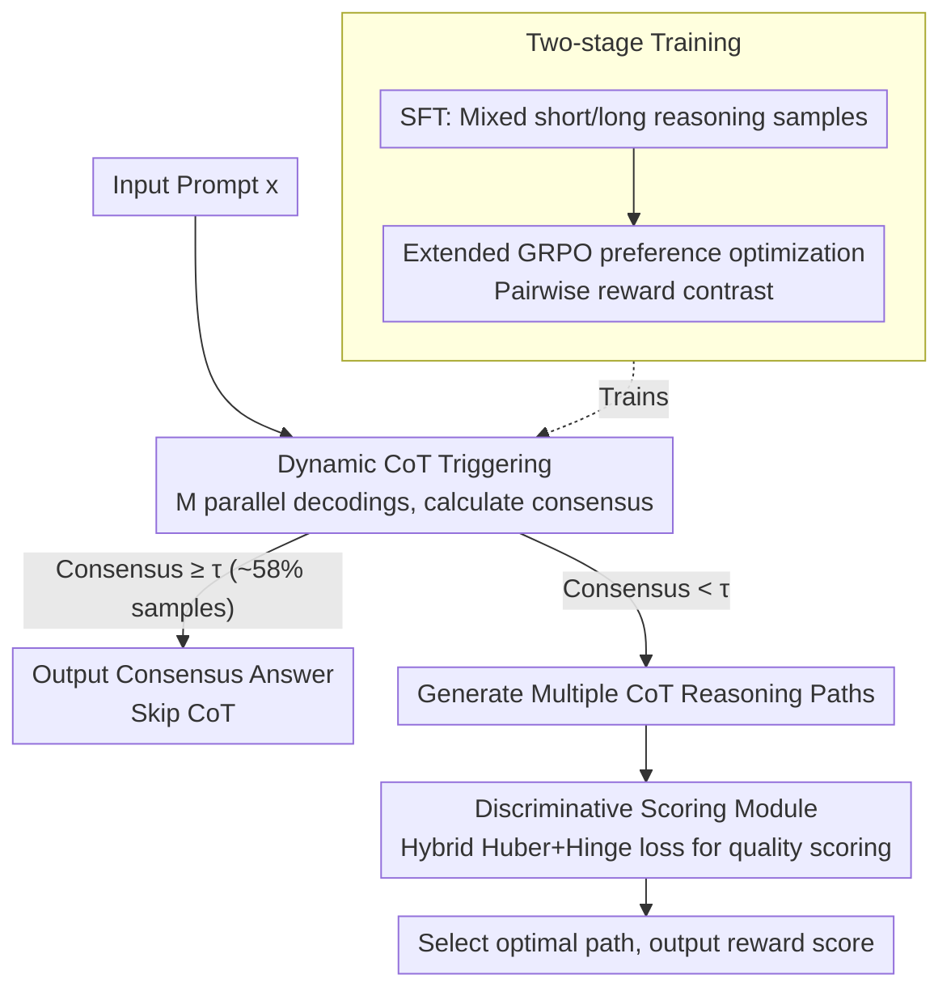

# Reason Only When Needed: Efficient Generative Reward Modeling via Model-Internal Uncertainty

**Conference**: ACL 2026 Findings  
**arXiv**: [2604.10072](https://arxiv.org/abs/2604.10072)  
**Code**: None  
**Area**: Model Compression/LLM Efficiency  
**Keywords**: Generative Reward Model, Dynamic CoT Triggering, Model-Internal Uncertainty, Discriminative Scoring, Inference Efficiency

## TL;DR

The E-GRM framework is proposed to estimate uncertainty using the convergence behavior of model-internal parallel decoding. CoT reasoning is triggered only when necessary, and a discriminative scorer trained with hybrid loss evaluates reasoning path quality. This achieves SOTA performance on multiple reward model benchmarks while reducing inference latency by 62%.

## Background & Motivation

**Background**: Generative Reward Models (GRM) utilize CoT prompting to enhance the reasoning evaluation capabilities of LLMs, demonstrating outstanding performance in complex tasks such as mathematical problem solving and multi-step decision making.

**Limitations of Prior Work**: Existing GRMs suffer from two core issues. First, CoT reasoning is applied indiscriminately to all inputs regardless of item difficulty, incurring unnecessary computational overhead for simple questions. Second, existing methods rely primarily on voting mechanisms to aggregate CoT answers, which lacks the granularity to distinguish quality differences between reasoning paths.

**Key Challenge**: A dual bottleneck in efficiency and quality—there is a need to adaptively allocate reasoning resources based on task complexity and to implement a more refined scoring mechanism to differentiate reasoning quality. Existing adaptive CoT methods (e.g., AdaCoT) often rely on task-specific heuristics or manual features, limiting generalization.

**Goal**: (1) Identify a task-agnostic signal to determine the necessity of CoT. (2) Design a discriminative evaluation method more precise than voting.

**Key Insight**: The authors observe that during multiple parallel decodings of the same prompt, outputs for simple questions converge rapidly, whereas outputs for difficult questions diverge significantly. This convergence behavior serves as a natural indicator of problem complexity.

**Core Idea**: Use the consensus from model-internal parallel generation as an uncertainty estimation signal to dynamically trigger CoT, while training a lightweight discriminative scorer with a hybrid regression-ranking loss for fine-grained scoring.

## Method

### Overall Architecture

E-GRM consists of two core modules: (1) a dynamic CoT triggering mechanism based on model-internal uncertainty; (2) a discriminative scoring module based on hybrid loss. Training proceeds in two stages: SFT to teach the model both short and long reasoning modes, followed by preference optimization via extended GRPO. During inference, the system first determines if CoT is required; if so, multiple paths are generated and evaluated by the scorer.

### Key Designs

**1. Dynamic CoT Triggering: Using "Answer Convergence Speed" as a Complexity Probe**

Applying CoT to all inputs creates an efficiency sink. The decision criteria here derive entirely from model behavior: execute $M$ parallel decodings for input $x$ (using different temperature/sampling parameters) and calculate $\text{Consensus}(x) = \max_y \text{Count}(y) / M$. If consensus $\geq \tau$ (default 0.8), the consensus answer is output directly; otherwise, full CoT generation is triggered. Approximately 58% of samples are classified as "short reasoning," allowing them to skip the full process.

The advantage of this design is its independence from external features or task-specific heuristics. Unlike methods such as AdaCoT that estimate complexity based on solution length, "sampling convergence" is a task-agnostic property.

**2. Discriminative Scoring Module: Hybrid Regression-Ranking Loss vs. Coarse Voting**

Voting mechanisms only track answer consistency and cannot differentiate the quality of reasoning processes. This work trains a lightweight scoring model $\mathcal{S}_\phi$ to output a quality score in $[0,1]$. The loss function combines two objectives: Huber Loss for robust regression (transitioning from L2 to L1 for outliers) and Hinge Loss for discriminative ranking, enforcing a margin $m$ between high-quality and low-quality paths. The total loss is defined as:

$$\mathcal{L} = \alpha \cdot \ell_{\text{Huber}} + (1-\alpha) \cdot \ell_{\text{Hinge}}$$

The hybrid approach addresses the conflict between absolute calibration (how high the quality is) and relative ranking (which of two close paths is better).

**3. Extended GRPO (Coupled-GRPO): Integrating Pairwise Contrasts into Reward Signals**

Standard GRPO calculates relative rewards within independently sampled groups. This framework introduces pairwise rewards when training data consists of positive/negative pairs:

$$R_{\text{pair}} = \mathcal{S}_\phi(x, r^+) - \mathcal{S}_\phi(x, r^-) + \beta \cdot \mathbb{I}(\text{Ans}(r^+) = y)$$

This directly contrasts the scorer's output for positive and negative samples and adds an indicator reward for answer correctness, providing more targeted gradients with less noise than random grouping.

### Loss & Training

Training involves: (1) An SFT stage mixing short reasoning samples (direct answer prediction) and long reasoning samples (CoT sequences), partitioned automatically via uncertainty estimation. (2) A GRPO stage utilizing pairwise preference data and the discriminative scorer for alignment, including KL regularization to prevent divergence from the reference policy.

## Key Experimental Results

### Main Results

| Benchmark | Metric | E-GRM (32B) | Prev. SOTA | Gain |
| :--- | :--- | :--- | :--- | :--- |
| RM-Bench | Avg | 79.2% | 76.4% (14B) | +2.8% |
| RMB | Overall | 0.743 | 0.738 (GPT-4o) | +0.005 |
| RewardBench | Overall | 91.5% | 90.0% (Self-taught-70B) | +1.5% |
| RewardBench | Reasoning | 95.4% | 88.4% (Self-taught-70B) | +7.0% |

### Ablation Study

| Configuration | Acc (%) | FLOPs (T) | Latency (s) |
| :--- | :--- | :--- | :--- |
| Full E-GRM | 78.4 | 15.7 | 2.2 |
| w/o Dynamic CoT | 75.2 | 23.4 | 3.4 |
| w/o Discrim. Scoring | 72.8 | 15.9 | 2.2 |
| Base CoT-GRM | 69.1 | 23.7 | 3.6 |

### Key Findings

- The discriminative scoring module is the primary contributor: removing it results in a 5.6% drop in accuracy, highlighting the importance of fine-grained evaluation.
- Dynamic CoT triggering yields a 49% reduction in FLOPs and a 55% reduction in latency, while improving accuracy by 3.2%, suggesting that unnecessary CoT can introduce error propagation.
- Compared to heuristic methods like AdaCoT, E-GRM achieves higher accuracy (78.4% vs 76.8%) and lower latency (2.2s vs 2.9s) without requiring task-specific priors.
- Extended GRPO provides consistent but moderate improvements over standard GRPO (e.g., MATH: 78.4% vs 76.9%).

## Highlights & Insights

- **Consensus as a Complexity Probe**: Leveraging model-internal behavior rather than external signals is an elegant, task-agnostic design with zero extra parameter costs. This concept is transferable to other adaptive computation scenarios like early exit or dynamic depth.
- **Hybrid Regression-Ranking Loss**: The Huber + Hinge combination successfully balances the dual requirements of absolute calibration and relative ranking.
- The finding that 58% of samples are "simple problems" not requiring CoT reveals significant computational waste in current uniform GRM deployments.

## Limitations & Future Work

- Parallel decoding requires $M$ forward passes ($M=5$). While cheaper than full CoT, the feasibility in extreme low-latency scenarios remains to be verified.
- The threshold $\tau$ and sample count $M$ are currently set manually; different domains may require tuned settings.
- The discriminative scorer requires labeled quality data, which may limit rapid deployment in new fields.
- Future work could explore combining uncertainty estimation with speculative decoding or using internal representations (e.g., attention entropy) from a single forward pass.

## Related Work & Insights

- **vs. DeepSeek-GRM**: DeepSeek-GRM lacks adaptive reasoning and applies CoT uniformly. E-GRM significantly reduces cost with comparable or higher accuracy.
- **vs. AdaCoT**: AdaCoT uses task-specific heuristics based on solution length. E-GRM is task-agnostic and demonstrates superior performance in experiments.

## Rating

- **Novelty**: ⭐⭐⭐⭐ Parallel decoding consensus as an uncertainty signal is a novel entry point, though hybrid loss and GRPO extensions are incremental.
- **Experimental Thoroughness**: ⭐⭐⭐⭐⭐ Comprehensive testing across three benchmarks, thorough ablation, and well-designed comparison with AdaCoT.
- **Writing Quality**: ⭐⭐⭐⭐ Clear structure and detailed method description, though some formulas are lengthier than necessary.
- **Value**: ⭐⭐⭐⭐ Effectively addresses GRM efficiency; the 62% latency reduction is highly significant for practical deployment.

<!-- RELATED:START -->

## Related Papers

- [\[ACL 2026\] Latent-Condensed Transformer for Efficient Long Context Modeling](latent-condensed_transformer_for_efficient_long_context_modeling.md)
- [\[ICML 2026\] When Shared Knowledge Hurts: Spectral Over-Accumulation in Model Merging](../../ICML2026/model_compression/when_shared_knowledge_hurts_spectral_over-accumulation_in_model_merging.md)
- [\[ACL 2026\] Cognitive-Uncertainty Guided Knowledge Distillation for Accurate Classification of Student Misconceptions](cognitive-uncertainty_guided_knowledge_distillation_for_accurate_classification_.md)
- [\[ICML 2025\] Bring Reason to Vision: Understanding Perception and Reasoning through Model Merging](../../ICML2025/model_compression/bring_reason_to_vision_understanding_perception_and_reasoning_through_model_merg.md)
- [\[CVPR 2026\] Progressive Supernet Training for Efficient Visual Autoregressive Modeling](../../CVPR2026/model_compression/progressive_supernet_training_for_efficient_visual_autoregressive_modeling.md)

<!-- RELATED:END -->
