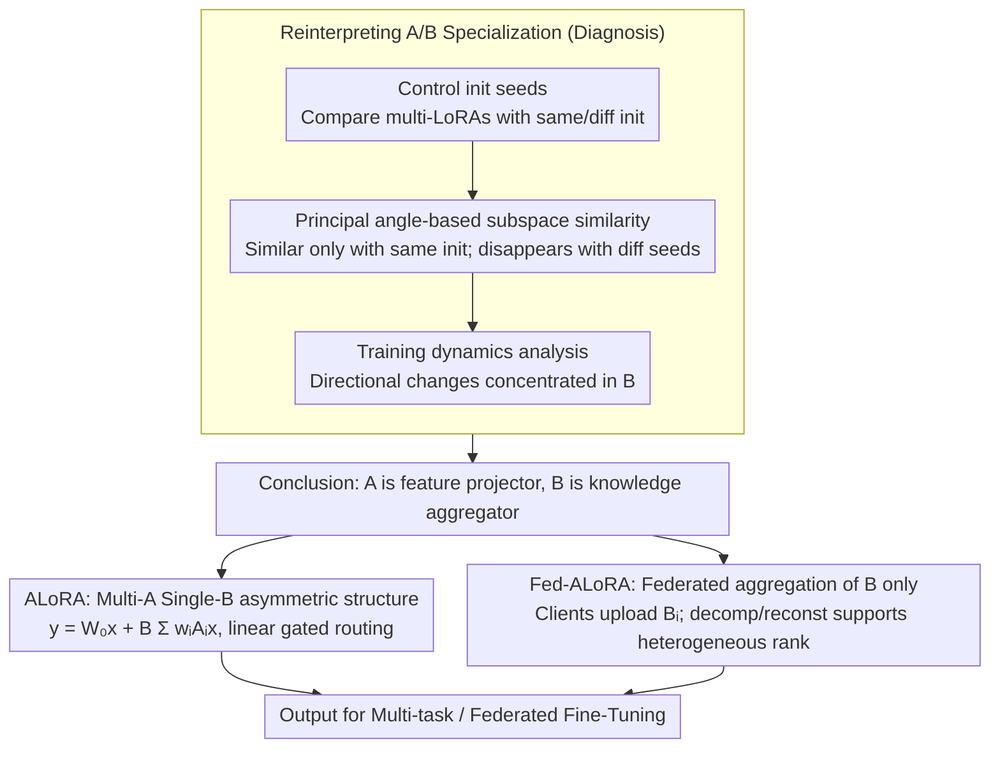

# Rethinking Parameter Sharing for LLM Fine-Tuning with Multiple LoRAs

**Conference**: ACL2026 Findings  
**arXiv**: [2509.25414](https://arxiv.org/abs/2509.25414)  
**Code**: https://github.com/OptMN-Lab/ALoRA  
**Area**: Model Compression / Parameter-Efficient Fine-Tuning / Federated Fine-Tuning  
**Keywords**: LoRA, Parameter Sharing, Multi-task Fine-Tuning, Federated Learning, Communication Compression

## TL;DR
This paper overturns the common assumption that "multiple LoRAs should share the A matrix" by demonstrating that the similarity of A primarily stems from identical initialization rather than shared knowledge. It proposes ALoRA and Fed-ALoRA, which share the B matrix, achieving a balance between performance, fairness, and communication efficiency in multi-task and federated fine-tuning scenarios.

## Background & Motivation
**Background**: Fine-tuning Large Language Models (LLMs) typically employs parameter-efficient methods like LoRA, which represents weight increments as a low-rank decomposition $\Delta W=BA$, freezing the original model while training only A and B. For multi-task, multi-domain, or multi-client data, a single LoRA often lacks sufficient capacity, leading to the emergence of structures such as multiple LoRA experts, LoRA MoE, and federated LoRA aggregation.

**Limitations of Prior Work**: While multiple LoRAs enhance adaptation capabilities, they introduce overhead in parameters, computation, and communication. Existing parameter-sharing methods often observe high similarity between A matrices across different LoRAs and thus share A while keeping individual B matrices, such as in HydraLoRA and FedSA-LoRA.

**Key Challenge**: The similarity of A matrices does not necessarily imply that A carries shared knowledge. If this similarity arises merely from the same random initialization, then sharing A might not only fail to facilitate knowledge transfer but also restrict different tasks from exploring diverse feature subspaces; the parameters truly worth sharing might actually be in matrix B.

**Goal**: The authors first re-examine the similarity and variation patterns of A and B matrices during training; then, they compare the knowledge transfer effectiveness of sharing A versus sharing B; finally, they propose a shared B structure suitable for multi-task and federated scenarios.

**Key Insight**: Instead of starting with more complex MoEs or routers, the paper returns to the fundamental matrix decomposition of LoRA, asking a basic question: which matrix should actually be shared in a multi-LoRA setup? This question directly impacts model capacity allocation and federated communication costs.

**Core Idea**: Allow multiple A matrices to handle different feature projections while using a shared B matrix to aggregate and transfer knowledge. In federated fine-tuning, only B is communicated, and matrix decomposition is employed to support heterogeneous ranks.

## Method

### Overall Architecture
The paper is divided into "Diagnosis" and "Method" parts. The diagnosis part controls the initialization seeds for models like LLaMA2-7B, finding that the high similarity of A only occurs under identical initialization and disappears when different seeds are used. Further analysis of matrix magnitude and direction changes before and after training shows that B undergoes more significant directional changes. Based on this, the method part introduces ALoRA, using multiple $A_i$ and a shared $B$ for multi-task fine-tuning, and Fed-ALoRA, where clients update full LoRAs locally but only upload and aggregate B-related parameters.

### Key Designs

**1. Reinterpreting A/B Specialization from Initialization and Training Dynamics: Similarity in A is an initialization remnant, while B carries the knowledge.**

Many works observe that A matrices across different LoRAs are similar and proceed to share A. However, "similarity" does not equate to "containing shared knowledge." This paper debunks this assumption with a controlled experiment using principal angle-based similarity to measure subspace similarity across LoRA modules under identical vs. different tasks and identical vs. different initializations. The results are clear: A is highly similar only with the same initialization. Once the seeds are changed, A is no longer similar even for the same task. Training dynamic analysis shows that A mostly maintains its projection structure, while significant changes in magnitude and direction are concentrated in B.

This evidence repositions A as a feature projector and B as a domain/task knowledge aggregator. If the similarity in A is merely a byproduct of initialization, the structural assumption that "sharing A enables knowledge sharing" becomes untenable; B is what truly warrants sharing.

**2. ALoRA: Asymmetric Multi-task LoRA with Multiple A and Single B**

Since B is the actual carrier of knowledge, the multi-task structure should be designed accordingly. The forward pass of ALoRA is:

$$y = W_0 x + B \sum_i w_i A_i x$$

Each $A_i$ acts as an expert, exploring different low-rank feature subspaces; the unique shared $B$ fuses these projected features into the output space. Routing weights are provided by a linear gating mechanism $w = \text{softmax}(W_g x)$, allowing adapters to be dynamically merged during inference based on the input.

This design is motivated by the fact that sharing A forces multiple tasks to compete for the same feature projections, leading to smaller gradients and more gradient conflicts. Retaining multiple A matrices provides enough exploration space for different tasks, while concentrating sharing on B aligns with its role as a knowledge aggregator.

**3. Fed-ALoRA: Federated Fine-Tuning with B-only Aggregation and Heterogeneous Ranks**

Applying the shared B concept to federated settings simultaneously reduces communication and facilitates transfer. In homogeneous rank scenarios, each client trains the full $(A_i, B_i)$ locally but only uploads $B_i$. The server aggregates a global $B_0$ and broadcasts it back, reducing single-round communication from $(d_{in}+d_{out})r$ in full-LoRA to $d_{out}r$. In heterogeneous scenarios where clients have different ranks $r_i$ and $B_i$ cannot be directly averaged, the authors represent the update as $(B_{i0}+B_{i2}B_{i1})M_iA_i$. The server reconstructs $B_{i2}B_{i1}$ to the same dimension before aggregation and uses an accumulator to store historical global updates.

In contrast, FedSA-LoRA aggregates A and only supports homogeneous ranks. Methods like ZeroPadding and FLoRA can handle heterogeneity but must pad updates to the maximum rank, incurring high communication costs. Fed-ALoRA unifies knowledge transfer and communication compression within a single mechanism using the shared B structure.

### Loss & Training
ALoRA and Fed-ALoRA do not change the downstream task loss; the core training objective remains language modeling or task-specific supervised loss. Multi-task ALoRA trains the router, multiple $A_i$, and the shared $B$. The homogeneous federated version uploads $B_i$ after local LoRA loss optimization. The heterogeneous version optimizes $(A_i, M_i, B_{i1}, B_{i2})$ locally, and the server performs FedAvg-like aggregation on the reconstructed B updates.

## Key Experimental Results

### Main Results
The authors first conducted a direct comparison in federated fine-tuning across 8 FLAN task clients, where sharing B significantly outperformed sharing A.

| Setting | Shared Params | Avg. ROUGE-1 | Relative Conclusion |
|------|----------|--------------|----------|
| Homogeneous rank | A | 44.30 | Weak knowledge transfer via sharing A |
| Homogeneous rank | B | 66.32 | 49.71% higher than sharing A |
| Heterogeneous rank | A | 40.76 | Harder to aggregate under heterogeneity |
| Heterogeneous rank | B | 50.30 | 23.41% higher than sharing A |

In multi-task fine-tuning, ALoRA achieved the most balanced results across commonsense reasoning and cross-domain NLP. A lower $\Delta m\%$ is preferred, indicating smaller average performance loss relative to the single-task baseline.

| Benchmark | Model | Method | Avg. | $\Delta m\%$ | Key Comparison |
|-----------|------|------|------|--------------|----------|
| Commonsense | LLaMA3-8B | HydraLoRA | 84.57 | 0.32 | Strong shared-A baseline |
| Commonsense | LLaMA3-8B | ALoRA | 84.81 | 0.04 | Higher average with minimal task imbalance |
| Commonsense | Qwen2-7B | HydraLoRA | 86.09 | 1.32 | Shared-A unstable on Qwen |
| Commonsense | Qwen2-7B | ALoRA | 86.47 | 0.91 | Better average and fairness |
| Cross-domain NLP | LLaMA2-7B | HydraLoRA | 66.45 | -6.39 | Strong multi-LoRA baseline |
| Cross-domain NLP | LLaMA2-7B | ALoRA | 67.13 | -8.33 | Avg. +0.68 with stronger fairness |
| Cross-domain NLP | Qwen2-7B | HydraLoRA | 80.03 | -7.14 | Shared-A baseline |
| Cross-domain NLP | Qwen2-7B | ALoRA | 80.46 | -7.98 | Avg. +0.43 |

### Ablation Study
Federated fine-tuning experiments demonstrate the communication advantage of Fed-ALoRA. Params represents the average communication parameters per client per round in millions.

| Setting | Model | Method | Avg. | $\Delta m\%$ | Params | Note |
|------|------|------|------|--------------|--------|------|
| Homogeneous | LLaMA2-7B | FedIT | 82.47 | -3.92 | 8.39 | Full LoRA aggregation |
| Homogeneous | LLaMA2-7B | FedSA-LoRA | 81.15 | -2.21 | 4.19 | Shared A; low comms, weak performance |
| Homogeneous | LLaMA2-7B | Fed-ALoRA | 82.51 | -4.29 | 4.19 | Performance comparable to FedIT; 50% less comms |
| Homogeneous | Qwen2-7B | FedIT | 82.80 | -0.05 | 6.42 | Full LoRA aggregation |
| Homogeneous | Qwen2-7B | Fed-ALoRA | 84.30 | -2.05 | 3.21 | Highest average; 50% less comms |
| Heterogeneous | LLaMA2-7B | ZeroPadding | 82.29 | -0.91 | 49.28 | Requires padding to max rank |
| Heterogeneous | LLaMA2-7B | Fed-ALoRA | 82.50 | -1.07 | 12.12 | ~75% less communication |
| Heterogeneous | Qwen2-7B | ZeroPadding | 83.32 | 0.06 | 37.73 | Heterogeneous full agg baseline |
| Heterogeneous | Qwen2-7B | Fed-ALoRA | 84.13 | -1.02 | 9.23 | Better performance and communication |

### Key Findings
- High similarity in A matrices is not evidence of shared knowledge but a byproduct of identical initialization; similarity disappears quickly under different initializations.
- Matrix B undergoes more directional changes during training, making it the part that genuinely absorbs task and domain knowledge.
- Sharing A leads to smaller gradients and more conflicts (termed "lazy learning" by the authors); sharing B allows multiple A matrices to maintain feature subspace diversity.
- Fed-ALoRA's value lies not just in performance but in reducing homogeneous communication by half and heterogeneous communication by approximately 75%, while improving average scores and task fairness.

## Highlights & Insights
- The core highlight of this paper is the "reinterpretation of existing observations." While many works share A upon seeing its similarity, this paper uses initialization-controlled experiments to point out that this interpretation is flawed, which is more insightful than merely proposing a new structure.
- The design of ALoRA is concise: multiple A matrices, one B matrix, and a lightweight router. It achieves stable improvements across multiple benchmarks without introducing complex expert transformations.
- Heterogeneous Fed-ALoRA is highly practical. Real-world federated devices often have different computing power and rank budgets. Being able to aggregate LoRA updates of different sizes is much closer to deployment needs than homogeneous-only settings.
- This work reminds PEFT research not only to look at parameter counts but also to consider the functional roles of parameters in decomposition structures. The left and right factors of low-rank matrices are not symmetric.

## Limitations & Future Work
- The paper primarily discusses issues within the LoRA A/B factorization framework; whether findings transfer to DoRA, AdaLoRA, LoHa, or more complex adapter structures remains to be verified.
- Multi-task experiments cover commonsense, math, and FLAN-style NLP, but do not yet extend to more complex LLM adaptation scenarios such as long context, code, or tool calling.
- The router uses a simple linear gating mechanism. Stronger routers might further improve ALoRA but could also introduce load imbalance and training instability.
- Federated experiments are based on offline benchmark constructions; systematic evaluations of client dropouts, varying non-IID degrees, privacy budgets, and secure aggregation overhead in real federated systems are still needed.

## Related Work & Insights
- **vs HydraLoRA**: HydraLoRA shares A and keeps multiple B matrices, assuming A carries shared knowledge. ALoRA does the opposite based on the finding that B is better suited for knowledge transfer, yielding better average scores and fairness in experiments.
- **vs FedSA-LoRA**: FedSA-LoRA aggregates A in federated settings and only supports homogeneous ranks. Fed-ALoRA aggregates B and supports heterogeneous ranks through decomposition.
- **vs ZeroPadding / FLoRA**: While these methods handle heterogeneous LoRAs, they involve high communication costs. Fed-ALoRA uses a shared B structure to lower communication overhead while maintaining or enhancing performance.
- **Insight**: Future PEFT research could systematically investigate the functional roles of different parameter subspaces rather than treating all trainable parameters as interchangeable low-rank blocks.

## Rating
- Novelty: ⭐⭐⭐⭐☆ Not a brand-new PEFT paradigm, but provides a powerful reversal of the multi-LoRA parameter sharing direction.
- Experimental Thoroughness: ⭐⭐⭐⭐☆ Covers multi-task, cross-domain, federated homogeneous, and heterogeneous settings; could be strengthened with real-world large-scale federated deployment data.
- Writing Quality: ⭐⭐⭐⭐☆ Motivation, diagnosis, and methods are naturally connected; mathematical notation is slightly dense but overall clear.
- Value: ⭐⭐⭐⭐⭐ Direct engineering value for multi-LoRA, federated PEFT, and communication-efficient fine-tuning.

<!-- RELATED:START -->

## Related Papers

- [\[ICLR 2026\] PiCa: Parameter-Efficient Fine-Tuning with Column Space Projection](../../ICLR2026/model_compression/pica_parameter-efficient_fine-tuning_with_column_space_projection.md)
- [\[ICML 2026\] Compress then Merge: From Multiple LoRAs into One Low-Rank Adapter](../../ICML2026/model_compression/compress_then_merge_from_multiple_loras_into_one_low-rank_adapter.md)
- [\[ICLR 2026\] TRAC: Tensor-Train Based Across-Layer Compression for Parameter-Efficient Fine-Tuning](../../ICLR2026/model_compression/trac_tensor-train_based_across-layer_compression_for_parameter-efficient_fine-tu.md)
- [\[ACL 2025\] C3A: Parameter-Efficient Fine-Tuning via Circular Convolution](../../ACL2025/model_compression/parameter-efficient_fine-tuning_via_circular_convolution.md)
- [\[ICML 2025\] Parameter-Efficient Fine-Tuning of State Space Models](../../ICML2025/model_compression/parameter-efficient_fine-tuning_of_state_space_models.md)

<!-- RELATED:END -->
