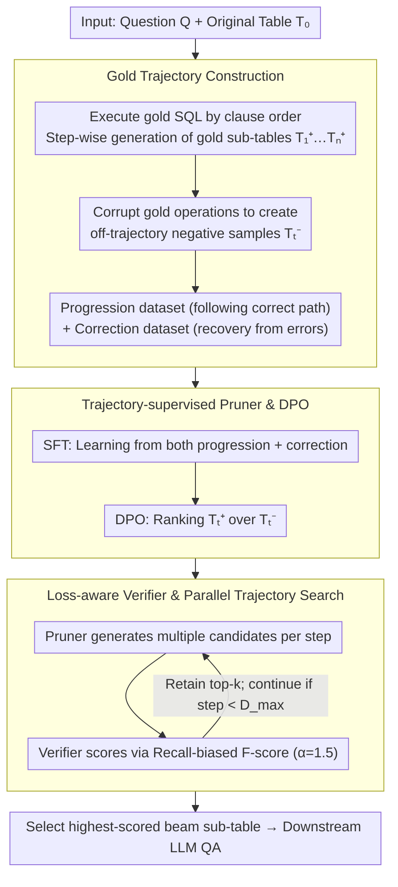

# Rethinking Table Pruning in TableQA: From Sequential Revisions to Gold Trajectory-Supervised Parallel Search

**Conference**: ACL2026 Oral  
**arXiv**: [2601.03851](https://arxiv.org/abs/2601.03851)  
**Code**: None  
**Area**: Table Question Answering / Table Pruning / LLM Reasoning  
**Keywords**: TableQA, table pruning, gold trajectory, verifier, beam search

## TL;DR
This paper proposes TabTrim, which transforms table pruning from error-prone single-path sequential revisions to a framework consisting of an "SQL trajectory-supervised pruner + loss-aware verifier + parallel trajectory search." It achieves an average accuracy of 73.5% on WikiTQ, TabFact, and TableBench, outperforming the strongest baseline by 3.2 percentage points.

## Background & Motivation
**Background**: TableQA and complex table reasoning often require locating a small number of relevant rows and columns within large tables. Directly serializing the original table for an LLM introduces significant noise and high long-context costs. Consequently, table pruning is used to remove redundant cells, retaining only the sub-tables useful for the question before passing them to a downstream reasoner.

**Limitations of Prior Work**: Existing table pruning methods are generally categorized into program-based and LLM-based approaches. The former relies on the execution of programs like SQL/Python, while the latter depends on Chain-of-Thought (CoT) or multi-agent planning. Both suffer from pruning critical rows or columns, and subsequent critique signals are often unreliable: successful program execution does not guarantee semantic correctness, and LLM-as-a-Judge may justify incorrect reasoning or excessively negate correct steps.

**Key Challenge**: The primary risk in table pruning is over-pruning; once answer-critical cells are deleted, downstream reasoning can rarely recover. Conversely, conservative pruning retains too much noise. Existing methods typically follow a single-trajectory sequential revision, where early errors become locked in, lacking backtrackable or comparable candidate branches.

**Goal**: The authors aim to provide verifiable intermediate supervision for table pruning, informing the model which critical cells to retain at each step, while exploring multiple pruning trajectories during inference instead of relying on a single sequential revision.

**Key Insight**: Text-to-SQL datasets contain gold SQL. The authors observe that the clause-level execution process of SQL naturally generates a sequence of intermediate sub-tables. These sub-tables are constrained by the final correct answer and can serve as gold pruning trajectories without requiring manual annotation.

**Core Idea**: Train a pruner and a verifier using gold SQL execution trajectories, and employ a beam-search style parallel trajectory search during inference to maintain multiple candidate sub-tables, avoiding local optima inherent in single-path pruning.

## Method

### Overall Architecture
TabTrim addresses the most fatal failure mode of table pruning: the inability to recover once answer-critical cells are deleted during single-path sequential revisions. It introduces "process supervision + parallel search." Given a question $Q$, original table $T_0$, and current sub-table $T_{t-1}$, it outputs a more compact sub-table. During training, gold SQL from Text-to-SQL data is decomposed by clause-level execution order (row filtering, column projection, etc.) to produce gold sub-tables $T_0, T_1^+, \dots, T_n^+$. These train two components: the pruner learns to move from the current sub-table to the next gold step, and the verifier learns to score any sub-table based on its alignment with the final gold sub-table. During inference, starting from the original table, the pruner generates multiple candidates per step, and the verifier scores and retains the top-$k$, finally selecting the highest-scoring sub-table for the downstream reasoner.

### Key Designs

**1. Gold Trajectory Construction: Turning SQL Intermediate States into Annotation-free Supervision**

The pain point is that the final answer only indicates whether the model was "correct," but not where it failed during pruning steps. The authors note that gold SQL in Text-to-SQL data naturally possesses a clause-level execution order. For each sample $(Q, SQL_{gold}, T_{raw})$, the SQL is decomposed into logical steps, where each step results in a gold sub-table $T_t^+$, constrained by the final answer without additional manual labeling.

Positive paths alone are insufficient; the pruner will inevitably deviate during inference. Thus, the authors construct off-trajectory negative sub-tables $T_t^-$ by corrupting gold operations, organizing data into a "progression dataset" (advancing along the correct path) and a "correction dataset" (recovering from erroneous states). Intermediate SQL states provide alignable process supervision, while negative trajectories teach the model how to recover.

**2. Trajectory-supervised Pruner and DPO: Advancing and Correcting from Deviated Sub-tables**

If trained only via imitation learning on gold paths, the pruner becomes helpless when encountering slightly deviated sub-tables it generated during inference. The authors use a two-stage training approach. The first stage, SFT, uses both progression and correction samples with the loss:

$$L_{SFT}=-\log P_\theta(T_t^+\mid Q,T_0,T_{t-1}^+)-\lambda\log P_\theta(T_t^+\mid Q,T_0,T_{t-1}^-)$$

The first term encourages moving toward the next gold step from a correct sub-table, while the second requires a transition to the correct $T_t^+$ even if the precursor $T_{t-1}^-$ is incorrect. The second stage uses DPO to rank the gold next sub-table $T_t^+$ over the incorrect $T_t^-$, further suppressing fine-grained semantic pruning errors. Consequently, the pruner can both advance along the trajectory and correct its direction.

**3. Loss-aware Verifier and Parallel Trajectory Search: Path Selection via Recall-biased Scoring**

High generation probability does not equate to sub-table quality—lethal errors like missing answer-critical cells are rarely penalized by likelihood. The authors represent candidate sub-tables as canonical cell sets and calculate precision and recall relative to the final gold sub-table $T_n^+$. An $F$-score with a recall bias ($\alpha=1.5$ by default) serves as the quality score $S(T_t)$, favoring the retention of answer-critical cells over aggressive pruning. During inference, beam search with width $k$, branch factor $b$, and maximum depth $D_{max}$ is performed using this score. This transforms pruning from "fixing one path" to "exploring multiple paths and discarding poor early branches."

### Mechanism: How Beam Search Recovers a Mis-pruned Row
Assume $k=b=2, D_{max}=4$. The original table $T_0$ has dozens of rows. At Step 1, the pruner generates 2 candidates. After verifier scoring, the top 2 enter the beam. Suppose one branch incorrectly removes a column required for the answer due to aggressive projection; it may still look good in terms of precision. At Step 2, each beam generates 2 candidates (4 total). The verifier uses the recall-biased score ($\alpha=1.5$); the branch that deleted the critical column receives a significantly lower score due to the drop in recall and is dropped from the top-2, while the branch retaining the critical column continues to prune redundant rows. After 3-4 steps, the system selects the sub-table with the highest recall from the parallel candidates rather than being stuck on a single erroneous path.

### Loss & Training
TabTrim uses WikiSQL and SQUALL to construct over 80K training samples. The pruner is trained using Qwen3-4B and Qwen3-8B, while the verifier uses Qwen3-0.6B with $\alpha=1.5$. During inference, $k=b=2$ and $D_{max}=4$ are used. The upper bound for pruner/verifier calls per sample is $O(k\cdot b\cdot D_{max})$. Final answer generation is performed via GPT-4o-mini to ensure consistency with baseline reasoner settings.

## Key Experimental Results

### Main Results

| Method | WikiTQ | TabFact | TB-NR | TB-FC | TB-DA | Average |
|------|--------|---------|-------|-------|-------|---------|
| Direct QA: GPT-4o-mini | 54.3 | 77.4 | 65.5 | 76.0 | 25.1 | 59.8 |
| Binder | 54.8 | 83.3 | 66.8 | 67.7 | 26.8 | 59.9 |
| Chain-of-Table | 67.5 | 88.9 | 68.5 | 78.1 | 30.3 | 66.7 |
| TALON | 70.7 | 87.6 | 67.3 | 77.1 | 28.9 | 66.3 |
| Table-Critic | 72.6 | 90.6 | 73.0 | 81.3 | 33.8 | 70.3 |
| TabTrim-4B | 76.8 | 89.4 | 76.3 | 79.2 | 32.1 | 70.8 |
| TabTrim-8B | 79.4 | 91.2 | 78.8 | 83.3 | 34.7 | 73.5 |

### Ablation Study

| Configuration | WikiTQ | TableBench | Description |
|------|--------|------------|------|
| TabTrim | 79.4 | 61.2 | Full model |
| w/o DPO | 78.1 | 58.6 | Removing preference optimization makes fine-grained errors harder to correct |
| w/o Correction Samples | 74.8 | 55.4 | Significant robustness drop without off-trajectory recovery |
| w/o Training | 54.7 | 49.6 | Performance reverts to base model capability |
| Balanced score | 77.8 | 58.3 | Performance drops after removing recall bias ($\alpha=1$) |
| Rank by Likelihood | 74.2 | 56.7 | Generation probability is less effective than verifier score |
| Sequential Revisions | 72.9 | 55.1 | Significant drop when parallel search is disabled |

### Key Findings
- TabTrim-8B achieves an average accuracy of 73.5%, 3.2 points higher than the strongest non-TabTrim baseline, Table-Critic (70.3%). On WikiTQ, it reaches 79.4%, a 6.8 point lead.
- Correction samples are critical; removing them drops WikiTQ by 4.6 and TableBench by 5.8 points, demonstrating the importance of recovery from deviations.
- Parallel search and verifier ranking are irreplaceable: sequential revision drops WikiTQ by 6.5 points, while ranking by likelihood drops it by 5.2 points.
- As a plug-and-play front-end, TabTrim provides +25.9 points for Qwen3 on WikiTQ and +7.4 points for Table-R1.
- In terms of token cost, TabTrim consumes approximately 0.56x to 0.66x the tokens of Table-Critic, indicating it does not rely on context brute-forcing.

## Highlights & Insights
- The most clever aspect is transforming SQL execution into trajectory supervision for pruning. Many table tasks have programmatic labels; these intermediate states can be converted into process supervision rather than just final answer labels.
- The loss-aware verifier explicitly prioritizes recall, aligning with the risk structure of table pruning: while redundancy adds noise, missing answer-critical cells is typically irreversible.
- Parallel trajectory search changes table pruning from "fixing a single path" to "exploring multiple paths," a strategy consistent with search/rerank methods in complex reasoning, applicable to document compression and multi-hop retrieval.

## Limitations & Future Work
- Due to compute constraints, experiments were limited to 4B and 8B pruners; scaling laws for larger models were not explored.
- Gold trajectories are derived from SQL execution; how to construct equivalent process supervision for tasks without program annotations remains open.
- The verifier score currently depends on cell-set overlap with a specific gold sub-table; if multiple valid pruning paths exist, it might unfairly penalize legitimate alternatives.
- Future work could explore lighter verifiers, dynamic search budgets, and weak-supervision for trajectory generation.

## Related Work & Insights
- **vs Binder / TabSQLify**: These program-based methods rely on executable programs, which might mistake execution success for semantic correctness. TabTrim uses gold trajectories and a verifier to monitor sub-table quality directly.
- **vs Chain-of-Table / Dater**: LLM-based methods use multi-step reasoning, but critiques are often subjective. TabTrim's critiques are based on SQL trajectories and cell overlap, making them more objective.
- **vs Table-Critic / TALON**: These also attempt critiques or revisions but still follow sequential paths. TabTrim's key differentiator is maintaining multiple candidate trajectories via verifier-led search.
- **Insight**: For any "compress-then-reason" system, process supervision and search are more reliable than one-shot compression, especially where evidence is sparse and the cost of missing evidence is high.

## Rating
- Novelty: ⭐⭐⭐⭐⭐ The combination of SQL gold trajectories, loss-aware verifier, and parallel search is highly effective.
- Experimental Thoroughness: ⭐⭐⭐⭐⭐ Includes main results, ablations, difficulty stratification, scaling, and cost analysis.
- Writing Quality: ⭐⭐⭐⭐☆ Clear methodology and well-organized tables that directly support the conclusions.
- Value: ⭐⭐⭐⭐⭐ Highly reusable for TableQA, RAG compression, and evidence selection.

<!-- RELATED:START -->

## Related Papers

- [\[ACL 2026\] DeepPrune: Parallel Scaling without Inter-Trace Redundancy](deepprune_parallel_scaling_without_inter-trace_redundancy.md)
- [\[ICLR 2026\] Parallel Token Prediction for Language Models](../../ICLR2026/model_compression/parallel_token_prediction_for_language_models.md)
- [\[ACL 2026\] A Layer-wise Analysis of Supervised Fine-Tuning](a_layer-wise_analysis_of_supervised_fine-tuning.md)
- [\[ACL 2026\] MTA: Multi-Granular Trajectory Alignment for Large Language Model Distillation](mta_multi-granular_trajectory_alignment_for_large_language_model_distillation.md)
- [\[ICML 2026\] Detecting Fluent Optimization-Based Adversarial Prompts via Sequential Entropy Changes](../../ICML2026/model_compression/detecting_fluent_optimization-based_adversarial_prompts_via_sequential_entropy_c.md)

<!-- RELATED:END -->
