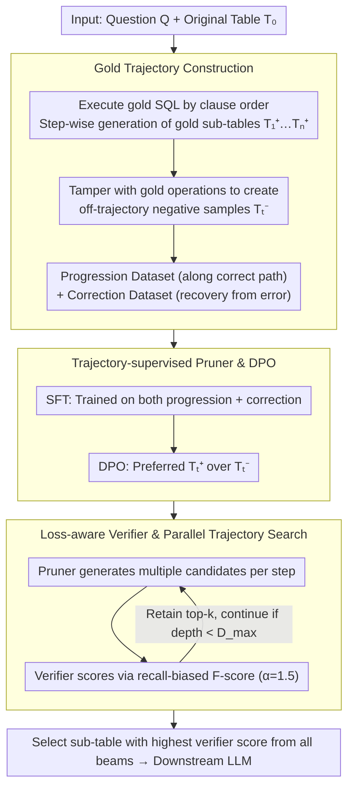

# Rethinking Table Pruning in TableQA: From Sequential Revisions to Gold Trajectory-Supervised Parallel Search

**Conference**: ACL2026 Oral  
**arXiv**: [2601.03851](https://arxiv.org/abs/2601.03851)  
**Code**: None  
**Area**: TableQA / Table Pruning / LLM Reasoning  
**Keywords**: TableQA, table pruning, gold trajectory, verifier, beam search

## TL;DR
This paper proposes TabTrim, transforming table pruning from error-prone single-path sequential revisions into a "SQL trajectory-supervised pruner + loss-aware verifier + parallel trajectory search" framework. It improves average accuracy to 73.5% on WikiTQ, TabFact, and TableBench, significantly outperforming the strongest baseline by 3.2 percentage points.

## Background & Motivation
**Background**: TableQA and complex table reasoning often require locating a small number of relevant rows and columns within large tables. Directly serializing the original table for LLMs introduces significant noise and high long-context costs. Consequently, table pruning is employed to remove redundant cells, retaining only the task-relevant sub-table for the downstream reasoner.

**Limitations of Prior Work**: Existing table pruning methods are categorized into program-based and LLM-based approaches. The former relies on the execution of programs like SQL/Python, while the latter depends on CoT or multi-agent planning. Both suffer from deleting critical rows/columns, and subsequent critique signals are often unreliable: successful program execution does not guarantee semantic correctness, and LLM-as-a-Judge may rationalize incorrect reasoning or excessively reject correct steps.

**Key Challenge**: The primary risk in table pruning is over-pruning. Once answer-critical cells are deleted, downstream reasoning can rarely recover. Conversely, conservative pruning retains too much noise. Existing methods typically follow a single-trajectory sequential revision, where early errors become irreversible due to the lack of backtrackable and comparable candidate branches.

**Goal**: The authors aim to provide verifiable intermediate supervision for table pruning, informing the model which critical cells to retain at each step. Simultaneously, they aim to explore multiple pruning trajectories during inference rather than relying on a single sequential revision.

**Key Insight**: Text-to-SQL datasets contain gold SQL. The authors observe that the clause-level execution of SQL naturally generates a sequence of intermediate sub-tables. These sub-tables are constrained by the final correct answer and can serve as gold pruning trajectories without manual annotation.

**Core Idea**: Train the pruner and verifier using gold SQL execution trajectories, then utilize a beam-search style parallel trajectory search during inference to maintain multiple candidate sub-tables, avoiding local optima inherent in single-path pruning.

## Method

### Overall Architecture
TabTrim addresses the most fatal failure mode of table pruning: the inability to recover once answer-critical cells are deleted during single-path sequential revisions. It introduces "process supervision + parallel search" to the pruning process. Given a question $Q$, an original table $T_0$, and the current sub-table $T_{t-1}$, it outputs a more compact sub-table. During training, gold SQL from Text-to-SQL data is decomposed by clause-level execution order (row filtering, column projection, etc.), yielding a sequence of gold sub-tables $T_0, T_1^+, \dots, T_n^+$. These are used to train two components: a pruner that learns to move from the current sub-table to the next gold sub-table, and a verifier that learns to score the quality of any sub-table relative to the final gold state. During inference, starting from the original table, the pruner generates multiple candidates at each step, and the verifier scores them to retain the top-$k$ candidates. Finally, the sub-table with the highest verifier score across all beams is passed to the downstream LLM.

### Key Designs

**1. Gold trajectory construction: Turning intermediate SQL execution states into annotation-free supervision**

The pain point is that the final answer only indicates "success or failure" without identifying which pruning step deleted critical data. The authors leverage the fact that gold SQL in Text-to-SQL data inherently follows a clause-level execution sequence. For each sample $(Q, SQL_{gold}, T_{raw})$, the SQL is decomposed into a sequence of operations. Executing each operation results in a gold sub-table $T_t^+$, constrained by the correct answer and requiring no manual labeling.

Positive paths alone are insufficient; the pruner will inevitably deviate from the gold trajectory during inference. To address this, the authors construct off-trajectory negative sub-tables $T_t^-$ by tampering with gold operations, organizing data into a progression dataset (advancing along the correct path) and a correction dataset (recovering from erroneous states). This provides intermediate process supervision and teaches the model to recover from errors.

**2. Trajectory-supervised Pruner & DPO: Learning to advance and correct**

If trained only via imitation learning on gold paths, the pruner becomes helpless when encountering slightly deviated sub-tables it generated during inference. The authors implement a two-stage training process for "progression" and "correction." The first stage, SFT, utilizes both progression and correction samples with the loss:

$$L_{SFT}=-\log P_\theta(T_t^+\mid Q,T_0,T_{t-1}^+)-\lambda\log P_\theta(T_t^+\mid Q,T_0,T_{t-1}^-)$$

The first term encourages the model to move toward the next gold step from a correct predecessor, while the second term requires it to target the correct $T_t^+$ even if the predecessor $T_{t-1}^-$ is incorrect. The second stage uses DPO to prefer the gold next sub-table $T_t^+$ over the erroneous $T_t^-$, further refining semantic pruning accuracy. Combined, these stages allow the pruner to follow trajectories and correct course when candidates deviate.

**3. Loss-aware Verifier & Parallel Trajectory Search: Path selection with recall bias**

High generation probability does not equate to sub-table quality—specifically, likelihood functions rarely penalize fatal errors like omitting critical cells. The authors represent each candidate sub-table as a canonical cell set and calculate its precision and recall against the final gold sub-table $T_n^+$. They use a recall-biased $F$-score as the quality score $S(T_t)$, with a default $\alpha=1.5$ to favor "retaining more over deleting answer-critical cells." Using this score, which aligns better with pruning risks than log-likelihood, beam search is conducted during inference (width $k$, branching $b$, max depth $D_{max}$). This transforms pruning from "revising a single path" to "exploring multiple paths and discarding poor branches."

### Walkthrough Example: How beam search recovers a mistakenly deleted row
Assume $k=b=2, D_{max}=4$. The original table $T_0$ has dozens of rows. Step 1: the pruner generates 2 branch candidates from $T_0$. After verifier scoring, top-2 sub-tables enter the beam. One branch, due to aggressive column projection, removes a column needed for the answer but maintains high precision. Step 2: each beam generates 2 more candidates (4 total). The verifier uses the recall-biased score ($\alpha=1.5$). The branch missing the critical column receives a low score due to the recall drop and is discarded from the top-2, while the branch retaining the critical column continues to prune redundant rows. After 3-4 steps, instead of being locked into a single erroneous path, the system selects the cleanest sub-table with the highest recall from parallel candidates for downstream consumption—a backtracking capability sequential revision lacks.

### Loss & Training
TabTrim utilizes WikiSQL and SQUALL to construct over 80K training samples. The pruner is trained using Qwen3-4B and Qwen3-8B, while the verifier uses Qwen3-0.6B with $\alpha=1.5$. Inference defaults to $k=b=2, D_{max}=4$. The pruner/verifier call upper bound per sample is $O(k\cdot b\cdot D_{max})$. Final answer generation uses GPT-4o-mini to maintain consistency with closed-source and open-source baseline downstream reasoners.

## Key Experimental Results

### Main Results

| Method | WikiTQ | TabFact | TB-NR | TB-FC | TB-DA | Average |
|------|--------|---------|-------|-------|-------|---------|
| Direct QA: GPT-4o-mini | 54.3 | 77.4 | 65.5 | 76.0 | 25.1 | 59.8 |
| Binder | 54.8 | 83.3 | 66.8 | 67.7 | 26.8 | 59.9 |
| Chain-of-Table | 67.5 | 88.9 | 68.5 | 78.1 | 30.3 | 66.7 |
| TALON | 70.7 | 87.6 | 67.3 | 77.1 | 28.9 | 66.3 |
| Table-Critic | 72.6 | 90.6 | 73.0 | 81.3 | 33.8 | 70.3 |
| TabTrim-4B | 76.8 | 89.4 | 76.3 | 79.2 | 32.1 | 70.8 |
| TabTrim-8B | 79.4 | 91.2 | 78.8 | 83.3 | 34.7 | 73.5 |

### Ablation Study

| Configuration | WikiTQ | TableBench | Description |
|------|--------|------------|------|
| TabTrim | 79.4 | 61.2 | Full model |
| w/o DPO | 78.1 | 58.6 | Without preference optimization, fine-grained errors are harder to correct |
| w/o Correction Samples | 74.8 | 55.4 | Without off-trajectory recovery, robustness drops significantly |
| w/o Training | 54.7 | 49.6 | Without trajectory-supervised training, reverts to base capability |
| Balanced score | 77.8 | 58.3 | Performance drops when $\alpha=1$ (reduced recall bias) |
| Rank by Likelihood | 74.2 | 56.7 | Ranking by generation probability is inferior to verifier score |
| Sequential Revisions | 72.9 | 55.1 | Disabling parallel search leads to significant decline |

### Key Findings
- TabTrim-8B achieves an average accuracy of 73.5%, 3.2 points higher than the strongest non-TabTrim baseline, Table-Critic. On WikiTQ, it reaches 79.4%, 6.8 points higher than Table-Critic.
- Correction samples are critical; removing them drops WikiTQ by 4.6 points and TableBench by 5.8 points, proving the necessity of recovery from off-trajectory states.
- Parallel search and verifier ranking are irreplaceable: sequential revision drops WikiTQ by 6.5 points, and ranking by likelihood drops it by 5.2 points.
- As a plug-and-play front-end, TabTrim boosts Qwen3 on WikiTQ by +25.9 points and TableBench by +10.8 points; it boosts Table-R1 by +7.4 and +8.8 points respectively.
- Token cost: TabTrim's total token usage is approximately 0.56x to 0.66x that of Table-Critic, demonstrating efficiency rather than reliance on massive context.

## Highlights & Insights
- The most ingenious aspect is converting the gold SQL execution process into pruning trajectory supervision. Many table tasks have programmatic annotations or executable queries; these "intermediate execution states" can be leveraged as process supervision.
- The loss-aware verifier explicitly prioritizes recall, aligning with the risk structure of table pruning: redundancy adds noise, but deleting critical cells is often irreversible.
- Parallel trajectory search changes table pruning from "revising one path" to "evaluating multiple paths," consistent with search/rerank strategies in complex reasoning, making it applicable to document compression, evidence selection, and multi-hop retrieval.

## Limitations & Future Work
- The experiments were constrained by compute resources, primarily covering the 4B and 8B scales for pruners, without exploring scaling laws for larger models.
- Gold trajectories are derived from SQL execution; for TableQA or open-domain table reasoning tasks lacking program annotations, constructing reliable process supervision remains a challenge.
- The current verifier score depends on cell-set overlap with a final sub-table; while clear during training, it might penalize other valid pruning paths in real-world tasks where multiple gold sub-tables are possible.
- Future work could explore lighter verifiers, dynamic search budgets, and adapting TabTrim to weakly-supervised trajectory generation.

## Related Work & Insights
- **vs Binder / TabSQLify**: These program-based methods rely on executable programs for pruning, potentially confusing successful execution with semantic correctness; TabTrim uses gold trajectories and verifiers to supervise sub-table quality directly.
- **vs Chain-of-Table / Dater**: LLM-based methods prune tables via multi-step reasoning, but critiques are often subjective; TabTrim’s critiques are objective, derived from SQL trajectories and cell overlap.
- **vs Table-Critic / TALON**: These attempt critique or revision but remain largely sequential; TabTrim's key differentiator is maintaining multiple candidate trajectories via verifier-led search.
- **Insight**: For any system that "compresses context before reasoning," process supervision and search are more reliable than one-shot compression; especially in tasks with sparse evidence and high deletion costs, optimization should prioritize recall-aware compression objectives.

## Rating
- Novelty: ⭐⭐⭐⭐⭐ The combination of SQL gold trajectory, loss-aware verifier, and parallel search is comprehensive and addresses the core problem of table pruning.
- Experimental Thoroughness: ⭐⭐⭐⭐⭐ Extensive main results, ablations, difficulty stratification, scaling, plug-and-play, and cost analyses.
- Writing Quality: ⭐⭐⭐⭐☆ Methodological descriptions are clear despite the heavy notation, and tables strongly support the conclusions.
- Value: ⭐⭐⭐⭐⭐ Highly reusable for TableQA, RAG compression, and evidence selection; likely to serve as a strong future baseline.

<!-- RELATED:START -->

## Related Papers

- [\[ACL 2026\] DeepPrune: Parallel Scaling without Inter-Trace Redundancy](deepprune_parallel_scaling_without_inter-trace_redundancy.md)
- [\[ICLR 2026\] Parallel Token Prediction for Language Models](../../ICLR2026/model_compression/parallel_token_prediction_for_language_models.md)
- [\[ACL 2026\] A Layer-wise Analysis of Supervised Fine-Tuning](a_layer-wise_analysis_of_supervised_fine-tuning.md)
- [\[ICML 2026\] Detecting Fluent Optimization-Based Adversarial Prompts via Sequential Entropy Changes](../../ICML2026/model_compression/detecting_fluent_optimization-based_adversarial_prompts_via_sequential_entropy_c.md)
- [\[ACL 2026\] MTA: Multi-Granular Trajectory Alignment for Large Language Model Distillation](mta_multi-granular_trajectory_alignment_for_large_language_model_distillation.md)

<!-- RELATED:END -->
