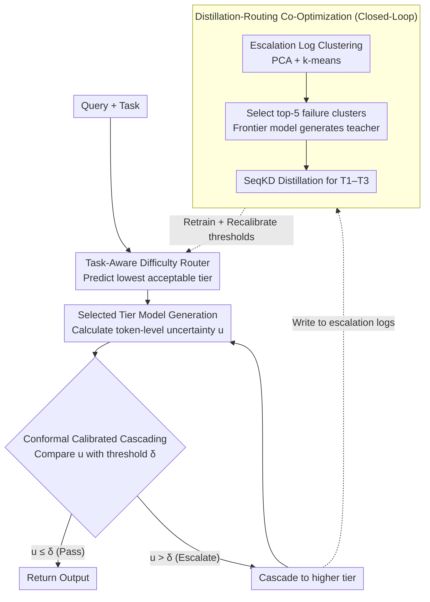

# RouteNLP: Closed-Loop LLM Routing with Conformal Cascading and Distillation Co-Optimization

**Conference**: ACL2026  
**arXiv**: [2604.23577](https://arxiv.org/abs/2604.23577)  
**Code**: https://github.com/bettyguo/RouteNLP  
**Area**: Model Compression / LLM Routing / Efficient Deployment  
**Keywords**: LLM Routing, conformal cascading, knowledge distillation, cost optimization, enterprise deployment

## TL;DR
RouteNLP is a closed-loop LLM routing and cascading framework that co-optimizes model combinations using task-aware routers, conformal calibrated cascading, and failure-cluster-directed distillation. It achieves a 0.159 cost ratio while maintaining a 0.971 quality ratio across a six-task enterprise benchmark, and reduced inference costs by 58% in an 8-week customer service pilot while maintaining a 91% response acceptance rate.

## Background & Motivation
**Background**: Enterprise NLP services typically maintain multiple model tiers: lightweight classifiers, small open-source LLMs, medium MoE models, and expensive frontier APIs. Request difficulty varies significantly; many routine queries do not require the strongest models, yet critical business requests must satisfy strict quality and latency constraints.

**Limitations of Prior Work**: Existing LLM routing and cascading methods are mostly evaluated on single benchmarks, rarely considering multi-tasking, SLAs, tail latency, and model combination evolution in production. More importantly, they often treat the model combination as a fixed input: the router learns to assign requests to existing models but does not modify cheap models based on routing failures.

**Key Challenge**: Pure routing can only save costs within existing capability boundaries; if cheaper models are systematically deficient in certain high-frequency failure clusters, requests will continue to escalate to expensive models. True cost optimization should be a closed loop: identifying escalation failure patterns, performing targeted distillation on cheaper models, and then retraining the router and thresholds.

**Goal**: The authors propose RouteNLP, which integrates a difficulty-aware router, confidence-calibrated cascading, and distillation-routing co-optimization into a production-oriented framework aimed at minimizing costs and SLA violations under task-specific quality constraints.

**Key Insight**: The paper stems from a real-world enterprise scenario: a partner's inference costs exceeded $200,000 per month, yet over 70% of queries were routine tasks. The authors exploit this heavy-tailed difficulty distribution to assign requests to the cheapest model that meets quality thresholds, allowing failure logs to drive subsequent distillation.

**Core Idea**: Treat LLM serving as a closed-loop system of "routing + calibrated cascading + ensemble modification" rather than a one-off router training. Inexpensive models gradually absorb high-frequency failure clusters through targeted distillation, allowing more requests to remain in low-cost tiers.

## Method
RouteNLP assumes a model combination $M=\{m_1,\dots,m_K\}$ ordered by increasing cost, with each task having a quality threshold $\tau_t$. The system minimizes the cumulative cost required to process requests while ensuring final output quality meets task requirements. This is achieved through three parts: predicting the cheapest available tier, using uncertainty to determine escalation, and clustering escalation logs into distillation data to improve lower-tier models.

### Overall Architecture
The true key is that the paper treats the "model combination" itself as an optimizable object. The combination includes four tiers: T1 is DistilBERT ($0.01/1K tokens); T2 is Mistral-7B-Instruct ($0.10); T3 is a quantized Mixtral-8x7B ($0.80); and T4 is the GPT-4-Turbo API ($8.00). A request is first assigned a tier by the router; if the token-level uncertainty after generation exceeds the conformal threshold, it cascades to the next tier. All escalation logs are clustered into distillation data to modify cheap models and retrain the router—forming a "routing → calibrated cascading → ensemble modification" loop. Training labels are derived from offline evaluations of all models across all queries, with quality metrics varying by task: F1 or accuracy for structured tasks, and ROUGE-L or BERTScore for generative tasks. The system is evaluated on a six-task enterprise benchmark covering finance (NER/Summarization), customer service (Intent/Response), and legal (Clause Extraction/Risk Assessment), totaling 40,200 training samples and 8,800 test samples.

### Key Designs

**1. Task-Aware Difficulty Router: Predicting the minimum acceptable tier for a query instead of assigning everything to the strongest model.**

Difficulty patterns for financial entity extraction, customer service responses, and legal risk assessment differ; uniform rules inevitably lead to wasted compute or sub-standard quality. RouteNLP uses DistilBERT-base as a lightweight router, concatenating the `[CLS]` representation with a 64-dimensional task embedding, then outputting 4 tier logits via task projection heads. The shared encoder reuses language representations, while task embeddings allow the router to learn task-conditioned difficulty boundaries. The training loss consists of tier classification, a cost term, and a quality constraint hinge penalty, with weights $\lambda_c=0.3$ and $\lambda_q=0.5$ to balance "choosing the cheapest tier" and "avoiding insufficient quality."

**2. Conformal confidence-calibrated cascading: Providing a safety net when the router underestimates difficulty to prevent low-quality outputs from returning.**

The router provides a prior judgment before generation, which may underestimate the difficulty of some queries. A safety net is needed to inspect the "actual output." Every task and tier uses 500 calibration samples to estimate uncertainty thresholds. After a tier generates output, token-level uncertainty is calculated:

$$u=\frac{1}{L}\sum_{i=1}^{L}\big(1-p(y_i\mid y_{<i},x)\big)$$

If $u>\delta_{k,t}$, the request escalates to the next tier. Thresholds are set via conformal risk control targeting a marginal violation rate $\alpha=0.05$. The authors honestly note that conformal methods only provide distribution-free marginal coverage guarantees; if distribution shift occurs, the assumption breaks (empirical violation rates worsened from 5% to 8.1%).

**3. Failure-cluster-driven distillation-routing co-optimization: Allowing cheap models to absorb high-frequency escalation failures instead of relying on expensive models.**

Pure routing only saves money within existing capability boundaries. RouteNLP's closed loop addresses this: it collects escalation logs, extracts hidden representations from the router, applies PCA to reduce to 128 dimensions, and performs k-means clustering by task. Clusters are ranked by "Cluster Size × Average Quality Gap," and top-5 clusters are selected. Frontier models generate teacher outputs for these clusters to perform SeqKD on T1 through T3, followed by retraining the router and recalibrating thresholds. Compared to random distillation spread over samples the model can already handle, targeting systematic weaknesses yields greater cost reductions with the same data volume.

### Instance Example: How a Query Moves from T1 to Closed-Loop Modification
A customer service intent classification request arrives; the router identifies it as a routine task and assigns it to T1 (DistilBERT). After T1 generates, token-level uncertainty $u$ is found to exceed the conformal threshold $\delta_{k,t}$ for that task and tier. Consequently, it cascades to T2 (Mistral-7B), which generates a qualifying output. This escalation is recorded in the logs. Over time, many similar "intent classification with multi-turn references" failures are clustered via k-means into a significant quality-gap cluster. The system generates teacher outputs using T4 for this cluster and distills T1. In the next round, similar requests are mostly handled directly by T1 without escalation. This explains why, after three rounds of co-optimization, the T1+T2 share rose from 68% to 81%, the T4 share dropped from 11% to 5%, and the cost ratio fell from 0.203 to 0.159.

### Loss & Training
The router loss is $L=L_{route}+\lambda_c L_{cost}+\lambda_q L_{quality}$. $L_{route}$ is the cross-entropy for tier classification with labels from full-model evaluation; $L_{cost}$ encourages low-cost tier selection; $L_{quality}$ applies a hinge penalty for predicted tiers below the task quality threshold. The distillation loop uses a convergence threshold $\epsilon=0.005$, typically reaching convergence in 2-3 rounds. The router has approximately 67M parameters and takes about 45 minutes to train on an A100.

## Key Experimental Results

### Main Results
RouteNLP achieves significantly lower costs than Hybrid LLM with nearly identical quality, while substantially reducing SLA violations.

| System | Quality Ratio | Cost Ratio | p99 Latency | SLA Violation | Description |
|------|---------------|------------|-------------|---------------|------|
| Always-T4 | 1.000 | 1.000 | 1847 ms | 38.2% | Quality upper bound; highest cost/latency |
| Always-T2 | 0.891 | 0.013 | 142 ms | 0.1% | Low cost, but quality below threshold |
| Random | 0.924 | 0.252 | 623 ms | 12.4% | Unreliable allocation |
| FrugalGPT | 0.967 | 0.284 | 986 ms | 21.3% | Cascading saves money, but SLA is poor |
| Hybrid LLM | 0.972 | 0.312 | 874 ms | 18.7% | Near-frontier quality, but high cost |
| RouteLLM | 0.969 | 0.246 | 841 ms | 17.2% | Preference router baseline |
| AutoMix | 0.958 | 0.231 | 1124 ms | 24.6% | POMDP-style hybrid model |
| RouteNLP | 0.971 | 0.159 | 387 ms | 2.3% | Lowest cost with significantly reduced SLA violations |

### Ablation Study

| Configuration | Quality Ratio | Cost Ratio | T1+T2 Share | T4 Share | Description |
|------|---------------|------------|-------------|----------|------|
| Iter 0 Initial | 0.961 | 0.203 | 68% | 11% | Initial router and thresholds |
| Iter 1 | 0.964 | 0.178 | 74% | 8% | More requests enter low tiers after targeted distillation |
| Iter 2 | 0.969 | 0.163 | 79% | 6% | Quality continues to recover, cost continues to drop |
| Iter 3 Final | 0.971 | 0.159 | 81% | 5% | Convergence after three rounds |

### Key Findings
- Removing the cascade leads to a 1.9-point drop in quality, proving the necessity of the confidence-calibrated safety net. Removing co-optimization increases costs by 28%, proving that routing alone cannot fully minimize costs.
- Compared to random distillation, targeted distillation reduced the cost ratio from 0.203 to 0.159 (a 21.7% improvement) with the same data volume; random distillation only reached 0.184 (9.4% improvement).
- Across six tasks, structured task costs fell by 78-85% while retaining ~99% quality; generative task costs fell by 40-47% while retaining ~96% quality.
- Human evaluation of 400 generative samples showed that 74.5% of routed outputs were equal to or better than T4; of the poor samples, ~68% were only slightly worse, with ~8-9% showing significant degradation risks.
- An 8-week customer service pilot (~5K queries/day) showed a real-world cost reduction of 58%, a 4.8% violation rate, and a T4 usage of 9.7%, closely matching the simulated 62% reduction.

## Highlights & Insights
- The biggest highlight is "treating the model combination as a learnable object." Common routers only learn assignment; RouteNLP uses failure logs to modify cheap models, which more closely resembles long-term enterprise systems.
- Conformal calibration is presented honestly: the authors clearly state that guarantees are marginal and depend on exchangeability, noting that domain shift pushed violations to 8.1%. This boundary clarity is vital for deployment papers.
- Pilot deployment results enhance credibility. Although it was a shadow deployment rather than an A/B test, 8 weeks of 5K queries/day with quality audits and cost data are more reliable than pure simulations.
- Failure mode analysis aids practical application: multi-step reasoning, domain knowledge, and ambiguity accounted for 42%, 31%, and 27% of clusters respectively; the pilot also identified OCR artifacts and multi-turn references as better suited for escalation than distillation.

## Limitations & Future Work
- The pilot only covered customer service; financial and legal results are primarily based on benchmark simulations. Real-world deployment across industries still requires more evidence.
- The co-optimization loop runs on benchmark data rather than production failure logs; the authors admit that new failure modes in the pilot did not perfectly align with benchmark clusters.
- The pilot was a shadow deployment, not a randomized A/B test, limiting causal attribution for cost and complaint rate changes.
- Conformal coverage worsened from 5% to 8.1% under domain shift, suggesting a need for online threshold adaptation or drift detection.
- Evaluation is limited to English; the 84-87% human correlation for BERTScore as a quality proxy has not been verified for out-of-distribution scenarios.
- A single co-optimization cycle at this scale costs approximately $2,400, which might not be amortized in low-volume or low-cost scenarios.

## Related Work & Insights
- **vs FrugalGPT / Hybrid LLM**: These methods focus on invocation order or binary routing. RouteNLP adds multi-tasking, SLAs, conformal calibration, and distillation loops, making it more suitable for enterprise model ensembles.
- **vs RouteLLM**: RouteLLM learns routing using preference data but does not evaluate actual business quality of routed outputs or modify the ensemble. RouteNLP integrates quality, cost, and failure-driven refinement.
- **vs Model Compression**: Traditional distillation is a one-off compression. RouteNLP performs continuous targeted distillation based on routing failure clusters; the goal is not a general-purpose small model but one that covers high-frequency business gaps.
- **Insight**: The key to efficient LLM deployment may not be "selecting one optimal small model," but rather building a continuous learning serving system: monitor failures, cluster failures, perform targeted distillation, recalibrate thresholds, and re-deploy.

## Rating
- Novelty: ⭐⭐⭐⭐☆ Routing, cascading, conformal, and distillation are existing modules, but the closed-loop combination and production validation are notably novel.
- Experimental Thoroughness: ⭐⭐⭐⭐☆ Six-task benchmark, ablation, human eval, and 8-week pilot are solid; limited by non-A/B pilot and English-only scope.
- Writing Quality: ⭐⭐⭐⭐☆ Engineering details, cost models, and limitations are clear, with dense tables supporting the deployment narrative.
- Value: ⭐⭐⭐⭐⭐ Highly relevant for enterprise LLM cost optimization, model combination governance, and low-cost serving architectures.

<!-- RELATED:START -->

## Related Papers

- [\[NeurIPS 2025\] Beyond Random: Automatic Inner-Loop Optimization in Dataset Distillation](../../NeurIPS2025/model_compression/beyond_random_automatic_inner-loop_optimization_in_dataset_distillation.md)
- [\[ICLR 2026\] Dr.LLM: Dynamic Layer Routing in LLMs](../../ICLR2026/model_compression/drllm_dynamic_layer_routing_in_llms.md)
- [\[ACL 2026\] LLM Prompt Duel Optimizer: Efficient Label-Free Prompt Optimization](llm_prompt_duel_optimizer_efficient_label-free_prompt_optimization.md)
- [\[NeurIPS 2025\] ORPO-Distill: Mixed-Policy Preference Optimization for Cross-Architecture LLM Distillation](../../NeurIPS2025/model_compression/orpo-distill_mixed-policy_preference_optimization_for_cross-architecture_llm_dis.md)
- [\[ICLR 2026\] DTO-KD: Dynamic Trade-off Optimization for Effective Knowledge Distillation](../../ICLR2026/model_compression/dto-kd_dynamic_trade-off_optimization_for_effective_knowledge_distillation.md)

<!-- RELATED:END -->
