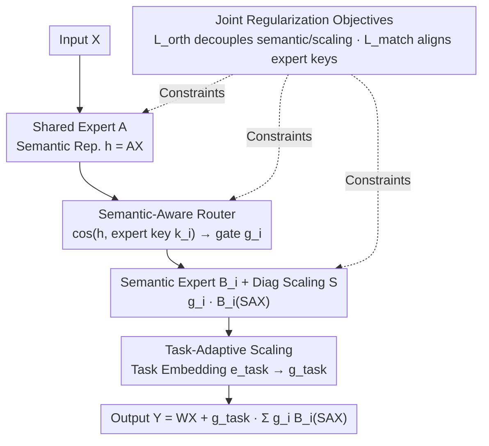

# SAMoRA: Semantic-Aware Mixture of LoRA Experts for Task-Adaptive Learning

**Conference**: ACL 2026 Findings  
**arXiv**: [2604.19048](https://arxiv.org/abs/2604.19048)  
**Code**: [https://github.com/boyan-code/SAMoRA](https://github.com/boyan-code/SAMoRA)  
**Area**: Model Compression/Parameter-Efficient Fine-Tuning  
**Keywords**: Mixture of Experts, LoRA, Semantic-Aware Routing, Task-Adaptive, Multi-Task Learning

## TL;DR

SAMoRA addresses the issues of imprecise routing and lack of flexibility in weight fusion in existing MoE-LoRA methods through a semantic-aware router and a task-adaptive scaling mechanism. It achieves SOTA performance on multi-task benchmarks with minimal trainable parameters (0.15%).

## Background & Motivation

**Background**: As a mainstream solution for parameter-efficient fine-tuning, LoRA performs excellently on single tasks. However, in complex multi-task scenarios, a single set of parameters struggles to handle diverse task requirements. Recent MoE-LoRA methods (e.g., HydraLoRA, MTL-LoRA) use multiple LoRA modules as experts and introduce routing mechanisms, significantly increasing model capacity.

**Limitations of Prior Work**: Two core problems remain unsolved—(1) Existing MLP routers assign tasks based on learned data distributions rather than actual expert capabilities, leading to expert homogenization and a lack of differentiated specialization; (2) Standard LoRA uses a globally fixed scaling factor, applying uniform update intensity to all tasks and ignoring differences in task complexity.

**Key Challenge**: The decoupling between routing decisions and expert semantic capabilities, and the conflict between "one-size-fits-all" weight fusion strategies and diverse task needs.

**Goal**: (1) Achieve precise routing based on semantic matching; (2) Dynamically adjust update intensity according to task characteristics; (3) Improve multi-task generalization while maintaining parameter efficiency.

**Key Insight**: Utilize a shared expert A as a semantic encoder to extract unified representations. Perform explicit semantic-expert matching via cosine similarity in low-rank space, and introduce an SVD-initialized diagonal scaling matrix and task embeddings to dynamically regulate update magnitudes.

**Core Idea**: Replace black-box MLP routing with semantic-aware cosine similarity routing and replace global fixed scaling with task-driven dynamic scaling. Ensure expert differentiation through orthogonal and semantic matching regularization.

## Method

### Overall Architecture
SAMoRA addresses two chronic issues in existing MoE-LoRA: MLP routers learning data distribution instead of real expert capability (leading to homogenization), and LoRA using global fixed scaling regardless of task. It adopts an asymmetric MoE-LoRA architecture: a single shared expert $A \in \mathbb{R}^{r \times d_{in}}$ serves both as a semantic extractor and router, while multiple semantic experts $\{B_i\}_{i=1}^N$ focus on different semantic subspaces. Input $X$ first passes through the shared expert to obtain the semantic representation $\mathbf{h} = AX$. The semantic-aware router selects appropriate experts in the low-rank space, and the task-adaptive scaling mechanism regulates the fusion intensity. The final output is:

$$Y = WX + g_{task}\sum_{i=1}^N g_i B_i(SAX)$$

The design revolves around "aligning routing with expert capability and aligning scaling with task complexity."

### Key Designs

**1. Semantic-Aware Router: Replacing Black-box MLP Routing with Explicit Cosine Similarity Matching**

Traditional MLP routers learn mappings in implicit space without knowing what each expert specializes in, resulting in entangled experts. SAMoRA equips each expert $B_i$ with a trainable expert key $k_i \in \mathbb{R}^r$ as an anchor for its semantic capability. Routing scores are calculated via the cosine similarity between the input semantic representation $\mathbf{h}$ and the expert keys:

$$g_i = \frac{\exp(\cos(\mathbf{h}, k_i)/\tau)}{\sum_j \exp(\cos(\mathbf{h}, k_j)/\tau)}$$

where temperature $\tau$ controls the matching strictness. This matching occurs in the $r$-dimensional low-rank space, reducing routing computation from $\mathcal{O}(Nd_{in})$ to $\mathcal{O}(Nr)$ and making the "input semantic → expert" alignment interpretable rather than an implicit mapping.

**2. Task-Adaptive Scaling: Varying Update Intensity with Task Complexity**

Complex tasks require significant parameter adjustments, while simple tasks only need fine-tuning. Standard LoRA applies a uniform scaling factor to all tasks, which inevitably fails some. SAMoRA replaces fixed scaling with two components: a diagonal scaling matrix $S = \text{diag}(\sigma_1, \dots, \sigma_r)$ initialized via SVD using the top-$r$ singular values of pre-trained weights to align the adaptation direction with the main semantic directions; and a learnable task embedding $e_{task}$ for each task, producing a gating factor $g_{task} = \sigma(W_{gate} e_{task} + b_{gate})$ via nonlinear mapping. Scaling thus becomes a learnable quantity conditioned on the task.

**3. Joint Regularization Training Objective: Ensuring Expert Differentiation and Routing Reliability**

Without constraints, expert keys might not align with actual capabilities, leading to misrouting, and diagonal scaling might interfere with direction learning. SAMoRA uses a total loss:

$$\mathcal{L}_{total} = \mathcal{L}_{task} + \lambda_{orth}\mathcal{L}_{orth} + \lambda_{match}\mathcal{L}_{match}$$

Orthogonal regularization $\mathcal{L}_{orth}$ constrains the rows/columns of $A$ and each $B_i$ to be approximately orthogonal, decoupling semantic directions and scaling effects. Semantic matching regularization $\mathcal{L}_{match}$ uses KL divergence to minimize the distribution difference between expert keys $k_i$ and expert semantic centers $b_i$, forcing keys to faithfully reflect expert capabilities.

### Loss & Training
The total loss consists of the standard multi-task language modeling loss $\mathcal{L}_{task}$ plus two regularization terms. $\mathcal{L}_{orth}$ enforces orthogonality in $A$ and $B_i$ ($\|AA^\top - I\|_F^2 + \sum_i \|B_i^\top B_i - I\|_F^2$), while $\mathcal{L}_{match}$ aligns expert keys with expert representations through $D_{KL}(P_{Expert} \| P_{Key})$. Hyperparameters $\lambda_{orth}$ and $\lambda_{match}$ control regularization strength.

## Key Experimental Results

### Main Results

**Commonsense Reasoning Benchmarks (Llama3.1-8B, average of 9 tasks)**

| Method | Trainable Params % | BoolQ | PIQA | ARC-C | ARC-E | Avg. |
|------|-----------|-------|------|-------|-------|------|
| LoRA | 2.09 | 70.43 | 82.97 | 77.56 | 85.77 | 79.54 |
| HydraLoRA | 0.17 | 74.31 | 90.15 | 84.06 | 92.18 | 86.27 |
| MTL-LoRA | 0.16 | 74.34 | 89.90 | 84.55 | 93.81 | 86.77 |
| **Ours** | **0.15** | **74.89** | **90.37** | **86.35** | **94.70** | **87.64** |

**Commonsense Reasoning Benchmarks (Qwen3-8B, average of 9 tasks)**

| Method | Avg. |
|------|------|
| LoRA | 88.64 |
| MTL-LoRA | 90.98 |
| **Ours** | **91.71** |

**GLUE Benchmark (Qwen3-8B, average of 7 tasks)**

| Method | CoLA | MNLI | Avg. |
|------|------|------|------|
| LoRA | 64.06 | 91.84 | 88.41 |
| MTL-LoRA | 66.32 | 91.93 | 89.18 |
| **Ours** | **69.75** | **91.96** | **89.98** |

### Ablation Study

| Variant | CoLA | GLUE Avg. |
|------|------|-----------|
| SAMoRA (Full) | 69.75 | 89.98 |
| w/o Router (Replace with MLP) | 68.19 | 89.36 |
| w/o Scaling | 66.43 | 88.90 |
| w/o $\mathcal{L}_{orth}$ | 68.32 | 88.99 |
| w/o $\mathcal{L}_{match}$ | 68.73 | 89.02 |

### Key Findings

- Removing task-adaptive scaling caused the largest performance drop (3.32% on CoLA), indicating the importance of dynamic scaling in mitigating task conflicts and negative transfer.
- PCA visualization shows that the semantic-aware router results in clearly separated clusters in the feature space, whereas experts in MLP routers are highly entangled.
- SAMoRA outperforms all baselines with the fewest trainable parameters (0.15%), achieving the best trade-off between parameter efficiency and performance.

## Highlights & Insights

- Transforming routing from implicit MLP mappings to explicit cosine similarity matching improves routing interpretability and precision.
- The clever design of the asymmetric architecture (Shared A + Multiple B): A simultaneously serves as a semantic encoder and router, eliminating the overhead of an independent routing network.
- SVD initialization provides a theoretically sound starting point for task-adaptive scaling, aligning adaptation directions with the principal components of pre-trained weights.

## Limitations & Future Work

- Validated only on 8B scale models; scalability to 70B+ models has not been tested.
- Multimodal scenarios (e.g., visual instruction tuning, VQA) have not been explored.
- Future work could extend the method to large-scale and multimodal settings.

## Related Work & Insights

- Shares asymmetric architecture concepts with HydraLoRA but adds explicit semantic routing and dynamic scaling.
- The SVD initialization strategy draws from MoORE but introduces a task-driven gating mechanism.
- Provides a new design paradigm for the MoE-LoRA field: semantic-aware + task-adaptive.

## Rating

- Novelty: ⭐⭐⭐⭐ The combination of semantic-aware routing and task-adaptive scaling is a meaningful innovation, though individual components are not entirely novel.
- Experimental Thoroughness: ⭐⭐⭐⭐ Covers two benchmarks, two backbone models, complete ablation, and visualization, though lacks verification on large-scale models.
- Writing Quality: ⭐⭐⭐⭐ Clear motivation, complete methodology, and thorough complexity analysis.

<!-- RELATED:START -->

## Related Papers

- [\[ACL 2025\] MoRE: A Mixture of Low-Rank Experts for Adaptive Multi-Task Learning](../../ACL2025/model_compression/more_a_mixture_of_low-rank_experts_for_adaptive_multi-task_learning.md)
- [\[NeurIPS 2025\] Multi-Task Vehicle Routing Solver via Mixture of Specialized Experts under State-Decomposable MDP](../../NeurIPS2025/model_compression/multi-task_vehicle_routing_solver_via_mixture_of_specialized_experts_under_state.md)
- [\[ICLR 2026\] LD-MoLE: Learnable Dynamic Routing for Mixture of LoRA Experts](../../ICLR2026/model_compression/ld-mole_learnable_dynamic_routing_for_mixture_of_lora_experts.md)
- [\[ACL 2026\] TELL-TALE: Task Efficient LLMs with Task Aware Layer Elimination](tell-tale_task_efficient_llms_with_task_aware_layer_elimination.md)
- [\[ICML 2025\] Make LoRA Great Again: Boosting LoRA with Adaptive Singular Values and Mixture-of-Experts Optimization Alignment](../../ICML2025/model_compression/make_lora_great_again_boosting_lora_with_adaptive_singular_values_and_mixture-of.md)

<!-- RELATED:END -->
