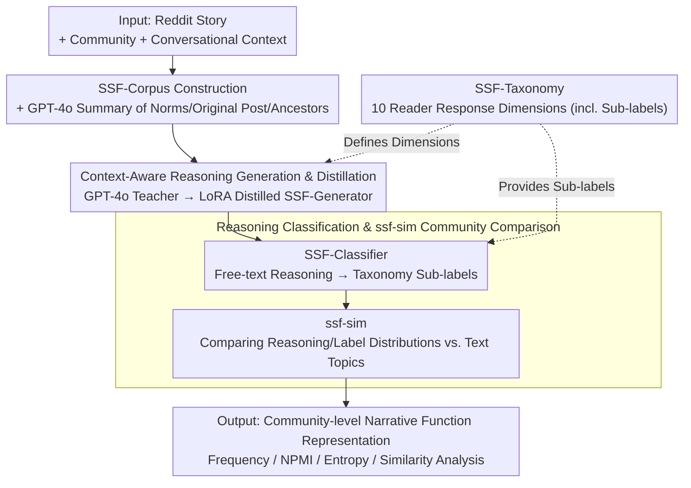

# Social Story Frames: Contextual Reasoning about Narrative Intent and Reception

**Conference**: ACL2026  
**arXiv**: [2512.15925](https://arxiv.org/abs/2512.15925)  
**Code**: social-story-frames (Project name provided in paper; no full URL in main text)  
**Area**: NLP Understanding / Computational Social Science / Narrative Reasoning  
**Keywords**: Narrative understanding, reader response, social media, contextual reasoning, model distillation

## TL;DR
This paper proposes SocialStoryFrames, utilizing a reader response taxonomy with 10 dimensions and two distilled models to place Reddit stories back into community and conversational contexts. It infers narrative intent, reader sentiment, and value judgments, demonstrating a more granular analysis of community narrative practices across 6,140 social media stories compared to semantic similarity.

## Background & Motivation
**Background**: NLP processing of stories has long leaned toward internal content, such as event causality, character psychology, plot consistency, or localized reader reactions like suspense and curiosity. Computational Social Science (CSS) also analyzes narratives in online communities, but common practices either involve deep studies of a single community or statistical analysis of story volume, structural archetypes, or topic distributions on large-scale corpora.

**Limitations of Prior Work**: These two paths involve a clear trade-off between depth and scale. Case studies explain power, identity, or emotional negotiation within a community but struggle with cross-community comparisons. Large-scale analyses scale easily but often simplify stories into text topics or embedding similarities, losing the socio-pragmatic layer of "why the author tells this story" and "how a reader might understand it."

**Key Challenge**: Social media stories are not isolated texts. An individual telling a story about a product failure in r/buildapc versus a trial failure in r/MakeupAddiction involves completely different surface topics, but both may be seeking advice, validating experiences, or gaining emotional support. Focusing only on story text misses this functional similarity; relying solely on manual interpretation cannot cover a massive number of communities.

**Goal**: The authors aim to construct a formalized framework with both theoretical explanatory power and the capability for batch model application to answer three types of questions: what intent a story is perceived to have within a specific community and conversation; what interpretations, predictions, emotions, and value judgments readers generate; and whether narrative practices in different communities can be compared beyond semantic topics.

**Key Insight**: The paper maps concepts from reader response theory, narrative theory, pragmatics, and psychology into a SocialStoryFrames taxonomy. It then uses GPT-4o / GPT-4.1 to generate reference reasoning, which is distilled into open-weight models. This retains theoretical dimensions while transforming expensive expert or closed-source model reasoning into a reproducible batch pipeline.

**Core Idea**: Use "Community Context + Conversational Context + Reader Response Taxonomy" to replace pure textual semantic representation, modeling the social functions and reception of stories in online communities.

## Method
SocialStoryFrames is not a single classifier but a complete pipeline spanning theoretical taxonomy, corpus construction, context summarization, reasoning generation, reasoning classification, and community analysis. Its input consists of a Reddit comment containing a story, its community information, and the preceding conversation; its output consists of free-text reasoning across multiple dimensions and taxonomy label distributions.

### Overall Architecture
The overall process is divided into four steps. First, stories are filtered from ConvoKit's reddit-corpus-small to construct the SSF-Corpus, retaining community and conversational contexts for each story. Second, GPT-4o summarizes subreddit purposes, norms, original posts, and ancestor/sibling comments, allowing the model to see the context actual readers likely possess. Third, SSF-Generator generates reader response reasoning for each taxonomy dimension, such as author intent, causal explanation, future prediction, or aesthetic feeling. Fourth, SSF-Classifier maps free-text reasoning to fine-grained taxonomy sub-labels, resulting in statistical and comparable community-level narrative representations. The SSF-Taxonomy runs through this: it defines the 10 dimensions for generating reasoning in step three and provides the sub-labels for classification in step four.

### Key Designs

**1. SSF-Taxonomy Reader Response Dimensions: Breaking "how readers understand a story" into 10 operational dimensions**

Viewing only story text leads models to output "this comment is sad" or "topics are similar," losing the socio-pragmatic layer. The SSF-Taxonomy does not use unsupervised clustering; instead, it draws from reader response theory, narrative theory, pragmatics, emotional psychology, and value theory to establish 10 dimensions: overall goal, narrative intent, author emotional response, causal explanation, prediction, character appraisal, moral, stance, narrative feeling, and aesthetic feeling. Sub-classes are designed for each—for narrative intent, categories include identity expression, meaning-making, emotional release, entertainment, argument, and seeking support; for moral, high-level categories from Schwartz’s Value Theory are used.

This provides a common coordinate system for community comparison: model outputs map to interpretable social functions rather than just free text, without requiring separate labels for every subreddit.

**2. Context-Aware Reasoning Generation and Distillation: Making reasoning dependent on community norms and conversation, while migrating closed-source model capabilities to open-source students**

Reader response is highly context-dependent; zero-shot reasoning by small models often becomes superficial. The authors use GPT-4o as a teacher to generate up to 3 independent reasonings for story-dimension pairs in SSF-Split-Corpus, constrained by dimension-specific templates while allowing free content. GPT-4o also summarizes subreddit purposes, norms, and conversation history. Llama3.1-8B-Instruct is then distilled into SSF-Generator via LoRA, turning expensive closed-source reasoning into a batchable, reproducible pipeline. A human plausibility survey verifies that these reasonings are perceived as reasonable by humans.

**3. Reasoning Classification and ssf-sim Community Comparison: Compressing free-text reasoning into label distributions to compare communities with different topics but similar narrative functions**

Free-text reasoning is information-dense but difficult to quantify. Finding that zero-shot multi-label inference classification performs poorly, the authors use GPT-4.1 k-shot prompting to generate classification references and distill SSF-Classifier to map reasonings to taxonomy sub-labels. Community similarity, ssf-sim, compares the reasoning and label distributions of SSF-Generator and SSF-Classifier rather than raw text embeddings. This allows frequency, NPMI, entropy, and similarity analysis at the community level. Consequently, ssf-sim can identify community pairs like r/MakeupAddiction and r/buildapc that have vastly different topics but similar narrative functions.

### Loss & Training
The paper does not emphasize new training losses; the core strategy is teacher-student distillation. On the generation side, GPT-4o produces reference reasonings to finetune Llama3.1-8B-Instruct via LoRA. On the classification side, GPT-4.1 k-shot outputs serve as references to finetune open-source models for zero-shot multi-label classification. SSF-Split-Corpus contains 1,778 stories with a train/val/test split of roughly 2/3, 1/6, and 1/6. To test cross-community generalization, 10% of the validation and test stories are from 55 subreddits not seen during training.

## Key Experimental Results

### Main Results

| Evaluated Object | Setting | Key Metrics | Results | Remarks |
|--------|------|----------|------|------|
| SSF-Corpus | Filtered from 100 subreddits | Story count | 6,140 | Includes story, prior dialogue, and community context |
| SSF-Split-Corpus | Train/Val/Test | Story count | 1,778 | Val/Test each contain 10% unseen subreddits |
| GPT-4o Reasoning Plausibility | Prolific human evaluation | Valid ratings | 4,239 ratings / 278 annotators | Representative sample of US adults |
| SSF-Generator Plausibility | Human evaluation | Plausible ratio | >=94% | Most reasonings considered contextually reasonable |
| SSF-Generator Likelihood | Human evaluation | Somewhat/Very likely | >=78% | High likelihood beyond mere plausibility |
| ssf-sim Construct Validity | 50 story-pair comparisons | Human agreement | 74% | Sentence-BERT baseline is 52% |

### Ablation Study

| Configuration | Key Metrics | Remarks |
|------|---------|------|
| Full context SSF-Generator | Best alignment with teacher | Uses story, community, and conversational contexts |
| w/o Community Context | Decreased alignment | Community norms/values affect reader interpretation |
| w/o Conversational Context | Significant decrease | Conversational context is particularly critical |
| Sentence-BERT semantic similarity | 52% human-aligned | Topical similarity fails to capture functional similarity |
| ssf-sim | 74% human-aligned | Based on reasoning and taxonomy labels; closer to pragmatic function |

### Key Findings
- Narrative intent distribution shows the most common intent is to "justify or challenge a belief" (40%), followed by "clarification" and "emotional release" (14% each), and "identity" and "entertainment" (10% each). This suggests online stories often serve argumentative and social negotiation functions rather than just entertainment.
- "Emotional support" in overall goals correlates strongly with "conveying a similar experience" in narrative intent (NPMI = 0.35), supporting the online support mechanism of using shared experiences to express empathy.
- SSF-Classifier approaches GPT-4.1 k-shot performance on the test set. It exceeds, matches, or stays within 0.05 Micro F1 of GPT-4.1 on 7/10 dimensions, with no gap exceeding 0.1 on any dimension.
- Community comparisons reveal that subreddits with vastly different topics, like r/MakeupAddiction and r/buildapc, can have similar narrative functions, while r/funny vs. r/news/r/politics might exhibit entirely different narrative orientations despite topic proximity.

## Highlights & Insights
- Shifting "story understanding" from internal text to social context is the most valuable contribution. The paper asks not just what happened in the story, but how it is used and received in a community.
- The taxonomy design is restrained: it covers 10 dimensions, proving sufficiently wide, yet maintains statistical utility through sub-labels. This is better suited for cross-community analysis than long LLM explanations.
- ssf-sim is a highly transferable concept. Similarity in many tasks should not rely solely on content; for instance, customer service dialogues, medical narratives, or forum requests can be compared by "communicative function" and "expected reaction."
- The paper validates at two levels: first verifying the plausibility of generated reasoning, then verifying the construct validity of the similarity metric. This gives the method social science measurement rigor beyond simple LLM prompting.

## Limitations & Future Work
- The iterative summarization of context may result in information cascades and loss of detail, especially for stories requiring specific nuances.
- Current models and corpora focus on English Reddit, and human evaluators were primarily US adults. Treating these as universal reader responses may introduce cultural, gender, and ideological biases.
- The taxonomy is not exhaustive. Aspects like narrative absorption, complex aesthetic emotions, reader identity differences, and dependencies between dimensions are simplified.
- The model assumes a "common reader response" within a community, which may not hold for highly polarized or specialized subreddits.
- Future work could build dimensions into joint structural models to explicitly model dependencies between intent, stance, emotion, and moral, rather than generating each independently.

## Related Work & Insights
- **vs. Traditional Commonsense Reasoning**: ATOMIC/COMET works usually perform decontextualized reasoning on short events; this work embeds stories in communities and conversations to infer reception and social function.
- **vs. Narrative Schema / Story Understanding**: Existing narrative NLP focuses on plot, character psychology, or causal consistency; this work focuses on why a story is told and how it is understood by readers.
- **vs. Sentence-BERT Semantic Similarity**: Semantic similarity excels at finding texts with similar topics; ssf-sim finds community narratives with similar functions despite different topics.
- **Insight**: This "theoretical taxonomy + LLM distillation + human construct validation" route is well-suited for high-level social semantic tasks, such as value conflict identification, community norm modeling, and stance/support function analysis in multi-party dialogues.

## Rating
- **Novelty**: ⭐⭐⭐⭐ Modeling social narrative reception and ssf-sim are highly innovative; the core model training is standard.
- **Experimental Thoroughness**: ⭐⭐⭐⭐ Includes human plausibility, expert labeling, and community analysis, though global similarity validation scale remains small.
- **Writing Quality**: ⭐⭐⭐⭐⭐ Theoretical motivation, taxonomy, modeling, and social science analysis are seamlessly connected.
- **Value**: ⭐⭐⭐⭐ Highly insightful for NLP+CSS with strong reusability, though cross-platform and cross-cultural generalization needs further validation.

<!-- RELATED:START -->

## Related Papers

- [\[ICLR 2026\] ACPBench Hard: Unrestrained Reasoning about Action, Change, and Planning](../../ICLR2026/model_compression/acpbench_hard_unrestrained_reasoning_about_action_change_and_planning.md)
- [\[CVPR 2025\] ECVC: Exploiting Non-Local Correlations in Multiple Frames for Contextual Video Compression](../../CVPR2025/model_compression/ecvc_exploiting_non-local_correlations_in_multiple_frames_for_contextual_video_c.md)
- [\[CVPR 2026\] Rethinking Dataset Distillation: Hard Truths about Soft Labels](../../CVPR2026/model_compression/rethinking_dataset_distillation_hard_truths_about_soft_labels.md)
- [\[ACL 2026\] JudgeMeNot: Personalizing Large Language Models to Emulate Judicial Reasoning in Hebrew](judgemenot_personalizing_large_language_models_to_emulate_judicial_reasoning_in_.md)
- [\[ACL 2026\] LightReasoner: Can Small Language Models Teach Large Language Models Reasoning?](lightreasoner_can_small_language_models_teach_large_language_models_reasoning.md)

<!-- RELATED:END -->
