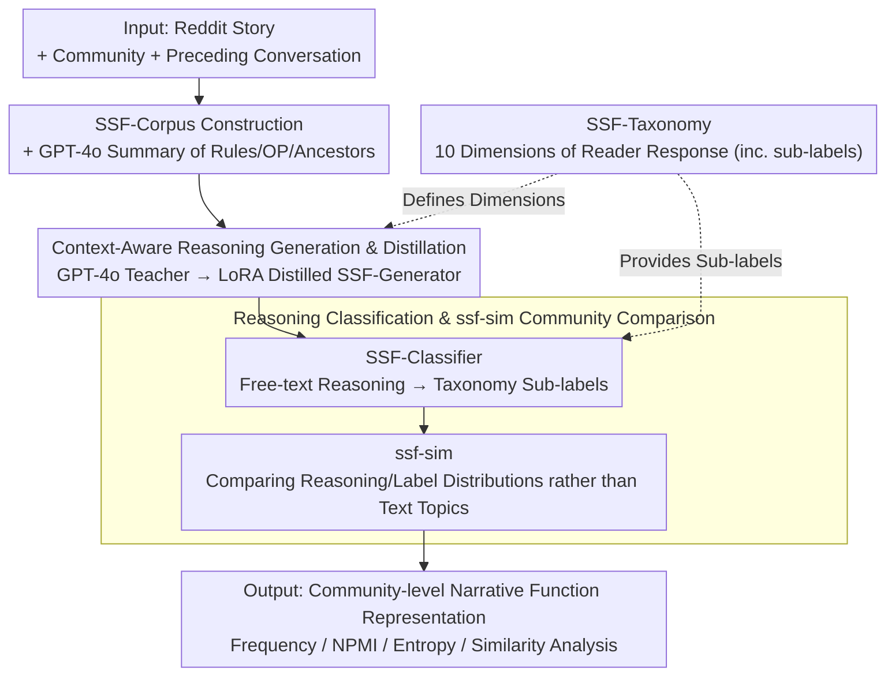

# Social Story Frames: Contextual Reasoning about Narrative Intent and Reception

**Conference**: ACL2026  
**arXiv**: [2512.15925](https://arxiv.org/abs/2512.15925)  
**Code**: social-story-frames (Project name provided in the paper; full URL not expanded in the main text)  
**Area**: NLP Understanding / Computational Social Science / Narrative Reasoning  
**Keywords**: Narrative Understanding, Reader Response, Social Media, Contextual Reasoning, Model Distillation

## TL;DR
This paper proposes SocialStoryFrames, utilizing a 10-dimensional reader response taxonomy and two distilled models to situate Reddit stories within their community and conversational contexts. It infers narrative intent, reader sentiment, and value judgments, demonstrating a more granular analysis of community narrative practices than semantic similarity across 6,140 social media stories.

## Background & Motivation
**Background**: NLP treatment of stories has long leaned toward internal content, such as event causality, character psychology, plot consistency, or local reader reactions like suspense and curiosity. Computational social science also analyzes narratives in online communities, but common practices either involve deep studies of single communities or statistical analysis of story counts, structural prototypes, or topic distributions across large corpora.

**Limitations of Prior Work**: These two approaches face clear trade-offs between depth and scale. Case studies explain power, identity, or emotional negotiation within a community but are hard to compare across dozens of communities; large-scale analyses scale easily but often simplify stories into text topics or embedding similarities, losing the socio-pragmatic layers of "why the author told this story" and "how readers might understand it."

**Key Challenge**: Social media stories are not isolated texts. A product failure story in r/buildapc and a trial failure story in r/MakeupAddiction have completely different surface topics, yet both might involve seeking advice, validating experiences, or gaining emotional support. Focusing only on story text misses this similarity in "narrative function," while manual interpretation cannot cover a massive number of communities.

**Goal**: The authors aim to construct a formalized framework with both theoretical explanatory power and the capability for batch application by models. The objective is to answer three types of questions: what intent a story is perceived to have within a specific community and conversation; what interpretations, predictions, emotions, and value judgments readers generate; and whether narrative practices across different communities can be compared beyond semantic topics.

**Key Insight**: The paper operationalizes concepts from reader response theory, narrative theory, pragmatics, and psychology into a SocialStoryFrames taxonomy. Reference reasoning is generated using GPT-4o / GPT-4.1 and distilled into open-weight models. This preserves theoretical dimensions while transforming expensive expert or closed-source model reasoning into a reproducible batch pipeline.

**Core Idea**: Utilizing "Community Context + Conversational Context + Reader Response Taxonomy" to replace pure text semantic representations, modeling the social functions and reception of stories in online communities.

## Method
SocialStoryFrames is not a single classifier but a complete pipeline covering theoretical taxonomy, corpus construction, context summarization, reasoning generation, reasoning classification, and community analysis. The input is a Reddit comment containing a story, its community information, and the preceding conversation; the output consists of free-text reasoning across multiple dimensions and taxonomy label distributions.

### Overall Architecture
The process is divided into four steps. First, stories are filtered from ConvoKit's reddit-corpus-small to construct the SSF-Corpus, retaining community and conversational context for each story. Second, GPT-4o summarizes subreddit purposes, rules, original posts, and ancestor/sibling comments, allowing the model to see the context actual readers would have. Third, the SSF-Generator produces reader response reasoning for each taxonomy dimension, such as author intent, causal explanations, future predictions, or aesthetic feelings. Fourth, the SSF-Classifier maps free-text reasoning to fine-grained taxonomy sub-labels, resulting in statistical, comparable community-level narrative representations. The SSF-Taxonomy governs both the 10 dimensions for reasoning generation and the sub-labels for classification.

### Key Designs

**1. SSF-Taxonomy Reader Response Dimensions: Deconstructing "how readers understand a story" into 10 operational dimensions.**

Relying solely on story text often results in models outputting "this comment is sad" or "similar topics," missing the socio-pragmatic layer. Instead of unsupervised clustering, the SSF-Taxonomy organizes 10 dimensions—overall goal, narrative intent, author emotional response, causal explanation, prediction, character appraisal, moral, stance, narrative feeling, and aesthetic feeling—derived from reader response theory, narrative theory, pragmatics, emotional psychology, and value theory. Each dimension includes sub-categories; for instance, narrative intent includes identity expression, sense-making, emotional release, entertainment, argumentation, and seeking support, while moral uses high-level categories from Schwartz's value theory.

**2. Context-Aware Reasoning Generation & Distillation: Relying on community norms and conversational history, then transferring closed-source power to open-source students.**

Reader response is highly context-dependent. GPT-4o acts as a teacher to generate up to 3 independent reasonings for each story-dimension pair in the SSF-Split-Corpus, constrained by dimension-specific templates via free-text. GPT-4o is also used to summarize subreddit purposes, rules, the original post, and ancestor comments to provide the model with the reader's actual context. Subsequently, Llama3.1-8B-Instruct is distilled using LoRA to become the SSF-Generator, turning expensive closed-source reasoning into a batch-processable and reproducible pipeline.

**3. Reasoning Classification and ssf-sim Community Comparison: Compressing free-text reasoning into label distributions to compare communities with "different topics but similar narrative functions."**

Free-text reasoning is information-dense but difficult to quantify. Zero-shot multi-label inference classification performed poorly; therefore, the authors used k-shot prompting with GPT-4.1 to generate classification references and distilled the SSF-Classifier to map each reasoning to taxonomy sub-labels. Community similarity, *ssf-sim*, compares the reasoning and label distributions from the SSF-Generator and SSF-Classifier rather than raw text embeddings. This allows for frequency, NPMI, entropy, and similarity analysis at the community level, enabling *ssf-sim* to identify community pairs like r/MakeupAddiction and r/buildapc that share narrative functions despite disparate topics.

### Loss & Training
The paper does not emphasize a new training loss; the core strategy is teacher-student distillation. The generation side uses GPT-4o for reference reasoning to fine-tune Llama3.1-8B-Instruct via LoRA. The classification side uses GPT-4.1 k-shot outputs as references to fine-tune open-source models for zero-shot multi-label classification. In the SSF-Split-Corpus (1,778 stories), the Train/Val/Test split is roughly 2/3, 1/6, 1/6, with 10% of stories in validation and testing coming from 55 unseen subreddits to evaluate cross-community generalization.

## Key Experimental Results

### Main Results

| Target | Setting | Key Metric | Result | Description |
|--------|---------|------------|--------|-------------|
| SSF-Corpus | Filtered from 100 Subreddits | Story Count | 6,140 | Each includes story, conversation, and community context |
| SSF-Split-Corpus | Train/Val/Test | Story Count | 1,778 | Val/Test each contain 10% unseen subreddits |
| GPT-4o Reasoning Plausibility | Prolific Human Eval | Valid Ratings | 4,239 ratings / 278 annotators | Representative US adult sample |
| SSF-Generator Output Plausibility | Human Eval | Plausible % | >=94% | Most reasonings deemed contextually reasonable |
| SSF-Generator Output Likelihood | Human Eval | Somewhat/Very Likely | >=78% | Deemed plausible and highly probable |
| *ssf-sim* Construct Validity | 50 Story Pair Comp. | Agreement with Human | 74% | Sentence-BERT baseline is 52% |

### Ablation Study

| Configuration | Key Metric | Description |
|---------------|------------|-------------|
| Full context SSF-Generator | Best alignment with GPT-4o teacher | Uses story, community, and conversational context |
| W/O Community Context | Alignment drop | Community norms and values affect reader interpretation |
| W/O Conversational Context | Significant drop | Conversational context is particularly critical |
| Sentence-BERT semantic similarity | 52% human-aligned | Topic similarity fails to capture functional similarity |
| *ssf-sim* | 74% human-aligned | Based on reasoning and taxonomy labels, closer to pragmatic function |

### Key Findings
- Narrative intent distribution shows the most common intent is to *justify or challenge a belief* (40%), followed by *clarification* and *emotional release* (14% each), and *identity* and *entertainment* (10% each). This indicates online stories often serve argumentative and social negotiation functions rather than just entertainment.
- *Emotional support* in overall goal correlates strongly with *conveying a similar experience* in narrative intent (NPMI = 0.35), supporting the mechanism of empathy through shared experience.
- The SSF-Classifier approaches GPT-4.1 k-shot performance. Its Micro F1 scores exceed, match, or are within 0.05 of GPT-4.1 on 7/10 dimensions, with no dimension trailing GPT-4.1 by more than 0.1.
- Community comparisons reveal that r/MakeupAddiction and r/buildapc share similar narrative functions despite topic differences, whereas r/funny and r/news/r/politics may have entirely different narrative orientations despite topic proximity.

## Highlights & Insights
- Shifting "story understanding" from internal text to social context is the most valuable contribution. The framework asks not just what happened, but how the story is used and received within a community.
- The taxonomy design is restrained: 10 dimensions provide sufficient breadth while sub-labels maintain statistical utility. This is more suitable for cross-community analysis than long LLM explanations.
- *ssf-sim* is a highly transferable concept. Similarity in many tasks should compare "communicative function" and "expected response" rather than just content—e.g., in customer service, medical narratives, or product reviews.
- Human validation is applied at two levels: first for the plausibility of generated reasoning, then for the construct validity of the similarity metric, ensuring social science measurement rigor rather than just LLM prompting.

## Limitations & Future Work
- Context summarization uses iterative techniques, which may lead to information loss, especially for stories requiring specific details or short contexts.
- The current model and corpus focus on English Reddit with US-based human evaluators, potentially introducing cultural, gender, and ideological biases.
- The taxonomy is not exhaustive; aspects like narrative absorption, complex aesthetic emotions, reader identity differences, and inter-dimensional dependencies are simplified.
- The model assumes a "typical reader response" for a community, which may not hold in highly polarized or specialized subreddits.
- Future work could build joint structural models for dimensions to explicitly model dependencies between intent, stance, emotion, and morals.

## Related Work & Insights
- **vs. Traditional Commonsense Reasoning**: Unlike ATOMIC/COMET, which performs decontextualized reasoning on short events, this work embeds stories in communities and conversations to infer social function.
- **vs. Narrative Schemas**: While previous NLP focuses on plot or causal consistency, this work focuses on "why" a story is told and "how" it is understood.
- **vs. Sentence-BERT**: Semantic similarity finds topic-proximate texts, whereas *ssf-sim* finds communities with similar narrative functions despite different topics.
- **Insight**: The "theory taxonomy + LLM distillation + human construct validation" pipeline is well-suited for high-level social semantics tasks, such as value conflict identification, community norm modeling, and stance/support analysis in multi-party dialogues.

## Rating
- Novelty: ⭐⭐⭐⭐
- Experimental Thoroughness: ⭐⭐⭐⭐
- Writing Quality: ⭐⭐⭐⭐⭐
- Value: ⭐⭐⭐⭐

<!-- RELATED:START -->

## Related Papers

- [\[ICLR 2026\] ACPBench Hard: Unrestrained Reasoning about Action, Change, and Planning](../../ICLR2026/model_compression/acpbench_hard_unrestrained_reasoning_about_action_change_and_planning.md)
- [\[CVPR 2025\] ECVC: Exploiting Non-Local Correlations in Multiple Frames for Contextual Video Compression](../../CVPR2025/model_compression/ecvc_exploiting_non-local_correlations_in_multiple_frames_for_contextual_video_c.md)
- [\[CVPR 2026\] Rethinking Dataset Distillation: Hard Truths about Soft Labels](../../CVPR2026/model_compression/rethinking_dataset_distillation_hard_truths_about_soft_labels.md)
- [\[ACL 2026\] JudgeMeNot: Personalizing Large Language Models to Emulate Judicial Reasoning in Hebrew](judgemenot_personalizing_large_language_models_to_emulate_judicial_reasoning_in_.md)
- [\[AAAI 2026\] Efficient Reasoning for Large Reasoning Language Models via Certainty-Guided Reflection Suppression](../../AAAI2026/model_compression/efficient_reasoning_for_large_reasoning_language_models_via_certainty-guided_ref.md)

<!-- RELATED:END -->
