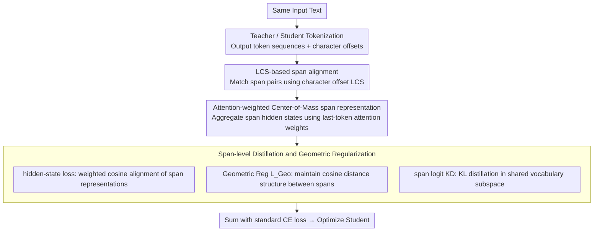

# SRA: Span Representation Alignment for Large Language Model Distillation

**Conference**: ACL 2026  
**arXiv**: [2605.01205](https://arxiv.org/abs/2605.01205)  
**Code**: No public repository provided in the paper  
**Area**: Model Compression / Knowledge Distillation / Cross-Tokenizer Distillation  
**Keywords**: Cross-tokenizer distillation, span alignment, center of mass, geometric regularization, LLM compression

## TL;DR
SRA replaces the fragile token-level alignment unit in cross-tokenizer LLM distillation with tokenizer-agnostic text spans. By utilizing LCS character offset matching, attention-weighted center-of-mass representations, geometric structure regularization, and shared vocabulary span logit distillation, it consistently outperforms ULD, MinED, DSKD, and MultiLevelOT across multiple teacher-student compression experiments.

## Background & Motivation
**Background**: Knowledge Distillation (KD) is a common compression technique used to transfer capabilities from large language models to smaller ones. Traditional KD usually assumes that the teacher and student share the same tokenizer, allowing for direct alignment of tokens or logit distributions. However, in real-world deployments, different model families often utilize different vocabularies and segmentation rules.

**Limitations of Prior Work**: Cross-Tokenizer Knowledge Distillation requires alignment across different tokenizers. Existing methods either use edit distance, dynamic programming, or Optimal Transport (OT) to process token sequences, or map different vocabularies into a unified space. However, token-level alignment is vulnerable to differences in segmentation granularity: a single text segment may be one token in the teacher but split into multiple tokens in the student.

**Key Challenge**: Distillation aims to transfer semantic and representational dynamics, but tokenizer mismatch prevents token sequences from serving as stable, one-to-one units. Directly aligning tokens confuses "segmentation differences" with "knowledge differences."

**Goal**: The authors aim to construct a distillation unit that is stable across tokenizers, enabling the teacher and student to align hidden states, geometric structures, and predictive distributions on the same text spans.

**Key Insight**: The paper adopts a physical perspective of Transformer as a Multi-Particle Dynamical System: token hidden states are viewed as particle positions, spans as particle clusters, and span representations as the attention-weighted center of mass.

**Core Idea**: First, character offsets are used to find text spans covered by both the teacher and student. Then, attention weighting aggregates these into span representations, followed by span-level distillation of hidden states, geometric structures, and logits.

## Method
The design of SRA can be interpreted as "identifying common semantic units first, then transferring representation dynamics." It avoids hard matching between token sequences of different tokenizers. Instead, it returns to the original string and uses character offsets to find spans interpretable by both sides. SRA requires not only that the student's span representation approaches the teacher's but also that the relative geometric relationships between spans are preserved.

### Overall Architecture
Given the same text, the teacher and student tokenizers output token sequences and character offsets, respectively. SRA constructs aligned spans using the Longest Common Subsequence (LCS) of the offset sequences. For each span, the model aggregates span representations from the final layer's hidden states using attention-weighted pooling. During training, the student optimizes standard CE, span hidden-state loss, geometric structure regularization, and span-level logit KD loss.

### Key Designs

**1. LCS-based span mapping: Establishing comparable text fragment units across different tokenizers**

Token-level alignment is fragile in cross-tokenizer scenarios: the same text might be one token in the teacher and multiple in the student. Directly aligning them mistakes "segmentation variation" for "knowledge difference." SRA returns to the raw string, calculating the Longest Common Subsequence (LCS) of the token character offset sequences for both teacher and student. Fragments with identical character boundaries are paired as spans, while special tokens with zero offset are ignored. The resulting spans cover shared sub-fragments regardless of token count, making character spans a stable carrier for knowledge transfer.

**2. Attention-weighted Center-of-Mass span representation: Aggregating hidden states of multiple tokens within a span into a single semantic representation**

Simple mean pooling dilutes key information. SRA adopts the physical view of Transformers as multi-particle dynamical systems: token hidden states act as particle positions, a span is a particle cluster, and the span representation is the attention-weighted center of mass. Specifically, the attention weights from the last token to all other tokens are used as importance $w_t$. After normalization, the weighted average of the span is calculated:

$$C_i=\sum_{t=s_i}^{e_i} w_t H_t$$

where $w_t$ is aggregated from multi-head attention in the final layer. Particles with more mass exert more influence on the center of mass; in text, tokens that receive more attention contribute more to the span representation, preventing key information from being averaged out.

**3. Span-level hidden/logit distillation and geometric regularization: Enabling the student to learn local span representations, relative structures, and shared vocabulary distributions**

Aligning only the position of span representations can be distorted by linear projections, while aligning only hidden states lacks vocabulary prediction knowledge. SRA employs three supervision channels: hidden-state loss uses weighted cosine to align teacher and student span representations; geometric regularization $L_{Geo}$ preserves the cosine distance structure between spans; and logit loss performs KL distillation after projecting teacher and student span logits into the shared vocabulary subspace $V_T \cap V_S$. Geometric regularization maintains the relative structure of the representation space, and shared logit loss provides vocabulary-level supervision. Ablations show these signals are complementary.

### Loss & Training
The overall objective is $L_{overall}=\alpha L_{CE}+(1-\alpha)(L_{HS}^{Span}+L_{KD}^{Span})$. $L_{HS}^{Span}$ includes weighted cosine loss and geometric structure regularization, while $L_{KD}^{Span}$ aligns span logits in the shared vocabulary space. Training data uses Databricks-Dolly-15k. Evaluation covers Dolly, VicunaEval, SelfInst, S-NI, and DialogSum using ROUGE-L, with results averaged over 5 random seeds.

## Key Experimental Results

### Main Results

| Teacher → Student | Strongest non-SRA baseline Avg | SRA Avg | Observations |
|--------|------|------|------|
| Qwen1.5-1.8B → GPT-2 120M | DSKD 15.35 | 17.97 | Most significant improvement on smallest student |
| Qwen1.5-1.8B → GPT-2 340M | DSKD 15.57 | 18.10 | S-NI improved from 17.18 to 24.49 |
| Qwen2.5-7B → GPT-2 1.5B | DSKD 19.27 | 20.99 | Effective with larger teacher and GPT-2 student |
| Qwen2.5-7B → OPT-2.7B | DSKD 20.15 | 20.92 | Maintains lead on OPT student |
| Mistral-7B → TinyLLaMA-1.1B | DSKD 21.33 | 22.52 | Robust across architectures and vocabularies |
| GPT-2 1.5B → GPT-2 120M | AKL 17.03 | 19.24 | Benefits even in same-tokenizer scenarios |

### Ablation Study

| Configuration | Qwen1.5→GPT-2 340M Avg | Qwen1.5→GPT-2 120M Avg | Description |
|------|------|------|------|
| Span logit KD only | 17.36 | 17.10 | Shared vocabulary distillation yields initial gain |
| Span logit KD + Geo Reg | 17.94 | 17.72 | Geometric structure preservation adds stable gain |
| Span logit KD + Cosine | 17.54 | 17.32 | Point alignment helps but is less sufficient than Geo |
| Cosine + Geo Reg | 17.48 | 16.04 | Less stable without logit KD |
| Full SRA | 18.10 | 17.97 | Complementary signals yield best performance |

| WSL / WSP Configuration | GPT-2 340M Avg | GPT-2 120M Avg | Description |
|------|------|------|------|
| W/O WSL & WSP | 16.99 | 14.85 | Span representation quality drops significantly |
| WSL only | 17.11 | 15.77 | Weighted loss provides some help |
| WSP only | 17.36 | 15.89 | Weighted pooling is more important than mean pooling |
| WSL + WSP | 18.10 | 17.97 | Shows span weight design is a core component |

### Key Findings
- SRA achieves the highest average ROUGE-L across all teacher-student configurations, proving span-level alignment provides stable gains for cross-tokenizer distillation rather than being an accidental success for specific models.
- Geometric regularization and attention weighting are not decorative: removing WSP or WSL leads to performance drops, especially noticeable in smaller models like GPT-2 120M.
- Training efficiency data shows SRA steps take 0.2754s, faster than DSKD (0.3520s), MinED (0.4244s), and ULD (0.4393s), at the cost of 21.96GB VRAM, slightly higher than MinED/ULD (19.63GB).

## Highlights & Insights
- The most ingenious aspect is converting the tokenizer mismatch from a discrete token alignment problem into a continuous span representation problem. Spans derived from character boundaries are naturally closer to semantic units than tokens.
- While the Multi-Particle / Center-of-Mass analogy is theoretical, the implementation is highly practical: "span pooling with attention importance + preservation of relative geometric structure."
- SRA is applicable not only to different tokenizers but also provides gains in same-tokenizer distillation, indicating it captures structural differences in teacher-student representation spaces beyond mere vocabulary overlap.

## Limitations & Future Work
- Current logit mapping is static and aligned only within the shared vocabulary subspace, potentially ignoring fine-grained knowledge in non-shared vocabularies.
- Span representation alignment requires online teacher inference; pre-calculating all teacher span embeddings would incur extremely high storage costs.
- Experiments were constrained by compute budgets, focusing on fixed benchmarks and decoder-to-decoder settings; verification on embedding models, encoder-decoder models, and longer context tasks is still needed.
- LCS depends on character offsets; span matching quality may become a bottleneck for mixed-language text, complex Unicode segmentation, or highly morphologically rich languages.

## Related Work & Insights
- **vs ULD / MinED**: These methods focus on token-level or edit-distance alignment. SRA retreats to the text span level, reducing noise from tokenizer granularity differences.
- **vs DSKD**: DSKD performs distribution alignment via a unified space. SRA aligns hidden geometry and span logits simultaneously, providing richer knowledge channels.
- **vs MultiLevelOT**: OT methods handle distribution matching but have high computational complexity. SRA's LCS + span pooling is more lightweight and faster per step.
- **vs Same-tokenizer KD**: SeqKD, RKL, JS, SKL, AKL, etc., assume consistent vocabularies. SRA’s improvement in same-tokenizer settings suggests span geometric distillation can serve as a general-purpose KD component.

## Rating
- Novelty: ⭐⭐⭐⭐☆ The combination of span-level CoM representation and geometric regularization is distinctive, with a clear physical design motivation.
- Experimental Thoroughness: ⭐⭐⭐⭐☆ Good coverage of teacher-student pairs, same/cross-tokenizer setups, ablations, and efficiency; could be extended to larger scales.
- Writing Quality: ⭐⭐⭐⭐☆ The methodological chain is complete, and formulas correspond clearly to the implementation.
- Value: ⭐⭐⭐⭐⭐ Highly practical for cross-model family distillation and small model deployment, particularly in real-world scenarios with inconsistent tokenizers.

<!-- RELATED:START -->

## Related Papers

- [\[ACL 2026\] MTA: Multi-Granular Trajectory Alignment for Large Language Model Distillation](mta_multi-granular_trajectory_alignment_for_large_language_model_distillation.md)
- [\[ACL 2026\] Alignment Tuning for Large Language Models: A Data-Centric Lens on Alignment Data Pipelines](alignment_tuning_for_large_language_models_a_data-centric_lens_on_alignment_data.md)
- [\[ACL 2025\] Quantification of Large Language Model Distillation](../../ACL2025/model_compression/quantification_of_large_language_model_distillation.md)
- [\[ICLR 2026\] Distillation of Large Language Models via Concrete Score Matching](../../ICLR2026/model_compression/distillation_of_large_language_models_via_concrete_score_matching.md)
- [\[ACL 2026\] LightReasoner: Can Small Language Models Teach Large Language Models Reasoning?](lightreasoner_can_small_language_models_teach_large_language_models_reasoning.md)

<!-- RELATED:END -->
