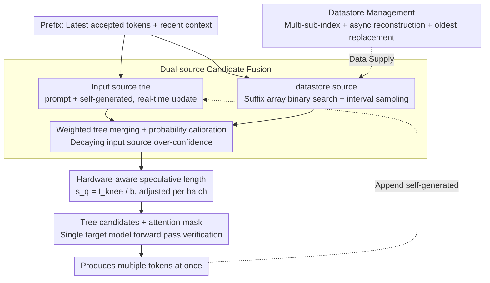

<!-- Automatically generated by src/gen_stubs.py -->
# SSSD: Simply-Scalable Speculative Decoding

**Conference**: ACL2026
**arXiv**: [2411.05894](https://arxiv.org/abs/2411.05894)  
**Code**: [GitHub](https://github.com/huawei-csl/sssd_speculator)  
**Area**: Model Compression
**Keywords**: Speculative Decoding, LLM Inference Acceleration, n-gram Matching, Training-free, Hardware-aware

## TL;DR

Ours proposes SSSD, a training-free speculative decoding method that combines lightweight n-gram matching with hardware-aware speculative length adjustment. It achieves up to $2.9\times$ inference acceleration without requiring any draft model training or deployment, demonstrating superior robustness over training-based methods in language/domain transfer and long-context scenarios.

## Background & Motivation

Speculative Decoding (SD) is a popular technique for accelerating LLM inference, but existing methods face two major practical deployment bottlenecks: (1) Training-based methods (e.g., EAGLE, Medusa) require training and deploying additional draft models, which adds maintenance complexity and necessitates retraining when target models or application domains change. (2) Existing model-free methods (e.g., Prompt Lookup Decoding, REST) have limited speculation quality and are only effective for specific tasks. In production systems, ease of integration and cost efficiency are as important as raw latency improvements. Furthermore, prior work indicates that training-based draft models generalize poorly across non-English languages, creating unfairness in inference speed. SSSD aims to fill the gap of "high performance and easy deployment."

## Method

### Overall Architecture

SSSD treats the prompt + self-generated text as a unified n-gram source and integrates it with a large text datastore. The prefix of the latest token is matched across both sources. The matched continuations are combined via weighted merging and probability calibration to construct a tree-based candidate set. Finally, a hardware-aware speculative length determines how many candidates are submitted to the target model for one-step verification. The entire draft generation process runs on the CPU, consuming no GPU resources.

### Key Designs

1.  **Dual-source Candidate Fusion**: Merges candidates from the prompt/self-output (stored in a trie structure, updated in real-time) and an external large-scale datastore (built based on suffix arrays). These two sources provide complementary candidates—the prompt source is sensitive to the current context, while the datastore source covers broader linguistic patterns. Weighted tree merging is applied, along with decay calibration for the over-confidence probability of the prompt source.
2.  **Datastore Management**: Employs a multi-sub-index architecture (each sub-index containing 512M tokens, $\approx 4\text{GB}$), supporting asynchronous reconstruction and oldest replacement strategies. Logarithmic search based on suffix arrays keeps retrieval latency low and approximately independent of datastore size. It supports a cold start—achieving $1.1\times$-$1.23\times$ acceleration even starting from an empty datastore.
3.  **Hardware-aware Speculative Length**: Dynamically selects the optimal speculative length $s_q = I_{knee} / b$ based on the Roofline model (where $I_{knee}$ is the peak FLOPS/bandwidth ratio and $b$ is the batch size). For small batch sizes, $s_q$ is larger (more speculation), while for large batch sizes, $s_q$ is reduced, automatically adapting to hardware resource utilization.

### Loss & Training

SSSD is entirely training-free. The weight fusion parameters for the n-gram models are determined through a simple grid search and are transferable across different models and tasks. It supports both greedy decoding and speculative sampling modes.

## Key Experimental Results

### Main Results

End-to-end evaluation on Llama-3.1-8B integrated into SGLang:

| Method | MT-Bench | MATH-500 | HumanEval | MT-Bench (German) | Training Requirement |
| :--- | :--- | :--- | :--- | :--- | :--- |
| Autoregressive | $1.00\times$ | $1.00\times$ | $1.00\times$ | $1.00\times$ | None |
| EAGLE-2 | $\approx 1.6\times$ | $\approx 1.5\times$ | $\approx 1.5\times$ | $\approx 1.3\times$ | Required |
| EAGLE-3 | $\approx 1.8\times$ | $\approx 1.6\times$ | $\approx 1.7\times$ | $\approx 1.4\times$ | Required |
| PLD | $\approx 1.2\times$ | $\approx 1.1\times$ | $\approx 1.2\times$ | $\approx 1.1\times$ | None |
| REST | $\approx 1.4\times$ | $\approx 1.3\times$ | $\approx 1.3\times$ | $\approx 1.2\times$ | None |
| **SSSD** | **$\approx 1.7\times$** | **$\approx 1.8\times$** | **$\approx 1.6\times$** | **$\approx 1.6\times$** | **None** |

Long Context (PG-19, 40k tokens):

| Method | Llama-3.1-8B | Llama-3.3-70B |
| :--- | :--- | :--- |
| Lookahead | $1.08\times$ | $1.15\times$ |
| EAGLE-3 | $0.80\times$ | $1.09\times$ |
| **SSSD** | **$1.23\times$** | **$1.26\times$** |

DeepSeek-R1-Distill-Llama-8B (MATH-500): SSSD achieves $2.29\times$ speedup (batch=1) and is the only method that maintains acceleration under large batch sizes.

### Ablation Study

| Experiment | Key Findings |
| :--- | :--- |
| Candidate Source Decomposition | Contributions of prompt and datastore sources are nearly perfectly additive, validating complementarity. |
| Datastore Cold Start | Empty datastore yields $1.1\times$-$1.23\times$ speedup; reaches $1.6\times$-$1.8\times$ after 1000 dialogues. |
| Model Gen vs Dataset Data | Predicting correct tokens from model-generated data is $35\%$ higher. |
| Cross-lingual Adaptation | English datastore provides initial gains for new languages, converging to monolingual performance as data accumulates. |
| Hardware-aware $s_q$ Adjustment | Automatically adapts to various batch sizes without manual hyperparameter tuning. |

### Key Findings

-   SSSD consistently outperforms all n-gram methods and EAGLE-2 in all tests, and matches or exceeds EAGLE-3 in most scenarios.
-   Speedup is more significant in non-English languages ($1.6\times$-$1.8\times$ vs. $1.4\times$ for English), helping to mitigate cross-lingual latency unfairness caused by tokenizers.
-   In long-context and agentic workloads, SSSD shows greater advantages (up to $1.9\times$ throughput improvement) because the drafting cost is independent of sequence length.

## Highlights & Insights

-   **Deployment Friendliness**: Zero training, zero extra GPU memory, and zero model alignment requirements. Drafting runs on the CPU, making it plug-and-play for existing serving systems.
-   **Cold-start Capability**: Provides immediate speedup from an empty datastore and adaptively improves with usage, fitting progressive real-world deployment scenarios.
-   **System-Algorithm Co-optimization**: Views inference acceleration as a joint algorithm-system problem; the $s_q$ selection guided by the Roofline model is an elegant engineering insight.
-   **Cross-lingual Fairness**: Requires no language-specific training and achieves greater speedups in low-resource languages, reducing language bias in inference efficiency.

## Limitations & Future Work

-   Gains are limited for MoE models as increasing speculative length activates more experts, thereby increasing memory loading overhead.
-   MLA attention (e.g., DeepSeek-V2) uses computationally intensive FlashMLA kernels, which have poor compatibility with speculative decoding.
-   The drafting stage relies on CPU performance and host memory, which may be constrained in resource-limited deployment environments.
-   Privacy considerations exist when using historical output as a candidate source, although it does not introduce additional information leakage.

## Related Work & Insights

-   **EAGLE / EAGLE-3** (Li et al., 2024/2025): Trained speculative heads; strong performance but high deployment complexity.
-   **REST** (He et al., 2024): Retrieval-based speculation using external corpora. SSSD introduces several improvements to its datastore design (interval sampling, no pruning, multi-sub-indexing).
-   **Prompt Lookup Decoding** (Saxena, 2023): Simple n-gram matching using only the prompt. SSSD significantly improves candidate quality by adding a datastore.
-   Insight: In the field of inference acceleration, "good enough + minimal deployment" is often more valuable than "optimal but complex."

## Rating

| Dimension | Score (1-10) |
| :--- | :--- |
| Novelty | 7 |
| Experimental Thoroughness | 9 |
| Writing Quality | 8 |
| Value | 9 |
| Overall | 8.3 |

## Rating
- Novelty: TBD
- Experimental Thoroughness: TBD
- Writing Quality: TBD
- Value: TBD

<!-- RELATED:START -->

## Related Papers

- [\[AAAI 2026\] Steering Pretrained Drafters during Speculative Decoding](../../AAAI2026/model_compression/steering_pretrained_drafters_during_speculative_decoding.md)
- [\[ACL 2026\] Calibrated Speculative Decoding: Frequency-Guided Candidate Selection for Efficient Inference](calibrated_speculative_decoding_frequency-guided_candidate_selection_for_efficie.md)
- [\[NeurIPS 2025\] Traversal Verification for Speculative Tree Decoding](../../NeurIPS2025/model_compression/traversal_verification_for_speculative_tree_decoding.md)
- [\[ICML 2026\] LK Losses: Direct Acceptance Rate Optimization for Speculative Decoding](../../ICML2026/model_compression/lk_losses_direct_acceptance_rate_optimization_for_speculative_decoding.md)
- [\[ICML 2026\] SPEED-Bench: A Unified and Diverse Benchmark for Speculative Decoding](../../ICML2026/model_compression/speed-bench_a_unified_and_diverse_benchmark_for_speculative_decoding.md)

<!-- RELATED:END -->
