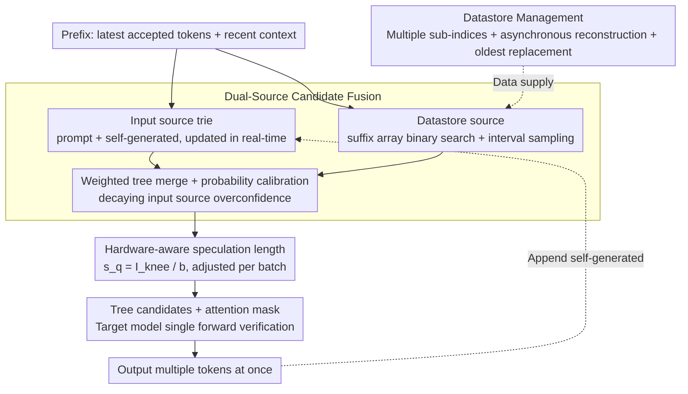

<!-- 由 src/gen_stubs.py 自动生成 -->
# SSSD: Simply-Scalable Speculative Decoding

**Conference**: ACL2026  
**arXiv**: [2411.05894](https://arxiv.org/abs/2411.05894)  
**Code**: [GitHub](https://github.com/huawei-csl/sssd_speculator)  
**Area**: Model Compression  
**Keywords**: Speculative Decoding, LLM Inference Acceleration, n-gram matching, training-free, hardware-aware

## TL;DR

The authors propose SSSD, a training-free speculative decoding method that combines lightweight n-gram matching with hardware-aware speculation length adjustment. Without requiring the training or deployment of any draft models, it achieves up to 2.9× inference speedup and demonstrates superior robustness compared to training-based methods in language/domain migration and long-context scenarios.

## Background & Motivation

Speculative Decoding (SD) is a popular technique for accelerating LLM inference, yet existing methods face two major practical deployment bottlenecks: (1) Training-based methods (e.g., EAGLE, Medusa) require training and deploying additional draft models, necessitating retraining when target models or application domains change, which increases maintenance complexity; (2) Existing model-free methods (e.g., Prompt Lookup Decoding, REST) offer limited speculation quality and are only effective for specific tasks. In real production systems, ease of integration and cost efficiency are as critical as raw latency improvements. Furthermore, prior work indicates that training-based draft models generalize poorly to non-English languages, creating unfairness in inference speed. SSSD aims to fill this gap between "high performance" and "easy deployment."

## Method

### Overall Architecture

SSSD treats the prompt + self-generated text as a unified n-gram source and integrates it with a large-scale text datastore. The prefix of the latest tokens is matched against both sources. The matched continuations are merged via weighted combination and probability calibration to construct tree-structured candidate sets. A hardware-aware speculation length then determines how many candidates are submitted to the target model for one-shot verification. The entire draft generation process runs on the CPU, consuming no GPU resources.

### Key Designs

1.  **Dual-Source Candidate Fusion**: This merges candidates from the prompt/self-output (stored in a trie structure, updated in real-time) and an external large-scale datastore (constructed using suffix arrays). The two sources provide complementary candidates—the prompt source is sensitive to the current context, while the datastore source covers broader language patterns. Through weighted tree merging, the overconfidence probability of the prompt source is calibrated via decay.
2.  **Datastore Management**: A multiple sub-index architecture is adopted (each sub-index contains 512M tokens, $\approx$ 4GB), supporting asynchronous reconstruction and oldest-replacement strategies. Logarithmic search based on suffix arrays keeps retrieval latency low and nearly independent of the datastore size. It supports cold-start—even starting from an empty datastore can yield 1.1-1.23× speedup.
3.  **Hardware-aware Speculation Length**: Based on the Roofline model, the optimal speculation length $s_q = I_{knee} / b$ is dynamically selected (where $I_{knee}$ is the peak FLOPS/bandwidth ratio and $b$ is the batch size). $s_q$ is larger (more speculation) under small batches and decreases under large batches, automatically adapting to hardware resource utilization.

### Loss & Training

SSSD is entirely training-free. The weight fusion parameters for the n-gram model are determined through a simple grid search and are transferable across different models and tasks. It supports both greedy decoding and speculative sampling modes.

## Key Experimental Results

### Main Results

Integrated into SGLang, end-to-end evaluation on Llama-3.1-8B:

| Method | MT-Bench | MATH-500 | HumanEval | MT-Bench (German) | Training Required |
| :--- | :--- | :--- | :--- | :--- | :--- |
| Autoregressive | 1.00× | 1.00× | 1.00× | 1.00× | None |
| EAGLE-2 | ~1.6× | ~1.5× | ~1.5× | ~1.3× | Yes |
| EAGLE-3 | ~1.8× | ~1.6× | ~1.7× | ~1.4× | Yes |
| PLD | ~1.2× | ~1.1× | ~1.2× | ~1.1× | None |
| REST | ~1.4× | ~1.3× | ~1.3× | ~1.2× | None |
| **SSSD** | **~1.7×** | **~1.8×** | **~1.6×** | **~1.6×** | **None** |

Long Context (PG-19, 40k tokens):

| Method | Llama-3.1-8B | Llama-3.3-70B |
| :--- | :--- | :--- |
| Lookahead | 1.08× | 1.15× |
| EAGLE-3 | 0.80× | 1.09× |
| **SSSD** | **1.23×** | **1.26×** |

DeepSeek-R1-Distill-Llama-8B (MATH-500): SSSD achieves a 2.29× speedup ($batch=1$) and is the only method that maintains speedup under large batch sizes.

### Ablation Study

| Experiment | Key Findings |
| :--- | :--- |
| Candidate Source Decomposition | Contributions from prompt and datastore sources are almost perfectly additive, validating complementarity. |
| Datastore Cold-start | An empty datastore yields 1.1-1.23× speedup, reaching 1.6-1.8× after 1000 dialogues. |
| Model Generation vs. Dataset Data | The correct token prediction rate for model self-generated data is 35% higher. |
| Cross-lingual Adaptation | English datastores provide initial gains for new languages, converging to monolingual performance as data accumulates. |
| Hardware-aware $s_q$ Regulation | Automatically adapts to different batch sizes without manual parameter tuning. |

### Key Findings

*   SSSD consistently outperforms all n-gram methods and EAGLE-2 in all tests, and matches or exceeds EAGLE-3 in most scenarios.
*   Acceleration is more significant in non-English languages (1.6-1.8× vs. 1.4× in English), helping mitigate cross-lingual latency unfairness caused by tokenizers.
*   In long-context and agentic workloads, SSSD shows a larger advantage (up to 1.9× throughput improvement) because its drafting cost is independent of context length.

## Highlights & Insights

*   **Deployment Friendliness**: Zero training, zero extra GPU memory, and zero model alignment requirements. Drafts run on the CPU, allowing for plug-and-play integration into existing serving systems.
*   **Cold-start Capability**: Speedup is available from an empty datastore and improves adaptively with usage, making it suitable for progressive scenarios in real-world deployment.
*   **System-Algorithm Co-optimization**: Inference acceleration is treated as a joint algorithm-system problem. The selection of $s_q$ guided by the Roofline model is an elegant engineering insight.
*   **Cross-lingual Fairness**: Without language-specific training, it provides greater speedups for low-resource languages, reducing language-based bias in inference efficiency.

## Limitations & Future Work

*   Gains are limited on MoE models, as increasing speculation length activates more experts, thereby increasing memory loading overhead.
*   MLA attention (e.g., DeepSeek-V2) utilizes compute-intensive FlashMLA kernels, which have poor compatibility with speculative decoding.
*   The drafting phase depends on CPU performance and host memory, which may be a bottleneck in CPU-constrained deployment environments.
*   Using historical output as candidate sources raises privacy considerations, although no additional information leakage is introduced.

## Related Work & Insights

*   **EAGLE / EAGLE-3** (Li et al., 2024/2025): Trained speculative heads; high performance but high deployment complexity.
*   **REST** (He et al., 2024): Retrieval-based speculation using external corpora. SSSD makes several improvements to its datastore design (interval sampling, no pruning, multiple sub-indices).
*   **Prompt Lookup Decoding** (Saxena, 2023): Simple n-gram matching utilizing only the prompt. SSSD significantly improves candidate quality by adding a datastore.
*   Insight: In the field of inference acceleration, "good enough + extremely simple deployment" often holds more practical value than "optimal but complex."

## Rating

| Dimension | Score (1-10) |
| :--- | :--- |
| Innovation | 7 |
| Experimental Thoroughness | 9 |
| Writing Quality | 8 |
| Value | 9 |
| Total Score | 8.3 |

## Rating
- Novelty: TBD
- Experimental Thoroughness: TBD
- Writing Quality: TBD
- Value: TBD

<!-- RELATED:START -->

## Related Papers

- [\[AAAI 2026\] Steering Pretrained Drafters during Speculative Decoding](../../AAAI2026/model_compression/steering_pretrained_drafters_during_speculative_decoding.md)
- [\[ACL 2026\] Calibrated Speculative Decoding: Frequency-Guided Candidate Selection for Efficient Inference](calibrated_speculative_decoding_frequency-guided_candidate_selection_for_efficie.md)
- [\[NeurIPS 2025\] Traversal Verification for Speculative Tree Decoding](../../NeurIPS2025/model_compression/traversal_verification_for_speculative_tree_decoding.md)
- [\[ICML 2026\] LK Losses: Direct Acceptance Rate Optimization for Speculative Decoding](../../ICML2026/model_compression/lk_losses_direct_acceptance_rate_optimization_for_speculative_decoding.md)
- [\[ICML 2026\] SPEED-Bench: A Unified and Diverse Benchmark for Speculative Decoding](../../ICML2026/model_compression/speed-bench_a_unified_and_diverse_benchmark_for_speculative_decoding.md)

<!-- RELATED:END -->
