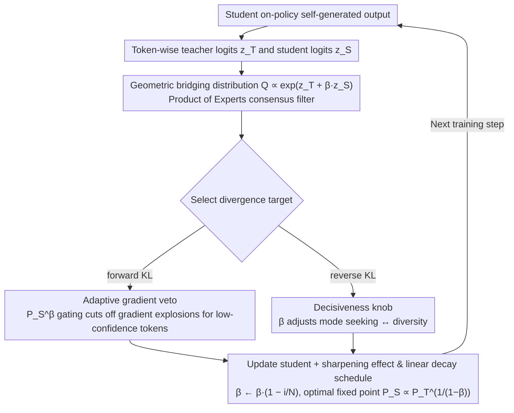

# Stable On-Policy Distillation through Adaptive Target Reformulation

**Conference**: ACL 2026 Findings  
**arXiv**: [2601.07155](https://arxiv.org/abs/2601.07155)  
**Code**: None  
**Area**: Model Compression  
**Keywords**: Knowledge Distillation, On-policy Distillation, Gradient Stability, KL Divergence, Target Reformulation

## TL;DR

This paper proposes Veto, a target-level reformulation method that stabilizes on-policy knowledge distillation by constructing a teacher-student geometric bridging distribution in logit space. A single parameter $\beta$ simultaneously acts as an adaptive gradient vetoer in forward KL (suppressing harmful gradients from low-confidence tokens) and a decisiveness knob in reverse KL (balancing reward-driven behavior and output diversity). It achieves a 9.2% improvement over SFT on GSM8K.

## Background & Motivation

**Background**: Knowledge Distillation (KD) is a widespread technique for transferring capabilities from large language models to smaller student models. Traditional supervised KD trains on fixed teacher-generated trajectories but suffers from exposure bias—training on teacher data while inferring on self-generated data—leading to performance degradation in autoregressive tasks. On-policy KD mitigates this by learning from the student's self-generated outputs.

**Limitations of Prior Work**: On-policy KD faces severe training instability due to the large distribution gap between novice students and expert teachers: (1) The forward KL objective triggers gradient explosions when the student assigns near-zero probability to teacher-preferred tokens ($P_T(y)/P_S(y) \to \infty$); (2) The reverse KL objective, while numerically stable, lacks explicit control over the intensity of mode-seeking, which easily leads to mode collapse and loss of diversity.

**Key Challenge**: Existing methods primarily interleave teacher and student tokens at the data level to bridge this gap, yet they neglect the stability of the optimization objective itself. Forcing a novice student to immediately match an expert's sharp distribution creates steep optimization cliffs even with mixed data. The root cause lies in the geometric properties of the divergence objectives.

**Goal**: To propose a target-level reformulation that constructs a distribution bridge between the teacher and student in logit space, simultaneously resolving gradient explosion in forward KL and mode collapse in reverse KL.

**Key Insight**: Instead of mixing samples at the data level, this method mixes at the distribution level—creating an intermediate target distribution in logit space that emphasizes consensus regions between the teacher and student, effectively "vetoing" harmful updates on low-confidence tokens.

**Core Idea**: Construct a geometric bridging distribution $Q \propto P_T \cdot P_S^\beta$ as a Product of Experts consensus filter. Only tokens supported by both the teacher (quality) and the student (confidence) receive high target probability. A single parameter $\beta$ unifiedly controls gradient suppression in forward KL and the decisiveness-diversity tradeoff in reverse KL.

## Method

### Overall Architecture

Veto modifies the target distribution based on standard on-policy KD. Instead of using the teacher distribution $P_T$ directly as the target, it constructs an intermediate target $Q$ via geometric interpolation in logit space. For each token position, teacher and student logits $z_T$ and $z_S$ are calculated to construct $Q \propto \exp(z_T + \beta \cdot z_S)$. The model then minimizes $D_{KL}(Q \| P_S)$ (forward KL) or $D_{KL}(P_S \| Q)$ (reverse KL). $\beta$ follows a linear decay schedule, decreasing from an initial value to 0.

### Key Designs

**1. Adaptive Gradient Veto (Forward KL): Cutting off gradient explosions for low-confidence tokens**

Standard forward KL is most dangerous in early on-policy stages: when a student assigns near-zero probability to a teacher-preferred token ($P_S(y) \to 0$ while $P_T(y) > 0$), the ratio $P_T(y)/P_S(y)$ diverges, with gradients reaching above $10^7$ in experiments. By replacing the target with the geometric bridge $Q = P_T \cdot P_S^\beta$, the loss term becomes $\mathcal{L}(y) \approx P_S(y)^\beta \log P_S(y)$. According to L'Hôpital's rule, the polynomial term $P_S^\beta(y)$ decays to zero faster than the logarithmic term $\log P_S(y)$ diverges. Thus, this term naturally tends toward zero, acting as a gate for tokens where the student is still "ignorant." This eliminates optimization instability from early noisy outputs purely at the objective function level without changing the architecture or data strategy.

**2. Decisiveness Knob (Reverse KL): Explicitly regulating mode-seeking vs diversity with the same $\beta$**

While reverse KL is numerically stable, it lacks an explicit mechanism to control the intensity of "mode-seeking," which easily leads to mode collapse and loss of diversity. Veto notes that the reverse KL gradient is equivalent to a policy gradient update:

$$\nabla_\theta \mathcal{L}_{\text{REV}} = \mathbb{E}_{y \sim P_S}[\nabla_\theta \log P_S(y) \cdot A(y)]$$

where the advantage function is $A(y) = -\log P_T(y) + (1-\beta) \log P_S(y)$. Thus, $\beta$ becomes a continuous knob between KD and RL: $\beta=0$ is standard reverse KD (perfect teacher matching), $0 < \beta < 1$ is geometric KD (seeking high-reward regions while retaining a diversity budget), and $\beta \to 1$ degrades to pure REINFORCE (zero entropy regularization, collapsing to the single highest reward mode). Users can thus tune between "decisiveness" and "diversity" based on task requirements.

**3. Sharpening Effect and Linear Decay Schedule: Ensuring convergence to a sharpened teacher version**

At the optimal fixed point $P_S^* = Q$, one can derive $P_S^*(y|x) \propto P_T(y|x)^{1/(1-\beta)}$. Since $0 \leq \beta < 1$, the exponent $1/(1-\beta) > 1$, naturally making the student distribution sharper and more decisive than the teacher's. Instead of a fixed value, $\beta$ follows a linear decay schedule $\beta \leftarrow \beta \cdot (1 - i/N)$, decreasing to 0 over training steps $i$. Large $\beta$ provides strong protection for a noisy student early on, while the schedule restores standard KD and closes the gap with the teacher as the student improves. Ablations confirm that linear decay outperforms a constant $\beta$.

### Loss & Training

The experiment uses Qwen2-0.5B-IT as the student and Qwen2-7B-IT as the teacher. The teacher is first supervised fine-tuned on task data, followed by 1K instances sampled for student on-policy training. Hyperparameters: learning rate 1e-5, warmup ratio 0.1, dropout 0.1, 3 epochs on 2 H100 GPUs. $\beta$ is determined via grid search and linearly decayed. Different $\beta$ values are used for different tasks: reasoning $\beta=0.8$, code $\beta=1.0$, and summarization $\beta=0.3$.

## Key Experimental Results

### Main Results

**Performance comparison across three domains**

| Method | GSM8K (Accuracy) | HumanEval (Pass@1) | HumanEval (Pass@10) | DialogSum (Win-rate) |
| :--- | :--- | :--- | :--- | :--- |
| Teacher SFT | 74.7 | 64.7 | 72.2 | 65.0 |
| Student SFT | 30.7 | 26.9 | 34.6 | 54.0 |
| Supervised KD | 33.4 | 26.8 | 34.5 | 54.3 |
| SKD | 33.6 | 24.8 | 34.8 | 53.6 |
| On-policy KD | 35.1 | 22.9 | 35.3 | 54.3 |
| **Ours (Veto)** | **39.9** | **29.0** | **37.7** | **56.5** |

### Ablation Study

| Configuration | GSM8K Accuracy | Description |
| :--- | :--- | :--- |
| Student SFT | 30.7 | Baseline |
| Supervised KD | 33.4 | +2.7 |
| On-policy KD | 35.1 | +4.4 |
| Veto ($\beta=0.8$) | **39.9** | **+9.2**, Optimal |
| Veto (No Decay) | — | Decay schedule is beneficial |

**Impact of different $\beta$ values**:
- $\beta=0$ degrades to standard on-policy KD.
- $\beta=0.8$ is optimal for GSM8K.
- $\beta=1.0$ is optimal for code generation.
- $\beta=0.3$ is optimal for summarization.
- Excessive $\beta$ leads to over-sharpening, while insufficient $\beta$ provides inadequate protection.

### Key Findings

- Ours improves GSM8K performance by 9.2 percentage points (30.7% $\to$ 39.9%) over Student SFT and 4.8 percentage points over on-policy KD.
- Standard Forward KL gradients exceed $10^7$ on "ignorant" tokens, whereas Veto effectively suppresses them within a stable range.
- HumanEval Pass@1 increased from 22.9 to 29.0 (+6.1), and DialogSum Win-rate increased from 54.3 to 56.5 (+2.2).
- The variation in optimal $\beta$ across tasks reflects fundamental differences between reasoning (requiring high decisiveness) and generation (requiring diversity) tasks.
- Linear $\beta$ decay is superior to constant $\beta$, validating the strategy of "strong early protection, gradual late relaxation."

## Highlights & Insights

- Solving on-policy KD stability from the geometric properties of the divergence objective is more fundamental than data-level mixing.
- A single parameter $\beta$ unifiedly addresses both forward KL gradient explosion and reverse KL mode collapse, which is theoretically elegant.
- Theorem 3 reveals that Veto under reverse KL is equivalent to REINFORCE with scaled entropy regularization, bridging KD and RL.
- The "consensus filter" intuition in the Product of Experts form is clear: only tokens supported by both the teacher and student receive high weights.

## Limitations & Future Work

- Experiments only used Qwen2-0.5B as the student and Qwen2-7B as the teacher, without validation on larger scales (e.g., 7B $\to$ 70B).
- Different tasks require different $\beta$ values, and optimal hyperparameters must be determined via grid search.
- Theoretical analysis is mainly at the token level; sequence-level dynamic characteristics were not explored in depth.
- The relationship and combination potential with other advanced on-policy methods (e.g., RLHF/DPO) have not been fully investigated.

## Related Work & Insights

- **vs GKD (On-policy KD)**: GKD proposed an on-policy distillation framework but did not solve objective stability; Veto provides stability guarantees from the objective level.
- **vs SKD (Interleaved Sampling)**: SKD improves feedback quality through interleaved sampling but still operates at the data level; Veto operates at the distribution level, making them orthogonal.
- **vs MiniLLM/f-distill (Reverse KL)**: These use reverse KL to encourage mode-seeking but lack diversity control; Veto provides an explicit decisiveness-diversity tradeoff through $\beta$.

## Rating

- Novelty: ⭐⭐⭐⭐ The idea of unifiedly solving two problems from the geometry of the objective function is elegant; the KD-RL bridge has theoretical depth.
- Experimental Thoroughness: ⭐⭐⭐ Validated across three tasks, but the model scale is limited (0.5B-7B) and more baselines are needed.
- Writing Quality: ⭐⭐⭐⭐ Theoretical derivations are clear, intuitive explanations are well-provided, and the quality of illustrations is high.
- Value: ⭐⭐⭐⭐ Provides a simple and effective stabilization scheme for on-policy KD, with a good balance of theory and practice.

<!-- RELATED:START -->

## Related Papers

- [\[ICML 2026\] Entropy-Aware On-Policy Distillation of Language Models](../../ICML2026/model_compression/entropy-aware_on-policy_distillation_of_language_models.md)
- [\[ACL 2025\] AlignDistil: Token-Level Language Model Alignment as Adaptive Policy Distillation](../../ACL2025/model_compression/aligndistil_token_level_alignment.md)
- [\[ICLR 2026\] MASS: MoErging through Adaptive Subspace Selection](../../ICLR2026/model_compression/mass_moerging_through_adaptive_subspace_selection.md)
- [\[ICLR 2026\] π-Flow: Policy-Based Few-Step Generation via Imitation Distillation](../../ICLR2026/model_compression/pi-flow_policy-based_few-step_generation_via_imitation_distillation.md)
- [\[ICLR 2026\] Knowledge Distillation for Large Language Models through Residual Learning](../../ICLR2026/model_compression/knowledge_distillation_for_large_language_models_through_residual_learning.md)

<!-- RELATED:END -->
## Related Papers

- [\[ICML 2026\] Entropy-Aware On-Policy Distillation of Language Models](../../ICML2026/model_compression/entropy-aware_on-policy_distillation_of_language_models.md)
- [\[ACL 2025\] AlignDistil: Token-Level Language Model Alignment as Adaptive Policy Distillation](../../ACL2025/model_compression/aligndistil_token_level_alignment.md)
- [\[ICLR 2026\] π-Flow: Policy-Based Few-Step Generation via Imitation Distillation](../../ICLR2026/model_compression/pi-flow_policy-based_few-step_generation_via_imitation_distillation.md)
- [\[CVPR 2026\] WPT: World-to-Policy Transfer via Online World Model Distillation](../../CVPR2026/model_compression/wpt_world-to-policy_transfer_via_online_world_model_distillation.md)
- [\[NeurIPS 2025\] ORPO-Distill: Mixed-Policy Preference Optimization for Cross-Architecture LLM Distillation](../../NeurIPS2025/model_compression/orpo-distill_mixed-policy_preference_optimization_for_cross-architecture_llm_dis.md)

<!-- RELATED:END -->
