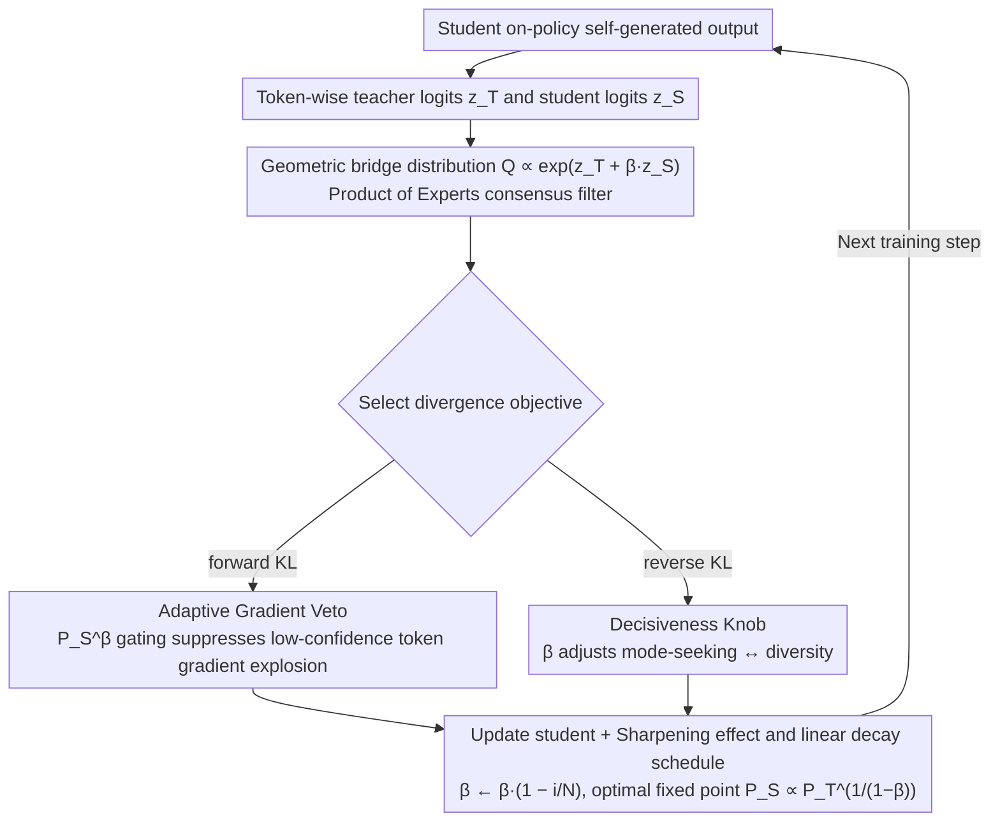

# Stable On-Policy Distillation through Adaptive Target Reformulation

**Conference**: ACL 2026 Findings  
**arXiv**: [2601.07155](https://arxiv.org/abs/2601.07155)  
**Code**: None  
**Area**: Model Compression  
**Keywords**: Knowledge Distillation, On-policy Distillation, Gradient Stability, KL Divergence, Target Reformulation

## TL;DR

This paper proposes Veto, a target-level reformulation method that stabilizes on-policy knowledge distillation by constructing a geometric teacher-student bridge distribution in the logit space. A single parameter $\beta$ simultaneously acts as an adaptive gradient veto in forward KL (suppressing harmful gradients from low-confidence tokens) and a decisiveness knob in reverse KL (balancing reward-driven selection and output diversity). It achieves a 9.2% improvement over SFT on GSM8K.

## Background & Motivation

**Background**: Knowledge distillation (KD) is a widely used technique for transferring the capabilities of large language models to smaller student models. Traditional supervised KD trains on fixed teacher generation trajectories but suffers from exposure bias—using teacher data during training while using self-generated data during inference—leading to performance degradation in autoregressive tasks. On-policy KD alleviates this problem by learning from the student's self-generated outputs.

**Limitations of Prior Work**: On-policy KD faces severe training instability because the distribution gap between a novice student and an expert teacher is too large: (1) The forward KL objective generates gradient explosions ($P_T(y)/P_S(y) \to \infty$) when the student assigns near-zero probability to the teacher's preferred tokens; (2) The reverse KL objective, while numerically stable, lacks explicit control over the intensity of mode-seeking, which easily leads to mode collapse and loss of diversity.

**Key Challenge**: Existing methods primarily bridge the gap by mixing teacher and student tokens at the data level but overlook the stability of the optimization objective itself. Even with mixed data, forcing a novice student to immediately match the expert's sharp distribution creates steep optimization cliffs. The root cause lies in the geometric properties of the divergence objectives.

**Goal**: To propose a target-level reformulation that constructs a distribution bridge between the teacher and the student, simultaneously addressing the gradient explosion of forward KL and the mode collapse of reverse KL.

**Key Insight**: Instead of mixing samples at the data level, this work mixes them at the distribution level—creating an intermediate target distribution in the logit space that emphasizes the consensus region between the teacher and the student, effectively "vetoing" harmful updates on low-confidence tokens.

**Core Idea**: Construct a geometric bridge distribution $Q \propto P_T \cdot P_S^\beta$ as a Product of Experts consensus filter. Only tokens supported by both the teacher (quality) and the student (confidence) receive high target probabilities. A single parameter $\beta$ uniformly controls gradient suppression in forward KL and the decisiveness-diversity trade-off in reverse KL.

## Method

### Overall Architecture

Veto modifies the target distribution based on standard on-policy KD: instead of directly using the teacher distribution $P_T$ as the target, it constructs an intermediate target $Q$ via geometric interpolation in the logit space. For each token position, teacher and student logits $z_T$ and $z_S$ are calculated to construct $Q \propto \exp(z_T + \beta \cdot z_S)$. Then, $D_{KL}(Q \| P_S)$ (forward KL) or $D_{KL}(P_S \| Q)$ (reverse KL) is minimized. $\beta$ follows a linear decay from an initial value to 0.

### Key Designs

**1. Adaptive Gradient Veto (Forward KL): Suppressing gradient explosions on low-confidence tokens**

Standard forward KL is most dangerous during the early stages of on-policy training: when the student assigns near-zero probability to a teacher-preferred token ($P_S(y)\to 0$ while $P_T(y)>0$), the ratio $P_T(y)/P_S(y)$ diverges, with observed gradients exceeding $10^7$. By replacing the target distribution with the geometric bridge $Q=P_T\cdot P_S^\beta$, the loss term becomes $\mathcal{L}(y)\approx P_S(y)^\beta \log P_S(y)$. According to L'Hôpital's rule, the polynomial term $P_S^\beta(y)$ decays to zero faster than the logarithmic term $\log P_S(y)$ diverges, causing this term to naturally approach zero. This essentially installs a gate for "tokens unknown to the student," eliminating optimization instability from noisy outputs without changing the model architecture or data generation strategy.

**2. Decisiveness Knob (Reverse KL): Explicitly regulating mode-seeking and diversity with $\beta$**

Reverse KL is numerically stable but lacks an explicit mechanism to control "mode-seeking" intensity, leading to potential mode collapse and loss of diversity. Veto notes that the gradient of reverse KL is equivalent to a policy gradient update:

$$\nabla_\theta \mathcal{L}_{\text{REV}} = \mathbb{E}_{y \sim P_S}[\nabla_\theta \log P_S(y) \cdot A(y)]$$

where the advantage function is $A(y) = -\log P_T(y) + (1-\beta) \log P_S(y)$. Thus, $\beta$ acts as a continuous knob between KD and RL: $\beta=0$ is standard reverse KD (fully matching the teacher), $0<\beta<1$ is geometric KD (seeking high rewards while retaining diversity budget), and $\beta\to 1$ degrades to pure REINFORCE (zero entropy regularization, collapsing to a single highest-reward mode). Users can thus toggle between "decisive" and "diverse" based on task requirements.

**3. Sharpening effect and linear decay schedule: Ensuring convergence to a sharpened teacher version**

At the optimal fixed point $P_S^* = Q$, we solve for $P_S^*(y|x) \propto P_T(y|x)^{1/(1-\beta)}$. Since $0 \leq \beta < 1$, the exponent $1/(1-\beta) > 1$, meaning the student distribution is naturally sharper and more decisive than the teacher's. $\beta$ is not a fixed value but decreases to 0 via linear decay $\beta \leftarrow \beta \cdot (1 - i/N)$ over training steps $i$. A large $\beta$ provides strong protection for a noisy student early on, while standard KD is progressively restored as the student improves. Ablations confirm that linear decay outperforms a constant $\beta$.

### Loss & Training

Qwen2-0.5B-IT is used as the student and Qwen2-7B-IT as the teacher. The teacher is first supervised fine-tuned on task data, then 1K instances are sampled for on-policy student training. Learning rate is 1e-5, warmup ratio 0.1, dropout 0.1, trained for 3 epochs on 2 H100 GPUs. $\beta$ is selected via grid search and linearly decayed. Different $\beta$ values are used for different tasks: reasoning $\beta=0.8$, code $\beta=1.0$, and summarization $\beta=0.3$.

## Key Experimental Results

### Main Results

**Performance comparison across three domains**

| Method | GSM8K (Accuracy) | HumanEval (Pass@1) | HumanEval (Pass@10) | DialogSum (Win-rate) |
|------|------|------|------|------|
| Teacher SFT | 74.7 | 64.7 | 72.2 | 65.0 |
| Student SFT | 30.7 | 26.9 | 34.6 | 54.0 |
| Supervised KD | 33.4 | 26.8 | 34.5 | 54.3 |
| SKD | 33.6 | 24.8 | 34.8 | 53.6 |
| On-policy KD | 35.1 | 22.9 | 35.3 | 54.3 |
| **Veto (Ours)** | **39.9** | **29.0** | **37.7** | **56.5** |

### Ablation Study

| Configuration | GSM8K Accuracy | Description |
|------|------|------|
| Student SFT | 30.7 | Baseline |
| Supervised KD | 33.4 | +2.7 |
| On-policy KD | 35.1 | +4.4 |
| Veto ($\beta=0.8$) | **39.9** | **+9.2**, Best |
| Veto (No decay) | — | Decay schedule is beneficial |

**Impact of different $\beta$ values**:
- $\beta=0$ degrades to standard on-policy KD.
- $\beta=0.8$ is optimal for GSM8K.
- $\beta=1.0$ is optimal for code generation.
- $\beta=0.3$ is optimal for summarization.
- Excessive $\beta$ leads to over-sharpening, while insufficient $\beta$ provides inadequate protection.

### Key Findings

- Veto improves GSM8K by 9.2 percentage points over Student SFT (30.7%→39.9%) and by 4.8 percentage points over on-policy KD.
- Standard Forward KL produces gradients exceeding $10^7$ on ignorant tokens, which Veto effectively suppresses within a stable range.
- HumanEval Pass@1 increased from 22.9 to 29.0 (+6.1), and DialogSum Win-rate increased from 54.3 to 56.5 (+2.2).
- The optimal $\beta$ varies by task, reflecting the intrinsic differences between reasoning (requiring high decisiveness) and generation (requiring diversity) tasks.
- Linear $\beta$ decay outperforms constant $\beta$, validating the strategy of "strong protection early, progressive relaxation late."

## Highlights & Insights

- Addressing the stability of on-policy KD from the geometric properties of divergence objectives is more fundamental than data-level mixing.
- A single parameter $\beta$ elegantly solves both forward KL gradient explosion and reverse KL mode collapse; the theory is elegant.
- Theorem 3 reveals that under reverse KL, Veto is equivalent to REINFORCE with scaled entropy regularization, establishing a bridge between KD and RL.
- The Product of Experts "consensus filter" intuition is clear: only tokens supported by both the teacher (quality) and the student (confidence) receive high weights.

## Limitations & Future Work

- Experiments used only Qwen2-0.5B as student and Qwen2-7B as teacher; not yet validated on larger scales (e.g., 7B→70B).
- Different tasks require different $\beta$ values, and optimal hyperparameters must be determined via grid search.
- The theoretical analysis is mainly at the token level; sequence-level dynamic characteristics were not explored in depth.
- Relationships and combination potential with other advanced on-policy methods (e.g., RLHF/DPO) have not been fully explored.

## Related Work & Insights

- **vs GKD (On-policy KD)**: GKD proposed the on-policy distillation framework but did not solve target stability; Veto provides stability guarantees at the target level.
- **vs SKD (Interleaved Sampling)**: SKD improves feedback quality through interleaved sampling but still operates at the data level; Veto operates at the distribution level, making them orthogonal.
- **vs MiniLLM/f-distill (Reverse KL)**: These use reverse KL to encourage mode-seeking but lack diversity control; Veto provides an explicit decisiveness-diversity trade-off via $\beta$.

## Rating

- Novelty: ⭐⭐⭐⭐ The idea of unifying two problems from the perspective of objective function geometry is elegant; the KD-RL bridge has theoretical depth.
- Experimental Thoroughness: ⭐⭐⭐ Validated across three tasks, but with a single model scale (0.5B-7B) and missing comparisons with more baselines.
- Writing Quality: ⭐⭐⭐⭐ Theoretical derivations are clear, intuitive explanations are well-placed, and illustration quality is high.
- Value: ⭐⭐⭐⭐ Provides a simple and effective stabilization scheme for on-policy KD with a good combination of theory and practice.

<!-- RELATED:START -->

## Related Papers

- [\[ICML 2026\] Entropy-Aware On-Policy Distillation of Language Models](../../ICML2026/model_compression/entropy-aware_on-policy_distillation_of_language_models.md)
- [\[ACL 2025\] AlignDistil: Token-Level Language Model Alignment as Adaptive Policy Distillation](../../ACL2025/model_compression/aligndistil_token_level_alignment.md)
- [\[ICLR 2026\] π-Flow: Policy-Based Few-Step Generation via Imitation Distillation](../../ICLR2026/model_compression/pi-flow_policy-based_few-step_generation_via_imitation_distillation.md)
- [\[CVPR 2026\] WPT: World-to-Policy Transfer via Online World Model Distillation](../../CVPR2026/model_compression/wpt_world-to-policy_transfer_via_online_world_model_distillation.md)
- [\[CVPR 2026\] LIFT and PLACE: A Simple, Stable, and Effective Knowledge Distillation Framework for Lightweight Diffusion Models](../../CVPR2026/model_compression/lift_and_place_a_simple_stable_and_effective_knowledge_distillation_framework_fo.md)

<!-- RELATED:END -->
