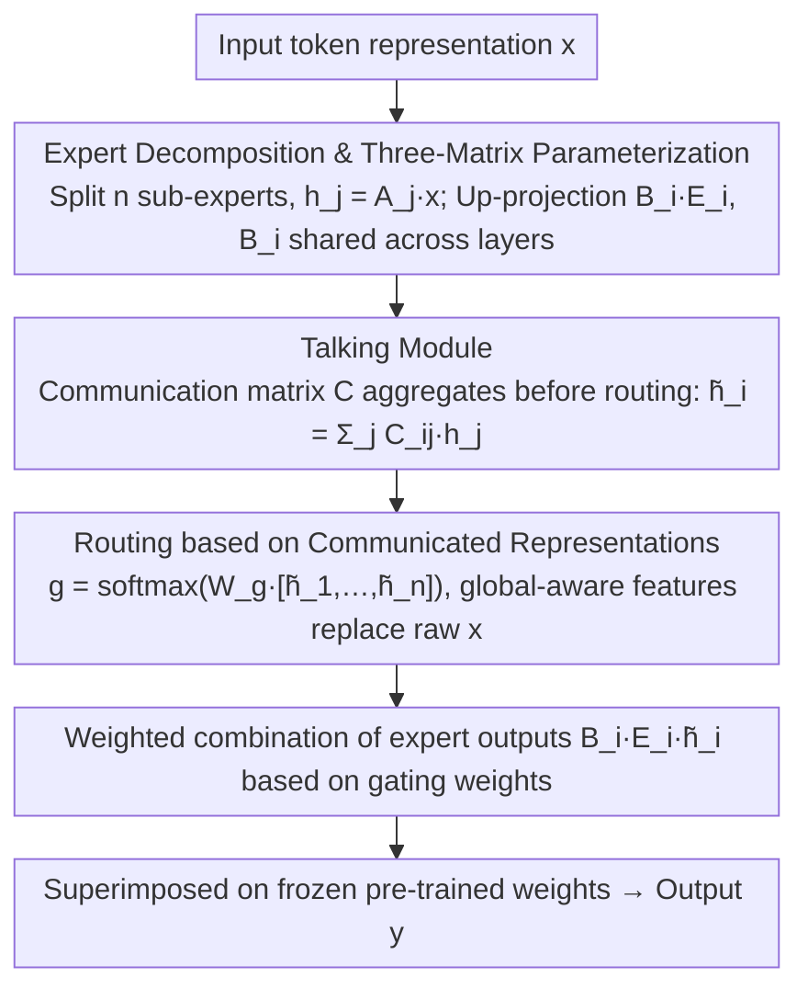

# TalkLoRA: Communication-Aware Mixture of Low-Rank Adaptation for Large Language Models

**Conference**: ACL2026  
**arXiv**: [2604.06291](https://arxiv.org/abs/2604.06291)  
**Code**: [GitHub](https://github.com/why0129/TalkLoRA)  
**Area**: Model Compression  
**Keywords**: LoRA, MoE, Parameter-Efficient Fine-Tuning, Expert Communication, Routing Equilibrium, Talking Module

## TL;DR

TalkLoRA introduces a lightweight Talking Module into the MoE-LoRA architecture, allowing low-rank experts to exchange information before routing. This addresses the issues of unstable routing and expert dominance caused by independent expert operation in traditional MoELoRA. On commonsense reasoning and NLU tasks, it consistently outperforms LoRA and MoELoRA variants with fewer parameters (0.2%).

## Background & Motivation

LoRA achieves parameter-efficient fine-tuning through low-rank decomposition, while MoE extensions (MoELoRA) dynamically combine multiple LoRA modules as experts to enhance flexibility. However, existing MoELoRA assumes that experts operate independently, leading to three problems: (1) unstable routing, characterized by sharp and low-entropy gating distributions; (2) expert dominance—where a few experts consistently receive the highest weights while other experts receive negligible gradient signals (exacerbated by network depth); (3) representation redundancy—where independently trained experts learn highly overlapping representations under the same supervision signal.

## Method

### Overall Architecture

TalkLoRA decomposes each LoRA into $n$ sub-experts and implements information exchange between experts through a Talking Module before routing decisions. Routing is based on global-aware expert features rather than raw inputs, combined with a parameter sharing strategy to reduce redundant parameters.

### Key Designs

1.  **Expert Decomposition and Three-Matrix Parameterization**: The up-projection matrix of each sub-expert $i$ is further decomposed as $B_i E_i A_i x$, where $A_i \in \mathbb{R}^{r/n \times d}$ and $E_i \in \mathbb{R}^{r/n \times r/n}$ learn domain-specific knowledge, and $B_i \in \mathbb{R}^{k \times r/n}$ restores the dimension. $B_i$ is shared across layers to reduce parameter volume, while $A_i$ and $E_i$ remain independent for each layer.
2.  **Talking Module**: Through a learnable communication matrix $C \in \mathbb{R}^{n \times n}$, internal expert representations $h_j = A_j x$ are linearly aggregated: $\tilde{h_i} = \sum_{j=1}^n C_{ij} h_j$, which only adds $O(n^2)$ parameters. When $C_{ij}=0$ ($i \neq j$), it degrades to standard MoELoRA—TalkLoRA is a strict generalization of MoELoRA.
3.  **Routing based on Communicated Representations**: The gating function operates on the concatenated representations after communication $g([\tilde{h_1}, ..., \tilde{h_n}]) = \text{softmax}(W_g [\tilde{h_1}, ..., \tilde{h_n}])$, rather than the original input $x$. Global-aware features alleviate routing overconfidence and reduce sensitivity to local noise.

### Loss & Training

Standard SFT training is employed. $A_i$ and $E_i$ use Kaiming initialization, while $B_i$ is zero-initialized to keep the initial output unchanged. An AdamW optimizer is used to train for 2 epochs on 4× 3090 GPUs, with validation every 80 steps.

## Key Experimental Results

### Main Results

Average accuracy (%) for 8 commonsense reasoning tasks:

| Model | Method | #Param(%) | BoolQ | PIQA | ARC-c | OBQA | Avg. |
|---|---|---|---|---|---|---|---|
| Qwen2.5-7B | LoRA (r=16) | 0.4 | 60.0 | 73.6 | 71.7 | 74.4 | 73.8 |
| Qwen2.5-7B | TeamLoRA (r=16) | 0.4 | 74.6 | 90.0 | 88.5 | 92.2 | 88.5 |
| Qwen2.5-7B | **Ours (r=16)** | **0.2** | 73.6 | 90.9 | 89.6 | 92.8 | **89.0** |
| LLaMA3-8B | MoELoRA (r=32) | 0.7 | 74.6 | 89.1 | 82.8 | 87.6 | 86.6 |
| LLaMA3-8B | **Ours (r=32)** | **0.4** | 76.1 | 89.6 | 84.5 | 89.4 | **87.6** |

GLUE benchmark (RoBERTa-base, 0.3M parameters):

| Method | SST-2 | MRPC | CoLA | QNLI | RTE | STS-B | Avg. |
|---|---|---|---|---|---|---|---|
| LoRA | 93.9 | 88.7 | 59.7 | 92.6 | 75.3 | 90.3 | 83.4 |
| DeLoRA | 94.1 | 89.0 | 63.6 | 92.8 | 77.1 | 90.9 | 84.6 |
| **Ours** | **94.2** | **89.3** | **64.2** | **93.0** | **77.6** | 90.9 | **84.9** |

### Ablation Study

-   **Number of Experts and Rank**: On LLaMA3-8B, $r=32$ with 8 experts (per-expert rank=4) reached 87.8%, surpassing all $r=32$ baselines while doubling parameter efficiency.
-   **Non-expansiveness of Communication Matrix**: Experiments verified that the spectral norm of $C$ is $\le 1$, ensuring that perturbations are not amplified.
-   **TalkLoRA Placement**: Application on the Q/V projections of the Transformer yielded the best results.

### Key Findings

-   TalkLoRA surpasses TeamLoRA (which requires 0.4% parameters at r=16) using only 0.2% parameters (r=16), effectively doubling parameter efficiency.
-   Expert communication results in a more uniform routing weight distribution, alleviating the dominance of a few experts in deeper layers.
-   Strict generalization relationship: TalkLoRA simplifies to MoELoRA when the communication matrix is diagonal. It is theoretically proven that the function class of TalkLoRA is strictly larger than that of MoELoRA.

## Highlights & Insights

-   **Transferring Talking-Head Ideas from Attention to MoE-LoRA**: Inspired by talking-head attention, controlled information exchange is introduced into the expert system, addressing the root cause of routing instability.
-   **Synergy of Parameter Sharing + Communication**: The combination of cross-layer sharing for $B_i$ and the Talking Module for cross-expert communication enhances expressiveness while reducing parameters.
-   **Complete Theoretical Guarantees**: Proves the strict expansion of the function class and the smoothness of routing.

## Limitations & Future Work

-   Only validated on commonsense reasoning and NLU tasks; the effectiveness on tasks like code generation and mathematical reasoning is unknown.
-   The $O(n^2)$ parameters of the Talking Module may become a bottleneck when the number of experts is very large.
-   The parameter sharing strategy ($B_i$ sharing across layers) might be limited in tasks requiring strong differentiation between layers.

## Related Work & Insights

-   **LoRA** (Hu et al., 2022): The fundamental method for parameter-efficient fine-tuning; TalkLoRA introduces MoE + communication on top of this.
-   **Talking-Head Attention** (Shazeer et al., 2020): Information exchange between independent attention heads inspired the design of inter-expert communication.
-   **TeamLoRA** (Lin et al., 2025): Balances experts through collaboration and competition modules; TalkLoRA surpasses it with fewer parameters.
-   **DenseLoRA** (Mu et al., 2025): Compresses redundancy in LoRA updates, which inspired the parameter sharing strategy.

## Rating

| Dimension | Score (1-10) |
|---|---|
| Novelty | 7 |
| Practicality | 8 |
| Clarity | 7 |
| Experimental Thoroughness | 8 |

## Rating
- Novelty: To be rated
- Experimental Thoroughness: To be rated
- Writing Quality: To be rated
- Value: To be rated

<!-- RELATED:START -->

## Related Papers

- [\[ACL 2026\] TLoRA: Task-aware Low Rank Adaptation of Large Language Models](tlora_task-aware_low_rank_adaptation_of_large_language_models.md)
- [\[ACL 2026\] Not All Directions Matter: Towards Structured and Task-Aware Low-Rank Model Adaptation](not_all_directions_matter_towards_structured_and_task-aware_low-rank_model_adapt.md)
- [\[NeurIPS 2025\] Gated Integration of Low-Rank Adaptation for Continual Learning of Large Language Models](../../NeurIPS2025/model_compression/gated_integration_of_low-rank_adaptation_for_continual_learning_of_large_languag.md)
- [\[NeurIPS 2025\] Data Efficient Adaptation in Large Language Models via Continuous Low-Rank Fine-Tuning](../../NeurIPS2025/model_compression/data_efficient_adaptation_in_large_language_models_via_continuous_low-rank_fine-.md)
- [\[NeurIPS 2025\] C-LoRA: Contextual Low-Rank Adaptation for Uncertainty Estimation in Large Language Models](../../NeurIPS2025/model_compression/c-lora_contextual_low-rank_adaptation_for_uncertainty_estimation_in_large_langua.md)

<!-- RELATED:END -->
