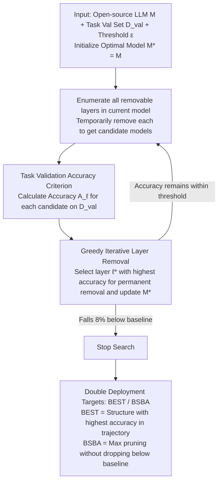

# TELL-TALE: Task Efficient LLMs with Task Aware Layer Elimination

**Conference**: ACL 2026 Findings  
**arXiv**: [2510.22767](https://arxiv.org/abs/2510.22767)  
**Code**: https://github.com/omyokun/tale/  
**Area**: Model Compression / LLM Efficiency  
**Keywords**: Task-aware pruning, Layer elimination, Inference acceleration, Validation set search, Training-free

## TL;DR
TALE utilizes a training-free greedy search process to directly eliminate "underperforming" Transformer layers for each downstream task, simultaneously improving task accuracy and reducing inference costs across 5 open-source LLMs and 9 benchmarks.

## Background & Motivation
**Background**: Large Language Models are typically deployed with a fixed depth, processing every Transformer layer regardless of whether the downstream task involves mathematical reasoning, commonsense QA, or knowledge-based multiple-choice questions. Existing model compression methods can prune weights, heads, blocks, or implement early exits, but most rely on general metrics like perplexity, representation similarity, or reconstruction error, primarily aiming to save computational power.

**Limitations of Prior Work**: General pruning metrics do not necessarily correspond to target task performance. A layer that appears important for language modeling perplexity might introduce noise for a specific task; conversely, certain intermediate layers may already be sufficient for specific tasks, and proceeding through subsequent layers can decrease accuracy. Furthermore, fine-tuning improves task performance but does not reduce inference costs and requires data and training budgets.

**Key Challenge**: Model compression typically assumes that "layer removal damages capability," thus optimization goals focus on minimizing performance drops. However, this work observes that for some tasks, removing mismatched layers is itself a form of task adaptation that can make the model both more accurate and faster.

**Goal**: Ours aims to provide a practically deployable method: no weight modifications, no retraining, and no dependence on hardware-specific implementations. It seeks to find the optimal pruned structure and efficient architecture for a task using only a small-scale task validation set.

**Key Insight**: The paper explains layer removal through the residual stream: removing layer $\ell$ is equivalent to setting that layer's transformation $F_\ell$ to zero, allowing the hidden state to pass through directly. By projecting intermediate hidden states to the vocabulary space, it is found that intermediate layer predictions outperform final layer predictions on many tasks, suggesting that "deeper" is not always "better."

**Core Idea**: Instead of using task-agnostic proxies to guess which layers are redundant, directly test the removal of each layer on the target task validation set and retain the removal operations that maximize validation accuracy.

## Method
TALE's method is straightforward, making it highly suitable for deployment. Given an open-source LLM and a task validation set, it trains no parameters and performs only structural search: each step enumerates all remaining layers in the current model, temporarily removes one layer, and calculates accuracy on the validation set. The candidate model with the highest accuracy is selected, that layer is permanently removed, and the process repeats on the new, shallower model.

The paper outputs two model concepts: BEST refers to the pruned model with the highest task accuracy during the search, suitable for "accuracy-first" scenarios. BSBA stands for Best Speedup with at least Baseline Accuracy, which maximizes layer removal as long as the original model's accuracy is maintained, suitable for "speed-first" scenarios without performance loss.

### Overall Architecture
Inputs include a pre-trained or instruction-tuned model $M$, a validation set $D_{val}$, and a threshold $\epsilon$. TALE initializes $M^*=M$. In each iteration, for every removable layer $\ell$ in the current model, a candidate model $M_{-\ell}$ is constructed, and $A_\ell=Acc(M_{-\ell},D_{val})$ is calculated. The layer $\ell^*=\arg\max_\ell A_\ell$ is selected. if the performance after removal remains within the allowed range, $M^*$ is updated to $M_{-\ell^*}$; otherwise, the search stops. The stop threshold is set at 8% below baseline accuracy, allowing the search to briefly explore lower-performing structures, though recovery after falling below the baseline was not observed in practice.

For evaluation, two protocols are used: LM-Eval and Decoder Eval. Decoder Eval requires the model to generate structured answers, which are then extracted and compared against the ground truth; this is considered closer to real generation capability as multiple-choice probability-based LM-Eval may make weak models appear stronger due to option compression.

### Key Designs
**1. Direct Use of Task Validation Accuracy as Pruning Criterion: Aligning Search and Deployment Goals**
Methods like SLEB or BlockPruner rely on task-agnostic proxies like representation similarity or perplexity to judge redundancy, often removing layers useful for the task or retaining harmful ones—creating a gap between the proxy and the actual downstream goal. TALE closes this gap by evaluating candidate models (after removing a layer) directly on the task validation set at each step. Since the evaluation metric is the one being optimized for deployment, the search can directly identify "negative contribution layers"—those whose removal actually improves accuracy—which proxy metrics fail to detect.

**2. Greedy Iterative Layer Removal: Removing one layer per round and re-evaluating to capture layer interactions**
The trouble with preset fixed pruning budgets (cutting top-k layers at once) is that the optimal number of layers to remove varies by task: some tasks perform best when pruned to layer $n$, but drop sharply if one more is removed. TALE does not specify the number of layers upfront. Instead, it enumerates all existing layers each round, performs temporary removal, and picks the candidate $\ell^*=\arg\max_\ell A_\ell$ for permanent removal. "Re-evaluating after removal" is crucial—removing one layer changes the relative importance of subsequent layers. Iterative re-evaluation follows these interactions to find task-specific shallow structures rather than using a static importance table.

**3. BEST / BSBA Double Deployment Targets: Satisfying both "Accuracy-First" and "Efficiency-First" Needs from One Search Trajectory**
Real systems do not always chase the highest score: multi-agent, high-concurrency, or edge deployments care more about throughput and latency but cannot afford performance drops. TALE records two models during the same search: BEST is the structure with the highest accuracy in the trajectory, for accuracy-prioritized scenarios; BSBA (Best Speedup with at least Baseline Accuracy) is the structure that removes the most layers without falling below the original accuracy, for "fast but no drop" scenarios. One search produces two outputs; users select based on deployment needs without running separate searches for different goals.

### Loss & Training
TALE itself has no training loss because it does not update model weights. Its "optimization target" is the validation set accuracy. Computational cost is approximately $O(I\cdot L\cdot V\cdot T_{layer})$, where $I$ is the number of pruning iterations, $L$ is the number of layers, $V$ is the validation set size. For LLaMA 3.1 8B, on a validation set of 500 to 1500 samples, each task takes about 1 to 2 A100 GPU hours. The paper uses LoRA in fine-tuning experiments, but that is to evaluate the interaction between TALE and fine-tuning, not a necessary step for TALE itself.

## Key Experimental Results

### Main Results
TALE was evaluated on 5 open-source models and 9 tasks, including ARC-Challenge, ARC-Easy, MMLU, Winogrande, GSM8K-HARD, MATH500, CommonQA, BIG-Bench, and BoolQ. The table below extracts zero-shot results for LLaMA 3.1 8B and Qwen 2.5 7B; #D is the number of layers removed.

| Model | Dataset | Baseline | TALE BEST | #D | BSBA | Observation |
|------|--------|----------|-----------|----|------|------|
| LLaMA 3.1 8B | ARC-Challenge | 79.4 | 80.6 | 4 | 77.6 | Modest gains on knowledge/commonsense |
| LLaMA 3.1 8B | MMLU | 48.8 | 53.8 | 1 | 50.2 | Significant gain removing just 1 layer |
| LLaMA 3.1 8B | GSM8K-HARD | 39.0 | 59.0 | 1 | 39.4 | Mathematical reasoning sees largest gain |
| LLaMA 3.1 8B | MATH500 | 25.4 | 28.2 | 2 | 27.4 | Early/middle layer removal effective for reasoning |
| Qwen 2.5 7B | ARC-Challenge | 86.55 | 92.00 | 2 | 86.55 | ARC-C increased by 5.45 points |
| Qwen 2.5 7B | MMLU | 68.10 | 71.00 | 5 | 68.13 | More layers removable while maintaining baseline |
| Qwen 2.5 7B | GSM8K-HARD | 43.80 | 61.80 | 2 | 43.99 | Math reasoning increased by 18 points |
| Qwen 2.5 7B | MATH500 | 31.00 | 38.20 | 2 | 32.10 | Stable gains on math tasks |

The overall trend concluded is: Gain on LLaMA for ARC-Challenge is small (~+1.6), but more pronounced on Qwen 2.5 7B (~+6.3); reasoning tasks like MATH500 and GSM8K see gains ranging from 23% to 51%. This supports the judgment that some layers are not just neutrally redundant for reasoning tasks but may actually introduce task-mismatched representational perturbations.

| Eval | Method | ARC-Easy | ARC-Challenge | Winogrande | Conclusion |
|------|------|----------|---------------|------------|------|
| Decoder Eval | TALE | 76.7 | 54.3 | 73.1 | Best across all three |
| Decoder Eval | SLEB-ta | 61.0 | 38.0 | 66.5 | Still significantly behind even when task-aware |
| Decoder Eval | BlockPruner-ta | 64.6 | 39.6 | 65.59 | Inferior to direct accuracy search |
| LM-Eval | BlockPruner-ta | 65 | 41 | 66 | Baseline pruning still drops points significantly |
| LM-Eval | TALE | 81 | 55 | 78 | Maintains lead consistently |

### Ablation Study
There is no "module ablation" in the traditional sense; instead, TALE is validated across robustness, evaluation protocols, validation set scale, and fine-tuning interactions. The most critical comparison: switching TALE's target from task accuracy to representation similarity or perplexity significantly degrades results. For example, on ARC-Easy, using cosine similarity to guide TALE removes 2 layers, but LLaMA accuracy drops from 79.5 to 58.5, indicating that proxy targets can be severely misaligned with real task targets.

| Setting | Representative Result | Description |
|------|----------|------|
| Val Set Size | Beyond 500 samples, layer sets for ARC-Easy/MMLU/GSM8K stabilize | TALE does not require large task validation sets |
| Random Seed | BEST results for LLaMA, Qwen, Lucie, Mistral show very low variance | Search does not depend on lucky seed hits |
| Inference Efficiency | 9/9 settings improved first-token latency, macro avg -14.3%; throughput improved in 9/9, macro avg +17.9% | BEST models also provide real throughput gains |
| Search Cost | ~1-2 A100 hours per task for LLaMA 3.1 8B | One-time search cost is amortized by long-term inference |

The interaction with fine-tuning is also interesting. TALE is not just for inference-time pruning; it is complementary to LoRA fine-tuning.

| Model / Dataset | Baseline | TALE only | FT only | TALE → FT | FT → TALE | (TALE → FT) → TALE |
|---------------|----------|-----------|---------|-----------|-----------|----------------------|
| LLaMA 3.1 8B / Winogrande | 53.83 | 56.67 (#D=4) | 85.00 | 87.06 (#D=4) | 86.74 (#D=7) | 87.37 (#D=8) |
| LLaMA 3.1 8B / MMLU | 54.87 | 59.90 (#D=1) | 63.62 | 63.49 (#D=1) | 64.21 (#D=2) | 64.01 (#D=2) |
| LLaMA 3.1 8B / GSM8K | 15.07 | 37.08 (#D=3) | 42.70 | 53.96 (#D=1) | 50.86 (#D=2) | 54.02 (#D=2) |
| Qwen 0.5B / MMLU | 31.48 | 39.98 (#D=2) | 44.87 | 43.76 (#D=2) | 45.53 (#D=2) | 45.58 (#D=3) |

### Key Findings
- Layer elimination is not pure compression; it can also be task adaptation. Removing 1 to 3 early-to-mid layers often yields the maximum benefit, especially in math reasoning tasks.
- Layer importance is highly task-dependent. Commonsense/knowledge tasks and math reasoning tasks rely on different layer segments; fixed strategies (e.g., pruning only from the top or bottom) rarely generalize.
- TALE is effective for both large and small models, though the magnitude of gain varies. The paper notes significant gains for Lucie 7B, possibly because it was trained on fewer tokens and is further from its performance ceiling.

## Highlights & Insights
- The most elegant point is shifting the pruning goal from "minimizing drop" to "directly maximizing task score." This unifies compression and adaptation, avoiding detour via proxy metrics.
- The method is engineering-friendly: no weight changes, no retraining, hardware-agnostic. The output is a standard Transformer with removed layers, ready for existing inference stacks.
- TALE provides an interpretative lens: if task score increases after removing a layer, that layer likely introduced unnecessary representational transformations for that task; layer-wise ablation curves help locate the distribution of task capabilities within the network.

## Limitations & Future Work
- TALE currently operates at the whole-layer granularity, which is transparent but coarse. Finer structures like attention heads, MLP blocks, or token-adaptive routing might offer better trade-offs.
- It requires a separate search for each task, resulting in task-specific structures; if a deployment requires one model to handle highly heterogeneous tasks simultaneously, frequent structure switching increases management complexity.
- Greedy search does not guarantee a global optimum. Removing a layer changes the importance of subsequent layers; a local optimal path might miss structures that only emerge through combinatorial removal.
- While search costs are not high, a target task validation set is still required. For open-ended generation tasks without stable validation sets or those with high evaluation noise, TALE's objective function would need redesigning.

## Related Work & Insights
- **vs SLEB**: SLEB performs training-free layer removal based on representation similarity and perplexity. TALE uses target task accuracy, making it better at identifying task-harmful layers.
- **vs BlockPruner**: BlockPruner divides into blocks and prunes using general metrics. TALE is coarser but more direct; experiments show that even when SLEB/BlockPruner are provided with task validation data, they underperform TALE.
- **vs SparseGPT / Wanda / SliceGPT**: These focus on general compression at the weight or dimension level. TALE leaves weights untouched and only modifies the layer path, making deployment and rollback simpler.
- **vs Early Exit**: Early exit dynamically decides when to stop during inference. TALE performs an offline search for a fixed pruned structure; the former is more flexible, while the latter integrates more easily with existing static inference optimizations.

## Rating
- Novelty: ⭐⭐⭐⭐ Simple yet precise approach; targeting task accuracy delivers strong empirical results.
- Experimental Thoroughness: ⭐⭐⭐⭐⭐ Comprehensive coverage of models, tasks, evaluation protocols, seeds, validation sizes, baselines, and fine-tuning interactions.
- Writing Quality: ⭐⭐⭐⭐ Clear main line and ample appendix data; some tables and speed metrics are densely packed.
- Value: ⭐⭐⭐⭐⭐ Very practical for task-specific LLM deployment, particularly for preparing lightweight specialized models for different roles in multi-agent systems.

<!-- RELATED:START -->

## Related Papers

- [\[ACL 2026\] SAMoRA: Semantic-Aware Mixture of LoRA Experts for Task-Adaptive Learning](samora_semantic-aware_mixture_of_lora_experts_for_task-adaptive_learning.md)
- [\[ACL 2026\] Task-Stratified Knowledge Scaling Laws for Post-Training Quantized LLMs](task-stratified_knowledge_scaling_laws_for_post-training_quantized_large_languag.md)
- [\[CVPR 2026\] Discovering Adaptive Task Dependencies for Efficient Multi-Task Representation Compression](../../CVPR2026/model_compression/discovering_adaptive_task_dependencies_for_efficient_multi-task_representation_c.md)
- [\[ACL 2026\] LEAP: Layer-wise Exit-Aware Pretraining for Efficient Transformer Inference](leap_layer-wise_exit-aware_pretraining_for_efficient_transformer_inference.md)
- [\[ACL 2026\] ProActor: Timing-Aware Reinforcement Learning for Proactive Task Scheduling Agents](proactor_timing-aware_reinforcement_learning_for_proactive_task_scheduling_agent.md)

<!-- RELATED:END -->
