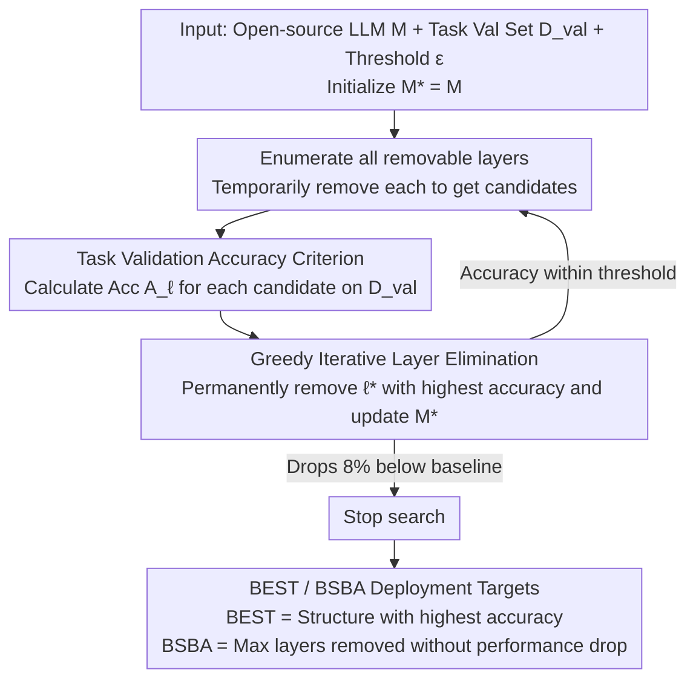

# TELL-TALE: Task Efficient LLMs with Task Aware Layer Elimination

**Conference**: ACL 2026 Findings  
**arXiv**: [2510.22767](https://arxiv.org/abs/2510.22767)  
**Code**: https://github.com/omyokun/tale/  
**Area**: Model Compression / LLM Efficiency  
**Keywords**: Task-aware Pruning, Layer Elimination, Inference Acceleration, Validation Set Search, Retraining-free

## TL;DR
TALE utilizes a retraining-free greedy search process to directly eliminate "impeding" Transformer layers for specific downstream tasks, simultaneously enhancing task accuracy and reducing inference costs across five open-source LLMs and nine benchmarks.

## Background & Motivation
**Background**: Large Language Models (LLMs) are typically deployed with a fixed depth, processing all Transformer layers regardless of whether the downstream task involves mathematical reasoning, commonsense QA, or knowledge-based multiple-choice questions. Existing model compression methods—such as weight pruning, head/block removal, or early exit—mostly rely on general metrics like perplexity, representation similarity, or reconstruction error, primarily aiming to save computational resources.

**Limitations of Prior Work**: General pruning metrics do not necessarily correlate with performance on specific target tasks. A layer that appears essential for language modeling perplexity might introduce noise for a specific task; conversely, certain intermediate layers might already provide sufficient representations for a task, and passing through subsequent layers could actually degrade accuracy. Furthermore, while fine-tuning improves task performance, it does not reduce inference costs and requires significant data and training budgets.

**Key Challenge**: Model compression typically operates under the assumption that "removing layers damages capabilities," thus treating optimization as a task of minimizing performance drops. However, this paper observes that for certain tasks, eliminating mismatched layers can serve as a form of task adaptation, potentially making the model both more accurate and faster.

**Goal**: The authors aim to provide a practically deployable method: no weight modifications, no retraining, and no reliance on hardware-specific implementations. By using a small-scale task validation set, the method identifies the optimal layer-removed structure and efficient architecture for that specific task.

**Key Insight**: The paper explains layer removal through the lens of residual flow: removing layer $\ell$ is equivalent to setting the transformation $F_\ell$ to zero, allowing the hidden state to pass through directly. By projecting intermediate hidden states into the vocabulary space, the authors found that intermediate layer predictions already outperform final layer predictions on many tasks, suggesting that "deeper" is not always "better."

**Core Idea**: Instead of using task-agnostic proxies to guess which layers are redundant, the method directly attempts to remove every layer on the target task validation set, retaining the removal operations that maximize validation accuracy.

## Method
The TALE approach is straightforward, making it highly suitable for deployment. Given an open-source LLM and a task validation set, it updates no parameters and focuses solely on structural search. In each step, it enumerates all currently existing layers in the model, temporarily removes one, and evaluates accuracy on the validation set. The candidate model with the highest accuracy is selected, that layer is permanently removed, and the process repeats on the new, shallower model.

The paper introduces two model concepts. BEST refers to the layer-removed structure with the highest task accuracy during the search, suitable for "accuracy-priority" scenarios. BSBA (Best Speedup with at least Baseline Accuracy) refers to the structure that removes the maximum number of layers without falling below the original model's accuracy, suitable for "speed-priority" scenarios.

### Overall Architecture
The input includes a pre-trained or instruction-tuned model $M$, a validation set $D_{val}$, and a threshold $\epsilon$. TALE initializes $M^* = M$. In each iteration, for every removable layer $\ell$ in the current model, a candidate model $M_{-\ell}$ is constructed, and $A_\ell = Acc(M_{-\ell}, D_{val})$ is calculated. The layer $\ell^* = \arg\max_\ell A_\ell$ is selected. if the performance after removal remains within the allowed range, $M^*$ is updated to $M_{-\ell^*}$; otherwise, the search stops. The stop threshold is set at 8% below the baseline accuracy, allowing the search to briefly explore lower-performing structures, though the authors observed no instances of recovery after dropping below the baseline.

For evaluation, the authors use two protocols: LM-Eval and Decoder Eval. Decoder Eval requires the model to generate structured answers, from which the final answer is extracted and compared to the ground truth. The authors argue this is closer to real-world generative capability, as multiple-choice probability-based LM-Eval might make weaker models appear stronger due to option compression.

### Key Designs
**1. Task Validation Accuracy as the Pruning Criterion: Aligning Search and Deployment Goals**

Methods like SLEB and BlockPruner rely on task-agnostic proxies like representation similarity or perplexity to judge redundancy, which often leads to removing layers useful for the task or retaining those that are harmful. TALE eliminates this gap by directly evaluating candidate models on the validation set after removing a layer. Since the evaluation metric is the same as the deployment optimization goal, the search directly identifies "negative contribution layers"—those whose removal actually improves accuracy—which proxy metrics fail to detect.

**2. Greedy Iterative Layer Elimination: Single-layer Removal and Re-evaluation to Capture Interactions**

The problem with pre-setting a fixed pruning budget (e.g., cutting the top-k layers at once) is that the optimal number of layers to remove varies by task. TALE does not pre-define the number of layers; instead, it enumerates all remaining layers in each round, performs temporary removal, and picks the best candidate $ \ell^* = \arg\max_\ell A_\ell $ for permanent removal. Re-evaluating after each removal is crucial, as removing one layer changes the relative importance of subsequent layers. This iterative process allows the method to find task-specific shallow structures by capturing these interactions.

**3. BEST / BSBA Dual Deployment Targets: Satisfying "Accuracy-First" and "Efficiency-First" Requirements from One Search**

Practical systems do not always prioritize the highest score; multi-agent systems or edge deployments often value throughput and latency, provided performance does not drop. TALE records two models during the same search: BEST (the structure with the highest accuracy in the trajectory) and BSBA (the structure with the most layers removed without dropping below the baseline). This allows users to choose based on deployment needs without running multiple searches for different objectives.

### Loss & Training
TALE involves no training loss as it does not update model weights. Its "optimization objective" is validation set accuracy. The computational cost is approximately $O(I \cdot L \cdot V \cdot T_{layer})$, where $I$ is the number of iterations, $L$ is the number of layers, $V$ is the validation set size, and $T_{layer}$ is the per-layer forward pass time. For LLaMA 3.1 8B, a search on a validation set of 500 to 1,500 samples takes about 1 to 2 A100 GPU hours per task. While LoRA is used in some experiments, it is to evaluate TALE's interaction with fine-tuning rather than a requirement for TALE itself.

## Key Experimental Results

### Main Results
TALE was evaluated across 5 open-source models and 9 tasks, including ARC-Challenge, ARC-Easy, MMLU, Winogrande, GSM8K-HARD, MATH500, CommonQA, BIG-Bench, and BoolQ. The table below highlights zero-shot results for LLaMA 3.1 8B and Qwen 2.5 7B (#D denotes the number of removed layers).

| Model | Dataset | Baseline | TALE BEST | #D | BSBA | Observation |
|------|--------|----------|-----------|----|------|------|
| LLaMA 3.1 8B | ARC-Challenge | 79.4 | 80.6 | 4 | 77.6 | Modest gains in knowledge/commonsense |
| LLaMA 3.1 8B | MMLU | 48.8 | 53.8 | 1 | 50.2 | Significant gain dropping just 1 layer |
| LLaMA 3.1 8B | GSM8K-HARD | 39.0 | 59.0 | 1 | 39.4 | Largest gains in math reasoning |
| LLaMA 3.1 8B | MATH500 | 25.4 | 28.2 | 2 | 27.4 | Early/mid-layer removal effective for reasoning |
| Qwen 2.5 7B | ARC-Challenge | 86.55| 92.00 | 2 | 86.55| +5.45 improvement on ARC-C |
| Qwen 2.5 7B | MMLU | 68.10 | 71.00 | 5 | 68.13| More layers removed while maintaining baseline |
| Qwen 2.5 7B | GSM8K-HARD | 43.80 | 61.80 | 2 | 43.99| +18 improvement on math reasoning |
| Qwen 2.5 7B | MATH500 | 31.00 | 38.20 | 2 | 32.10| Consistent gains on math tasks |

The overall trend shows that while LLaMA's improvements on ARC-Challenge are small (~+1.6), Qwen 2.5 7B shows more significant gains (~+6.3). Reasoning tasks like MATH500 and GSM8K see improvements ranging from 23% to 51%. This supports the insight that some layers are not just neutral redundancies for reasoning tasks but may actually introduce mismatched representation noise.

| Eval | Method | ARC-Easy | ARC-Challenge | Winogrande | Conclusion |
|------|------|----------|---------------|------------|------|
| Decoder Eval | TALE | 76.7 | 54.3 | 73.1 | Best across all three |
| Decoder Eval | SLEB-ta | 61.0 | 38.0 | 66.5 | Trails even when task-aware |
| Decoder Eval | BlockPruner-ta | 64.6 | 39.6 | 65.59 | Inferior to direct accuracy search |
| LM-Eval | BlockPruner-ta | 65 | 41 | 66 | Baseline pruning still drops performance |
| LM-Eval | TALE | 81 | 55 | 78 | Continues to lead |

### Ablation Study
Instead of traditional module ablation, the paper validates TALE's robustness via evaluation protocols, validation set size, and interaction with fine-tuning. A key finding is that replacing TALE’s objective (task accuracy) with representation similarity or perplexity leads to significantly worse results. For example, on ARC-Easy, using cosine similarity to guide TALE removes 2 layers, but LLaMA accuracy drops from 79.5 to 58.5, indicating a severe misalignment between proxy and task objectives.

| Setting | Representative Result | Description |
|------|----------|------|
| Val Set Size | Layer removal sets stabilize beyond 500 samples | TALE does not require large validation sets |
| Random Seed | Very low variance in BEST results across models | Search is not dependent on chance seeds |
| Inference Efficiency | 1st token latency improved in 9/9 cases (avg -14.3%); throughput improved in 9/9 cases (avg +17.9%) | BEST models provide real throughput gains |
| Search Cost | ~1-2 A100 hours per task for LLaMA 3.1 8B | Search cost is amortized by long-term inference |

TALE is not just for inference-time pruning; it is also complementary to LoRA fine-tuning.

| Model / Dataset | Baseline | TALE only | FT only | TALE → FT | FT → TALE | (TALE → FT) → TALE |
|---------------|----------|-----------|---------|-----------|-----------|----------------------|
| LLaMA 3.1 8B / Winogrande | 53.83 | 56.67 (#D=4) | 85.00 | 87.06 (#D=4) | 86.74 (#D=7) | 87.37 (#D=8) |
| LLaMA 3.1 8B / MMLU | 54.87 | 59.90 (#D=1) | 63.62 | 63.49 (#D=1) | 64.21 (#D=2) | 64.01 (#D=2) |
| LLaMA 3.1 8B / GSM8K | 15.07 | 37.08 (#D=3) | 42.70 | 53.96 (#D=1) | 50.86 (#D=2) | 54.02 (#D=2) |
| Qwen 0.5B / MMLU | 31.48 | 39.98 (#D=2) | 44.87 | 43.76 (#D=2) | 45.53 (#D=2) | 45.58 (#D=3) |

### Key Findings
- Layer removal is not merely compression; it can serve as task adaptation. Specifically, removing 1 to 3 early-to-mid layers often yields the greatest benefits for math reasoning tasks.
- Layer importance is highly task-dependent. Commonsense/knowledge tasks and math reasoning tasks rely on different layer segments, making fixed top-down or bottom-up pruning strategies difficult to generalize.
- TALE is effective for both large and small models, though the magnitude of gains varies. The paper notes significant gains for Lucie 7B, potentially because as it was trained on fewer tokens, it remains further from its performance ceiling.

## Highlights & Insights
- The most elegant aspect is shifting the pruning goal from "minimizing loss" to "directly maximizing task score." This unifies compression and adaptation, avoiding the pitfalls of proxy metrics.
- The method is engineering-friendly: no weight changes, no retraining, and hardware-agnostic. It produces a standard Transformer with removed layers that integrates directly into existing inference stacks.
- TALE provides an interpretability perspective: if task performance increases after removing a layer, that layer may be introducing unnecessary representational transformations for that task. The iterative ablation curves help locate where specific task capabilities are distributed within the network.

## Limitations & Future Work
- TALE currently operates at the full-layer granularity. While transparent, finer-grained structures like attention heads, MLP blocks, or token-adaptive routing might offer better trade-offs.
- It requires a separate search for each task, resulting in task-specific structures. In scenarios requiring one model to handle highly heterogeneous tasks simultaneously, frequent structure switching might increase management complexity.
- Greedy search does not guarantee a global optimum. Removing one layer alters the importance of others; local optimal paths might miss structures that only emerge through combined removals.
- While search costs are low, a target task validation set is still necessary. For open-ended generation tasks without stable validation sets or with high evaluation noise, the objective function for TALE would need redesigning.

## Related Work & Insights
- **vs SLEB**: SLEB performs training-free layer removal based on representation similarity and perplexity. TALE uses target task accuracy for search, enabling better identification of task-harmful layers.
- **vs BlockPruner**: BlockPruner partitions blocks and prunes using general metrics. TALE is coarser in granularity but more direct in objective; experiments show TALE outperforms SLEB/BlockPruner even when they are given task validation data.
- **vs SparseGPT / Wanda / SliceGPT**: These methods focus on general compression at the weight or dimension level. TALE keeps weights intact and only modifies the layer path, simplifying deployment and rollback.
- **vs Early Exit**: Early exit dynamically decides when to stop inference, while TALE performs an offline search for a fixed layer-removed structure. The former is more flexible, while the latter integrates more easily with static inference optimizations.

## Rating
- Novelty: ⭐⭐⭐⭐ Simple but impactful shift to using task accuracy as the pruning objective leads to strong empirical results.
- Experimental Thoroughness: ⭐⭐⭐⭐⭐ Comprehensive coverage includes various models, tasks, evaluation protocols, random seeds, validation set sizes, baseline comparisons, and fine-tuning interactions.
- Writing Quality: ⭐⭐⭐⭐ Clear main narrative with ample supplementary data in the appendix; some tables and speed metrics are densely packed.
- Value: ⭐⭐⭐⭐⭐ Highly practical for task-specific LLM deployment, especially for preparing lightweight specialized models for diverse roles in multi-agent systems.

<!-- RELATED:START -->

## Related Papers

- [\[ACL 2026\] SAMoRA: Semantic-Aware Mixture of LoRA Experts for Task-Adaptive Learning](samora_semantic-aware_mixture_of_lora_experts_for_task-adaptive_learning.md)
- [\[ACL 2026\] Task-Stratified Knowledge Scaling Laws for Post-Training Quantized LLMs](task-stratified_knowledge_scaling_laws_for_post-training_quantized_large_languag.md)
- [\[CVPR 2026\] Discovering Adaptive Task Dependencies for Efficient Multi-Task Representation Compression](../../CVPR2026/model_compression/discovering_adaptive_task_dependencies_for_efficient_multi-task_representation_c.md)
- [\[ACL 2026\] LEAP: Layer-wise Exit-Aware Pretraining for Efficient Transformer Inference](leap_layer-wise_exit-aware_pretraining_for_efficient_transformer_inference.md)
- [\[ACL 2026\] ProActor: Timing-Aware Reinforcement Learning for Proactive Task Scheduling Agents](proactor_timing-aware_reinforcement_learning_for_proactive_task_scheduling_agent.md)

<!-- RELATED:END -->
