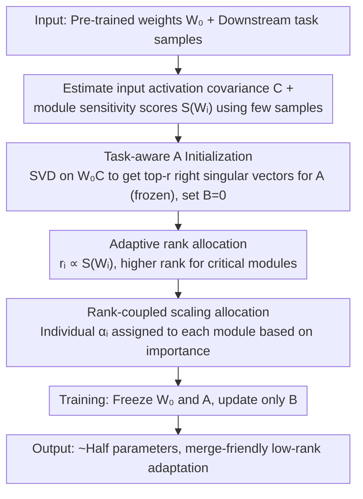

# TLoRA: Task-aware Low Rank Adaptation of Large Language Models

**Conference**: ACL2026  
**arXiv**: [2604.18124](https://arxiv.org/abs/2604.18124)  
**Code**: https://github.com/Rambo-Yi/TLora/tree/main  
**Area**: Code Intelligence / Parameter-Efficient Fine-Tuning / LLM Adaptation  
**Keywords**: LoRA, PEFT, Task-aware Initialization, Adaptive Rank Allocation, Low-Rank Adaptation

## TL;DR
TLoRA uses training sample activation covariance to initialize and freeze the LoRA $A$ matrix, then adaptively allocates rank and scaling factors based on module importance. This allows LLMs to achieve or exceed mainstream LoRA variants on NLU, common sense reasoning, math, code generation, and chat tasks using approximately half the trainable parameters.

## Background & Motivation
**Background**: LoRA is currently one of the most widely used methods for parameter-efficient fine-tuning. It freezes the original model weights and only trains two low-rank matrices $A$ and $B$. Since $BA$ can be merged back into the original weights during inference, it is highly suitable for the low-cost adaptation of Large Language Models and Code Models.

**Limitations of Prior Work**: The design of two key hyperparameters in standard LoRA is crude: first, $A$ is randomly initialized, so the low-rank subspace is not necessarily aligned with the current task at the start; second, all layers use a uniform rank and uniform $alpha/r$ scaling, defaulting to the assumption that different modules are equally important. On complex tasks, this causes early training steps to be wasted on "rotating" the projection subspace and wastes parameter budget on non-critical layers.

**Key Challenge**: The value of LoRA stems from its simplicity, efficiency, and mergeability. However, many improvement methods either only modify initialization, dynamically adjust rank during training, or require modifying pre-trained weights to maintain initial output. The conflict this paper addresses is: can better initialization and resource allocation be completed once before training begins, while retaining the engineering simplicity of LoRA?

**Goal**: The authors aim to build a unified framework that simultaneously determines three things under a fixed parameter budget: which task-related subspace each module's $A$ should align with, how much rank each module should be allocated, and how large the update magnitude for each module should be.

**Key Insight**: The paper identifies the functional asymmetry of the two LoRA matrices: $A$ acts more like a feature extractor, determining which input subspace the updates are restricted to; $B$ acts more like an output mapper, responsible for mapping the extracted low-dimensional features to the target update. If $A$ is sufficiently good at initialization, it can be frozen entirely, with only $B$ being trained.

**Core Idea**: Use the SVD of $W_0 C$ to find the principal directions most relevant to task activations for initializing $A$, and then use sensitivity scores $|w \cdot \nabla_w L|$ to distribute rank and scaling factors to more critical modules.

## Method
TLoRA does not redesign the inference form of LoRA but rather rewrites the "pre-training preparation." it first uses a small number of training samples to estimate the input activation covariance and parameter sensitivity of each module, then assigns different ranks and scales to all LoRA modules and initializes a frozen $A$. Only $B$ is updated during the training phase, significantly reducing the trainable parameters and optimizer states for each adapter.

### Overall Architecture
Given pre-trained weights $W_0$ and downstream task training samples, TLoRA performs three steps for each LoRA-injected module. First, aggregate input activations to calculate the covariance matrix $C$, initialize $A$ with the top-r right singular vectors of $W_0 C$, and set $B=0$ to ensure the initial output remains equivalent to the original model. Second, calculate the importance score for each module to estimate its sensitivity to the loss of the current task. Third, under a total rank budget and total scaling budget, allocate higher ranks and larger update magnitudes to high-importance modules. During training, $W_0$ and $A$ are frozen, and only $B$ is updated.

### Key Designs

**1. Task-aware $A$ Initialization: Aligning projection subspaces with task directions before training**

Standard LoRA initializes $A$ randomly, leaving the training process to slowly "rotate" into a useful subspace. TLoRA's key observation is that once the decision is made to freeze $A$ and only optimize $B$, weight updates are permanently restricted to the row space of $A$. If this space does not cover task-relevant directions from the start, training $B$ cannot compensate for it later. Therefore, initialization must be precise. The paper theoretically derives that the optimal $A$ contains a $C^{-1/2}$ term (where $C$ is the input activation covariance), but empirical tests show that LLM activation covariance has a long tail of small eigenvalues, where direct inversion amplifies noise.

To address this, TLoRA adopts a more stable approximation: perform SVD on $W_0 C$, take the top-$r$ right singular vectors as $A$, and set $B=0$ to ensure the initial output is equivalent to the original model. This $W_0 C$ simultaneously encodes two layers of information—$W_0$ provides the feature basis already learned by the pre-trained weights, while $C$ uses the activation statistics of the current task to filter for high-variance, high-correlation input directions. Compared to initializations that only extract directions from pre-trained weights, it is closer to the downstream distribution; compared to methods that rewrite original weights, it maintains the merge-friendliness of $B=0$, making it easier to deploy.

**2. Sensitivity-based Adaptive Rank Allocation: Compressing parameter budgets into modules that actually affect loss**

Uniform rank implicitly assumes all layers are equally important, but mathematical, code, and common sense reasoning do not activate the same set of modules—one-size-fits-all budget allocation inevitably leads to waste. TLoRA instead uses a sensitivity score to measure the impact of each module on the current task loss. For module $W_i$, it calculates:

$$S(W_i)=\frac{1}{|W_i|}\sum_{w \in W_i}|w \cdot \nabla_w L|$$

Rank is then allocated based on the proportion of $S(W_i)$ across all modules, i.e., $r_i \propto S(W_i)$, where highly sensitive modules receive higher ranks. The paper's appendix also observes that sensitive modules do not shift globally across tasks but are stably concentrated in a few layers and projection matrices, which is the prerequisite for targeted allocation being more cost-effective than uniform allocation. Unlike dynamic rank adjustment methods like AdaLoRA, TLoRA moves the entire allocation process to the initialization phase, keeping the training pipeline simple.

**3. Rank-coupled Scaling Factor Allocation: Preventing high-rank modules from being suppressed by $\alpha/r$**

Design point 2 gives higher ranks to critical modules, but the standard LoRA scaling is $\alpha/r$—the larger the rank, the smaller the scaling. If a uniform $\alpha$ is still used, critical modules may gain more directions, but their actual update magnitude is suppressed, rendering the effort futile. TLoRA therefore calculates an individual $\alpha_i$ for each module based on importance, allowing high-importance modules to simultaneously obtain more directional capacity and greater update intensity. These three design points have clear roles: initialization handles "which direction to update," rank handles "how much capacity to provide," and scale handles "how much force to apply." They must be adjusted together to avoid scenarios where the "direction is correct but capacity is insufficient" or "capacity is provided but suppressed by scaling."

### Loss & Training
The training objective remains the standard supervised fine-tuning loss for downstream tasks; TLoRA does not introduce additional generation objectives. During the initialization phase, a small number of samples are used to estimate activation covariance and sensitivity scores. In the main experiments, GLUE uses T5-base, and generation tasks use LLaMA2-7B, running on a single NVIDIA A800. Math, code, and chat experiments use a target rank of 128 and $alpha=128$, with a TLoRA sample size typically at 32. A key training constraint is freezing $A$ and only training $B$, which reduces the trainable parameters per adapter by approximately half.

## Key Experimental Results

### Main Results
The paper covers NLU, common sense reasoning, mathematical reasoning, code generation, and chat generation. The average results and representative tasks are kept below.

| Task Group | Model / Metric | TLoRA | Repr. Baseline | Parameter Comparison | Conclusion |
|------------|----------------|-------|----------------|----------------------|------------|
| GLUE NLU | T5-base Avg Acc | 85.96 | PiSSA 85.24 / LoRA 83.44 | TLoRA 5.44M vs LoRA 12.97M | Best avg with fewer params |
| Common Sense | LLaMA2-7B 8-task Avg | 84.21 | DoRA 83.61 / LoRA 83.57 | TLoRA 41.68M vs LoRA 79.95M | Best in 5 out of 8 tasks |
| Math Reasoning | GSM8K / MATH | 56.34 / 9.08 | LoRA 44.80 / 6.18 | TLoRA 171.71M vs LoRA 319.81M | Best on MATH, GSM8K near LoRA-GA |
| Code Generation | HumanEval / MBPP | 23.50 / 40.20 | LoRA 20.70 / 35.70 | TLoRA 171.71M vs LoRA 319.81M | Better than PEFT baselines |
| Chat Generation | MT-Bench | 5.17 | PiSSA 5.00 / LoRA 4.76 | TLoRA 171.71M vs LoRA 319.81M | Benefits complex generation |

These results indicate that TLoRA is not only effective on a single benchmark. Specifically, in code generation, it improves HumanEval from LoRA's 20.70 to 23.50 and MBPP from 35.70 to 40.20, while using approximately 46% fewer trainable parameters.

### Ablation Study
The authors verified the coupling relationship between rank adaptation, scale adaptation, and task-aware initialization on LLaMA2-7B.

| Configuration | GSM8K | MATH | HumanEval | MBPP | Description |
|---------------|-------|------|-----------|------|-------------|
| LoRA | 44.80 | 6.18 | 20.70 | 35.70 | Std random init with uniform rank/scale |
| + RA | 45.33 | 5.96 | 22.60 | 34.40 | Only rank adj; unstable gains |
| + SA | 45.86 | 6.30 | 23.20 | 35.40 | Only scale adj; limited by random subspace |
| + Init | 51.78 | 7.74 | 22.00 | 39.40 | Direction alignment provides largest gain |
| + Init + RA | 54.05 | 7.68 | 22.60 | 38.60 | Capacity allocation starts to contribute |
| + Init + SA | 55.11 | 8.36 | 22.00 | 39.40 | Update intensity more effective with Init |
| + RA + SA | 47.68 | 6.50 | 22.60 | 36.50 | Still limited without Init |
| TLoRA | 56.34 | 9.08 | 23.50 | 40.20 | Init + RA + SA all included |

The design of freezing $A$ was also independently verified.

| Configuration | GSM8K | MATH | HumanEval | MBPP | MT-Bench | Conclusion |
|---------------|-------|------|-----------|------|----------|------------|
| TLoRA, Unfrozen-A | 57.01 | 8.78 | 23.20 | 40.70 | 5.09 | Unstable gains despite more params |
| TLoRA, Frozen-A | 56.34 | 9.08 | 23.50 | 40.20 | 5.13 | Parity performance; saves memory |

### Key Findings
- Task-aware initialization is the largest single contributor: adding Init alone raised GSM8K from 44.80 to 51.78 and MBPP from 35.70 to 39.40, indicating that LoRA's "initial subspace" is indeed a bottleneck for complex tasks.
- RA / SA show unstable effects under random initialization but become significantly stronger when combined with Init, supporting the proposed coupling of "direction alignment + capacity allocation + update intensity."
- Computational cost analysis shows that TLoRA initialization adds 232.47s of time and 17098MB of peak memory; formal training time is 4h49min23s, nearly equal to LoRA's 4h48min15s, but training VRAM dropped from 63530MB to 50448MB.
- Low sensitivity to sample size: as initialization samples varied from 16 to 512, GSM8K stayed around 55.88-56.94 and MATH at 8.70-9.12, showing that a small number of calibration samples is sufficient for estimating available subspaces.

## Highlights & Insights
- This paper clearly explains the $A/B$ asymmetry of LoRA: $A$ determines "which directions can be updated," while $B$ determines "how to map within these directions." This perspective explains why freezing $A$ does not necessarily lose expressivity better than just comparing initialization tricks.
- $W_0 C$ is a practical proxy: $W_0$ provides existing feature bases from the pre-trained model, while $C$ filters directions using current task activations. It does not require full fine-tuning or modifying original weights.
- The joint allocation of rank and scale reminds us that PEFT parameter budgeting is not just a "total volume" issue, but also a matter of "which modules and with what update magnitude." This logic is worth reusing for task-specific adapters in code, math, or multimodal models.
- The VRAM savings from freezing $A$ are direct, as it eliminates half of the adapter parameters and their optimizer states; for private deployments or multi-task adapter training with limited resources, this engineering value may be more important than incremental accuracy gains.

## Limitations & Future Work
- The main experimental model scales are T5-base and LLaMA2-7B. Although the appendix adds results for Mistral-7B, LLaMA2-13B, and LLaMA3-8B on math tasks, scalability on 70B, MoE, or more modern code LLMs has not been fully verified.
- The paper focuses on text tasks like NLP and code generation. The authors mention the method is theoretically applicable to ViT or VLM, but the activation covariance structure of vision and multimodal modules may differ and requires validation.
- Importance scores rely on gradient estimation. Although calculated only during the initialization phase, they may be sensitive to data sampling, batch composition, and task mixing ratios; conflicts in module importance during multi-task adaptation require additional handling.
- Future work could combine TLoRA with quantization, sparse MoE adapters, or repository-level fine-tuning for code models to study whether rank allocation remains stable in ultra-long code contexts and multilingual code tasks.

## Related Work & Insights
- **vs Standard LoRA**: Standard LoRA uses random initialization for $A$ and uniform rank/scale; TLoRA completes task subspace alignment and resource allocation at initialization. The advantage is faster convergence and fewer parameters, at the cost of one calibration step.
- **vs PiSSA / OLoRA / MiLoRA**: These methods primarily extract initialization directions from the pre-trained weights themselves. TLoRA introduces activation covariance from task data, making it closer to the actual downstream distribution.
- **vs LoRA-GA / CorDA**: LoRA-GA and CorDA are also data-driven initializations, but some require adjusting pre-trained weights or maintaining weight differences. TLoRA keeps $B=0$, leaving the initial output unchanged and maintaining compatibility with LoRA's merge-deployment advantages.
- **vs AdaLoRA / DyLoRA**: Dynamic rank methods like AdaLoRA adjust budgets during training, offering more flexible expressivity but higher complexity; TLoRA moves adaptation to the precursor stage, suitable for scenarios requiring simple training pipelines.

## Rating
- Novelty: ⭐⭐⭐⭐☆ Unified task-aware initialization, rank allocation, and scale allocation into a solid framework, though built on the existing LoRA paradigm.
- Experimental Thoroughness: ⭐⭐⭐⭐☆ Covers NLU, common sense, math, code, and chat with convincing ablations; larger models and multimodal tasks are still open areas.
- Writing Quality: ⭐⭐⭐⭐☆ Method derivation and ablation explanations are clear; some minor HTML table conversion issues but logical integrity is maintained.
- Value: ⭐⭐⭐⭐⭐ Practical for engineering teams needing low-cost fine-tuning of code models or general LLMs, especially in VRAM-constrained adapter training.

<!-- RELATED:START -->

## Related Papers

- [\[ACL 2026\] TalkLoRA: Communication-Aware Mixture of Low-Rank Adaptation for Large Language Models](talklora_communication-aware_mixture_of_low-rank_adaptation_for_large_language_m.md)
- [\[ACL 2026\] Not All Directions Matter: Towards Structured and Task-Aware Low-Rank Model Adaptation](not_all_directions_matter_towards_structured_and_task-aware_low-rank_model_adapt.md)
- [\[NeurIPS 2025\] Beyond Higher Rank: Token-wise Input-Output Projections for Efficient Low-Rank Adaptation](../../NeurIPS2025/model_compression/beyond_higher_rank_token-wise_input-output_projections_for_efficient_low-rank_ad.md)
- [\[AAAI 2026\] Group Orthogonal Low-Rank Adaptation for RGB-T Tracking](../../AAAI2026/model_compression/group_orthogonal_low-rank_adaptation_for_rgb-t_tracking.md)
- [\[NeurIPS 2025\] Gated Integration of Low-Rank Adaptation for Continual Learning of Large Language Models](../../NeurIPS2025/model_compression/gated_integration_of_low-rank_adaptation_for_continual_learning_of_large_languag.md)

<!-- RELATED:END -->
