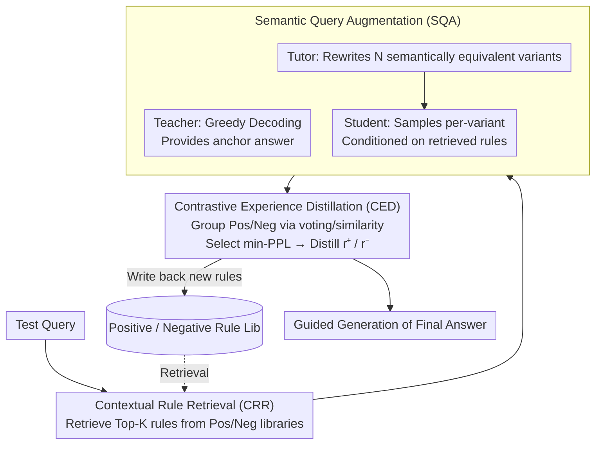

# Training-Free Test-Time Contrastive Learning for Large Language Models

**Conference**: ACL 2026 Findings  
**arXiv**: [2604.13552](https://arxiv.org/abs/2604.13552)  
**Code**: [https://github.com/KevinSCUTer/TF-TTCL](https://github.com/KevinSCUTer/TF-TTCL)  
**Area**: Model Compression / Test-Time Adaptation  
**Keywords**: Test-Time Adaptation, Contrastive Learning, Training-free Adaptation, Empirical Rules, Multi-agent

## TL;DR

This paper proposes TF-TTCL, a training-free test-time contrastive learning framework that enables frozen LLMs to self-improve online through an "Explore-Reflect-Guide" cycle. It utilizes multi-agent role-playing to generate diverse reasoning trajectories, distills textual rules from the contrast between positive and negative samples into a memory bank, and retrieves relevant rules to guide generation during inference.

## Background & Motivation

**Background**: LLMs often encounter distribution shifts during deployment. Test-Time Adaptation (TTA) aims to allow models to adapt to new data online during the inference phase. Most existing TTA methods rely on gradient updates (requiring white-box access), which incur high computational overhead and are unsuitable for black-box API scenarios.

**Limitations of Prior Work**: (1) Gradient-based TTA (e.g., Tent, TTT, TTRL) requires access to model parameters, making them inapplicable for API deployments; (2) Among training-free schemes, static prompting (CoT) cannot adapt to specific test instances, while dynamic schemes (RAG) depend on external knowledge bases or ground-truth verifiers; (3) TTRL requires multiple passes through test data before evaluation, which does not align with real-world online single-pass scenarios.

**Key Challenge**: How to extract reliable error signals from the frozen model's own outputs to guide online improvement without updating parameters or relying on external feedback?

**Goal**: To design a completely training-free, strictly online test-time self-improvement framework that does not require external knowledge.

**Key Insight**: Borrowing the core idea of contrastive learning—while ground truth is absent, the semantic gap between a model's high-quality and low-quality outputs contains rich supervisory information. This gap is distilled into explicit textual rules, acting as "semantic gradients" to replace parameter gradients.

**Core Idea**: Generate diverse reasoning paths via multi-agent role-playing; distinguish positive and negative samples based on consistency and perplexity; distill textual rules for "what to do" and "what to avoid" from the contrast; and accumulate these online into an empirical rule library to guide subsequent inference.

## Method

### Overall Architecture

TF-TTCL performs a three-step cycle for each incoming test sample: (1) Semantic Query Augmentation (SQA)—generating diverse reasoning trajectories using Teacher/Tutor/Student roles; (2) Contrastive Experience Distillation (CED)—partitioning trajectories into positive and negative samples to distill textual rules; (3) Contextual Rule Retrieval (CRR)—retrieving relevant rules from the library to guide the current inference. All roles share the same frozen LLM, differing only in system prompts and decoding configurations. No parameters are updated; only the rule library is "updated" as context.

### Key Designs

**1. Semantic Query Augmentation (SQA): Exploring Uncertainty via Multi-Agent Roles**

For contrastive learning to work without labels, meaningful "positive and negative samples" must be generated. Simply varying decoding temperatures often results in trajectories that are too semantically similar to expose vulnerabilities. SQA uses three roles sharing one frozen LLM to create intentional diversity: Teacher uses greedy decoding for a high-confidence anchor; Tutor rewrites the original query into $N$ semantically equivalent but stylistically different variants to simulate input distribution shifts; Student then generates answers for each variant. Crucially, all roles are conditioned on retrieved historical rules. This approach forces out reasoning weaknesses where the model might fail simply because a question is phrased differently.

**2. Contrastive Experience Distillation (CED): Rule Distillation from Unlabeled Responses**

Without ground truth, CED evaluates candidates by grouping them. For closed-ended tasks, it uses majority voting; for open-ended tasks, it uses embedding similarity to the Teacher's anchor. Within groups, it selects trajectories with the minimum perplexity (min-PPL). Selecting the min-PPL negative sample is vital as it captures "confident errors" (hard negatives). The LLM then compares these to distill a positive rule $r^+$ (what to do) and a negative rule $r^-$ (what to avoid). Correcting these "confident hallucinations" is more valuable than addressing obvious errors.

**3. Contextual Rule Retrieval (CRR): Guiding Inference via Historical Experience**

Online learning requires the precise reuse of distilled rules. CRR maintains two independent memory banks—positive rule set $\mathcal{R}_{pos}$ and negative rule set $\mathcal{R}_{neg}$—stored as (embedding, text) key-value pairs. When a new query arrives, Top-$K$ relevant rules are retrieved from each library via cosine similarity. Separating the libraries prevents the model from confusing instructions to follow with those to avoid. The incremental update of the memory bank allows the system to continuously learn from history, stabilizing quality over time.

### A Complete Example: Online Correction of a GSM8K Problem

Suppose the model has processed several samples and the library contains rules about "listing arithmetic steps clearly and avoiding mental math skips." For a new word problem:

1.  **CRR**: Retrieves Top-$K$ rules from $\mathcal{R}_{pos}$ and $\mathcal{R}_{neg}$. E.g., Pos: "Write out intermediate quantities before adding," Neg: "Do not merge unit price and quantity mentally."
2.  **SQA**: Teacher provides an anchor answer (e.g., 42). Tutor generates $N$ variants. Student samples answers for each variant conditioned on rules, yielding {42, 42, 36, 42, 30}.
3.  **CED**: Majority voting identifies 42 as the positive group and {36, 30} as the negative group. The min-PPL samples are selected. The LLM compares them to distill a new rule, e.g., Pos: "Place multiplication results on a separate line before addition," Neg: "Avoid performing multiplication and addition in a single step to prevent missing terms."
4.  **Write-back**: New rules enter the library, available for the next related problem.

The model remains frozen; only the context is "updated."

### Loss & Training

Fully training-free. The framework involves no parameter updates. "Learning" is achieved entirely through the accumulation and retrieval of textual rules. The goal is to maximize the cumulative output quality of the online test stream.

## Key Experimental Results

### Main Results

| Method | GSM8K | MATH | ARC-C | HellaSwag |
| :--- | :--- | :--- | :--- | :--- |
| Zero-shot CoT | Baseline | Baseline | Baseline | Baseline |
| TTRL | Needs Multi-pass | Needs Multi-pass | - | - |
| TF-TTCL (Ours) | Significant Gain | Significant Gain | Gain | Gain |

TF-TTCL consistently outperforms zero-shot baselines and existing TTA methods across both closed-ended reasoning and open-ended evaluation tasks.

### Ablation Study

| Configuration | Key Metrics | Description |
| :--- | :--- | :--- |
| Full TF-TTCL | Optimal | Synergy of three modules |
| w/o Rule Retrieval | Significant drop | Validates value of experience accumulation |
| w/o Query Augmentation | Drop | Diversity is crucial for sample quality |
| w/o Negative Rules | Drop | Positive guidance alone is insufficient |
| Random Retrieval | Drop | Relevance matching in retrieval is critical |

### Key Findings

-   **Online Accumulation Effect**: As more test samples are processed and the rule library grows, reasoning quality for subsequent samples continues to improve, demonstrating true online learning.
-   **Indispensability of Negative Rules**: Removing negative rules (only telling the model "what to do") leads to performance degradation; "what to avoid" is equally crucial.
-   **min-PPL Negative Selection**: Selecting the most confident error as a negative sample provides a stronger learning signal than random or max-PPL choices.
-   **Strictly Online vs. Multi-pass**: Unlike TTRL’s multi-pass paradigm, TF-TTCL improves in a strict single-pass online setting, better suited for deployment.

## Highlights & Insights

-   **"Semantic Gradient" Concept**: Analogizing contrastive rules to gradients is a clever conceptual design—while parameter gradients update weights, textual rules "update" the context.
-   **Black-box Friendly**: Requires no access to model parameters, making it ideal for API-based deployment.
-   **Multi-agent Role Division**: The Teacher (stability) + Tutor (exploration) + Student (generation) design elegantly balances exploration and exploitation.

## Limitations & Future Work

-   Incurs linear increases in computational cost due to $N+1$ LLM calls per test sample.
-   Majority voting in closed-ended tasks suffers from self-confirmation bias if all generated answers are identical but incorrect.
-   Long-term deployment may require rule compression or eviction mechanisms as the library grows.
-   Grouping for open-ended tasks relies on the Teacher's anchor; if the Teacher is wrong, the grouping fails.

## Related Work & Insights

-   **vs. TTRL**: TTRL updates parameters via RL with consistency-based pseudo-rewards and requires multiple passes. TF-TTCL is training-free and strictly online.
-   **vs. ExpeL/AvaTaR**: These rely on external environment rewards or ground truth and are offline frameworks. TF-TTCL is entirely self-supervised and online.
-   **vs. Training-Free GRPO**: Depends on verifiable ground-truth rewards; without them, it degrades to majority voting. TF-TTCL provides richer signals via contrastive distillation.

## Rating

-   Novelty: ⭐⭐⭐⭐ "Semantic gradient" and training-free online contrastive framework are novel.
-   Experimental Thoroughness: ⭐⭐⭐⭐ Validated on both closed and open-ended benchmarks with thorough ablation.
-   Writing Quality: ⭐⭐⭐⭐ Clear framework description and apt analogies.
-   Value: ⭐⭐⭐⭐ Provides a practical solution for test-time self-improvement of black-box LLMs.

<!-- RELATED:START -->

<!-- RELATED:END -->

## Related Papers

- [\[CVPR 2026\] TALON: Test-time Adaptive Learning for On-the-Fly Category Discovery](../../CVPR2026/model_compression/talon_test-time_adaptive_learning_for_on-the-fly_category_discovery.md)
- [\[ACL 2026\] IntroLM: Introspective Language Models via Prefilling-Time Self-Evaluation](introlm_introspective_language_models_via_prefilling-time_self-evaluation.md)
- [\[CVPR 2026\] Test-time Sparsity for Extreme Fast Action Diffusion](../../CVPR2026/model_compression/test-time_sparsity_for_extreme_fast_action_diffusion.md)
- [\[ACL 2026\] JudgeMeNot: Personalizing Large Language Models to Emulate Judicial Reasoning in Hebrew](judgemenot_personalizing_large_language_models_to_emulate_judicial_reasoning_in_.md)
- [\[ACL 2026\] LightReasoner: Can Small Language Models Teach Large Language Models Reasoning?](lightreasoner_can_small_language_models_teach_large_language_models_reasoning.md)

<!-- RELATED:END -->
