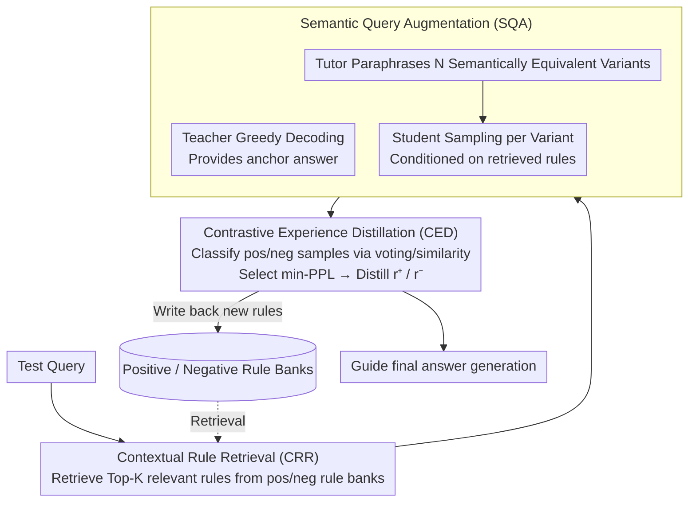

# Training-Free Test-Time Contrastive Learning for Large Language Models

**Conference**: ACL 2026 Findings  
**arXiv**: [2604.13552](https://arxiv.org/abs/2604.13552)  
**Code**: [https://github.com/KevinSCUTer/TF-TTCL](https://github.com/KevinSCUTer/TF-TTCL)  
**Area**: Model Compression / Test-time Adaptation  
**Keywords**: Test-time Adaptation, Contrastive Learning, Training-free Adaptation, Empirical Rules, Multi-agent

## TL;DR

This paper proposes TF-TTCL, a training-free test-time contrastive learning framework that enables frozen LLMs to self-improve online through an "explore-reflect-guide" loop. The framework utilizes multi-agent role-playing to generate diverse reasoning trajectories, distills textual rules from contrastive positive and negative samples into a memory bank, and retrieves relevant rules during inference to guide generation.

## Background & Motivation

**Background**: LLMs often encounter distribution shifts during deployment. Test-time adaptation (TTA) aims to allow models to adapt to new data online during the inference phase. Most existing TTA methods rely on gradient updates (requiring white-box access), which incur high computational overhead and are inapplicable to black-box API scenarios.

**Limitations of Prior Work**: (1) Gradient-based TTA (e.g., Tent, TTT, TTRL) requires access to model parameters, making it unsuitable for API-based deployment. (2) Among training-free schemes, static prompting (CoT) cannot adapt to specific test instances, while dynamic solutions (RAG) depend on external knowledge bases or ground-truth verifiers. (3) TTRL requires multiple passes over test data before evaluation, which does not align with realistic online single-pass scenarios.

**Key Challenge**: How to extract reliable error signals from a frozen model’s own output to guide online improvement without updating parameters or depending on external feedback?

**Goal**: To design a completely training-free, independent, and strictly online test-time self-improvement framework.

**Key Insight**: Drawing from the core idea of contrastive learning, although ground truth is unavailable, the semantic gap between a model’s high-quality and low-quality outputs contains rich supervisory information. This gap can be distilled into explicit textual rules, serving as "semantic gradients" to replace parameter gradients.

**Core Idea**: Diverse reasoning paths are generated through multi-agent role-playing. Positive and negative samples are distinguished based on consistency and perplexity. Textual rules for "what to do" and "what to avoid" are distilled from this contrast and accumulated online in an empirical rule bank to guide subsequent inference.

## Method

### Overall Architecture

TF-TTCL executes a three-step cycle for each arriving test sample: (1) Semantic Query Augmentation (SQA) uses three roles—Teacher, Tutor, and Student—to generate diverse reasoning trajectories. (2) Contrastive Experience Distillation (CED) classifies trajectories into positive and negative samples and distills textual rules from the contrast. (3) Contextual Rule Retrieval (CRR) retrieves relevant rules from the rule bank to guide the current inference. All roles share the same frozen LLM, utilizing only different system prompts and decoding configurations. This loop updates no parameters; only the rule bank within the context is "updated."

### Key Designs

**1. Semantic Query Augmentation (SQA): Deploying Three-Role Division to Explore Reasoning Uncertainty**

In label-free scenarios, contrastive learning requires "positive and negative samples." Trajectories generated merely by adjusting decoding temperature are often too semantically similar to expose the model's true vulnerabilities. SQA utilizes three roles—sharing the same frozen LLM but differing in system prompts and decoding configs—to create meaningful diversity. The Teacher uses greedy decoding to provide a high-confidence anchor answer as a stable baseline. The Tutor paraphrases the original query into $N$ stylistically different but semantically equivalent variants to simulate real-world input distribution shifts. The Student then samples answers for each variant. Crucially, the generation of all three roles is conditioned on historical rules retrieved from the rule bank, ensuring the exploration remains consistent with accumulated knowledge. By introducing diversity through query paraphrasing rather than simple randomness, the framework exposes reasoning fragilities (e.g., failing when a question is phrased differently), providing informative material for contrast.

**2. Contrastive Experience Distillation (CED): Identifying Samples from Unlabeled Responses to Distill Textual Rules**

With a pool of candidate responses, the system must distinguish correct from incorrect without ground truth. For closed-ended tasks, CED uses majority voting: consistent answers are grouped as positive samples, while inconsistent ones are negative. If all answers differ, the sample is skipped to avoid hallucination propagation. For open-ended tasks, embedding similarity to the Teacher's answer is used for grouping. In both positive and negative sets, the entry with the minimum perplexity (min-PPL) is selected. Selecting for min-PPL in positive samples identifies the "most confident correct answer," while in negative samples, it deliberately captures the "most confident error" (hard negative). Finally, the LLM summarizes the reasoning gap between the two to distill a positive rule $r^+$ (what to do) and a negative rule $r^-$ (what to avoid). The core premise is that an LLM's confident hallucinations are the most informative negative samples—correcting these assertive errors is far more valuable than correcting obvious ones.

**3. Contextual Rule Retrieval (CRR): Retrieving Historical Experience based on Relevance**

Online learning is only possible if distilled rules can be accurately reused. CRR maintains two independent memory banks: a positive rule set $\mathcal{R}_{pos}$ and a negative rule set $\mathcal{R}_{neg}$. Each rule is stored as a (embedding vector, text) key-value pair. When a new query arrives, the Top-$K$ most relevant rules are retrieved from each bank using cosine similarity. These are fed into the generation process to provide both positive guidance and negative warnings. Maintaining separate banks prevents the model from confusing which rules to follow and which to avoid. The incremental online updates to these memory banks allow the system to continuously learn from historical errors, stabilizing the quality of subsequent sample processing.

### Mechanism: Online Correction of a GSM8K Problem

Assuming the model has processed several samples and accumulated rules regarding "listing steps for multi-step arithmetic instead of mental math":

1.  **CRR Retrieval**: Using the query embedding, it retrieves Top-$K$ relevant rules from $\mathcal{R}_{pos}$ and $\mathcal{R}_{neg}$, such as "write out intermediate values before adding" (positive) and "do not combine unit price and quantity mentally" (negative).
2.  **SQA Exploration**: The Teacher provides an anchor answer (e.g., 42). The Tutor paraphrases the problem into $N$ variants. The Student samples answers for each variant, conditioned on the retrieved rules, yielding candidates like {42, 42, 36, 42, 30}.
3.  **CED Distillation**: Using majority voting for the closed-ended problem, 42 is grouped as positive, while 36 and 30 are negative. The min-PPL response for 42 is used for $r^+$, and the min-PPL response for 36 (a "confident error") is used as a hard negative. The LLM contrasts them to distill new rules, e.g., "results of multiplication must be on a separate line before addition" (positive) and "avoid simultaneous multiplication and addition in one step to prevent missing terms" (negative).
4.  **Write Back**: New rules are stored. The next related problem will retrieve them, forming an online accumulation where "more processing leads to richer rules and higher accuracy."

The entire process involves no parameter updates; the model weights remain frozen while the context is "updated."

### Loss & Training

Completely training-free. The framework does not involve parameter updates. "Learning" is achieved entirely through the accumulation and retrieval of textual rules. The objective is to maximize the cumulative output quality of the online test stream.

## Key Experimental Results

### Main Results

| Method | GSM8K | MATH | ARC-C | HellaSwag |
| :--- | :--- | :--- | :--- | :--- |
| Zero-shot CoT | Baseline | Baseline | Baseline | Baseline |
| TTRL | Multi-pass req. | Multi-pass req. | - | - |
| TF-TTCL (Ours) | Significant Gain | Significant Gain | Gain | Gain |

TF-TTCL consistently outperforms zero-shot baselines and existing TTA methods across both closed-ended reasoning tasks and open-ended evaluation tasks.

### Ablation Study

| Configuration | Key Metric | Description |
| :--- | :--- | :--- |
| Full TF-TTCL | Optimal | Synergy of three modules |
| w/o Rule Retrieval | Significant Drop | Validates the value of accumulated experience |
| w/o Query Augmentation | Drop | Diversity is crucial for pos/neg sample quality |
| w/o Negative Rules | Drop | Positive guidance alone is insufficient |
| Random Retrieval | Drop | Relevance matching in rule retrieval is critical |

### Key Findings

- **Online Cumulative Effect**: As more test samples are processed and the rule bank expands, the reasoning quality of subsequent samples improves, demonstrating true online learning capability.
- **Necessity of Pos/Neg Rules**: Ablation shows that removing negative rules (only telling the model "what to do") leads to performance degradation; "what to avoid" is equally critical.
- **min-PPL Negative Selection**: Selecting the most confident errors as negative samples provides a stronger learning signal than random or max-PPL selection.
- **Strictly Online vs. Multi-pass**: Unlike TTRL's multi-pass paradigm, TF-TTCL achieves self-improvement in a strict single-pass online setting, which is more suitable for real-world deployment.

## Highlights & Insights

- **"Semantic Gradient" Concept**: Analogizing contrastive rules to gradients is a clever conceptual design. While parameter gradients update weights, textual rules "update" the context; both share the same goal through different paths.
- **Black-box Friendly**: No model parameter access is required, making it ideal for API-based deployment. All "learning" is managed through prompt engineering and memory management.
- **Multi-agent Role Synergy**: The division of roles—Teacher (stable anchor), Tutor (diverse exploration), and Student (free generation)—elegantly balances the exploration-exploitation trade-off.

## Limitations & Future Work

- Computational cost increases linearly, requiring $N+1$ LLM inference calls per test sample (1 Teacher + $N$ Students).
- Closed-ended tasks use majority voting; if all answers are consistent but incorrect, the system cannot identify the error (self-confirmation bias).
- The rule bank grows continuously, requiring rule compression or eviction mechanisms for long-term deployment.
- Positive/negative grouping for open-ended tasks relies on similarity to the Teacher's answer; if the Teacher is wrong, the grouping fails.

## Related Work & Insights

- **vs. TTRL**: TTRL updates parameters using reinforcement learning with consistency-based pseudo-rewards and requires multiple passes. Ours is parameter-frozen and strictly online.
- **vs. ExpeL/AvaTaR**: These frameworks rely on external environment rewards or ground truth and are offline. TF-TTCL is entirely self-supervised and online.
- **vs. Training-Free GRPO**: Depends on verifiable ground-truth rewards and degrades to majority voting without them. TF-TTCL provides richer signals via contrastive distillation.

## Rating

- Novelty: ⭐⭐⭐⭐ The concept of "semantic gradients" and the training-free online contrastive framework are novel.
- Experimental Thoroughness: ⭐⭐⭐⭐ Validated on closed/open-ended benchmarks with extensive ablations.
- Writing Quality: ⭐⭐⭐⭐ Clear description of the framework and appropriate analogy to contrastive learning.
- Value: ⭐⭐⭐⭐ Provides a practical solution for the self-improvement of black-box LLMs at test time.

<!-- RELATED:START -->

## Related Papers

- [\[CVPR 2026\] TALON: Test-time Adaptive Learning for On-the-Fly Category Discovery](../../CVPR2026/model_compression/talon_test-time_adaptive_learning_for_on-the-fly_category_discovery.md)
- [\[ACL 2026\] IntroLM: Introspective Language Models via Prefilling-Time Self-Evaluation](introlm_introspective_language_models_via_prefilling-time_self-evaluation.md)
- [\[ICLR 2026\] Tequila: Trapping-free Ternary Quantization for Large Language Models](../../ICLR2026/model_compression/tequila_trapping-free_ternary_quantization_for_large_language_models.md)
- [\[CVPR 2026\] FOZO: Forward-Only Zeroth-Order Prompt Optimization for Test-Time Adaptation](../../CVPR2026/model_compression/fozo_forward-only_zeroth-order_prompt_optimization_for_test-time_adaptation.md)
- [\[CVPR 2026\] Back to Source: Open-Set Continual Test-Time Adaptation via Domain Compensation](../../CVPR2026/model_compression/back_to_source_open-set_continual_test-time_adaptation_via_domain_compensation.md)

<!-- RELATED:END -->
